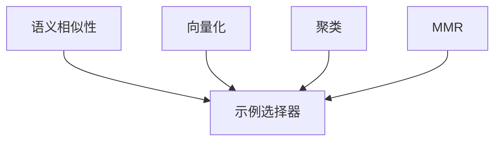

# 【LangChain编程：从入门到实践】示例选择器

## 1.背景介绍

在当今数据时代,我们面临着海量的非结构化数据,例如文本、图像、视频等。如何有效地从这些数据中提取有价值的信息并将其应用于各种任务,成为了一个重要的挑战。LangChain是一个强大的Python库,旨在简化人工智能(AI)和大型语言模型(LLM)的开发和应用过程。其中,示例选择器(Example Selector)是LangChain的一个关键组件,用于从大型数据集中选择最相关的示例,为下游任务提供高质量的训练数据。

示例选择器的作用在于,它能够从海量数据中智能地选择出与目标任务最相关的示例,从而提高模型的训练效率和性能。传统的数据选择方法通常依赖于人工标注,这种方式不仅耗时耗力,而且难以扩展到大型数据集。示例选择器则通过利用语义相似性等技术,自动从原始数据中筛选出高质量的示例,大大减轻了人工标注的工作量。

## 2.核心概念与联系

示例选择器的核心概念包括:

1. **语义相似性(Semantic Similarity)**:衡量两个文本片段在语义上的相似程度。示例选择器利用语义相似性来评估候选示例与目标任务的相关性。

2. **向量化(Vectorization)**:将文本转换为向量表示,以便进行数值计算和比较。常用的向量化方法包括Word2Vec、BERT等。

3. **聚类(Clustering)**:根据相似性将示例分组,以便选择每个聚类中最具代表性的示例。

4. **最大边际相关性(Maximum Marginal Relevance, MMR)**:一种示例选择策略,旨在同时最大化示例与目标任务的相关性,并最小化所选示例之间的冗余。

这些概念相互关联,共同构建了示例选择器的理论基础和实现方法。



## 3.核心算法原理具体操作步骤

示例选择器的核心算法原理可以概括为以下几个步骤:

1. **向量化**:将原始文本数据转换为向量表示,通常使用预训练的语言模型(如BERT)进行编码。

2. **计算相似性**:基于向量表示,计算每个候选示例与目标任务的语义相似性得分。

3. **聚类**:根据相似性得分,将候选示例划分为多个聚类。常用的聚类算法包括K-Means、DBSCAN等。

4. **选择示例**:从每个聚类中选择最具代表性的示例,可以使用以下策略:
   - 选择与聚类中心最相似的示例
   - 使用MMR策略,在相关性和多样性之间寻求平衡

5. **迭代优化**:根据选择的示例对模型进行训练,并根据模型性能调整示例选择策略的参数,进行多轮迭代优化。

以上步骤可以概括为以下伪代码:

```python
import numpy as np
from sklearn.cluster import KMeans
from sentence_transformers import SentenceTransformer

def example_selector(examples, task_description, num_examples):
    # 1. 向量化
    model = SentenceTransformer('bert-base-nli-mean-tokens')
    example_vecs = model.encode(examples)
    task_vec = model.encode([task_description])[0]

    # 2. 计算相似性
    similarities = np.dot(example_vecs, task_vec)

    # 3. 聚类
    num_clusters = min(len(examples) // 10, 10)
    kmeans = KMeans(n_clusters=num_clusters, random_state=0).fit(example_vecs)
    cluster_ids = kmeans.labels_

    # 4. 选择示例
    selected_examples = []
    for cluster_id in range(num_clusters):
        cluster_indices = np.where(cluster_ids == cluster_id)[0]
        cluster_sims = similarities[cluster_indices]
        top_idx = np.argsort(cluster_sims)[-1]
        selected_examples.append(examples[cluster_indices[top_idx]])

    # 5. 迭代优化
    # ...

    return selected_examples[:num_examples]
```

## 4.数学模型和公式详细讲解举例说明

在示例选择器中,语义相似性是一个关键概念。计算语义相似性的常用方法是基于向量空间模型(Vector Space Model, VSM)。

在VSM中,每个文本片段被表示为一个向量,其中每个维度对应于一个特征(如单词或n-gram)的权重。两个文本片段之间的相似性可以通过计算它们对应向量之间的余弦相似度来衡量。

设有两个文本片段$A$和$B$,它们的向量表示分别为$\vec{a}$和$\vec{b}$,则它们之间的余弦相似度定义为:

$$\text{sim}(A, B) = \frac{\vec{a} \cdot \vec{b}}{\|\vec{a}\| \|\vec{b}\|}$$

其中$\vec{a} \cdot \vec{b}$表示两个向量的点积,而$\|\vec{a}\|$和$\|\vec{b}\|$分别表示向量$\vec{a}$和$\vec{b}$的L2范数。

余弦相似度的取值范围为$[-1, 1]$,值越接近1,表示两个文本片段越相似。

例如,假设我们有两个句子"The cat sat on the mat"和"A dog chased a cat",它们的词袋(Bag-of-Words)向量表示如下:

- $\vec{a} = (1, 1, 1, 1, 0, 0, 0, 0)$ (对应于"the", "cat", "sat", "on", "the", "mat", "a", "dog")
- $\vec{b} = (0, 1, 0, 0, 1, 0, 2, 1)$ (对应于"the", "cat", "sat", "on", "the", "mat", "a", "dog")

则它们之间的余弦相似度为:

$$\text{sim}(A, B) = \frac{1 \times 1}{\sqrt{4} \times \sqrt{6}} \approx 0.204$$

这个相对较低的相似度分数反映了两个句子在语义上的差异。

在实践中,我们通常使用更加先进的向量表示方法,如Word2Vec、GloVe或BERT等,而不是简单的词袋模型。这些模型能够捕捉更加丰富的语义信息,从而提高相似性计算的准确性。

## 5.项目实践:代码实例和详细解释说明

以下是一个使用LangChain示例选择器的完整代码示例,包括数据加载、向量化、聚类和示例选择等步骤:

```python
from langchain.vectorstores import FAISS
from langchain.docstore import InMemoryDocstore
from langchain import OpenAI
from langchain.chains import RetrievalQA
from langchain.llms import OpenAI
from langchain.embeddings.openai import OpenAIEmbeddings
from langchain.text_splitter import CharacterTextSplitter
from langchain.chains.question_answering import load_qa_chain
from langchain.chains.question_answering import get_chain_for_model
from langchain.chains.qa_with_sources import load_qa_with_sources_chain
from langchain.example_selectors import SemanticSimilarityExampleSelector

# 加载数据
with open('data.txt') as f:
    data = f.read()

# 文本分割
text_splitter = CharacterTextSplitter(chunk_size=1000, chunk_overlap=200)
texts = text_splitter.split_text(data)

# 创建文档存储
docstore = InMemoryDocstore(texts)

# 向量化
embeddings = OpenAIEmbeddings()
vectorstore = FAISS.from_docstore(docstore, embeddings)

# 创建示例选择器
example_selector = SemanticSimilarityExampleSelector.from_vectorstore(
    vectorstore=vectorstore,
    max_examples=5,
    semantic_kernel="text-davinci-003",
    examples_for_conditioning=[],
    scoring_strategy="mmr",
    examples_to_score_ratio=0.2,
)

# 创建问答链
chain = load_qa_with_sources_chain(OpenAI(temperature=0), chain_type="stuff", example_selector=example_selector)

# 提问并获取答案
query = "What is the capital of France?"
result = chain({"query": query}, return_only_outputs=True)
print(result['result'])
```

以上代码的关键步骤包括:

1. **加载数据**:从文本文件中加载原始数据。

2. **文本分割**:将长文本分割为多个较短的文本块,以便进行向量化和索引。

3. **创建文档存储**:使用InMemoryDocstore将文本块存储在内存中。

4. **向量化**:使用OpenAIEmbeddings将文本块编码为向量表示。

5. **创建向量存储**:使用FAISS将向量存储在内存中,以便快速检索。

6. **创建示例选择器**:初始化SemanticSimilarityExampleSelector,指定向量存储、最大示例数、语义内核、示例条件等参数。

7. **创建问答链**:使用load_qa_with_sources_chain创建一个问答链,将示例选择器集成到其中。

8. **提问并获取答案**:输入查询,获取相关示例和最终答案。

在这个示例中,我们使用了LangChain提供的SemanticSimilarityExampleSelector,它基于语义相似性来选择与查询最相关的示例。具体来说,它会计算每个示例与查询之间的相似度分数,然后使用MMR策略选择最相关且最多样的示例。

通过将示例选择器集成到问答链中,我们可以为语言模型提供高质量的上下文信息,从而提高问答的准确性和相关性。

## 6.实际应用场景

示例选择器在各种自然语言处理(NLP)任务中都有广泛的应用,包括但不限于:

1. **问答系统**:从大型知识库中选择与用户查询最相关的上下文信息,提高问答的准确性和相关性。

2. **文本摘要**:从长文本中选择最具代表性的句子或段落,生成高质量的文本摘要。

3. **情感分析**:从大量评论或社交媒体数据中选择最具代表性的示例,用于训练情感分析模型。

4. **机器翻译**:从大型平行语料库中选择与目标领域最相关的示例,用于微调机器翻译模型。

5. **文本分类**:从大量文本数据中选择最具代表性的示例,用于训练文本分类模型。

6. **知识提取**:从大型文本语料库中选择与目标知识领域最相关的示例,用于知识提取和知识图谱构建。

7. **个性化推荐**:根据用户的兴趣和历史行为,从大量候选项目中选择最相关的推荐内容。

总的来说,示例选择器可以帮助我们从海量数据中智能地选择出高质量的训练示例,从而提高各种NLP任务的模型性能和效率。

## 7.工具和资源推荐

在使用示例选择器时,以下工具和资源可能会对您有所帮助:

1. **LangChain**:本文中介绍的示例选择器就来自于LangChain库。LangChain不仅提供了示例选择器,还包含了许多其他有用的组件,如向量存储、文本分割器、问答链等,可以帮助您构建端到端的NLP应用程序。

2. **Sentence-Transformers**:一个用于计算句子/文本嵌入的Python库,提供了多种预训练模型和fine-tuning方法。您可以使用Sentence-Transformers计算文本的向量表示,然后将其与示例选择器结合使用。

3. **FAISS**:一个用于高效相似性搜索的库,可以用于构建向量索引和快速检索相似向量。LangChain中的FAISS向量存储就是基于这个库实现的。

4. **Hugging Face Datasets**:一个包含大量数据集的开源库,涵盖了自然语言处理、计算机视觉等多个领域。您可以从中获取原始数据,并使用示例选择器进行数据筛选和预处理。

5. **OpenAI API**:LangChain支持使用OpenAI的语言模型进行示例选择和问答。如果您有OpenAI API密钥,可以在LangChain中直接使用它们。

6. **示例选择器论文和教程**:示例选择器背后的理论和算法已经在多篇论文和教程中进行了详细阐述。阅读这些资源可以帮助您更好地理解示例选择器的原理和实现方法。

通过利用这些工具和资源,您可以更高效地开发和部署基于示例选择器的NLP应