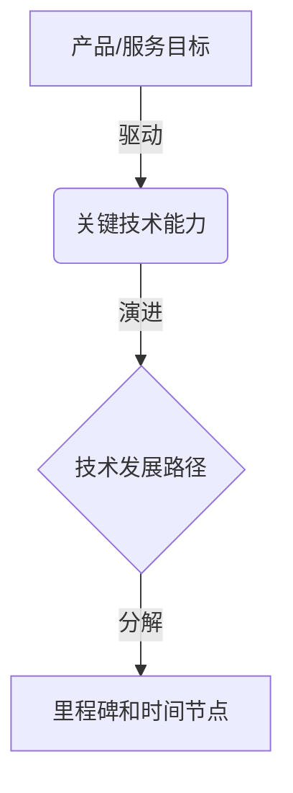
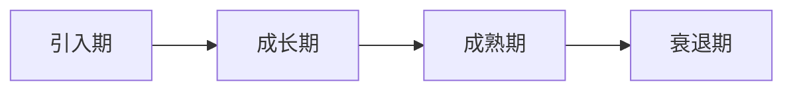
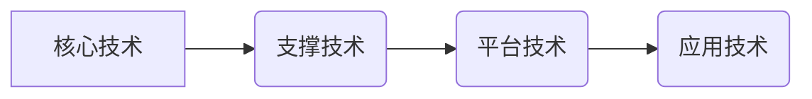
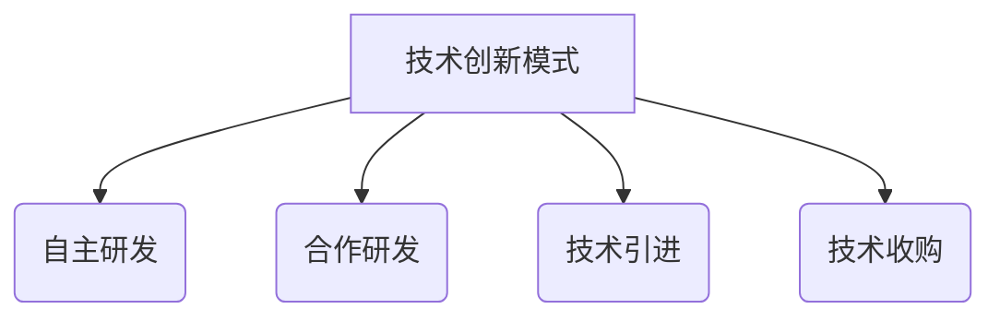
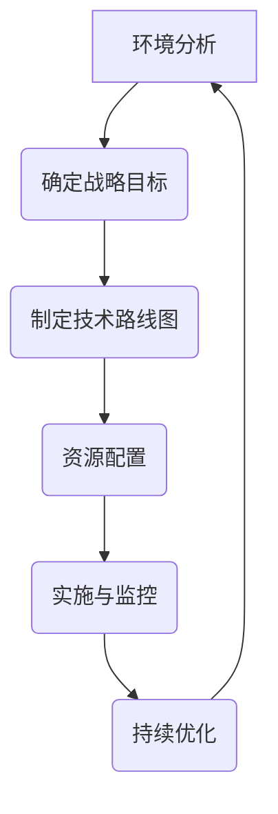

# 主导和把握公司的技术发展方向，研究制订公司的科技战略规划，包括技术路线、研发方向、产品创新等

## 1.背景介绍

在当今快节奏的商业环境中，技术发展日新月异，企业必须与时俱进，紧跟技术趋势，才能保持竞争力。因此，主导和把握公司的技术发展方向，研究制订公司的科技战略规划,包括技术路线、研发方向、产品创新等,对于企业的长期发展至关重要。

科技战略规划是企业发展的指路明灯,它为公司确立技术发展的总体方向,明确技术创新的重点领域,并制定相应的实施路线图。通过科学的技术战略规划,企业能够集中有限的资源投入到最具潜力的技术领域,最大限度地提高研发投入的回报率。

### 1.1 技术发展的重要性

良好的技术发展战略不仅能够帮助企业抓住技术创新的机遇,占领市场先机,更能促进企业内部的技术积累和知识沉淀,形成持续的创新动力。相反,如果企业缺乏清晰的技术发展方向,盲目追逐短期利益,将会在激烈的市场竞争中失去主动权。

### 1.2 科技战略规划的作用

科技战略规划的作用主要体现在以下几个方面:

1. 明确技术发展方向,避免盲目投资
2. 优化资源配置,提高研发效率
3. 促进技术创新,保持市场竞争力
4. 培养技术人才,构建创新文化
5. 提升品牌形象,增强市场影响力

## 2.核心概念与联系

制定科技战略规划需要对以下几个核心概念有深入的理解:

### 2.1 技术路线图

技术路线图(Technology Roadmap)是一种描述技术发展路径的工具,它将企业的产品和服务目标与所需的技术能力相结合,形成一个时间线,指导技术的研发和应用。

技术路线图包括以下几个要素:

1. 产品/服务目标
2. 关键技术能力
3. 技术发展路径
4. 里程碑和时间节点



### 2.2 技术生命周期

每项技术都有自己的生命周期,包括引入期、成长期、成熟期和衰退期。不同阶段的技术策略有所不同,企业需要根据技术所处的生命周期阶段,制定相应的战略。



### 2.3 技术组合

企业通常需要掌握多种技术,这些技术之间存在相互关系和依赖性。技术组合是指企业所掌握的技术资源的总和,需要对技术之间的关系进行系统规划和优化配置。



### 2.4 技术创新模式

技术创新有多种模式,包括自主研发、合作研发、技术引进、技术收购等。企业需要根据自身条件和技术特点,选择合适的创新模式。



## 3.核心算法原理具体操作步骤

制定科技战略规划是一个系统性的过程,需要遵循一定的原理和步骤。以下是核心算法原理的具体操作步骤:

### 3.1 环境分析

环境分析是科技战略规划的基础,包括对内部资源和外部环境的全面评估。

1. 内部资源分析:包括技术实力、人才储备、资金状况等
2. 外部环境分析:包括市场需求、竞争格局、政策法规等

### 3.2 确定战略目标

根据环境分析的结果,确定企业的科技战略目标,包括总体目标和阶段性目标。目标应该具有可测性和可实现性。

### 3.3 制定技术路线图

技术路线图是科技战略规划的核心内容,需要对关键技术能力、技术发展路径、里程碑和时间节点进行详细规划。

### 3.4 资源配置

根据技术路线图,合理配置人力、财力、物力等资源,确保战略规划的顺利实施。

### 3.5 实施与监控

将科技战略规划付诸实施,并建立监控机制,对实施过程进行跟踪评估,必要时进行调整。

### 3.6 持续优化

科技战略规划是一个动态过程,需要根据内外部环境的变化,持续优化和完善规划内容。



## 4.数学模型和公式详细讲解举例说明

在科技战略规划中,我们可以借助一些数学模型和公式来量化分析,为决策提供依据。

### 4.1 技术重要性评估模型

技术重要性评估模型可以帮助企业识别和筛选关键技术,合理分配研发资源。常用的模型包括层次分析法(AHP)和技术重要性系数法。

以技术重要性系数法为例,我们可以从技术自身特性、市场需求、竞争格局等多个维度对技术进行评分,计算出综合重要性系数,作为技术选择的依据。

设有n个评价指标,权重分别为$w_1,w_2,...,w_n$,满足$\sum_{i=1}^{n}w_i=1$。对于某项技术,在第i个指标上的评分为$s_i$,则该技术的重要性系数为:

$$R=\sum_{i=1}^{n}w_is_i$$

### 4.2 技术生命周期模型

技术生命周期模型可以帮助企业把握技术的发展趋势,制定相应的战略。常用的模型包括贝塞尔(Bezier)曲线模型和LogisticS曲线模型。

以LogisticS曲线模型为例,技术的生命周期可以用如下公式描述:

$$y=\frac{L}{1+e^{-k(t-t_0)}}$$

其中,y表示技术的发展水平,t表示时间,L表示技术的最大发展潜力,k表示发展速率,t0表示inflection point(拐点)的时间点。

通过对历史数据的拟合,我们可以估计出模型参数L、k、t0,进而预测技术的未来发展趋势。

### 4.3 技术投资回报模型

技术投资回报模型可以帮助企业评估技术投资的经济效益,实现投资决策的量化。常用的模型包括净现值法(NPV)、内部收益率法(IRR)等。

以净现值法为例,对于一项技术投资,如果其现金流入现值大于现金流出现值,则该投资是可行的。净现值公式如下:

$$NPV=\sum_{t=0}^{T}\frac{C_t}{(1+r)^t}$$

其中,T表示投资期限,Ct表示第t年的现金流量,r表示折现率。

如果NPV>0,则该投资是可行的;如果NPV<0,则该投资是不可行的。

## 5.项目实践:代码实例和详细解释说明

为了更好地理解科技战略规划的实际应用,我们以一个案例项目为例,介绍相关的代码实现和详细解释。

### 5.1 案例背景

某科技公司正在制定未来三年的技术发展战略,需要对现有技术进行评估,确定重点发展方向,并制定具体的技术路线图和资源配置方案。

### 5.2 技术评估

首先,我们需要对公司现有的技术进行评估,筛选出重点发展的技术。这里我们使用技术重要性系数法进行评估。

假设我们选取了5个评价指标,分别是技术先进性、市场需求、竞争优势、人才储备和资金投入,权重分别为0.3、0.25、0.2、0.15、0.1。对于每项技术,我们在每个指标上给出评分(满分10分)。

```python
import numpy as np

# 评价指标权重
weights = np.array([0.3, 0.25, 0.2, 0.15, 0.1])

# 技术评分矩阵
scores = np.array([[8, 7, 6, 9, 7],  # 技术A
                    [6, 8, 7, 6, 8],  # 技术B
                    [9, 6, 8, 7, 6]]) # 技术C

# 计算技术重要性系数
importance = scores @ weights

print("技术重要性系数:")
print(importance)
```

输出结果:

```
技术重要性系数:
[7.3 7.0 7.6]
```

根据计算结果,我们可以确定技术C是重点发展方向。

### 5.3 技术路线图制定

接下来,我们需要为技术C制定技术路线图,包括关键技术能力、技术发展路径、里程碑和时间节点。

```python
# 技术路线图
roadmap = {
    "产品目标": "新一代智能家居系统",
    "关键技术": ["人工智能", "物联网", "大数据", "云计算"],
    "发展路径": [
        {"里程碑": "AI语音交互模块研发", "时间节点": "2024Q1"},
        {"里程碑": "家居设备互联技术研发", "时间节点": "2024Q3"},
        {"里程碑": "大数据分析平台建设", "时间节点": "2025Q1"},
        {"里程碑": "云端管理系统研发", "时间节点": "2025Q4"},
        {"里程碑": "系统集成与测试", "时间节点": "2026Q2"}
    ]
}

print("技术路线图:")
for key, value in roadmap.items():
    print(f"{key}: {value}")
```

输出结果:

```
技术路线图:
产品目标: 新一代智能家居系统
关键技术: ['人工智能', '物联网', '大数据', '云计算']
发展路径: [{'里程碑': 'AI语音交互模块研发', '时间节点': '2024Q1'}, {'里程碑': '家居设备互联技术研发', '时间节点': '2024Q3'}, {'里程碑': '大数据分析平台建设', '时间节点': '2025Q1'}, {'里程碑': '云端管理系统研发', '时间节点': '2025Q4'}, {'里程碑': '系统集成与测试', '时间节点': '2026Q2'}]
```

### 5.4 资源配置

根据技术路线图,我们需要合理配置人力、财力等资源,以确保战略规划的顺利实施。

```python
# 资源配置
resources = {
    "人力": {
        "AI研发团队": 20,
        "物联网研发团队": 15,
        "大数据研发团队": 10,
        "云计算研发团队": 8
    },
    "财力": {
        "2024年预算": 5000000,
        "2025年预算": 6000000,
        "2026年预算": 4000000
    }
}

print("资源配置:")
for key, value in resources.items():
    print(f"{key}: {value}")
```

输出结果:

```
资源配置:
人力: {'AI研发团队': 20, '物联网研发团队': 15, '大数据研发团队': 10, '云计算研发团队': 8}
财力: {'2024年预算': 5000000, '2025年预算': 6000000, '2026年预算': 4000000}
```

## 6.实际应用场景

科技战略规划在各行各业都有广泛的应用,以下是一些典型的应用场景:

### 6.1 信息技术行业

信息技术行业是科技战略规划的重点应用领域,包括软件开发、硬件制造、互联网服务等。科技公司需要不断推出创新产品和服务,以保持竞争优势。

### 6.2 制造业

制造业企业需要持续提升生产工