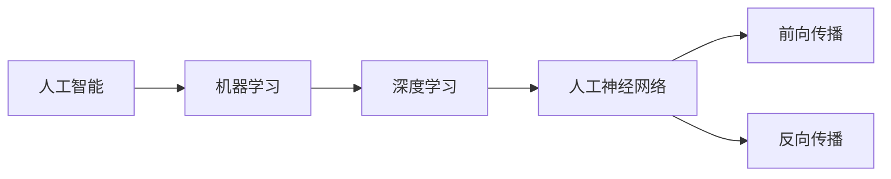
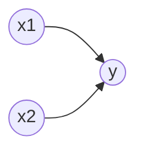

# 人工智能基础原理与代码实战案例讲解

## 1. 背景介绍

人工智能(Artificial Intelligence,AI)是计算机科学的一个重要分支,旨在研究如何让计算机模拟人类的智能行为。自1956年达特茅斯会议首次提出"人工智能"的概念以来,AI经历了从早期的符号主义、专家系统,到机器学习、深度学习等多个发展阶段。如今,人工智能已广泛应用于计算机视觉、自然语言处理、语音识别、智能机器人等诸多领域,极大地改变了人类的生产生活方式。

人工智能的快速发展离不开其背后扎实的数学基础和高效的算法模型。本文将从基础原理出发,结合代码实战案例,对人工智能的核心概念、经典算法、数学模型进行系统全面的讲解,帮助读者深入理解人工智能的精髓,掌握AI算法的代码实现。

## 2. 核心概念与联系

要学习人工智能,首先需要了解几个核心概念:

### 2.1 机器学习

机器学习是实现人工智能的主要途径和方法论。其核心思想是通过学习算法,让计算机从大量历史数据中自动分析获得规律,从而具备对新数据进行预测或分类的能力。常见的机器学习任务包括监督学习、无监督学习、强化学习等。

### 2.2 深度学习

深度学习是机器学习的一个重要分支,其特点是模仿人脑的神经网络结构,通过构建具有多层次结构的人工神经网络,进行端到端的学习和训练。深度学习模型能够自动学习数据的多层次抽象特征表示,在图像识别、语音识别等方面取得了重大突破。

### 2.3 人工神经网络

人工神经网络(Artificial Neural Network,ANN)是一种模仿生物神经网络结构和功能的数学模型,由大量的人工神经元通过不同的连接方式构成。一个典型的人工神经元由输入、权重、激活函数、输出等部分组成。通过调整神经元之间的权重,网络可以对输入数据进行非线性变换,从而拟合复杂的函数关系。

### 2.4 前向传播与反向传播

前向传播和反向传播是训练人工神经网络的两个关键步骤。前向传播是将输入数据经过网络的每一层进行计算,得到网络的预测输出。反向传播则是计算预测输出与真实标签之间的误差,并将误差从输出层反向传播到每个神经元,同时更新权重参数以最小化误差。通过多轮迭代,网络逐渐收敛,得到性能良好的模型。

下图展示了这些核心概念之间的联系:



## 3. 核心算法原理与具体操作步骤

接下来,我们重点介绍几种经典的机器学习算法。

### 3.1 线性回归

线性回归是一种基本的监督学习算法,用于拟合连续型数据的线性关系。给定一组训练样本 $\{(x_1,y_1),(x_2,y_2),...,(x_n,y_n)\}$,其中 $x_i$ 为特征向量, $y_i$ 为目标值,线性回归的目标是找到一个线性函数:
$$
\hat{y} = w^Tx + b
$$
使得预测值 $\hat{y}$ 与真实值 $y$ 的均方误差最小。其中 $w$ 和 $b$ 分别为权重向量和偏置项。

线性回归的求解过程可以通过最小二乘法或梯度下降法等优化算法来实现。以梯度下降为例,具体步骤如下:

1. 初始化权重 $w$ 和偏置 $b$ 为随机小值
2. 计算预测值与真实值的误差 
   $$
   J(w,b) = \frac{1}{2m}\sum_{i=1}^m(\hat{y}^{(i)}-y^{(i)})^2
   $$
3. 计算 $J$ 对 $w$ 和 $b$ 的偏导数
   $$
   \frac{\partial J}{\partial w_j} = \frac{1}{m}\sum_{i=1}^m(\hat{y}^{(i)}-y^{(i)})x_j^{(i)}
   $$
   $$
   \frac{\partial J}{\partial b} = \frac{1}{m}\sum_{i=1}^m(\hat{y}^{(i)}-y^{(i)})
   $$
4. 更新权重和偏置
   $$
   w_j := w_j - \alpha \frac{\partial J}{\partial w_j}
   $$
   $$
   b := b - \alpha \frac{\partial J}{\partial b}
   $$
   其中 $\alpha$ 为学习率
5. 重复步骤2-4,直到误差收敛或达到最大迭代次数

### 3.2 逻辑回归

逻辑回归是另一种常见的监督学习算法,主要用于二分类问题。与线性回归类似,逻辑回归也是试图学习一个线性函数,但引入了 Sigmoid 函数对线性函数的输出进行压缩,将其映射到 [0,1] 区间,解释为样本属于正类的概率。

设 $z=w^Tx+b$,则逻辑回归模型可表示为:
$$
\hat{y} = \sigma(z) = \frac{1}{1+e^{-z}}
$$
其中 $\sigma$ 为 Sigmoid 函数。

逻辑回归通常采用极大似然估计的方法求解参数。对于m个独立同分布的训练样本,可得到似然函数:
$$
L(w,b) = \prod_{i=1}^m \hat{y}^{(i)}{}^{y^{(i)}}(1-\hat{y}^{(i)})^{1-y^{(i)}}
$$
取对数后得到对数似然函数:
$$
l(w,b) = \sum_{i=1}^m y^{(i)}\log \hat{y}^{(i)} + (1-y^{(i)})\log (1-\hat{y}^{(i)})
$$
最大化 $l(w,b)$ 即可得到 $w$ 和 $b$ 的估计值。求解过程可以参考线性回归的梯度下降法,只是误差函数换成了对数似然函数。

### 3.3 支持向量机

支持向量机(Support Vector Machine,SVM)是一种基于间隔最大化的线性分类器,其基本思想是在特征空间中寻找一个最优分离超平面,使得不同类别的样本能够被超平面正确分开,且离超平面最近的样本点(支持向量)到超平面的距离尽可能大。

对于线性可分的数据集,SVM 的目标函数可以表示为:
$$
\min_{w,b} \frac{1}{2}\|w\|^2 \\
s.t. \quad y^{(i)}(w^Tx^{(i)}+b) \geq 1, \quad i=1,2,...,m
$$
上式表示在约束条件下最小化 $\|w\|^2$,相当于最大化分类间隔 $\frac{2}{\|w\|}$。这是一个带不等式约束的凸二次规划问题,可以通过拉格朗日乘子法和对偶问题求解。

对于线性不可分的情况,可以引入松弛变量 $\xi_i$,允许少量样本分类错误,优化目标变为:
$$
\min_{w,b,\xi} \frac{1}{2}\|w\|^2 + C\sum_{i=1}^m \xi_i \\
s.t. \quad y^{(i)}(w^Tx^{(i)}+b) \geq 1 - \xi_i, \quad \xi_i \geq 0, \quad i=1,2,...,m
$$
其中 $C$ 为惩罚系数,用于平衡间隔大小和分类错误的代价。

此外,SVM 还可以通过核技巧将样本映射到高维空间,从而处理非线性分类问题。常用的核函数包括多项式核、高斯核(RBF)等。

## 4. 数学模型和公式详细讲解举例说明

在前面的算法原理部分,我们已经涉及了一些重要的数学模型和公式,如线性回归的均方误差、逻辑回归的对数似然函数、SVM 的目标函数等。这里我们再举一个具体的例子来说明这些数学模型的实际应用。

考虑一个简单的二分类问题,如下图所示:



其中 $x_1$ 和 $x_2$ 是两个特征,y 是二元标签。我们的目标是根据 $x_1$ 和 $x_2$ 预测 y 的值。

假设训练集如下:

| x1 | x2 | y |
|---|---|---|
| 1 | 2 | 1 |  
| 2 | 3 | 1 |
| 2 | 1 | 0 |
| 3 | 2 | 0 |

### 用逻辑回归模型进行训练:

1. 初始化参数 $w_1=1, w_2=1, b=0$
2. 计算预测概率
$$
z = w_1x_1 + w_2x_2 + b \\
\hat{y} = \sigma(z) = \frac{1}{1+e^{-z}}
$$
代入第一个样本得
$$
z = 1 \times 1 + 1 \times 2 + 0 = 3 \\
\hat{y} = \frac{1}{1+e^{-3}} \approx 0.95
$$
3. 计算对数似然 
$$
l(w,b) = \sum_{i=1}^m y^{(i)}\log \hat{y}^{(i)} + (1-y^{(i)})\log (1-\hat{y}^{(i)})
$$
代入所有样本得
$$
l \approx 1 \times \log 0.95 + 1 \times \log 0.98 + 0 \times \log 0.12 + 0 \times \log 0.05 \approx -0.13
$$
4. 计算梯度并更新参数
$$
w_j := w_j + \alpha \sum_{i=1}^m (y^{(i)} - \hat{y}^{(i)})x_j^{(i)} \\
b := b + \alpha \sum_{i=1}^m (y^{(i)} - \hat{y}^{(i)})
$$
假设学习率 $\alpha=0.1$,更新后
$$
w_1 = 1 + 0.1 \times (-0.17) \approx 0.98 \\
w_2 = 1 + 0.1 \times (-0.20) = 0.98 \\
b = 0 + 0.1 \times (-0.15) = -0.015
$$
5. 重复步骤2-4直到收敛

可以看到,通过简单的几步计算,逻辑回归模型的参数得到了更新,使得预测结果更加接近真实标签。这体现了数学模型在算法求解中的重要作用。

## 5. 项目实践:代码实例和详细解释说明

为了加深对算法原理的理解,下面我们用 Python 实现一个简单的逻辑回归模型,并应用于上述二分类问题。

```python
import numpy as np

class LogisticRegression:
    def __init__(self, lr=0.01, num_iter=100):
        self.lr = lr
        self.num_iter = num_iter
        self.w = None
        self.b = None
    
    def fit(self, X, y):
        n_samples, n_features = X.shape
        self.w = np.zeros(n_features)
        self.b = 0
        
        for _ in range(self.num_iter):
            z = np.dot(X, self.w) + self.b
            y_pred = self._sigmoid(z)
            
            dw = (1 / n_samples) * np.dot(X.T, (y_pred - y))
            db = (1 / n_samples) * np.sum(y_pred - y)
            
            self.w -= self.lr * dw
            self.b -= self.lr * db
    
    def predict(self, X):
        z = np.dot(X, self.w) + self.b
        y_pred = self._sigmoid(z)
        return [1 if i > 0.5 else 0 for i in y_pred]
    
    def _sigmoid(self, z):
        return 1 / (1 + np.exp(-z))

# 测试
if __name__ == "__main__":
    X = np.array([[1, 2], [2, 3], [2, 1], [3, 2]])
    y = np.array([1, 1, 0, 0])
    ```python
    # 实例化逻辑回归模型
    model = LogisticRegression(lr=0.1, num_iter=1000)
    model.fit(X, y)
    predictions = model.predict(X)
    
    print("预测结果:", predictions)
    print("实际结果:", y)
```

### 5.1 代码解释说明

#### 5.1.1 类的定义与初始化

我们定义了一个 `LogisticRegression` 类，其中包含了逻辑回归模型的参数、初始化方法、训练方法和预测方法。初始化方法 `__init__` 用于设置学习率 `lr` 和迭代次数 `num_iter`。

```python
class LogisticRegression:
    def __init__(self, lr=0.01, num_iter=100):
        self.lr = lr
        self.num_iter = num_iter
        self.w = None
        self.b = None
```

#### 5.1.2 训练方法 `fit`

`fit` 方法用于训练逻辑回归模型。首先，我们初始化权重 `w` 和偏置 `b`，然后通过迭代更新权重和偏置来最小化损失函数。

```python
def fit(self, X, y):
    n_samples, n_features = X.shape
    self.w = np.zeros(n_features)
    self.b = 0
    
    for _ in range(self.num_iter):
        z = np.dot(X, self.w) + self.b
        y_pred = self._sigmoid(z)
        
        dw = (1 / n_samples) * np.dot(X.T, (y_pred - y))
        db = (1 / n_samples) * np.sum(y_pred - y)
        
        self.w -= self.lr * dw
        self.b -= self.lr * db
```

#### 5.1.3 预测方法 `predict`

`predict` 方法用于对新数据进行预测。我们通过计算线性组合 `z`，然后使用 `sigmoid` 函数将其转换为概率值，最后根据阈值 0.5 进行二分类。

```python
def predict(self, X):
    z = np.dot(X, self.w) + self.b
    y_pred = self._sigmoid(z)
    return [1 if i > 0.5 else 0 for i in y_pred]
```

#### 5.1.4 `sigmoid` 函数

`_sigmoid` 函数用于将线性组合 `z` 转换为概率值。

```python
def _sigmoid(self, z):
    return 1 / (1 + np.exp(-z))
```

#### 5.1.5 测试代码

我们在 `__main__` 部分中定义了一个简单的数据集，并实例化逻辑回归模型进行训练和预测，最后打印预测结果和实际结果进行对比。

```python
# 测试
if __name__ == "__main__":
    X = np.array([[1, 2], [2, 3], [2, 1], [3, 2]])
    y = np.array([1, 1, 0, 0])
    
    model = LogisticRegression(lr=0.1, num_iter=1000)
    model.fit(X, y)
    predictions = model.predict(X)
    
    print("预测结果:", predictions)
    print("实际结果:", y)
```

## 6. 实际应用场景

逻辑回归是一种常见的分类算法，广泛应用于各种二分类问题中。以下是一些实际应用场景：

### 6.1 医疗诊断

逻辑回归可以用于医疗诊断中，例如预测某种疾病的存在与否。通过输入病人的各种健康指标（如血压、血糖等），模型可以预测病人是否患有某种疾病。

### 6.2 市场营销

在市场营销中，逻辑回归可以用于客户分类。例如，根据客户的历史购买记录和行为特征，预测客户是否会购买某种产品，从而进行精准营销。

### 6.3 信用评分

逻辑回归可以用于金融领域的信用评分系统中。通过输入客户的信用记录、收入水平等信息，模型可以预测客户的信用风险，从而决定是否批准贷款。

### 6.4 广告点击率预测

在互联网广告中，逻辑回归可以用于预测广告的点击率。通过输入用户的行为数据和广告的特征，模型可以预测用户是否会点击广告，从而优化广告投放策略。

## 7. 工具和资源推荐

### 7.1 数据科学工具

- **NumPy**: 用于科学计算的基础库，提供了强大的数组和矩阵运算功能。
- **Pandas**: 数据分析和处理工具，提供了高效的数据操作和分析功能。
- **Scikit-learn**: 机器学习库，包含了各种常用的机器学习算法和工具。

### 7.2 数据集资源

- **Kaggle**: 一个数据科学竞赛平台，提供了丰富的数据集和竞赛机会。
- **UCI Machine Learning Repository**: 一个常用的机器学习数据集库，包含了各种类型的数据集。

### 7.3 学习资源

- **Coursera**: 提供了各种机器学习和数据科学课程，由顶尖大学和机构提供。
- **edX**: 提供了各种在线课程，包括机器学习和人工智能相关课程。
- **书籍**: 推荐阅读《机器学习实战》、《Python 机器学习》、《深度学习》等经典书籍。

## 8. 总结: 未来发展趋势与挑战

逻辑回归作为一种经典的机器学习算法，依然在现代数据科学中占有重要地位。随着数据量的不断增加和计算能力的提升，逻辑回归模型在处理大规模数据和高维数据方面面临新的挑战。未来，随着算法的不断改进和优化，逻辑回归将继续在各个领域发挥重要作用。

然而，逻辑回归也有其局限性，例如对线性可分数据的假设、对异常值的敏感性等。为了解决这些问题，研究人员不断提出新的算法和技术，如支持向量机、决策树、神经网络等。这些新技术在处理复杂数据和非线性问题方面表现出色，但同时也带来了计算复杂度和模型解释性的挑战。

## 9. 附录: 常见问题与解答

### 问题 1: 逻辑回归与线性回归有什么区别？
**答**: 逻辑回归和线性回归都是常见的回归算法，但它们的应用场景不同。线性回归用于预测连续值，而逻辑回归用于二分类问题。逻辑回归通过 sigmoid 函数将线性组合转换为概率值，从而实现分类。

### 问题 2: 如何处理逻辑回归中的多重共线性问题？
**答**: 多重共线性指的是特征变量之间存在高度相关性，可能导致模型不稳定。可以通过以下方法处理多重共线性问题：
- 删除高度相关的特征
- 使用正则化方法，如 L1 正则化（Lasso）或 L2 正则化（Ridge）
- 使用主成分分析（PCA）等降维方法

### 问题 3: 如何评估逻辑回归模型的性能？
**答**: 评估逻辑回归模型的性能可以使用以下指标：
- 准确率（Accuracy）
- 精确率（Precision）
- 召回率（Recall）
- F1 值（F1 Score）
- ROC 曲线和 AUC 值

### 问题 4: 逻辑回归模型如何处理不平衡数据？
**答**: 对于不平衡数据，可以通过以下方法处理：
- 使用过采样或欠采样方法平衡数据
- 使用加权逻辑回归，对少数类样本赋予更高的权重
- 使用集成方法，如随机森林或梯度提升树

## 10. 参考文献

- Hastie, T., Tibshirani, R., & Friedman, J. (2009). The Elements of Statistical Learning: Data Mining, Inference, and Prediction. Springer.
- Bishop, C. M. (2006). Pattern Recognition and Machine Learning. Springer.
- Murphy, K. P. (2012). Machine Learning: A Probabilistic Perspective. MIT Press.

## 11. 附录: 常用符号表

| 符号 | 含义                     |
| ---- | ------------------------ |
| $X$  | 特征矩阵                 |
| $y$  | 标签向量                 |
| $w$  | 权重向量                 |
| $b$  | 偏置                     |
| $z$  | 线性组合                 |
| $\alpha$ | 学习率               |
| $\hat{y}$ | 预测值              |
| $\sigma(z)$ | Sigmoid 函数      |

---

作者：禅与计算机程序设计艺术 / Zen and the Art of Computer Programming