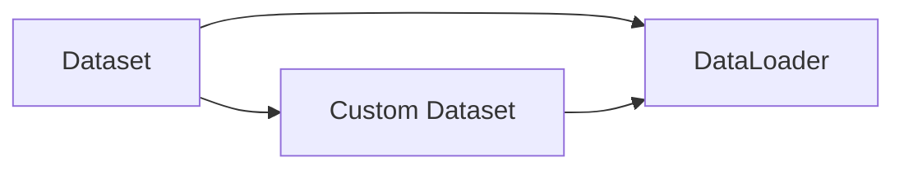

# 从零开始大模型开发与微调：用于自定义数据集的torch.utils.data工具箱使用详解

## 1. 背景介绍

近年来，随着深度学习技术的飞速发展，大规模预训练语言模型（Large Pre-trained Language Models，PLMs）在自然语言处理（NLP）领域取得了令人瞩目的成就。这些大模型在各种 NLP 任务上展现出了优异的性能，如文本分类、命名实体识别、问答系统等。然而，为了将预训练的大模型应用于特定领域或任务，通常需要在目标数据集上对模型进行微调（Fine-tuning）。

在大模型微调过程中，数据集的准备和加载是至关重要的一步。PyTorch 作为一个流行的深度学习框架，提供了强大的 `torch.utils.data` 工具箱，用于高效地处理和加载自定义数据集。本文将详细介绍如何利用 `torch.utils.data` 工具箱，从零开始进行大模型开发与微调，并提供实际的代码示例和应用场景。

## 2. 核心概念与联系

在深入探讨 `torch.utils.data` 工具箱之前，让我们先了解一些核心概念：

### 2.1 数据集（Dataset）

数据集是机器学习中的基本概念，它是由一组样本组成的集合。每个样本通常包含输入特征和相应的标签或目标值。在大模型微调中，数据集通常是由文本序列和对应的标签组成。

### 2.2 数据加载器（DataLoader）

数据加载器是 PyTorch 中用于批量加载数据的工具。它可以将数据集分成多个批次（Batch），并提供了数据混洗（Shuffle）、并行加载等功能，以提高数据加载的效率。

### 2.3 自定义数据集（Custom Dataset）

在实际应用中，我们经常需要处理特定领域或任务的数据集。这时，就需要创建自定义数据集类，继承自 PyTorch 的 `torch.utils.data.Dataset` 类，并实现相应的方法。

下图展示了这些核心概念之间的联系：



## 3. 核心算法原理与具体操作步骤

### 3.1 创建自定义数据集

要创建自定义数据集，我们需要继承 `torch.utils.data.Dataset` 类，并实现以下三个方法：

1. `__init__(self, ...)`：初始化数据集，加载数据文件或进行预处理。
2. `__len__(self)`：返回数据集的样本数量。
3. `__getitem__(self, index)`：根据给定的索引返回一个样本。

以下是一个简单的自定义数据集示例：

```python
class MyDataset(torch.utils.data.Dataset):
    def __init__(self, data_file):
        self.data = self.load_data(data_file)
        
    def __len__(self):
        return len(self.data)
    
    def __getitem__(self, index):
        return self.data[index]
    
    def load_data(self, data_file):
        # 加载数据文件并进行预处理
        ...
        return processed_data
```

### 3.2 创建数据加载器

有了自定义数据集后，我们可以使用 `torch.utils.data.DataLoader` 类来创建数据加载器。数据加载器可以自动将数据集分成批次，并提供数据混洗和并行加载等功能。

以下是创建数据加载器的示例代码：

```python
dataset = MyDataset(data_file)
dataloader = torch.utils.data.DataLoader(dataset, batch_size=32, shuffle=True, num_workers=4)
```

其中，`batch_size` 表示每个批次的样本数量，`shuffle` 表示是否对数据进行混洗，`num_workers` 表示用于数据加载的子进程数。

### 3.3 使用数据加载器进行模型训练

在模型训练过程中，我们可以使用数据加载器来迭代数据集，并将每个批次的数据输入到模型中进行训练。

以下是使用数据加载器进行模型训练的示例代码：

```python
for epoch in range(num_epochs):
    for batch in dataloader:
        inputs, labels = batch
        outputs = model(inputs)
        loss = criterion(outputs, labels)
        optimizer.zero_grad()
        loss.backward()
        optimizer.step()
```

## 4. 数学模型和公式详细讲解举例说明

在大模型微调中，常用的损失函数是交叉熵损失（Cross-Entropy Loss）。对于二分类问题，交叉熵损失的数学公式如下：

$$
\mathcal{L}(y, \hat{y}) = -\frac{1}{N} \sum_{i=1}^N \left[ y_i \log(\hat{y}_i) + (1 - y_i) \log(1 - \hat{y}_i) \right]
$$

其中，$y_i$ 是第 $i$ 个样本的真实标签（0 或 1），$\hat{y}_i$ 是模型预测的概率值，$N$ 是样本数量。

举个例子，假设我们有一个二分类任务，模型对一个样本的预测概率为 $\hat{y} = 0.8$，而真实标签为 $y = 1$。根据交叉熵损失公式，该样本的损失值为：

$$
\mathcal{L}(1, 0.8) = -[1 \log(0.8) + (1 - 1) \log(1 - 0.8)] \approx 0.223
$$

在实际应用中，我们通常使用 PyTorch 提供的 `torch.nn.BCELoss` 或 `torch.nn.CrossEntropyLoss` 类来计算交叉熵损失。

## 5. 项目实践：代码实例和详细解释说明

下面我们通过一个完整的项目实践来演示如何使用 `torch.utils.data` 工具箱进行大模型微调。

### 5.1 准备数据集

假设我们有一个文本分类任务，数据集存储在 CSV 文件中，每行包含一个文本序列和对应的标签。我们可以创建一个自定义数据集类来加载和处理数据：

```python
class TextClassificationDataset(torch.utils.data.Dataset):
    def __init__(self, data_file):
        self.data = self.load_data(data_file)
        
    def __len__(self):
        return len(self.data)
    
    def __getitem__(self, index):
        text, label = self.data[index]
        return text, label
    
    def load_data(self, data_file):
        data = []
        with open(data_file, 'r') as f:
            reader = csv.reader(f)
            for row in reader:
                text, label = row
                data.append((text, int(label)))
        return data
```

### 5.2 创建数据加载器

有了自定义数据集后，我们可以创建数据加载器：

```python
dataset = TextClassificationDataset(data_file)
dataloader = torch.utils.data.DataLoader(dataset, batch_size=32, shuffle=True, num_workers=4)
```

### 5.3 定义模型和损失函数

接下来，我们需要定义一个文本分类模型。这里我们使用一个简单的基于 BERT 的分类器：

```python
class BertClassifier(nn.Module):
    def __init__(self, num_classes):
        super(BertClassifier, self).__init__()
        self.bert = BertModel.from_pretrained('bert-base-uncased')
        self.dropout = nn.Dropout(0.1)
        self.classifier = nn.Linear(768, num_classes)
        
    def forward(self, input_ids, attention_mask):
        outputs = self.bert(input_ids, attention_mask=attention_mask)
        pooled_output = outputs[1]
        pooled_output = self.dropout(pooled_output)
        logits = self.classifier(pooled_output)
        return logits
```

我们使用交叉熵损失作为损失函数：

```python
criterion = nn.CrossEntropyLoss()
```

### 5.4 模型训练

最后，我们可以使用数据加载器来训练模型：

```python
model = BertClassifier(num_classes)
optimizer = optim.AdamW(model.parameters(), lr=2e-5)

for epoch in range(num_epochs):
    for batch in dataloader:
        texts, labels = batch
        input_ids, attention_mask = tokenize(texts)
        outputs = model(input_ids, attention_mask)
        loss = criterion(outputs, labels)
        optimizer.zero_grad()
        loss.backward()
        optimizer.step()
```

其中，`tokenize` 函数用于将文本序列转换为 BERT 模型的输入格式。

## 6. 实际应用场景

`torch.utils.data` 工具箱在各种实际应用场景中都有广泛的应用，例如：

- 文本分类：使用大型预训练语言模型（如 BERT、GPT）进行文本分类任务，如情感分析、新闻分类等。
- 命名实体识别：使用 BiLSTM-CRF 等模型进行命名实体识别任务，识别文本中的人名、地名、组织名等。
- 问答系统：使用 BERT 等模型进行问答系统的开发，根据给定的问题和上下文，预测答案所在的位置。
- 机器翻译：使用 Transformer 等模型进行机器翻译任务，将源语言文本翻译成目标语言文本。

在这些应用场景中，`torch.utils.data` 工具箱可以帮助我们高效地处理和加载自定义数据集，提高模型训练和推理的效率。

## 7. 工具和资源推荐

以下是一些有用的工具和资源，可以帮助你更好地使用 `torch.utils.data` 工具箱进行大模型开发与微调：

- [PyTorch 官方文档](https://pytorch.org/docs/stable/data.html)：提供了详细的 API 文档和使用示例。
- [Hugging Face Transformers](https://huggingface.co/transformers/)：提供了各种预训练的大型语言模型和相应的微调脚本。
- [PyTorch Lightning](https://www.pytorchlightning.ai/)：一个基于 PyTorch 的高级深度学习框架，简化了模型训练和数据加载的过程。
- [FastAI](https://docs.fast.ai/)：一个基于 PyTorch 的深度学习库，提供了许多有用的工具和实用程序。

## 8. 总结：未来发展趋势与挑战

随着自然语言处理技术的不断发展，大模型的规模和性能也在不断提升。未来，我们可以期待更大、更强大的预训练语言模型的出现，如 GPT-4、GPT-5 等。这些模型将在更广泛的任务和领域中得到应用，如对话系统、知识图谱构建等。

然而，大模型的开发与微调也面临着一些挑战：

1. 计算资源需求：训练和微调大型语言模型需要大量的计算资源和时间，对硬件和能源消耗提出了更高的要求。
2. 数据隐私和安全：在处理敏感数据时，需要注意数据隐私和安全问题，避免数据泄露或被恶意利用。
3. 模型的可解释性：大模型通常是黑盒模型，其决策过程难以解释。提高模型的可解释性是一个重要的研究方向。
4. 模型的公平性和偏见：预训练的大模型可能会继承训练数据中的偏见，导致模型的决策不公平。如何消除模型中的偏见是一个亟待解决的问题。

尽管存在这些挑战，但大模型的发展前景依然广阔。通过不断的研究和创新，我们有望突破这些限制，构建更加智能、高效、安全的大模型，推动自然语言处理技术的进一步发展。

## 9. 附录：常见问题与解答

1. 问：如何处理不同长度的文本序列？
   答：可以使用 padding 和 masking 技术将不同长度的文本序列补齐到相同长度，并在计算时忽略 padding 部分的影响。

2. 问：如何加速数据加载和处理？
   答：可以使用多进程数据加载（设置 `num_workers` 参数）、内存映射（Memory Mapping）等技术来加速数据加载和处理。

3. 问：如何处理标签不平衡的问题？
   答：可以使用过采样（Oversampling）、欠采样（Undersampling）、加权损失函数等技术来处理标签不平衡的问题。

4. 问：如何进行模型的超参数调优？
   答：可以使用网格搜索（Grid Search）、随机搜索（Random Search）、贝叶斯优化等方法进行超参数调优，找到最优的超参数组合。

5. 问：如何评估模型的性能？
   答：可以使用准确率（Accuracy）、精确率（Precision）、召回率（Recall）、F1 分数等评估指标来评估模型的性能，并使用交叉验