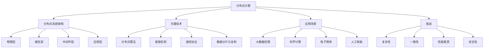

# 分布式计算原理与代码实战案例讲解

## 1.背景介绍

### 1.1 分布式计算的定义与特点

分布式计算是一种计算模式，通过网络将多个独立的计算机系统连接起来，协同完成大规模的计算任务。与传统的集中式计算不同，分布式计算具有以下特点：

1. 分散性：计算资源分散在不同的物理位置，通过网络进行通信和协作。
2. 并行性：多个计算节点同时执行任务，提高了计算效率。
3. 可扩展性：可以根据需要动态增加或减少计算节点，适应不同规模的计算任务。
4. 容错性：单个节点的故障不会影响整个系统的运行，提高了系统的可靠性。

### 1.2 分布式计算的发展历程

分布式计算的发展可以追溯到20世纪60年代，随着计算机网络技术的不断进步，分布式计算也经历了几个重要的阶段：

1. 早期阶段（20世纪60-70年代）：以ARPANET为代表的早期计算机网络的出现，为分布式计算奠定了基础。
2. 客户端/服务器模型（20世纪80-90年代）：随着个人计算机的普及，客户端/服务器模型成为主流，实现了计算任务的分工与协作。
3. 网格计算（20世纪90年代末-21世纪初）：通过将分散的计算资源整合成一个虚拟的超级计算机，实现了更大规模的分布式计算。
4. 云计算（21世纪初-现在）：基于虚拟化技术和互联网，提供按需的计算资源和服务，成为当前分布式计算的主要形态。

### 1.3 分布式计算的应用场景

分布式计算在许多领域都有广泛的应用，包括：

1. 大数据处理：处理海量的数据集，如搜索引擎、社交网络等。
2. 科学计算：解决复杂的科学问题，如气象预测、基因组分析等。
3. 电子商务：支撑高并发的在线交易系统，如电商平台、支付系统等。
4. 人工智能：训练大规模的机器学习模型，如深度学习、自然语言处理等。

## 2.核心概念与联系

### 2.1 分布式系统的架构

分布式系统通常采用分层架构，从底层到上层可以分为：

1. 物理层：计算机硬件和网络设备。
2. 通信层：网络协议和通信机制，如TCP/IP、RPC等。
3. 中间件层：提供分布式服务的软件框架，如消息队列、分布式存储等。
4. 应用层：具体的分布式应用程序。

### 2.2 分布式计算的关键技术

实现分布式计算需要一系列关键技术的支持，包括：

1. 分布式算法：设计高效、可靠的分布式算法，如分布式一致性算法、分布式调度算法等。
2. 容错机制：处理节点故障、网络故障等异常情况，保证系统的可用性和数据一致性。
3. 通信协议：高效、可靠的网络通信协议，如TCP/IP、RPC等。
4. 数据分片与复制：将数据分散存储在多个节点上，并通过复制保证数据的可靠性。

### 2.3 分布式计算的挑战

分布式计算虽然带来了许多好处，但也面临着一些挑战：

1. 复杂性：分布式系统的设计、开发和维护都比集中式系统更加复杂。
2. 一致性：保证分布式系统中数据的一致性是一个难题，需要权衡可用性和分区容错性。
3. 性能瓶颈：网络通信、数据同步等因素可能成为分布式系统的性能瓶颈。
4. 安全性：分布式系统面临更多的安全威胁，需要采取更加严格的安全措施。

下图展示了分布式计算的核心概念及其之间的联系：



## 3.核心算法原理具体操作步骤

### 3.1 MapReduce算法

MapReduce是一种常用的分布式计算模型，由Map和Reduce两个阶段组成：

1. Map阶段：将输入数据分割成多个部分，并行处理每个部分，生成中间结果（键值对）。
2. Reduce阶段：将Map阶段生成的中间结果按照键进行分组，并对每个组进行聚合操作，生成最终结果。

具体操作步骤如下：

1. 数据分割：将输入数据分割成多个部分，每个部分由一个Map任务处理。
2. Map任务：对每个部分的数据进行处理，生成中间结果（键值对）。
3. 数据洗牌：将Map任务生成的中间结果按照键进行分组，并将每个组发送给对应的Reduce任务。
4. Reduce任务：对每个组的数据进行聚合操作，生成最终结果。
5. 结果输出：将Reduce任务生成的最终结果输出到文件系统或数据库中。

### 3.2 Paxos算法

Paxos是一种分布式一致性算法，用于在分布式系统中达成共识。Paxos算法包括三个角色：Proposer、Acceptor和Learner。

具体操作步骤如下：

1. Prepare阶段：
   - Proposer选择一个提案编号N，向多数Acceptor发送Prepare请求。
   - Acceptor收到Prepare请求后，如果N大于之前接受的提案编号，则承诺不再接受编号小于N的提案，并返回之前接受的最大提案。
2. Accept阶段：
   - Proposer收到多数Acceptor的响应后，选择编号最大的提案作为决议，向Acceptor发送Accept请求。
   - Acceptor收到Accept请求后，如果提案编号等于之前承诺的编号，则接受该提案，并将其持久化。
3. Learn阶段：
   - Proposer将达成一致的提案发送给所有的Learner。
   - Learner接收到提案后，将其应用到本地状态中。

## 4.数学模型和公式详细讲解举例说明

### 4.1 CAP定理

CAP定理指出，分布式系统无法同时满足一致性（Consistency）、可用性（Availability）和分区容错性（Partition tolerance）这三个属性。

数学表示如下：

$CAP \Rightarrow C \wedge A \wedge P = \emptyset$

其中，$C$表示一致性，$A$表示可用性，$P$表示分区容错性，$\emptyset$表示空集。

例如，如果要保证分布式系统的一致性和分区容错性，就需要在发生网络分区时牺牲可用性；如果要保证可用性和分区容错性，就需要在发生网络分区时牺牲一致性。

### 4.2 Gossip协议

Gossip协议是一种基于随机通信的分布式协议，常用于信息传播和故障检测。

假设有$n$个节点，每个节点以概率$p$向其他节点发送消息，则在$t$轮通信后，未收到消息的节点数期望为：

$$E(t) = n(1-p)^t$$

例如，如果$n=1000$，$p=0.1$，经过$t=5$轮通信后，未收到消息的节点数期望为：

$$E(5) = 1000(1-0.1)^5 \approx 590$$

这意味着，经过5轮通信，大约有410个节点收到了消息，占总节点数的41%。

## 5.项目实践：代码实例和详细解释说明

下面以一个简单的MapReduce单词计数程序为例，演示如何使用Python实现分布式计算。

```python
from mrjob.job import MRJob

class MRWordCount(MRJob):

    def mapper(self, _, line):
        for word in line.split():
            yield word, 1

    def reducer(self, word, counts):
        yield word, sum(counts)

if __name__ == '__main__':
    MRWordCount.run()
```

代码解释：

1. 导入MRJob库，它提供了一个方便的MapReduce编程框架。
2. 定义一个MRWordCount类，继承自MRJob，实现mapper和reducer方法。
3. mapper方法接收每一行输入，将其拆分成单词，并输出(word, 1)的键值对。
4. reducer方法接收每个单词对应的计数列表，对其求和，得到每个单词的总频次。
5. 在主函数中调用MRWordCount.run()方法，启动MapReduce作业。

假设我们有一个名为input.txt的文本文件，内容如下：

```
hello world
hello hadoop
hadoop mapreduce
```

在命令行中执行以下命令：

```
python wordcount.py input.txt
```

程序会自动将文件分割成多个部分，并行处理每个部分，最终输出结果如下：

```
"hadoop"    2
"hello" 2
"mapreduce" 1
"world" 1
```

这个简单的例子展示了如何使用MapReduce模型进行分布式计算，将大规模数据处理任务分解成多个并行的子任务，提高了计算效率。

## 6.实际应用场景

分布式计算在许多实际场景中都有广泛应用，下面列举几个典型的例子：

### 6.1 搜索引擎

搜索引擎需要处理海量的网页数据，建立倒排索引，并根据用户查询返回相关结果。这个过程涉及大规模的数据爬取、存储、分析和检索，需要依赖分布式计算技术。

例如，Google使用MapReduce框架处理网页数据，并构建了分布式文件系统GFS和分布式数据库BigTable，支撑了其搜索引擎的高效运行。

### 6.2 社交网络

社交网络需要存储和分析用户之间的关系数据，挖掘用户兴趣爱好，进行个性化推荐。这些任务涉及图数据的分布式存储和计算，需要采用分布式图处理框架。

例如，Facebook使用Pregel框架进行分布式图计算，实现了好友推荐、社区发现等功能。Twitter使用Storm框架进行实时数据处理，实现了热门话题检测、推文推荐等功能。

### 6.3 电子商务

电子商务平台需要支撑高并发的用户访问和交易，同时进行海量数据的实时分析，为用户提供个性化的购物体验。这些任务对系统的可扩展性、可用性和实时性提出了很高的要求。

例如，淘宝使用Hadoop生态系统进行大规模数据处理，使用Kafka进行实时数据流处理，使用Redis进行分布式缓存，构建了一套完整的分布式电商架构。

### 6.4 人工智能

人工智能的训练和推理过程通常需要大量的计算资源和数据，单台机器难以胜任。因此，分布式计算成为人工智能发展的重要支撑技术。

例如，谷歌使用TensorFlow框架进行分布式机器学习，并在AlphaGo等项目中取得了突破性进展。百度使用PaddlePaddle框架进行大规模深度学习，并应用于语音识别、图像识别等领域。

## 7.工具和资源推荐

### 7.1 分布式计算框架

- Hadoop：一个开源的分布式计算框架，包括HDFS分布式文件系统和MapReduce计算模型。
- Spark：一个快速的分布式计算框架，支持内存计算和DAG执行引擎，适用于迭代式算法和交互式分析。
- Flink：一个实时流处理框架，支持有状态的计算和事件时间语义，适用于实时数据处理场景。
- Pregel：一个基于BSP（Bulk Synchronous Parallel）模型的分布式图处理框架，适用于大规模图数据分析。

### 7.2 分布式存储系统

- HDFS：Hadoop分布式文件系统