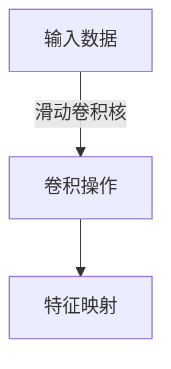
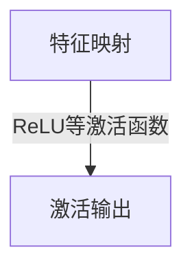
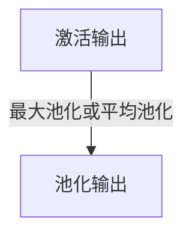
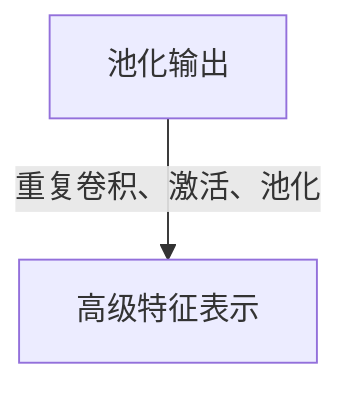
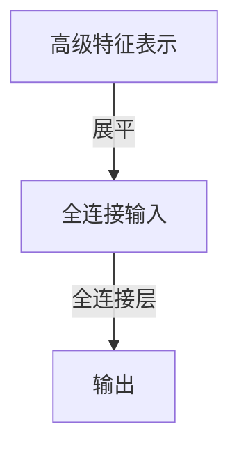
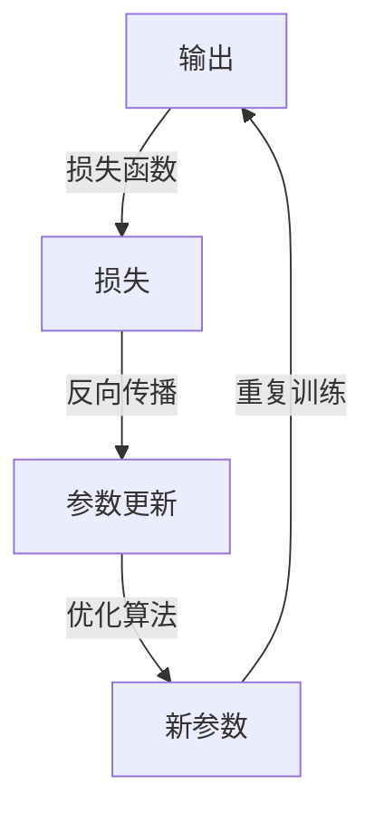

# 卷积神经网络CNN原理与代码实例讲解

## 1.背景介绍

在过去几年中,深度学习技术取得了令人瞩目的进展,尤其是在计算机视觉和自然语言处理等领域。卷积神经网络(Convolutional Neural Networks, CNN)作为一种强大的深度学习模型,在图像识别、目标检测、语音识别等任务中发挥着关键作用。CNN的灵感来源于生物学中视觉皮层的神经元结构,通过局部感受野、权值共享和池化操作等机制,能够有效地捕捉输入数据的局部特征。

## 2.核心概念与联系

### 2.1 卷积层

卷积层是CNN的核心组成部分,它通过在输入数据上滑动卷积核(也称为滤波器)来提取局部特征。卷积核是一个小的权重矩阵,它与输入数据的局部区域进行元素级乘积和求和操作,生成一个新的特征映射。通过在输入数据上滑动卷积核,可以获得不同位置的局部特征,从而形成一个新的特征映射。

### 2.2 池化层

池化层通常紧随卷积层,其目的是降低特征映射的维度,减少计算量和参数数量,并提供一定的平移不变性。最常见的池化操作是最大池化,它从输入特征映射的局部区域中选取最大值作为输出。另一种池化方式是平均池化,它计算局部区域的平均值作为输出。

### 2.3 全连接层

在CNN的最后几层通常是全连接层,它将前面卷积层和池化层提取的高级特征映射展平,并将其输入到全连接层进行分类或回归任务。全连接层的每个神经元与前一层的所有神经元相连,因此具有较高的计算复杂度。

### 2.4 激活函数

激活函数在CNN中扮演着非线性映射的重要角色,常用的激活函数包括ReLU(整流线性单元)、Sigmoid和Tanh等。激活函数引入非线性,使得CNN能够学习复杂的映射关系,提高模型的表达能力。

### 2.5 正则化

为了防止过拟合,CNN通常采用正则化技术,如L1/L2正则化、Dropout等。正则化可以减少模型的复杂度,提高其泛化能力。

## 3.核心算法原理具体操作步骤

CNN的核心算法原理可以概括为以下几个步骤:

1. **卷积操作**:卷积层通过在输入数据上滑动卷积核,计算局部区域与卷积核的元素级乘积和,从而提取局部特征。



2. **激活函数**:对卷积操作的输出结果应用非线性激活函数,如ReLU,以增加模型的表达能力。



3. **池化操作**:池化层对激活输出进行下采样,降低特征映射的维度,减少计算量和参数数量。



4. **堆叠多层**:重复执行卷积、激活和池化操作,形成多层CNN网络,以提取更高级的特征表示。



5. **全连接层**:将高级特征表示展平,输入到全连接层进行分类或回归任务。



6. **损失函数和优化**:根据任务目标定义损失函数,并使用优化算法(如梯度下降)调整CNN的参数,最小化损失函数。



通过上述步骤,CNN可以自动从原始输入数据中学习到有效的特征表示,并完成相应的任务。

## 4.数学模型和公式详细讲解举例说明

### 4.1 卷积操作

卷积操作是CNN的核心计算过程,它可以用数学公式表示为:

$$
(I * K)(i, j) = \sum_{m} \sum_{n} I(i + m, j + n) K(m, n)
$$

其中:
- $I$表示输入数据(如图像)
- $K$表示卷积核(也称为滤波器)
- $m, n$表示卷积核的维度
- $i, j$表示输出特征映射的位置

卷积操作可以看作是在输入数据上滑动卷积核,计算局部区域与卷积核的元素级乘积和。通过在整个输入数据上滑动卷积核,可以获得一个新的特征映射。

例如,对于一个$5 \times 5$的输入数据和一个$3 \times 3$的卷积核,卷积操作的过程如下:

```
输入数据:
 1  2  3  4  5
 6  7  8  9 10
11 12 13 14 15
16 17 18 19 20
21 22 23 24 25

卷积核:
 1  0  1
 0  1  0
 1  0  1

卷积操作:
(1*1 + 2*0 + 3*1 + 6*0 + 7*1 + 8*0 + 11*1 + 12*0 + 13*1) = 36
(2*1 + 3*0 + 4*1 + 7*0 + 8*1 + 9*0 + 12*1 + 13*0 + 14*1) = 44
...
```

通过在输入数据上滑动卷积核,可以得到一个$3 \times 3$的特征映射。

### 4.2 池化操作

池化操作用于降低特征映射的维度,减少计算量和参数数量。最常见的池化操作是最大池化,它从输入特征映射的局部区域中选取最大值作为输出。最大池化可以用数学公式表示为:

$$
(I \circledast K)(i, j) = \max_{(m, n) \in R} I(i + m, j + n)
$$

其中:
- $I$表示输入特征映射
- $K$表示池化核(如$2 \times 2$)
- $R$表示池化核的区域
- $i, j$表示输出特征映射的位置

例如,对于一个$4 \times 4$的输入特征映射和一个$2 \times 2$的池化核,最大池化操作的过程如下:

```
输入特征映射:
 1  2  3  4
 5  6  7  8
 9 10 11 12
13 14 15 16

最大池化操作(步长为2):
max(1, 2, 5, 6) = 6
max(3, 4, 7, 8) = 8
max(9, 10, 13, 14) = 14
max(11, 12, 15, 16) = 16

输出特征映射:
 6  8
14 16
```

通过最大池化操作,输入特征映射的维度从$4 \times 4$降低到$2 \times 2$,同时保留了局部区域的最大值特征。

### 4.3 全连接层

全连接层将前面卷积层和池化层提取的高级特征映射展平,并将其输入到全连接层进行分类或回归任务。全连接层的计算过程可以用矩阵乘法表示:

$$
y = f(W^T x + b)
$$

其中:
- $x$表示输入特征向量
- $W$表示权重矩阵
- $b$表示偏置向量
- $f$表示激活函数(如ReLU、Sigmoid等)

全连接层的输出$y$通常用于分类或回归任务,例如在图像分类任务中,输出向量的每个元素对应一个类别的概率。

## 5.项目实践:代码实例和详细解释说明

以下是使用PyTorch框架实现卷积神经网络的代码示例,用于对MNIST手写数字数据集进行分类:

```python
import torch
import torch.nn as nn
import torch.nn.functional as F

# 定义CNN模型
class ConvNet(nn.Module):
    def __init__(self):
        super(ConvNet, self).__init__()
        self.conv1 = nn.Conv2d(1, 32, 3, 1) # 输入通道数为1,输出通道数为32,卷积核大小为3x3,步长为1
        self.conv2 = nn.Conv2d(32, 64, 3, 1) # 输入通道数为32,输出通道数为64,卷积核大小为3x3,步长为1
        self.dropout1 = nn.Dropout2d(0.25) # 在卷积层之后应用Dropout正则化
        self.dropout2 = nn.Dropout2d(0.5)
        self.fc1 = nn.Linear(9216, 128) # 全连接层,输入特征维度为9216,输出维度为128
        self.fc2 = nn.Linear(128, 10) # 全连接层,输入维度为128,输出维度为10(对应MNIST数据集的10个类别)

    def forward(self, x):
        x = self.conv1(x) # 第一层卷积
        x = F.relu(x) # 应用ReLU激活函数
        x = self.conv2(x) # 第二层卷积
        x = F.max_pool2d(x, 2) # 最大池化,核大小为2x2
        x = self.dropout1(x) # 应用Dropout正则化
        x = torch.flatten(x, 1) # 展平特征映射
        x = self.fc1(x) # 第一层全连接
        x = F.relu(x) # 应用ReLU激活函数
        x = self.dropout2(x) # 应用Dropout正则化
        x = self.fc2(x) # 第二层全连接,输出维度为10(对应MNIST数据集的10个类别)
        output = F.log_softmax(x, dim=1) # 计算log softmax输出
        return output

# 实例化模型
model = ConvNet()

# 定义损失函数和优化器
criterion = nn.NLLLoss() # 负对数似然损失函数
optimizer = torch.optim.Adam(model.parameters(), lr=0.001) # Adam优化器

# 训练循环
for epoch in range(10):
    running_loss = 0.0
    for i, data in enumerate(trainloader, 0):
        inputs, labels = data
        optimizer.zero_grad() # 梯度清零

        outputs = model(inputs) # 前向传播
        loss = criterion(outputs, labels) # 计算损失
        loss.backward() # 反向传播
        optimizer.step() # 更新参数

        running_loss += loss.item()
        if i % 1000 == 999: # 每1000批次打印一次训练损失
            print('[%d, %5d] loss: %.3f' % (epoch + 1, i + 1, running_loss / 1000))
            running_loss = 0.0

# 测试循环
correct = 0
total = 0
with torch.no_grad():
    for data in testloader:
        images, labels = data
        outputs = model(images)
        _, predicted = torch.max(outputs.data, 1)
        total += labels.size(0)
        correct += (predicted == labels).sum().item()

print('Accuracy on test set: %d %%' % (100 * correct / total))
```

代码解释:

1. 定义CNN模型`ConvNet`，包含两个卷积层、两个全连接层和两个Dropout层。
2. 在`forward`函数中定义前向传播过程:
   - 第一层卷积,应用ReLU激活函数
   - 第二层卷积,应用最大池化
   - 应用Dropout正则化
   - 展平特征映射
   - 第一层全连接,应用ReLU激活函数
   - 应用Dropout正则化
   - 第二层全连接,输出维度为10(对应MNIST数据集的10个类别)
   - 计算log softmax输出
3. 实例化模型,定义损失函数(负对数似然损失)和优化器(Adam优化器)。
4. 训练循环:
   - 前向传播计算输出和损失
   - 反向传播计算梯度
   - 更新模型参数
   - 每1000批次打印一次训练损失
5. 测试循环:
   - 在测试集上计算模型的准确率

通过上述代码,我们可以训练一个卷积神经网络模型,并在MNIST数据集上进行手写数字识别。代码中详细注释了每一步的操作,方便理解CNN的实现过程。

## 6.实际应用场景