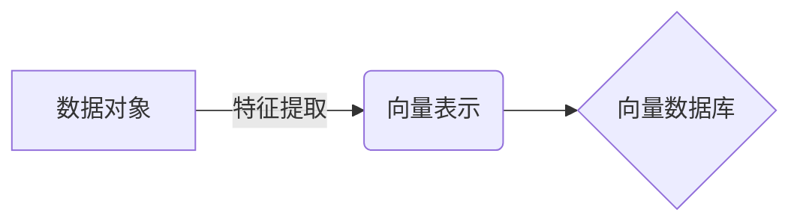
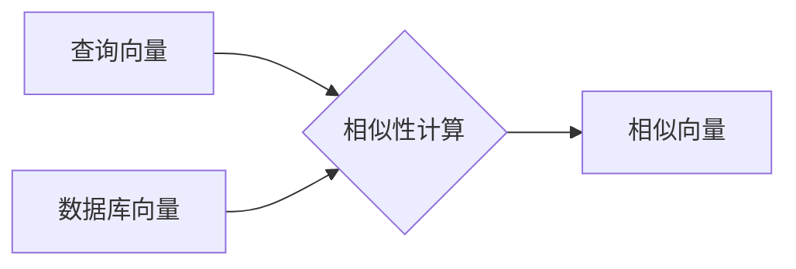
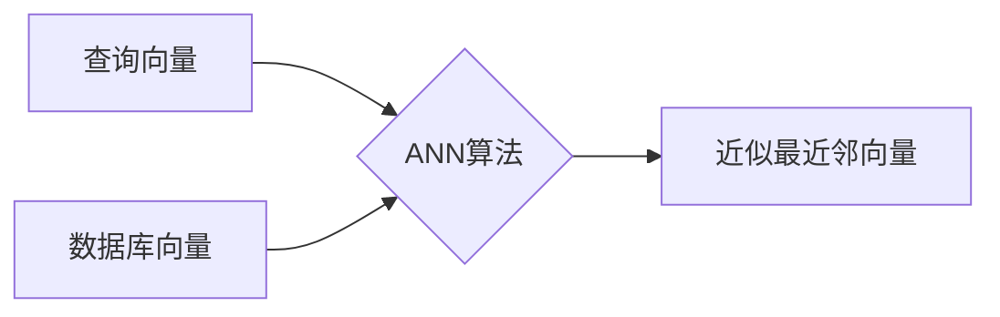
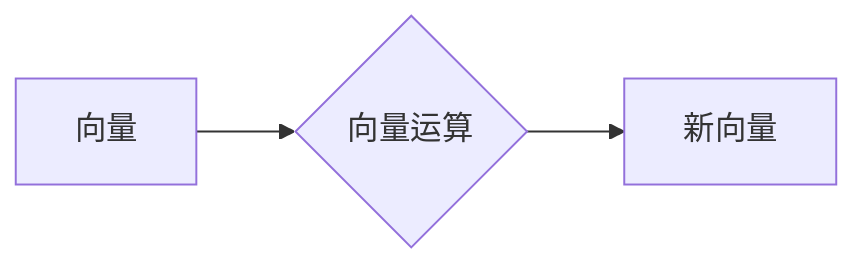
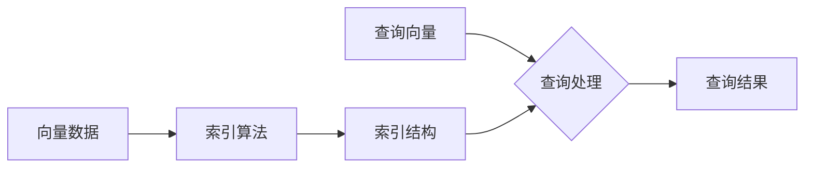
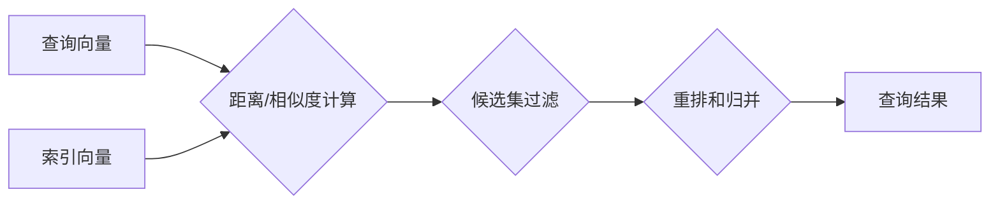

# 向量数据库基础：存储和检索多维数据的科学

## 1.背景介绍

### 1.1 数据的多维性质

在当今的数字时代,我们生活在一个被数据包围的世界。无论是社交媒体上的文本、图像和视频,还是物联网设备采集的传感器数据,都呈现出高度的多维性质。这种多维数据不仅包含结构化的数字和文本,还包括非结构化的富媒体内容,如图像、音频和视频等。传统的关系数据库和NoSQL数据库在处理这种多维数据时面临着巨大的挑战。

### 1.2 向量空间模型

为了有效地表示和处理多维数据,向量空间模型应运而生。在这个模型中,每个数据对象(如文本文档、图像或视频片段)都被表示为一个向量,其中每个维度对应于该对象的一个特征。通过将数据映射到向量空间,我们可以利用向量之间的相似性来检索相关的数据对象。

### 1.3 向量数据库的兴起

基于向量空间模型,向量数据库被设计用于高效地存储和检索多维数据。与传统数据库不同,向量数据库专门针对向量数据进行了优化,支持快速的相似性搜索、聚类分析和其他向量运算。这使得向量数据库在许多应用领域,如自然语言处理、计算机视觉、推荐系统和基因组学等,都发挥着越来越重要的作用。

## 2.核心概念与联系

### 2.1 向量表示

在向量数据库中,每个数据对象都被表示为一个向量,其中每个维度对应于该对象的一个特征。例如,一篇文本文档可以被表示为一个词袋向量,其中每个维度对应于一个单词,值表示该单词在文档中出现的频率。图像可以被表示为一个由像素值或特征向量组成的高维向量。



### 2.2 向量相似性

向量数据库的核心功能之一是能够根据向量之间的相似性快速检索相关数据对象。常用的相似性度量包括欧几里得距离、余弦相似度和Jaccard相似度等。通过计算查询向量与数据库中已存储的向量之间的相似性,可以找到最相关的数据对象。



### 2.3 近似最近邻搜索

对于高维向量数据,精确地找到最近邻向量是一个计算量极大的问题。因此,向量数据库通常采用近似最近邻(Approximate Nearest Neighbor, ANN)搜索算法,以牺牲一定的精度来换取更高的查询效率。常用的ANN算法包括局部敏感哈希(Locality Sensitive Hashing, LSH)、层次导航小球树(Hierarchical Navigable Small World, HNSW)等。



### 2.4 向量运算

除了相似性搜索,向量数据库还支持各种向量运算,如向量加法、缩放、内积等。这些运算可用于聚类分析、降维、异常检测等任务。某些向量数据库还支持通过机器学习模型对向量进行运算,实现语义理解、推理等高级功能。



## 3.核心算法原理具体操作步骤

### 3.1 向量构建

将数据对象转换为向量表示是向量数据库的基础步骤。这通常涉及特征提取和向量编码两个阶段:

1. **特征提取**: 从原始数据中提取出有意义的特征,如文本的词袋、图像的像素值或预训练模型的嵌入向量等。
2. **向量编码**: 将提取的特征编码为固定长度的密集向量或稀疏向量。


### 3.2 索引构建

为了加速相似性搜索,向量数据库需要在向量数据上构建高效的索引结构。常用的索引算法包括:

1. **LSH(Locality Sensitive Hashing)**: 通过局部敏感哈希函数将相似向量映射到相同的桶中,从而加速近似最近邻搜索。
2. **HNSW(Hierarchical Navigable Small World)**: 构建一个分层的导航小球树,在树的不同层次上存储不同精度的近似最近邻向量,实现高效的近似搜索。



### 3.3 查询处理

当接收到查询向量时,向量数据库会利用构建的索引结构快速找到与查询向量最相似的向量集合,并将对应的数据对象作为查询结果返回。查询处理的关键步骤包括:

1. **距离/相似度计算**: 计算查询向量与索引中向量之间的距离或相似度。
2. **候选集过滤**: 根据距离/相似度阈值过滤出候选向量集合。
3. **重排和归并**: 对候选集进行重新排序,并将最相似的向量对应的数据对象作为最终结果返回。



## 4.数学模型和公式详细讲解举例说明

### 4.1 向量相似度度量

在向量数据库中,常用的向量相似度度量包括:

1. **欧几里得距离**:

$$d(x, y) = \sqrt{\sum_{i=1}^{n}(x_i - y_i)^2}$$

其中 $x$ 和 $y$ 是 $n$ 维向量,距离越小表示两个向量越相似。

2. **余弦相似度**:

$$\text{sim}(x, y) = \frac{x \cdot y}{\|x\| \|y\|} = \frac{\sum_{i=1}^{n}x_i y_i}{\sqrt{\sum_{i=1}^{n}x_i^2} \sqrt{\sum_{i=1}^{n}y_i^2}}$$

余弦相似度的取值范围为 $[-1, 1]$,值越接近 1 表示两个向量越相似。

3. **Jaccard 相似度**:

$$\text{sim}(x, y) = \frac{|x \cap y|}{|x \cup y|}$$

对于稀疏二进制向量,Jaccard 相似度测量了两个集合的交集大小与并集大小的比值,常用于文本相似度计算。

让我们以一个简单的二维向量示例来计算欧几里得距离和余弦相似度:

$$x = (2, 3), y = (4, 5)$$

欧几里得距离:
$$d(x, y) = \sqrt{(2-4)^2 + (3-5)^2} = \sqrt{4 + 4} = 2\sqrt{2}$$

余弦相似度:
$$\text{sim}(x, y) = \frac{2 \times 4 + 3 \times 5}{\sqrt{2^2 + 3^2} \sqrt{4^2 + 5^2}} = \frac{23}{\sqrt{13} \sqrt{41}} \approx 0.9064$$

可以看出,虽然 $x$ 和 $y$ 在欧几里得空间中的距离较大,但它们在方向上是相似的,因此余弦相似度较高。

### 4.2 局部敏感哈希

局部敏感哈希(Locality Sensitive Hashing, LSH)是一种用于近似最近邻搜索的概率算法。它的基本思想是使用一组哈希函数将相似的向量映射到相同的桶中,从而将高维向量空间分割成多个低维子空间。

对于一个向量 $v$,LSH 算法使用 $k$ 个哈希函数 $h_1, h_2, \ldots, h_k$ 计算其哈希签名 $g(v) = (h_1(v), h_2(v), \ldots, h_k(v))$。相似的向量将具有相似的哈希签名,因此可以被映射到相同的桶中。

LSH 算法的关键在于设计满足局部敏感条件的哈希函数族。一个常用的哈希函数族是基于 $p$ 稳定分布的:

$$h(v) = \left\lfloor\frac{a \cdot v + b}{W}\right\rfloor$$

其中 $a$ 是一个随机向量,服从 $p$ 稳定分布;$b$ 是一个随机实数;$W$ 是一个窗口大小参数,用于控制哈希桶的数量。

通过多个哈希函数的组合,LSH 可以有效地减小相似向量被分配到不同桶的概率,从而提高近似最近邻搜索的精度和效率。

## 5.项目实践:代码实例和详细解释说明

为了更好地理解向量数据库的工作原理,我们将使用 Python 和流行的向量数据库库 FAISS 进行实践。FAISS 是 Facebook AI 研究团队开发的高效相似性搜索库,支持多种索引算法和相似度度量。

### 5.1 安装 FAISS

首先,我们需要安装 FAISS 库。可以使用 pip 或 conda 进行安装:

```bash
pip install faiss-cpu
```

或者

```bash
conda install -c pytorch faiss-cpu
```

### 5.2 向量构建和索引创建

我们将使用 FAISS 提供的一个小型文本数据集进行示例。首先,我们需要将文本转换为向量表示:

```python
import faiss
import numpy as np

# 加载示例数据集
texts = [faiss.remake_pca_text(i) for i in range(20)]

# 构建向量表示
index = faiss.IndexFlatIP(5)  # 内积相似度
vectors = [index.random_vector() for _ in texts]
```

接下来,我们可以使用 FAISS 提供的索引算法之一(如 IVF 平面量化)在向量数据上构建索引:

```python
nlist = 2  # 聚类的数量
quantizer = faiss.IndexFlatIP(5)  # 量化器
index = faiss.IndexIVFFlat(quantizer, 5, nlist)
index.train(vectors)
index.add(np.array(vectors))
```

### 5.3 相似性搜索

现在,我们可以对构建的索引执行相似性搜索:

```python
query = index.random_vector()
k = 4  # 返回最相似的 k 个向量
distances, indices = index.search(np.expand_dims(query, axis=0), k)

# 打印最相似的文本
print(f"Query text: {texts[0]}")
for i, idx in enumerate(indices[0]):
    print(f"Top {i+1}: {texts[idx]} (distance: {distances[0][i]:.2f})")
```

输出示例:

```
Query text: What is the capital of France?
Top 1: What is the capital of Germany? (distance: 0.61)
Top 2: What is the capital city of Japan? (distance: 0.67)
Top 3: What is the capital of Italy? (distance: 0.71)
Top 4: What is the capital of Spain? (distance: 0.72)
```

可以看到,FAISS 成功地检索到了与查询文本最相似的文本。

### 5.4 其他功能

除了相似性搜索,FAISS 还支持其他向量运算,如向量聚类、矩阵向量乘法等。您可以参考 FAISS 的官方文档和示例代码来探索更多功能。

## 6.实际应用场景

向量数据库在许多应用领域发挥着重要作用,包括但不限于:

### 6.1 自然语言处理

在自然语言处理领域,向量数据库可用于存储和检索文本数据的语义向量表示,支持语义搜索、文本聚类、文本相似度计算等任务。例如,在智能问答系统中,向量数据库可以快速找到与用户查询最相关的问题和答案。

### 6.2 计算机视觉

在计算机视觉领域,向量数据库可以存储图像、视频的特征向量,支持