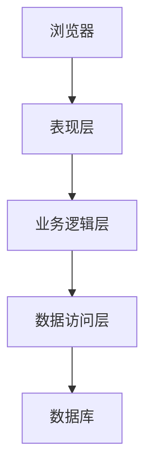

# 基于WEB的办公管理系统详细设计与具体代码实现

## 1. 背景介绍

### 1.1 办公管理系统的重要性

在当今快节奏的商业环境中,高效的办公管理对于企业的运营至关重要。传统的纸质文件管理方式已经无法满足现代化办公的需求,效率低下且容易出错。因此,基于Web的办公管理系统应运而生,它能够极大地提高工作效率,优化业务流程,降低运营成本。

### 1.2 系统概述

基于Web的办公管理系统是一种以浏览器为客户端的综合性应用程序,旨在实现无纸化办公,简化工作流程。该系统通常包括文件管理、审批流程、日程安排、通讯录等多个模块,为企业提供一站式的办公解决方案。

## 2. 核心概念与联系

### 2.1 系统架构

基于Web的办公管理系统通常采用经典的三层架构,包括表现层(前端)、业务逻辑层(后端)和数据访问层。前端通过浏览器与用户交互,后端处理业务逻辑,数据访问层负责与数据库进行交互。



### 2.2 关键技术

- 前端: HTML, CSS, JavaScript, React/Vue/Angular等框架
- 后端: Java, Python, Node.js, Spring, Django等框架
- 数据库: MySQL, PostgreSQL, Oracle等关系型数据库或MongoDB等NoSQL数据库
- 缓存: Redis, Memcached等
- 消息队列: RabbitMQ, Kafka等
- 文件存储: 分布式文件系统或对象存储服务

### 2.3 核心模块

- **文件管理**: 上传、下载、预览、版本控制、权限管理等功能
- **审批流程**: 工作流引擎,支持自定义审批流程
- **日程管理**: 个人日历、团队日历、会议安排等
- **通讯录**: 员工信息管理,组织架构展示
- **知识库**: 文档协作编辑,知识共享

## 3. 核心算法原理具体操作步骤

### 3.1 文件版本控制算法

文件版本控制是办公管理系统中一个关键功能,它能够追踪文件的变更历史,方便回滚到历史版本。常用的版本控制算法包括:

1. **线性版本控制**: 每次修改都会生成一个新版本,版本之间是线性关系。
2. **树状版本控制**: 允许从任意版本创建新的分支,形成树状结构。
3. **并行版本控制**: 支持多人并行编辑同一文件,合并修改。

无论采用何种算法,版本控制的核心步骤如下:

1. 初始化版本库
2. 提交修改,生成新版本
3. 查看版本历史
4. 切换到指定版本
5. 合并修改(可选)

### 3.2 工作流引擎

工作流引擎是审批流程模块的核心,它定义了审批的路由规则和审批人员。常用的工作流模型包括:

1. **有限状态机模型**: 将审批过程抽象为有限个状态和转移规则。
2. **基于活动的模型**: 将审批过程拆分为一系列有序活动。
3. **层次模型**: 支持子流程嵌套,形成层次化的工作流。

工作流引擎的核心算法步骤:

1. 定义流程模型
2. 部署流程定义
3. 启动流程实例
4. 执行任务
5. 流转到下一步骤
6. 完成或终止流程

## 4. 数学模型和公式详细讲解举例说明

### 4.1 文件存储模型

假设我们需要存储一个文件,文件大小为$S$,块大小为$B$,则需要的块数$N$可以表示为:

$$N = \lceil\frac{S}{B}\rceil$$

其中$\lceil x \rceil$表示向上取整。

如果采用纠删码存储,设置纠删码率为$r$,则总的存储空间为:

$$T = N \times (1 + r)$$

通过适当选择块大小$B$和纠删码率$r$,可以在存储空间和传输效率之间寻求平衡。

### 4.2 审批路由模型

假设一个审批流程有$n$个审批节点,每个节点有$m_i$个可选审批人,则总的审批路径数量$P$为:

$$P = \prod_{i=1}^n m_i$$

如果要找到最短审批路径,可以建模为一个加权有向图问题,使用dijkstra算法或其他最短路径算法求解。

设$c_{ij}$表示从节点$i$到节点$j$的权重(例如审批时间),则最短审批路径的总权重为:

$$w = \min\limits_{p \in P} \sum_{(i,j) \in p} c_{ij}$$

通过数学建模,可以优化审批流程,提高效率。

## 5. 项目实践: 代码实例和详细解释说明

本节将提供一些核心模块的代码实例,并详细解释实现原理和关键点。

### 5.1 文件上传模块

```python
from flask import Flask, request
import os

app = Flask(__name__)

# 设置文件上传路径
UPLOAD_FOLDER = 'uploads'
app.config['UPLOAD_FOLDER'] = UPLOAD_FOLDER

@app.route('/upload', methods=['POST'])
def upload_file():
    file = request.files['file']
    if file:
        # 保存文件
        filename = file.filename
        file_path = os.path.join(app.config['UPLOAD_FOLDER'], filename)
        file.save(file_path)
        return 'File uploaded successfully'
    else:
        return 'No file uploaded'

if __name__ == '__main__':
    # 创建上传文件夹
    os.makedirs(UPLOAD_FOLDER, exist_ok=True)
    app.run(debug=True)
```

这是一个使用Python Flask框架实现的简单文件上传模块。主要步骤如下:

1. 设置文件上传路径`UPLOAD_FOLDER`
2. 定义`/upload`路由,接收POST请求
3. 从请求中获取上传的文件对象`file`
4. 将文件保存到指定路径`file_path`
5. 返回上传成功或失败的响应

在实际项目中,还需要添加文件校验、权限控制、版本管理等功能。

### 5.2 工作流引擎模块

```java
public interface WorkflowEngine {
    void deployProcess(Process process);
    ProcessInstance startProcess(String processId, Map<String, Object> variables);
    void completeTask(String taskId, Map<String, Object> variables);
}

public class WorkflowEngineImpl implements WorkflowEngine {
    private Map<String, Process> processes = new HashMap<>();
    private Map<String, ProcessInstance> processInstances = new HashMap<>();

    @Override
    public void deployProcess(Process process) {
        processes.put(process.getId(), process);
    }

    @Override
    public ProcessInstance startProcess(String processId, Map<String, Object> variables) {
        Process process = processes.get(processId);
        ProcessInstance instance = process.start(variables);
        processInstances.put(instance.getId(), instance);
        return instance;
    }

    @Override
    public void completeTask(String taskId, Map<String, Object> variables) {
        ProcessInstance instance = findInstanceByTask(taskId);
        instance.completeTask(taskId, variables);
    }

    private ProcessInstance findInstanceByTask(String taskId) {
        // 查找包含该任务的流程实例
    }
}
```

这是一个使用Java实现的工作流引擎的简化版本,包含以下核心功能:

1. 部署流程定义(`deployProcess`)
2. 启动流程实例(`startProcess`)
3. 完成任务(`completeTask`)

在实现中,使用了进程(`Process`)和进程实例(`ProcessInstance`)的概念,它们分别表示流程模型和运行时实例。

工作流引擎维护了流程定义的注册表(`processes`)和运行中的流程实例(`processInstances`)。当收到完成任务的请求时,引擎会查找包含该任务的流程实例,并执行相应的操作。

在实际项目中,工作流引擎还需要支持更多功能,如任务分配、超时处理、错误处理等。

## 6. 实际应用场景

基于Web的办公管理系统在各行各业都有广泛的应用,下面列举了一些典型场景:

- **政府机构**: 公文流转、在线审批、会议管理等。
- **企业公司**: 协同办公、项目管理、客户关系管理等。
- **教育机构**: 教务管理、学生事务管理、资源共享等。
- **医疗机构**: 电子病历管理、诊疗流程管理、药品管理等。

无论是何种场景,办公管理系统都能够显著提高工作效率,降低运营成本,实现无纸化办公。

## 7. 工具和资源推荐

在开发基于Web的办公管理系统时,可以使用以下工具和资源:

- **开发框架**: Spring Boot, Django, Node.js等
- **前端框架**: React, Vue, Angular等
- **工作流引擎**: Activiti, Camunda, jBPM等
- **文档管理**: Alfresco, Confluence, SharePoint等
- **在线协作**: Google Suite, Office 365等
- **开源项目**: OFBiz, KnowledgeTree, OpenKM等

此外,还可以参考一些优秀的开源项目和技术博客,了解最新的技术动向和最佳实践。

## 8. 总结: 未来发展趋势与挑战

基于Web的办公管理系统正在不断演进,以适应不断变化的商业需求。未来的发展趋势包括:

1. **智能化**: 利用人工智能技术,实现自动化流程、智能决策等。
2. **移动化**: 支持移动办公,提供跨平台的无缝体验。
3. **云化**: 将系统部署在云端,实现弹性扩展和按需付费。
4. **开放性**: 提供开放的API,支持与第三方系统集成。
5. **大数据分析**: 挖掘办公数据,发现潜在价值。

同时,办公管理系统也面临一些挑战,如数据安全、隐私保护、系统性能优化等,需要在未来的发展中予以重视。

## 9. 附录: 常见问题与解答

### 9.1 如何实现文件的版本控制?

文件版本控制可以通过多种算法实现,如线性版本控制、树状版本控制和并行版本控制。具体的实现方式取决于系统的需求和复杂程度。一般来说,需要维护一个版本库,记录每次修改的差异,并提供回滚、合并等操作。

### 9.2 工作流引擎如何定义审批路由?

工作流引擎通常采用有限状态机模型、基于活动的模型或层次模型来定义审批路由。开发人员需要根据业务需求,设计出合理的审批流程模型,包括审批节点、审批人员、路由规则等。一些流行的工作流引擎(如Activiti、Camunda)提供了图形化的流程设计器,可以方便地定义和部署流程。

### 9.3 如何优化系统性能?

优化系统性能需要从多个方面入手:

1. **缓存优化**: 使用Redis、Memcached等缓存技术,减少数据库压力。
2. **异步处理**: 将耗时操作(如文件上传、发送邮件等)交给消息队列异步处理。
3. **负载均衡**: 使用负载均衡器分散请求,实现水平扩展。
4. **数据库优化**: 合理设计数据库schema、创建索引、使用读写分离等。
5. **代码优化**: 使用更高效的算法和数据结构,避免不必要的计算。

### 9.4 如何保证数据安全?

保证数据安全是办公管理系统的重中之重,可以从以下几个方面着手:

1. **访问控制**: 实现严格的权限管理,只有授权用户才能访问相关数据。
2. **数据加密**: 对敏感数据(如密码、文件内容等)进行加密存储和传输。
3. **备份策略**: 制定合理的备份策略,防止数据丢失。
4. **安全审计**: 记录并审计用户的操作日志,及时发现安全隐患。
5. **latest安全机制**: 如防火墙、入侵检测、漏洞修复等。

作者: 禅与计算机程序设计艺术 / Zen and the Art of Computer Programming