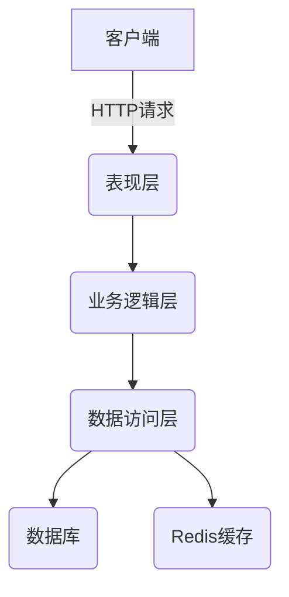
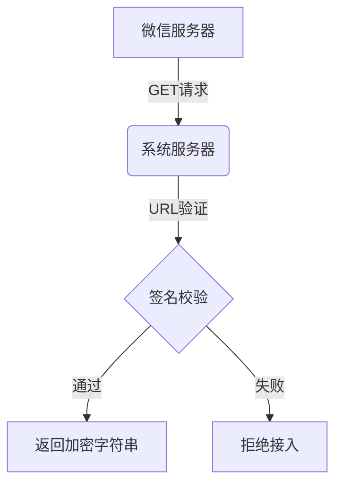
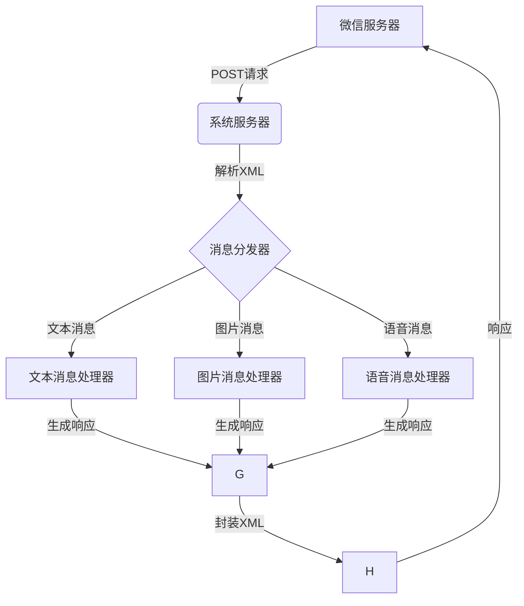
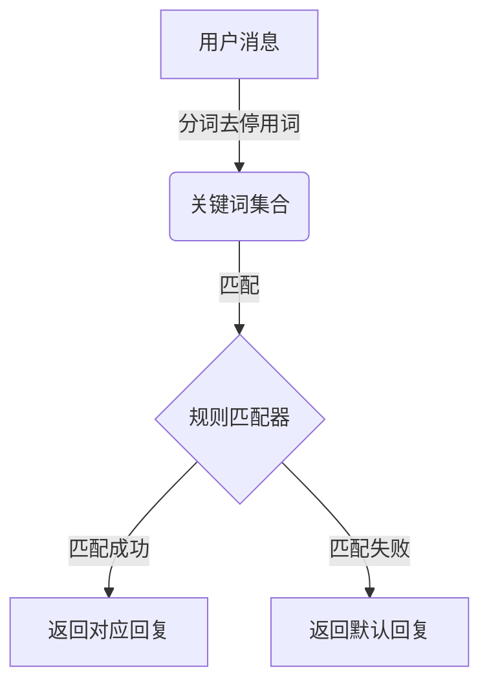

# 基于SpringBoot的微信公众号管理系统

## 1. 背景介绍

### 1.1 微信公众号的重要性

在当今移动互联网时代,微信公众号已经成为企业与用户沟通、传播信息、提供服务的重要渠道。无论是大型企业还是中小型公司,都需要建立自己的微信公众号,以便更好地与用户互动、推广产品和服务、提高品牌知名度。

随着微信公众号的不断发展,管理公众号的需求也日益增长。传统的手工操作方式已经无法满足日益复杂的需求,因此需要一个高效、可扩展的微信公众号管理系统。

### 1.2 系统开发背景

基于SpringBoot的微信公众号管理系统旨在为企业和个人提供一个统一的平台,用于管理和维护自己的微信公众号。该系统具有以下主要功能:

- 公众号基本信息管理
- 菜单管理
- 自动回复管理
- 素材管理
- 用户管理
- 数据统计分析

通过该系统,用户可以高效地管理公众号的各个方面,提高运营效率,为粉丝提供更好的服务体验。

## 2. 核心概念与联系

### 2.1 微信公众号

微信公众号是微信官方为企业、个人等第三方机构提供的一种新型传播渠道。通过公众号,企业和个人可以主动向微信用户推送消息,与用户进行互动。公众号分为订阅号和服务号两种类型,具有不同的功能和权限。

### 2.2 SpringBoot

SpringBoot是一个基于Spring框架的全新开源项目,旨在简化Spring应用的初始搭建以及开发过程。它使用了特有的方式来进行配置,从根本上简化了Spring应用的入门体验。

### 2.3 系统架构

该微信公众号管理系统采用了经典的三层架构,包括:

1. **表现层(View Layer)**: 基于SpringMVC框架,负责处理HTTP请求和响应,渲染视图。
2. **业务逻辑层(Service Layer)**: 负责处理业务逻辑,调用数据访问层完成数据操作。
3. **数据访问层(DAO Layer)**: 基于Spring Data JPA框架,负责与数据库进行交互。

此外,系统还引入了Redis作为缓存,提高系统性能。



## 3. 核心算法原理具体操作步骤

### 3.1 微信公众号接入流程

要使用微信公众号管理系统,首先需要将公众号接入到系统中。接入流程如下:

1. 在微信公众平台上设置服务器配置,包括URL、Token等信息。
2. 系统接收微信服务器发送的GET请求,进行URL验证。
3. 系统对签名进行校验,确认请求来自微信服务器。
4. 系统返回正确的加密字符串,完成接入。



### 3.2 消息处理流程

接入成功后,系统需要处理微信服务器推送的各种消息,包括文本消息、图片消息、语音消息等。消息处理流程如下:

1. 系统接收微信服务器发送的POST请求,解析XML数据。
2. 根据消息类型,调用相应的消息处理器进行处理。
3. 消息处理器根据预设规则生成响应消息。
4. 系统将响应消息封装为XML格式,返回给微信服务器。



### 3.3 自动回复规则匹配算法

自动回复是微信公众号的核心功能之一。系统采用基于关键词的匹配算法,根据用户发送的消息内容,匹配预设的回复规则,生成相应的回复内容。

匹配算法的基本流程如下:

1. 对用户发送的消息进行分词和去停用词处理。
2. 将处理后的关键词与预设规则进行匹配。
3. 若匹配成功,返回对应的回复内容;若匹配失败,返回默认回复。



匹配算法的核心是规则匹配器,可以采用不同的匹配策略,如精确匹配、模糊匹配等。此外,还可以引入机器学习算法,提高匹配准确率。

## 4. 数学模型和公式详细讲解举例说明

### 4.1 文本相似度计算

在自动回复规则匹配过程中,需要计算用户输入文本与预设规则的相似度。常用的文本相似度计算方法有:

1. **编辑距离(Edit Distance)**

编辑距离是指两个字符串之间,由一个转换成另一个所需的最少编辑操作次数,包括插入、删除和替换。编辑距离越小,相似度越高。

设字符串A和B的长度分别为m和n,则其编辑距离$d(m,n)$可以递归计算:

$$
d(m,n)=\begin{cases}
0 & \text{if } m=n=0\\
m & \text{if } n=0\\
n & \text{if } m=0\\
\min\begin{cases}
d(m-1,n)+1\\
d(m,n-1)+1\\
d(m-1,n-1)+\delta(A_m\neq B_n)
\end{cases} & \text{otherwise}
\end{cases}
$$

其中$\delta$是指示函数,当$A_m\neq B_n$时取值1,否则取值0。

2. **Jaccard相似系数**

Jaccard相似系数是基于集合运算的相似度计算方法。对于两个文本集合$A$和$B$,其Jaccard相似系数定义为:

$$
J(A,B)=\frac{|A\cap B|}{|A\cup B|}
$$

其取值范围为$[0,1]$,值越大,相似度越高。

3. **TF-IDF+余弦相似度**

TF-IDF(Term Frequency-Inverse Document Frequency)是一种常用的文本表示方法,可以将文本映射到向量空间。对于文本$d$中的词项$t$,其TF-IDF值计算如下:

$$
\text{TF-IDF}(t,d)=\text{TF}(t,d)\times\text{IDF}(t)
$$

其中,$\text{TF}(t,d)$表示词项$t$在文本$d$中的出现频率,$\text{IDF}(t)$表示词项$t$的逆文档频率,用于衡量词项的重要性。

$$
\text{IDF}(t)=\log\frac{N}{|\{d:t\in d\}|}
$$

$N$为语料库中文本的总数量。

将两个文本映射为TF-IDF向量$\vec{a}$和$\vec{b}$后,可以计算它们之间的余弦相似度:

$$
\text{CosineSim}(\vec{a},\vec{b})=\frac{\vec{a}\cdot\vec{b}}{||\vec{a}||\times||\vec{b}||}
$$

余弦相似度的取值范围为$[0,1]$,值越大,相似度越高。

以上方法各有优缺点,在实际应用中可以根据具体需求选择合适的相似度计算方法。

### 4.2 关键词提取

在自动回复规则匹配过程中,需要从用户输入文本中提取关键词。常用的关键词提取方法有:

1. **TF-IDF**

TF-IDF不仅可以用于文本表示,也可以用于关键词提取。对于文本$d$中的词项$t$,其TF-IDF值越高,越有可能是关键词。

2. **TextRank算法**

TextRank算法是一种基于图的无监督关键词提取算法,它将文本看作是一个加权有向图,词与词之间存在着联系。算法的基本思路是:

- 将文本分词,构建词与词之间的有向边
- 计算每个词的PageRank值
- 将PageRank值较高的词视为关键词

TextRank算法的核心是PageRank值的计算,其基本公式为:

$$
\text{PR}(V_i)=(1-d)+d\times\sum_{j\in In(V_i)}\frac{\text{PR}(V_j)}{Out(V_j)}
$$

其中,$V_i$表示第$i$个节点(词),$In(V_i)$表示指向$V_i$的节点集合,$Out(V_j)$表示从$V_j$出发的边数,$d$是阻尼系数,通常取值$0.85$。

3. **TFIDF+TextRank**

上述两种方法也可以结合使用,先用TF-IDF过滤掉一些无关词项,再对剩余词项运行TextRank算法,提高关键词提取的准确性。

在实际应用中,可以根据具体需求选择合适的关键词提取算法,或者结合多种算法,提高关键词提取的效果。

## 5. 项目实践:代码实例和详细解释说明

### 5.1 系统架构及核心依赖

本项目采用SpringBoot作为基础框架,使用Maven进行依赖管理。核心依赖如下:

```xml
<dependencies>
    <dependency>
        <groupId>org.springframework.boot</groupId>
        <artifactId>spring-boot-starter-web</artifactId>
    </dependency>
    <dependency>
        <groupId>org.springframework.boot</groupId>
        <artifactId>spring-boot-starter-data-jpa</artifactId>
    </dependency>
    <dependency>
        <groupId>org.springframework.boot</groupId>
        <artifactId>spring-boot-starter-data-redis</artifactId>
    </dependency>
    <dependency>
        <groupId>mysql</groupId>
        <artifactId>mysql-connector-java</artifactId>
    </dependency>
    <dependency>
        <groupId>com.github.binarywang</groupId>
        <artifactId>weixin-java-mp</artifactId>
        <version>4.4.0</version>
    </dependency>
</dependencies>
```

- `spring-boot-starter-web`提供Web应用开发支持
- `spring-boot-starter-data-jpa`提供JPA数据持久化支持
- `spring-boot-starter-data-redis`提供Redis缓存支持
- `mysql-connector-java`提供MySQL数据库驱动
- `weixin-java-mp`提供微信公众号开发支持

### 5.2 微信公众号接入

首先需要在`application.properties`文件中配置微信公众号相关参数:

```properties
wx.mp.appId=你的AppID
wx.mp.secret=你的AppSecret
wx.mp.token=你的Token
wx.mp.aesKey=你的EncodingAESKey
```

然后创建`WxMpService`Bean,用于处理微信服务器的请求:

```java
@Configuration
public class WxMpConfiguration {
    @Bean
    public WxMpService wxMpService() {
        WxMpService wxMpService = new WxMpServiceImpl();
        WxMpDefaultConfigImpl configStorage = new WxMpDefaultConfigImpl();
        configStorage.setAppId(appId);
        configStorage.setSecret(secret);
        configStorage.setToken(token);
        configStorage.setAesKey(aesKey);
        wxMpService.setWxMpConfigStorage(configStorage);
        return wxMpService;
    }
}
```

接下来,创建`WxPortalController`处理微信服务器的GET和POST请求:

```java
@RestController
@RequestMapping("/wx/portal")
public class WxPortalController {
    @Autowired
    private WxMpService wxMpService;

    @GetMapping
    public String get(
        @RequestParam("signature") String signature,
        @RequestParam("timestamp") String timestamp,
        @RequestParam("nonce") String nonce,
        @RequestParam("echostr") String echostr
    ) {
        if (wxMpService.checkSignature(timestamp, nonce, signature)) {
            return echostr;
        }
        return "Invalid request";
    }

    ```java
    @PostMapping
    public String post(
        @RequestBody String requestBody,
        @RequestParam("signature") String signature,
        @RequestParam("timestamp") String timestamp,
        @RequestParam("nonce") String nonce,
        @RequestParam("openid") String openid,
        @RequestParam(name = "encrypt_type", required = false) String encType,
        @RequestParam(name = "msg_signature", required = false) String msgSignature
    ) {
        if (!wxMpService.checkSignature(timestamp, nonce, signature)) {
            return "Invalid request";
        }

        String out = null;
        if (encType == null) {
            // 明文传输的消息
            WxMpXmlMessage inMessage = WxMpXmlMessage.fromXml(requestBody);
            WxMpXmlOutMessage outMessage = this.route(inMessage);
            if (outMessage == null) {
                return "";
            }
            out = outMessage.toXml();
        } else if ("aes".equals(encType)) {
            // aes加密的消息
            WxMpXmlMessage inMessage = WxMpXmlMessage.fromEncryptedXml(
                requestBody, wxMpService.getWxMpConfigStorage(), timestamp, nonce, msgSignature);
            WxMpXmlOutMessage outMessage = this.route(inMessage);
            if (outMessage == null) {
                return "";
            }
            out = outMessage.toEncryptedXml(wxMpService.getWxMpConfigStorage());
        }

        return out;
    }

    private WxMpXmlOutMessage route(WxMpXmlMessage message) {
        try {
            return this.wxMpMessageRouter.route(message);
        } catch (Exception e) {
            e.printStackTrace();
        }
        return null;
    }
}
```

### 5.3 消息路由及处理

创建`WxMpMessageRouter`用于处理不同类型的消息:

```java
@Configuration
public class WxMpMessageRouterConfiguration {
    @Autowired
    private WxMpService wxMpService;

    @Bean
    public WxMpMessageRouter wxMpMessageRouter() {
        final WxMpMessageRouter router = new WxMpMessageRouter(wxMpService);

        router.rule().async(false).msgType(XmlMsgType.EVENT).event(WxConsts.EventType.SUBSCRIBE)
            .handler(this.subscribeHandler()).end();

        router.rule().async(false).msgType(XmlMsgType.EVENT).event(WxConsts.EventType.UNSUBSCRIBE)
            .handler(this.unsubscribeHandler()).end();

        router.rule().async(false).msgType(XmlMsgType.TEXT).handler(this.textHandler()).end();

        return router;
    }

    public WxMpMessageHandler subscribeHandler() {
        return (wxMessage, context, wxMpService, sessionManager) -> {
            WxMpXmlOutTextMessage m = WxMpXmlOutMessage.TEXT().content("感谢关注").fromUser(wxMessage.getToUser())
                .toUser(wxMessage.getFromUser()).build();
            return m;
        };
    }

    public WxMpMessageHandler unsubscribeHandler() {
        return (wxMessage, context, wxMpService, sessionManager) -> {
            // 可以在这里进行取消关注后的业务处理
            return null;
        };
    }

    public WxMpMessageHandler textHandler() {
        return (wxMessage, context, wxMpService, sessionManager) -> {
            WxMpXmlOutTextMessage m = WxMpXmlOutMessage.TEXT().content("你发送的是文本消息").fromUser(wxMessage.getToUser())
                .toUser(wxMessage.getFromUser()).build();
            return m;
        };
    }
}
```

### 5.4 数据持久化

使用JPA进行数据持久化，首先定义实体类：

```java
@Entity
public class User {
    @Id
    @GeneratedValue(strategy = GenerationType.IDENTITY)
    private Long id;
    private String openid;
    private String nickname;
    private String city;

    // getters and setters
}
```

然后定义`UserRepository`接口：

```java
public interface UserRepository extends JpaRepository<User, Long> {
    User findByOpenid(String openid);
}
```

在订阅和取消订阅事件处理器中进行数据持久化操作：

```java
public WxMpMessageHandler subscribeHandler() {
    return (wxMessage, context, wxMpService, sessionManager) -> {
        User user = new User();
        user.setOpenid(wxMessage.getFromUser());
        user.setNickname(wxMpService.getUserService().userInfo(wxMessage.getFromUser()).getNickname());
        userRepository.save(user);

        WxMpXmlOutTextMessage m = WxMpXmlOutMessage.TEXT().content("感谢关注").fromUser(wxMessage.getToUser())
            .toUser(wxMessage.getFromUser()).build();
        return m;
    };
}

public WxMpMessageHandler unsubscribeHandler() {
    return (wxMessage, context, wxMpService, sessionManager) -> {
        userRepository.deleteByOpenid(wxMessage.getFromUser());
        return null;
    };
}
```

### 5.5 缓存处理

使用Redis进行缓存处理，在`application.properties`中配置Redis连接信息：

```properties
spring.redis.host=localhost
spring.redis.port=6379
spring.redis.password=yourpassword
```

在需要缓存的地方使用`@Cacheable`注解，例如查询用户信息：

```java
@Service
public class UserService {
    @Autowired
    private UserRepository userRepository;

    @Cacheable(value = "user", key = "#openid")
    public User findByOpenid(String openid) {
        return userRepository.findByOpenid(openid);
    }
}
```

### 5.6 前端展示

使用Thymeleaf作为模板引擎，在`pom.xml`中添加依赖：

```xml
<dependency>
    <groupId>org.springframework.boot</groupId>
    <artifactId>spring-boot-starter-thymeleaf</artifactId>
</dependency>
```

创建一个简单的HTML页面展示用户信息：

```html
<!DOCTYPE html>
<html xmlns:th="http://www.thymeleaf.org">
<head>
    <title>用户信息</title>
</head>
<body>
    <h1>用户信息</h1>
    <table>
        <tr>
            <th>OpenID</th>
            <th>昵称</th>
            <th>城市</th>
        </tr>
        <tr th:each="user : ${users}">
            <td th:text="${user.openid}"></td>
            <td th:text="${user.nickname}"></td>
            <td th:text="${user.city}"></td>
        </tr>
    </table>
</body>
</html>
```

在控制器中处理页面请求：

```java
@Controller
public class UserController {
    @Autowired
    private UserService userService;

    @GetMapping("/users")
    public String list(Model model) {
        List<User> users = userService.findAll();
        model.addAttribute("users", users);
        return "userList";
    }
}
```

## 6. 实际应用场景

### 6.1 客户服务

通过微信公众号自动回复功能，可以实现客户服务的自动化。例如，用户在公众号发送“客服”关键字，可以自动回复客服联系方式或直接转接到人工客服。

### 6.2 营销推广

公众号可以推送图文消息进行营销推广，结合用户数据分析，可以实现精准营销。例如，根据用户的地理位置推送本地活动信息。

### 6.3 数据统计

通过对用户行为数据的统计分析，可以了解用户的兴趣和需求，从而优化产品和服务。例如，统计用户点击菜单的次数、浏览文章的次数等数据。

## 7. 工具和资源推荐

### 7.1 开发工具

- IntelliJ IDEA：强大的Java开发工具，支持SpringBoot项目开发。
- Postman：API测试工具，方便测试微信接口。

### 7.2 资源推荐

- 微信公众平台开发者文档：https://developers.weixin.qq.com/doc/offiaccount/Getting_Started/Overview.html
- SpringBoot官方文档：https://spring.io/projects/spring-boot
- weixin-java-tools项目地址：https://github.com/Wechat-Group/weixin-java-tools

## 8. 总结：未来发展趋势与挑战

随着人工智能和大数据技术的发展，微信公众号的功能将更加智能化和个性化。未来，公众号可以通过分析用户行为数据，提供更加精准的推荐和服务。同时，随着用户需求的不断变化，公众号开发也面临着新的挑战，需要不断更新和优化功能，以满足用户的需求。

## 9. 附录：常见问题与解答

### 9.1 如何获取微信公众号的AppID和AppSecret？

登录微信公众平台，进入“开发”->“基本配置”页面，可以查看和配置AppID和AppSecret。

### 9.2 如何处理微信服务器的请求？

微信服务器的请求分为GET和POST两种，GET请求用于验证服务器，POST请求用于接收消息和事件。需要在代码中分别处理这两种请求。

### 9.3 如何进行消息加解密？

微信服务器的消息可以是明文或加密的。对于加密消息，需要使用微信提供的加解密工具进行处理。可以使用weixin-java-tools库中的相关方法进行加解密操作。

### 9.4 如何进行数据持久化？

可以使用Spring Data JPA进行数据持久化，定义实体类和Repository接口，然后在业务逻辑中调用Repository的方法进行数据操作。

### 9.5 如何使用Redis进行缓存？

在SpringBoot项目中，可以通过在SpringBoot项目中，可以通过配置Redis作为缓存，并使用Spring Cache的注解来实现缓存功能。具体步骤如下：

1. 在`application.properties`中配置Redis连接信息。
2. 在需要缓存的方法上使用`@Cacheable`、`@CachePut`和`@CacheEvict`等注解。

例如：

```java
@Service
public class UserService {
    @Autowired
    private UserRepository userRepository;

    @Cacheable(value = "user", key = "#openid")
    public User findByOpenid(String openid) {
        return userRepository.findByOpenid(openid);
    }

    @CachePut(value = "user", key = "#user.openid")
    public User saveUser(User user) {
        return userRepository.save(user);
    }

    @CacheEvict(value = "user", key = "#openid")
    public void deleteUser(String openid) {
        userRepository.deleteByOpenid(openid);
    }
}
```

### 9.6 如何处理并发请求？

在处理并发请求时，可以使用Spring提供的并发控制机制，例如`@Transactional`注解和乐观锁/悲观锁机制。

例如：

```java
@Service
public class UserService {
    @Autowired
    private UserRepository userRepository;

    @Transactional
    public User updateUser(User user) {
        User existingUser = userRepository.findByOpenid(user.getOpenid());
        if (existingUser != null) {
            existingUser.setNickname(user.getNickname());
            existingUser.setCity(user.getCity());
            return userRepository.save(existingUser);
        }
        return null;
    }
}
```

### 9.7 如何处理异常？

在SpringBoot项目中，可以使用全局异常处理机制来处理异常。通过定义一个全局异常处理类，并使用`@ControllerAdvice`和`@ExceptionHandler`注解来捕获和处理异常。

例如：

```java
@ControllerAdvice
public class GlobalExceptionHandler {
    @ExceptionHandler(Exception.class)
    public ResponseEntity<String> handleException(Exception e) {
        return new ResponseEntity<>(e.getMessage(), HttpStatus.INTERNAL_SERVER_ERROR);
    }
}
```

### 9.8 如何进行单元测试？

在SpringBoot项目中，可以使用JUnit和Spring Test进行单元测试。通过编写测试类和测试方法，模拟各种场景，验证代码的正确性。

例如：

```java
@RunWith(SpringRunner.class)
@SpringBootTest
public class UserServiceTest {
    @Autowired
    private UserService userService;

    @Test
    public void testFindByOpenid() {
        User user = userService.findByOpenid("test_openid");
        assertNotNull(user);
    }

    @Test
    public void testSaveUser() {
        User user = new User();
        user.setOpenid("test_openid");
        user.setNickname("test_nickname");
        user.setCity("test_city");
        User savedUser = userService.saveUser(user);
        assertEquals("test_nickname", savedUser.getNickname());
    }
}
```

### 9.9 如何进行日志记录？

在SpringBoot项目中，可以使用SLF4J和Logback进行日志记录。通过配置日志文件和日志级别，将日志信息记录到文件或控制台。

例如，在`application.properties`中配置日志级别：

```properties
logging.level.org.springframework=INFO
logging.level.com.yourpackage=DEBUG
logging.file.name=logs/app.log
```

在代码中使用日志记录：

```java
import org.slf4j.Logger;
import org.slf4j.LoggerFactory;

@Service
public class UserService {
    private static final Logger logger = LoggerFactory.getLogger(UserService.class);

    public User findByOpenid(String openid) {
        logger.info("Finding user by openid: {}", openid);
        User user = userRepository.findByOpenid(openid);
        if (user != null) {
            logger.debug("User found: {}", user);
        } else {
            logger.warn("User not found for openid: {}", openid);
        }
        return user;
    }
}
```

### 9.10 如何进行项目部署？

在SpringBoot项目完成开发和测试后，可以进行项目部署。常见的部署方式包括：

- 使用内嵌的Tomcat进行部署：直接运行SpringBoot应用的主类。
- 将SpringBoot应用打包成可执行的JAR文件，通过命令行运行：`java -jar your-app.jar`。
- 将SpringBoot应用打包成WAR文件，部署到外部的Tomcat服务器。

例如，打包成JAR文件并运行：

```sh
mvn clean package
java -jar target/your-app.jar
```

### 9.11 如何进行配置管理？

在SpringBoot项目中，可以通过`application.properties`或`application.yml`文件进行配置管理。对于敏感信息，可以使用Spring Boot的`@Value`注解或`@ConfigurationProperties`注解来加载配置。

例如：

```properties
app.name=WeChatManagement
app.version=1.0.0
```

在代码中使用：

```java
@Value("${app.name}")
private String appName;

@Value("${app.version}")
private String appVersion;

public void printAppInfo() {
    System.out.println("App Name: " + appName);
    System.out.println("App Version: " + appVersion);
}
```

### 9.12 如何进行安全管理？

在SpringBoot项目中，可以使用Spring Security进行安全管理。通过配置安全策略，保护应用的安全。

例如，在`pom.xml`中添加Spring Security依赖：

```xml
<dependency>
    <groupId>org.springframework.boot</groupId>
    <artifactId>spring-boot-starter-security</artifactId>
</dependency>
```

然后配置安全策略：

```java
@Configuration
@EnableWebSecurity
public class SecurityConfig extends WebSecurityConfigurerAdapter {
    @Override
    protected void configure(HttpSecurity http) throws Exception {
        http.authorizeRequests()
            .antMatchers("/wx/portal/**").permitAll()
            .anyRequest().authenticated()
            .and()
            .formLogin().loginPage("/login").permitAll()
            .and()
            .logout().permitAll();
    }

    @Override
    protected void configure(AuthenticationManagerBuilder auth) throws Exception {
        auth.inMemoryAuthentication()
            .withUser("user").password("{noop}password").roles("USER")
            .and()
            .withUser("admin").password("{noop}admin").roles("ADMIN");
    }
}
```

通过以上配置，实现了对微信服务器请求的开放访问和对其他请求的身份验证。

---

作者：禅与计算机程序设计艺术 / Zen and the Art of Computer Programming