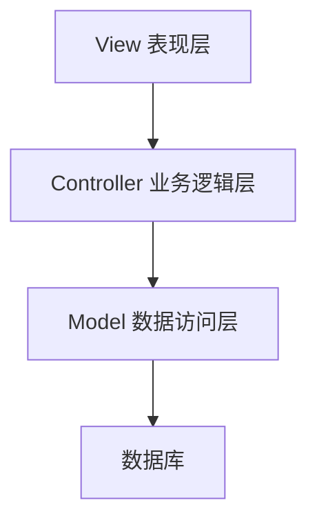

# 基于SSM的排课选课系统

## 1.背景介绍

随着教育信息化建设的不断推进,高校教务管理系统的需求日益迫切。传统的手工排课和选课方式已经无法满足现代化教学管理的要求,给教师和学生带来了诸多不便。因此,构建一个高效、便捷的排课选课系统,对于提高教学管理水平、优化教学资源配置具有重要意义。

本文将介绍基于SSM(Spring+SpringMVC+MyBatis)框架的排课选课系统的设计与实现。该系统旨在解决高校排课选课过程中的痛点,为师生提供一个统一、高效的平台,实现自动化排课、在线选课、课程查询等功能,从而提高教学管理效率,优化教学资源利用。

## 2.核心概念与联系

### 2.1 SSM框架

SSM框架是指Spring+SpringMVC+MyBatis三大框架的集合,是目前JavaEE领域中使用最广泛的轻量级框架组合。

- Spring: 提供了面向切面编程(AOP)和控制反转(IOC)等功能,用于管理应用程序对象及依赖关系。
- SpringMVC: 基于Spring框架,实现了Web层的Model-View-Controller设计模式,简化了Web开发流程。
- MyBatis: 一个优秀的持久层框架,用于执行SQL语句、存取数据库数据,避免了冗余的JDBC代码。

### 2.2 排课选课系统核心概念

- 课程: 包括课程编号、名称、学分、上课时间等信息。
- 教师: 具有工号、姓名、职称等属性,可开设和任课多门课程。
- 学生: 具有学号、姓名、年级、专业等属性,可选修多门课程。
- 排课: 根据教师情况、教室资源等,为每门课程安排合理的上课时间和教室。
- 选课: 学生根据自身情况,选择所需修读的课程。

## 3.核心算法原理具体操作步骤 

### 3.1 排课算法

排课算法的主要目标是在满足各种硬性约束(如教师时间冲突、教室容量等)的前提下,尽可能满足软性约束(如教师时间窗口偏好、教室特殊要求等),生成一个合理的排课方案。

本系统采用基于启发式规则的排课算法,具体步骤如下:

1. **数据预处理**: 获取教师、课程、教室等基本信息,构建数据模型。
2. **生成初始解**: 按照一定规则(如优先排必修课、大班课等),为每门课程临时指派一个合法的上课时间和教室,得到一个初始的排课方案。
3. **评估初始解**: 根据硬性约束和软性约束,计算初始解的适应度评分。
4. **规则迭代优化**:
    - 设置终止条件,如最大迭代次数、局部最优解连续出现次数等。
    - 在每次迭代中,遍历所有课程,尝试交换其上课时间和教室,并计算新解的适应度评分。
    - 如果新解的评分更高,则接受该解;否则根据一定概率决定是否接受(模拟退火算法)。
5. **输出最优解**:当达到终止条件时,输出当前最优的排课方案。

该算法的优点是简单、高效,能够在合理的时间内得到较优的排课方案。但也存在一定局限性,可能陷入局部最优解。

### 3.2 选课算法

学生选课过程中,需要考虑课程之间的先修关系、时间冲突等约束条件。本系统采用基于优先级队列的选课算法,具体步骤如下:

1. **构建课程关系图**:根据课程之间的先修关系,构建一个有向无环图,每个节点代表一门课程。
2. **计算课程优先级**:遍历课程关系图,计算每门课程的优先级值。优先级值越高,表示该课程越应该被优先选修。
3. **优先级队列初始化**:将所有课程按照优先级值从高到低排序,构建一个优先级队列。
4. **学生选课**:
    - 从优先级队列中取出最高优先级的课程。
    - 检查该课程是否与已选课程时间冲突。如果无冲突,则选修该课程。
    - 重复上述过程,直至优先级队列为空或达到学生可选课程数上限。

该算法能够很好地解决课程之间的先修关系问题,并尽量减少选课时的时间冲突。但在课程数量较多、时间安排较为分散的情况下,仍可能出现无法完全避免时间冲突的情况。

## 4.数学模型和公式详细讲解举例说明

### 4.1 排课问题数学模型

排课问题可以建模为一个约束优化问题,其目标是在满足各种约束条件的前提下,最小化一个代价函数(或最大化一个效用函数)。

设有 $n$ 门课程 $C=\{c_1,c_2,...,c_n\}$,需要被安排在 $m$ 个时间段 $T=\{t_1,t_2,...,t_m\}$ 和 $p$ 个教室 $R=\{r_1,r_2,...,r_p\}$ 中。我们定义决策变量 $x_{ijk}$ 表示课程 $c_i$ 是否被安排在时间段 $t_j$ 和教室 $r_k$ 上:

$$
x_{ijk}=\begin{cases}
1, & \text{if course }c_i\text{ is assigned to timeslot }t_j\text{ and room }r_k\\
0, & \text{otherwise}
\end{cases}
$$

约束条件包括:

1. **单一性约束**:每门课程只能被安排一次。

$$
\sum_{j=1}^{m}\sum_{k=1}^{p}x_{ijk}=1,\quad\forall i=1,2,...,n
$$

2. **教师时间冲突约束**:同一教师在同一时间段只能上一门课。
3. **教室容量约束**:选定教室的容量要能够容纳所有选修该课程的学生。
4. **教室特殊要求约束**:某些课程可能需要特殊的多媒体教室、实验室等。

目标函数可以是最小化总的教师时间窗口惩罚分数、最大化教师时间窗口满意度等。具体形式因实际需求而异。

通过构建这样的数学模型,排课问题可以使用整数线性规划、约束规划等优化算法求解。但由于实际情况的复杂性,通常采用启发式算法获得近似最优解。

### 4.2 选课问题数学模型

选课问题可以建模为一个约束满足问题。设有 $m$ 名学生 $S=\{s_1,s_2,...,s_m\}$,需要从 $n$ 门课程 $C=\{c_1,c_2,...,c_n\}$ 中选修。我们定义决策变量 $y_{ij}$ 表示学生 $s_i$ 是否选修课程 $c_j$:

$$
y_{ij}=\begin{cases}
1, & \text{if student }s_i\text{ selects course }c_j\\
0, & \text{otherwise}
\end{cases}
$$

约束条件包括:

1. **先修关系约束**:如果课程 $c_j$ 有先修课 $c_k$,那么只有在选修了 $c_k$ 的情况下,才能选修 $c_j$。
2. **时间冲突约束**:同一学生在同一时间段只能选修一门课程。
3. **学分限制约束**:每个学生一个学期可选修的总学分数有上下限。
4. **课程容量约束**:每门课程的选课人数不能超过其容量上限。

在满足上述约束条件的前提下,学生可以根据自身情况(如兴趣爱好、专业要求等)自主决定选修哪些课程。

该数学模型为选课问题提供了形式化的描述,可以帮助我们更好地理解和分析问题,并为设计高效的选课算法奠定基础。

## 5.项目实践:代码实例和详细解释说明

### 5.1 系统架构

本排课选课系统采用经典的三层架构,分为表现层(View)、业务逻辑层(Controller)和数据访问层(Model),如下图所示:



- **表现层(View)**:使用JSP+Bootstrap实现,提供用户界面,接收用户请求并将响应结果渲染给用户。
- **业务逻辑层(Controller)**:使用SpringMVC框架,负责处理用户请求,调用服务层的方法完成业务逻辑,控制系统流程。
- **数据访问层(Model)**:使用MyBatis框架,负责与数据库进行交互,执行数据持久化操作。

该架构有利于系统各层的解耦,提高了代码的可重用性和可维护性。

### 5.2 排课功能实现

排课功能的核心代码位于`com.example.service.SchedulingService`类中,主要方法如下:

```java
public class SchedulingService {
    // 排课算法实现
    public SchedulingResult schedule(SchedulingInput input) {
        // 1. 数据预处理
        ...
        
        // 2. 生成初始解
        Schedule initialSolution = generateInitialSolution(courses, teachers, classrooms);
        
        // 3. 评估初始解
        int initialScore = evaluateSolution(initialSolution);
        
        // 4. 规则迭代优化
        Schedule bestSolution = initialSolution;
        int bestScore = initialScore;
        
        while (!terminationConditionMet()) {
            Schedule newSolution = generateNeighbor(bestSolution);
            int newScore = evaluateSolution(newSolution);
            
            if (newScore > bestScore) {
                bestSolution = newSolution;
                bestScore = newScore;
            } else {
                // 模拟退火算法
                double temp = getTemperature();
                double acceptanceProbability = Math.exp((newScore - bestScore) / temp);
                if (random.nextDouble() < acceptanceProbability) {
                    bestSolution = newSolution;
                    bestScore = newScore;
                }
            }
        }
        
        // 5. 输出最优解
        return new SchedulingResult(bestSolution);
    }
    
    // 其他辅助方法
    ...
}
```

上述代码实现了前面介绍的排课算法的核心流程。其中`generateInitialSolution`方法用于生成初始解,`evaluateSolution`方法用于评估解的适应度,`generateNeighbor`方法用于生成新的邻域解,`getTemperature`方法用于计算模拟退火算法的温度值。

### 5.3 选课功能实现

选课功能的核心代码位于`com.example.service.RegistrationService`类中,主要方法如下:

```java
public class RegistrationService {
    // 选课算法实现
    public RegistrationResult register(RegistrationInput input) {
        // 1. 构建课程关系图
        CourseGraph courseGraph = buildCourseGraph(courses);
        
        // 2. 计算课程优先级
        Map<Course, Integer> coursePriorities = calculateCoursePriorities(courseGraph);
        
        // 3. 优先级队列初始化
        PriorityQueue<Course> priorityQueue = new PriorityQueue<>(coursePriorities.size(), (c1, c2) ->
            coursePriorities.get(c2) - coursePriorities.get(c1));
        priorityQueue.addAll(courses);
        
        // 4. 学生选课
        List<Course> selectedCourses = new ArrayList<>();
        while (!priorityQueue.isEmpty() && selectedCourses.size() < maxCoursesPerStudent) {
            Course course = priorityQueue.poll();
            if (!hasTimeConflict(selectedCourses, course)) {
                selectedCourses.add(course);
            }
        }
        
        return new RegistrationResult(selectedCourses);
    }
    
    // 其他辅助方法
    ...
}
```

上述代码实现了前面介绍的选课算法的核心流程。其中`buildCourseGraph`方法用于构建课程关系图,`calculateCoursePriorities`方法用于计算课程优先级,`hasTimeConflict`方法用于检查是否存在时间冲突。

## 6.实际应用场景

排课选课系统在高校教务管理中有着广泛的应用场景:

1. **智能排课**:系统可以根据教师、课程、教室等信息,自动生成合理的排课方案,避免手工排课的低效和冲突。
2. **在线选课**:学生可以通过系统查看开设课程信息,根据自身情况在线选修所需课程,免去传统现场选课