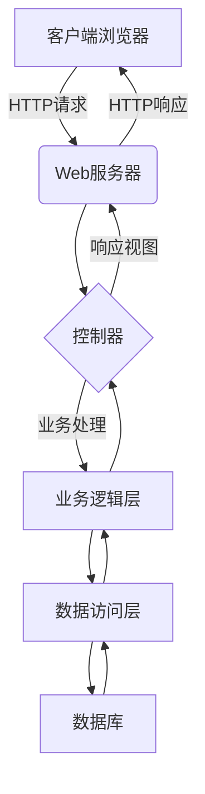

# 基于Web的师资管理系统设计与实现

## 1.背景介绍

随着信息技术的快速发展,教育信息化建设已成为现代教育改革和发展的重要内容。师资管理是学校管理工作的重要组成部分,传统的师资管理模式已无法满足现代化教育管理的需求。设计并实现一套基于Web的师资管理系统,可以有效提高管理效率,优化管理流程,实现师资信息的集中管理和共享。

## 2.核心概念与联系

### 2.1 师资管理

师资管理是指对学校教职工的聘任、培养、考核、晋升、奖惩等全过程的科学化管理。主要包括教师信息管理、职称评审管理、培训管理、考核管理等模块。

### 2.2 Web应用程序

Web应用程序是一种基于网络的软件系统,通过浏览器与服务器进行交互,实现各种功能和服务。采用B/S架构模式,客户端只需安装浏览器,服务器端负责运行应用程序和存储数据。

### 2.3 系统架构

本系统采用经典的三层架构,包括表现层(前端)、业务逻辑层(中间件)和数据访问层(数据库)。前端使用HTML/CSS/JavaScript技术,后端使用Java语言开发,数据库使用MySQL。



## 3.核心算法原理具体操作步骤

### 3.1 教师信息管理

1) 新增教师信息
   - 输入教师基本信息(姓名、性别、出生年月、学历、职称等)
   - 上传教师照片
   - 保存教师信息至数据库

2) 编辑教师信息
   - 根据教师工号查询教师信息
   - 修改相应信息字段
   - 更新教师信息至数据库

3) 删除教师信息
   - 根据教师工号查询教师信息
   - 确认删除操作
   - 从数据库中删除该教师记录

### 3.2 职称评审管理

1) 发布评审通知
   - 管理员发布新的职称评审通知
   - 设置评审条件和截止日期
   - 通知在职教师申报

2) 教师申报
   - 教师在线填写申报表
   - 上传相关证明材料
   - 提交申报信息

3) 评审专家评分
   - 指定评审专家
   - 评审专家独立评分
   - 汇总评分结果

4) 评审结果公示
   - 根据评分排名确定合格人员
   - 在系统公示评审结果
   - 按程序进行公示和申诉

### 3.3 培训管理

1) 发布培训计划
   - 管理员制定年度培训计划
   - 设置培训课程及时间安排
   - 在系统发布培训通知

2) 教师报名
   - 教师查看培训计划
   - 选择感兴趣的课程
   - 在线报名参加培训

3) 培训资源管理
   - 上传培训课件、视频等资源
   - 管理和维护资源库
   - 为培训提供教学资源支持  

4) 培训考核
   - 针对培训设置在线测试
   - 教师在线参加考试
   - 系统自动评分并反馈成绩

## 4.数学模型和公式详细讲解举例说明

### 4.1 教师绩效评分模型

教师绩效评分是职称评审的重要依据,可以采用加权评分模型计算总分:

$$
S = \sum\limits_{i=1}^{n}{w_i \times s_i}
$$

其中:
- $S$为教师的总评分
- $n$为评分指标个数
- $w_i$为第$i$个指标的权重
- $s_i$为第$i$个指标的得分

评分指标可包括教学工作、科研成果、社会服务等方面,每个指标的权重根据学校实际情况设置。

### 4.2 培训效果评估模型

培训效果评估可采用Kirkpatrick四级模型:

1) 反应层面评估
   - 评估学员对培训的满意度
   - $满意度 = \frac{\sum(问卷分数)}{最高分数 \times 问卷人数}$

2) 学习层面评估
   - 评估学员知识、技能的提升程度
   - $知识提升率 = \frac{培训后测试平均分-培训前测试平均分}{培训前测试平均分}$

3) 行为层面评估
   - 评估学员在实际工作中应用所学的程度

4) 结果层面评估
   - 评估培训对组织绩效、效益的影响

## 5.项目实践：代码实例和详细解释说明

### 5.1 教师信息管理模块

#### 5.1.1 教师实体类

```java
@Entity
@Table(name = "teacher")
public class Teacher {
    @Id
    @GeneratedValue(strategy = GenerationType.IDENTITY)
    private Long id;
    
    @Column(nullable = false)
    private String name;
    
    @Column(nullable = false)
    private String gender;
    
    // 其他属性省略
    
    // 构造函数、getter和setter方法
}
```

该类使用JPA注解映射到数据库的teacher表,id为自增主键,name和gender为必填字段。

#### 5.1.2 教师Repository接口

```java
@Repository
public interface TeacherRepository extends JpaRepository<Teacher, Long> {
    List<Teacher> findByNameContaining(String name);
}
```

继承JpaRepository提供基本的CRUD操作,同时定义了根据名称模糊查询的方法。

#### 5.1.3 教师Service层

```java
@Service
public class TeacherService {
    @Autowired
    private TeacherRepository teacherRepo;
    
    public Teacher createTeacher(Teacher teacher) {
        return teacherRepo.save(teacher);
    }
    
    public Teacher updateTeacher(Teacher teacher) {
        return teacherRepo.save(teacher);
    }
    
    public void deleteTeacher(Long id) {
        teacherRepo.deleteById(id);
    }
    
    public List<Teacher> searchTeachers(String name) {
        if (name == null || name.isEmpty()) {
            return teacherRepo.findAll();
        } else {
            return teacherRepo.findByNameContaining(name);
        }
    }
}
```

注入TeacherRepository,提供创建、更新、删除和查询教师信息的服务方法。

#### 5.1.4 教师Controller层

```java
@RestController
@RequestMapping("/teachers")
public class TeacherController {
    @Autowired
    private TeacherService teacherService;

    @PostMapping
    public Teacher createTeacher(@RequestBody Teacher teacher) {
        return teacherService.createTeacher(teacher);
    }

    @PutMapping("/{id}")
    public Teacher updateTeacher(@PathVariable Long id, @RequestBody Teacher teacher) {
        teacher.setId(id);
        return teacherService.updateTeacher(teacher);
    }

    @DeleteMapping("/{id}")
    public void deleteTeacher(@PathVariable Long id) {
        teacherService.deleteTeacher(id);
    }

    @GetMapping
    public List<Teacher> searchTeachers(@RequestParam(required = false) String name) {
        return teacherService.searchTeachers(name);
    }
}
```

通过Spring MVC注解映射HTTP请求,调用TeacherService完成各种操作。

### 5.2 前端页面示例

#### 5.2.1 教师列表页面

```html
<table>
  <thead>
    <tr>
      <th>工号</th>
      <th>姓名</th>
      <th>性别</th>
      <th>操作</th>
    </tr>
  </thead>
  <tbody>
    <tr v-for="teacher in teachers" :key="teacher.id">
      <td>{{ teacher.id }}</td>
      <td>{{ teacher.name }}</td>
      <td>{{ teacher.gender }}</td>
      <td>
        <button @click="editTeacher(teacher)">编辑</button>
        <button @click="deleteTeacher(teacher.id)">删除</button>
      </td>
    </tr>
  </tbody>
</table>

<button @click="showAddTeacherDialog">新增教师</button>
```

使用Vue.js渲染教师列表,提供编辑、删除和新增教师的操作按钮。

#### 5.2.2 新增/编辑教师对话框

```html
<el-dialog title="新增教师" v-model="addTeacherDialogVisible">
  <el-form :model="newTeacher" label-width="80px">
    <el-form-item label="姓名">
      <el-input v-model="newTeacher.name"></el-input>
    </el-form-item>
    <el-form-item label="性别">
      <el-radio-group v-model="newTeacher.gender">
        <el-radio label="男">男</el-radio>
        <el-radio label="女">女</el-radio>
      </el-radio-group>
    </el-form-item>
    <!-- 其他表单项 -->
  </el-form>
  <div slot="footer">
    <el-button @click="addTeacherDialogVisible = false">取消</el-button>
    <el-button type="primary" @click="saveTeacher">保存</el-button>
  </div>
</el-dialog>
```

使用Element UI库提供一个对话框组件,包含新增或编辑教师信息的表单。

#### 5.2.3 Vue.js脚本

```javascript
new Vue({
  el: '#app',
  data: {
    teachers: [],
    newTeacher: {
      name: '',
      gender: '',
      // 其他属性
    },
    addTeacherDialogVisible: false
  },
  methods: {
    loadTeachers() {
      axios.get('/api/teachers')
        .then(response => {
          this.teachers = response.data;
        })
        .catch(error => {
          console.error(error);
        });
    },
    editTeacher(teacher) {
      this.newTeacher = { ...teacher };
      this.addTeacherDialogVisible = true;
    },
    deleteTeacher(id) {
      axios.delete(`/api/teachers/${id}`)
        .then(() => {
          this.loadTeachers();
        })
        .catch(error => {
          console.error(error);
        });
    },
    showAddTeacherDialog() {
      this.newTeacher = {
        name: '',
        gender: '',
        // 其他属性
      };
      this.addTeacherDialogVisible = true;
    },
    saveTeacher() {
      if (this.newTeacher.id) {
        axios.put(`/api/teachers/${this.newTeacher.id}`, this.newTeacher)
          .then(() => {
            this.loadTeachers();
            this.addTeacherDialogVisible = false;
          })
          .catch(error => {
            console.error(error);
          });
      } else {
        axios.post('/api/teachers', this.newTeacher)
          .then(() => {
            this.loadTeachers();
            this.addTeacherDialogVisible = false;
          })
          .catch(error => {
            console.error(error);
          });
      }
    }
  },
  mounted() {
    this.loadTeachers();
  }
});
```

使用Vue.js和Axios库实现页面交互和数据通信。

## 6.实际应用场景

基于Web的师资管理系统可广泛应用于各级各类学校,包括:

- 中小学校
- 大专院校
- 培训机构
- 企业内部培训

该系统可以实现以下功能:

- 集中管理教职工信息
- 自动化的职称评审流程
- 规范化的培训管理
- 绩效考核和薪酬管理
- 教学资源共享和管理

通过信息化手段提高管理效率,减轻管理人员的工作压力,实现师资管理的精细化和规范化。

## 7.工具和资源推荐

### 7.1 开发工具

- IDE: IntelliJ IDEA / Eclipse
- 构建工具: Maven / Gradle
- 版本控制: Git
- 测试工具: JUnit / Selenium
- 性能分析: JProfiler / JMeter

### 7.2 框架和库

- Spring Boot: 用于快速构建应用程序
- Spring MVC: 基于MVC模式的Web框架
- Spring Data JPA: 简化数据库访问
- MyBatis: 持久层框架
- Vue.js: 构建交互式Web界面
- Element UI: 基于Vue的UI组件库

### 7.3 云服务

- 云服务器: 阿里云 / 腾讯云 / AWS
- 对象存储: 阿里云OSS / 腾讯云COS
- 数据库: 阿里云RDS / 腾讯云云数据库

### 7.4 教学资源

- 官方文档
- 在线教程和视频
- 技术博客和论坛
- 开源项目

## 8.总结：未来发展趋势与挑战

### 8.1 发展趋势

1. 智能化管理
   - 利用大数据、人工智能等技术,实现智能化决策支持
   - 预测师资需求,优化资源配置

2. 移动