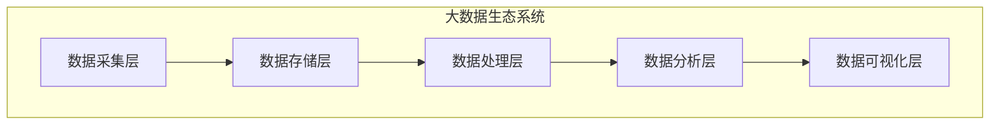
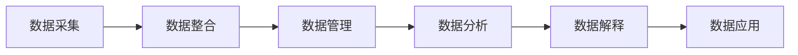
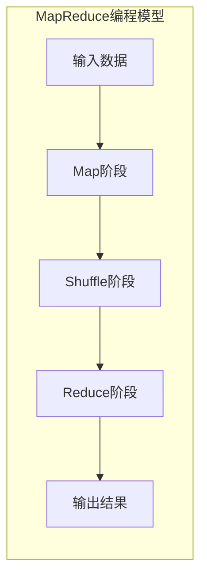
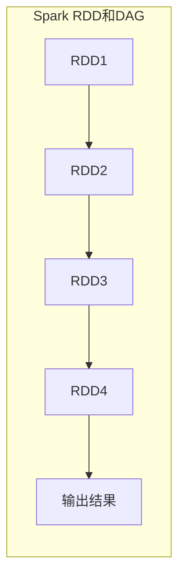

# 大数据 (Big Data)

## 1. 背景介绍

### 1.1 大数据时代的来临

在当今信息时代,数据正以前所未有的规模和速度迅猛增长。从个人社交媒体活动到企业运营数据,从物联网设备到科学研究,无处不在的数据正在被不断产生和收集。这种海量的、多样化的、高速流动的数据,被称为"大数据"(Big Data)。

大数据时代的到来,给传统的数据处理和分析方式带来了巨大挑战,同时也为我们提供了前所未有的机遇。通过对大数据的深入分析和挖掘,我们可以发现隐藏其中的宝贵信息和知识,从而推动科技创新、优化决策、提高运营效率、发现新的商业模式等。

### 1.2 大数据的特征

大数据通常被描述为具有4V特征:

- 海量 (Volume): 大数据拥有巨大的数据量,通常以TB、PB甚至EB为单位。
- 多样 (Variety): 大数据来源广泛,包括结构化数据(如数据库)、半结构化数据(如XML文件)和非结构化数据(如文本、图像、视频等)。
- 高速 (Velocity): 大数据的产生、传输和处理速度极快,需要实时或准实时的处理能力。
- 价值密度低 (Value Density): 大数据中有价值的数据所占比例较小,需要从海量数据中提取有价值的信息。

## 2. 核心概念与联系

### 2.1 大数据生态系统

要有效管理和利用大数据,需要一个完整的大数据生态系统。该系统通常包括以下几个关键组件:

1. **数据采集层**: 从各种数据源(如网络日志、社交媒体、传感器等)收集原始数据。常用工具有Flume、Kafka等。
2. **数据存储层**: 将采集到的数据存储到分布式文件系统(如HDFS)或NoSQL数据库(如HBase、Cassandra)中。
3. **数据处理层**: 使用分布式计算框架(如MapReduce、Spark)对存储的数据进行批处理或流式处理。
4. **数据分析层**: 利用数据挖掘、机器学习等技术对处理后的数据进行分析,提取有价值的信息。
5. **数据可视化层**: 通过报表、仪表盘等方式将分析结果以可视化的形式呈现给用户。



### 2.2 大数据价值链

大数据价值链描述了从原始数据到获取洞见的过程,包括以下几个环节:

1. **数据采集**: 从各种来源收集原始数据。
2. **数据整合**: 将采集到的异构数据进行清洗、转换和集成,形成统一的数据集。
3. **数据管理**: 对整合后的数据进行存储、备份、安全控制等管理。
4. **数据分析**: 利用数据挖掘、机器学习等技术对数据进行分析,发现隐藏的模式和规律。
5. **数据解释**: 将分析结果转化为可理解的洞见,为决策提供支持。
6. **数据应用**: 将获得的洞见应用于实际场景,如优化业务流程、改进产品设计等。



## 3. 核心算法原理具体操作步骤

### 3.1 MapReduce编程模型

MapReduce是一种分布式数据处理模型,适用于大规模数据集的并行计算。它将计算过程分为两个阶段:Map和Reduce。

#### 3.1.1 Map阶段

Map阶段将输入数据划分为多个数据块,并对每个数据块进行独立的处理,生成中间结果。具体步骤如下:

1. 输入数据被划分为多个数据块。
2. 每个数据块由一个Map任务处理,Map任务将输入数据转换为<key, value>对。
3. Map任务对<key, value>对进行处理,生成中间结果,以<key, value>对的形式输出。

#### 3.1.2 Reduce阶段

Reduce阶段对Map阶段生成的中间结果进行合并和处理,生成最终结果。具体步骤如下:

1. Shuffle阶段:将Map阶段生成的中间结果按照key进行分组,并将相同key的数据发送到同一个Reduce任务。
2. Reduce任务对每一组数据执行用户定义的Reduce函数,将相同key的值进行合并和处理。
3. Reduce任务将处理结果输出为最终结果。



### 3.2 Spark RDD和DAG

Apache Spark是一种基于内存计算的分布式数据处理框架,它提供了弹性分布式数据集(Resilient Distributed Dataset, RDD)和有向无环图(Directed Acyclic Graph, DAG)两个核心概念。

#### 3.2.1 RDD

RDD是Spark中的基本数据结构,表示一个不可变、分区的数据集合。RDD支持两种操作:转换(Transformation)和动作(Action)。

- 转换操作(如map、filter、join等)用于从一个RDD生成新的RDD,是延迟计算的。
- 动作操作(如count、collect、save等)用于触发实际的计算,并返回结果。

#### 3.2.2 DAG

DAG是Spark用于描述RDD之间依赖关系的有向无环图。当执行动作操作时,Spark会根据DAG重构RDD的计算过程,并进行优化和调度。



## 4. 数学模型和公式详细讲解举例说明

在大数据分析中,常常需要使用数学模型和公式来描述数据特征、发现数据规律、预测未来趋势等。以下是一些常用的数学模型和公式。

### 4.1 线性回归模型

线性回归是一种常用的监督学习算法,用于建立自变量和因变量之间的线性关系模型。线性回归模型的数学表达式如下:

$$y = \beta_0 + \beta_1x_1 + \beta_2x_2 + ... + \beta_nx_n + \epsilon$$

其中:
- $y$是因变量
- $x_1, x_2, ..., x_n$是自变量
- $\beta_0$是常数项
- $\beta_1, \beta_2, ..., \beta_n$是各自变量的系数
- $\epsilon$是随机误差项

线性回归模型的目标是找到最佳的系数$\beta$值,使得模型对观测数据的拟合程度最高。常用的求解方法是最小二乘法。

### 4.2 K-Means聚类算法

K-Means是一种常用的无监督学习算法,用于对数据进行聚类。算法的核心思想是将n个数据对象划分为k个聚类,使得聚类内部数据对象之间的距离尽可能小,聚类之间的距离尽可能大。

算法的具体步骤如下:

1. 随机选择k个初始聚类中心$c_1, c_2, ..., c_k$
2. 对每个数据对象$x_i$,计算它与每个聚类中心的距离$d(x_i, c_j)$,将$x_i$划分到最近的聚类中
3. 重新计算每个聚类的新中心点
4. 重复步骤2和3,直到聚类中心不再发生变化

K-Means算法的目标函数是最小化所有数据对象到其所属聚类中心的总距离:

$$J = \sum_{j=1}^k \sum_{x_i \in C_j} d(x_i, c_j)^2$$

其中:
- $k$是聚类数量
- $C_j$是第j个聚类
- $c_j$是第j个聚类的中心点
- $d(x_i, c_j)$是数据对象$x_i$与聚类中心$c_j$的距离

## 5. 项目实践: 代码实例和详细解释说明

为了更好地理解大数据处理的实践,我们以一个基于Spark的电影评分数据分析项目为例,展示如何使用Spark进行数据处理和分析。

### 5.1 数据集介绍

我们使用的数据集是MovieLens 100K数据集,包含了10万条电影评分记录。数据集包括以下几个文件:

- `movies.dat`: 电影信息,包括电影ID、电影名称和电影类型。
- `ratings.dat`: 用户对电影的评分记录,包括用户ID、电影ID、评分和时间戳。
- `users.dat`: 用户信息,包括用户ID、性别、年龄、职业和邮编。

### 5.2 环境准备

首先,我们需要准备Spark环境。以下是在Python中使用Spark的代码:

```python
from pyspark import SparkContext, SparkConf

# 创建SparkConf对象
conf = SparkConf().setAppName("MovieLensAnalysis").setMaster("local[*]")

# 创建SparkContext对象
sc = SparkContext(conf=conf)
```

### 5.3 数据加载

接下来,我们加载电影评分数据:

```python
# 加载电影数据
movies = sc.textFile("movies.dat").map(lambda line: line.split("::")).map(lambda x: (int(x[0]), x[1], x[2])).collect()

# 加载评分数据
ratings = sc.textFile("ratings.dat").map(lambda line: line.split("::")).map(lambda x: (int(x[0]), int(x[1]), float(x[2]), int(x[3]))).cache()
```

### 5.4 数据分析

现在,我们可以对加载的数据进行各种分析操作。以下是一些示例:

#### 5.4.1 计算每部电影的平均评分

```python
# 计算每部电影的平均评分
movie_ratings = ratings.map(lambda x: (x[1], x[2])).groupByKey().mapValues(lambda x: sum(x) / len(x))
movie_ratings.take(5)
```

#### 5.4.2 找出评分最高的前10部电影

```python
# 找出评分最高的前10部电影
top_movies = movie_ratings.takeOrdered(10, key=lambda x: -x[1])
for movie in top_movies:
    print(f"Movie ID: {movie[0]}, Average Rating: {movie[1]}, Movie Name: {next(x[1] for x in movies if x[0] == movie[0])}")
```

#### 5.4.3 计算每个用户的评分数量

```python
# 计算每个用户的评分数量
user_ratings = ratings.map(lambda x: (x[0], 1)).reduceByKey(lambda a, b: a + b)
user_ratings.take(5)
```

### 5.5 结果输出

最后,我们可以将分析结果保存到文件或数据库中。以下是将结果保存到文本文件的示例:

```python
# 将结果保存到文本文件
movie_ratings.saveAsTextFile("movie_ratings.txt")
```

通过这个示例项目,我们可以看到如何使用Spark进行大数据处理和分析。Spark提供了高效的分布式计算能力,并且支持多种语言,如Scala、Python和Java,方便开发者使用。

## 6. 实际应用场景

大数据技术在各个领域都有广泛的应用,以下是一些典型的应用场景:

### 6.1 电子商务

在电子商务领域,大数据技术可以用于:

- 分析用户行为数据,了解用户偏好,进行个性化推荐和营销。
- 预测销售趋势,优化库存管理和供应链。
- 分析竞争对手的价格策略,制定更有效的定价策略。
- 检测欺诈行为,保护交易安全。

### 6.2 金融服务

在金融服务领域,大数据技术可以用于:

- 分析客户数据,进行风险评估和信贷决策。
- 监测交易数据,发现异常活动和潜在欺诈行为。
- 优化投资组合,提高投资回报。