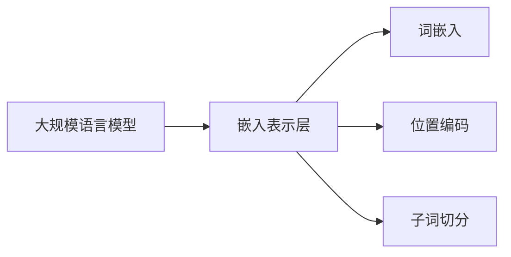

# 大规模语言模型从理论到实践 嵌入表示层

## 1. 背景介绍
### 1.1 大规模语言模型的发展历程
#### 1.1.1 早期的统计语言模型
#### 1.1.2 神经网络语言模型的兴起
#### 1.1.3 Transformer模型的突破

### 1.2 嵌入表示层在语言模型中的重要性
#### 1.2.1 词嵌入的概念与优势
#### 1.2.2 上下文相关的词嵌入表示
#### 1.2.3 嵌入表示层对模型性能的影响

## 2. 核心概念与联系
### 2.1 词嵌入(Word Embedding)
#### 2.1.1 One-hot编码的局限性
#### 2.1.2 分布式表示与词嵌入
#### 2.1.3 词嵌入的训练方法

### 2.2 位置编码(Positional Encoding)
#### 2.2.1 序列模型中位置信息的重要性
#### 2.2.2 绝对位置编码与相对位置编码
#### 2.2.3 正弦曲线位置编码的数学原理

### 2.3 子词切分(Subword Tokenization)
#### 2.3.1 未登录词(OOV)问题
#### 2.3.2 字节对编码(BPE)算法
#### 2.3.3 WordPiece与SentencePiece

### 2.4 概念之间的关系

## 3. 核心算法原理具体操作步骤
### 3.1 Word2Vec词嵌入算法
#### 3.1.1 CBOW与Skip-gram模型
#### 3.1.2 负采样(Negative Sampling)
#### 3.1.3 分层Softmax(Hierarchical Softmax)

### 3.2 GloVe词嵌入算法
#### 3.2.1 共现矩阵(Co-occurrence Matrix)
#### 3.2.2 加权最小二乘法
#### 3.2.3 GloVe与Word2Vec的比较

### 3.3 FastText词嵌入算法
#### 3.3.1 字符级n-gram特征
#### 3.3.2 FastText模型结构
#### 3.3.3 FastText在轻量化与多语言方面的优势

### 3.4 ELMo上下文相关词嵌入
#### 3.4.1 双向LSTM语言模型
#### 3.4.2 词表示的上下文化
#### 3.4.3 ELMo在下游任务中的应用

## 4. 数学模型和公式详细讲解举例说明
### 4.1 Word2Vec中的数学原理
#### 4.1.1 CBOW的目标函数与优化
$$ J_{\theta}=\frac{1}{T}\sum_{t=1}^{T}\log p(w_t|w_{t-c},...,w_{t+c}) $$
#### 4.1.2 Skip-gram的目标函数与优化
$$ J_{\theta}=\frac{1}{T}\sum_{t=1}^{T}\sum_{-c \leq j \leq c, j \neq 0}\log p(w_{t+j}|w_t) $$
#### 4.1.3 负采样的概率分布
$$ P(w)=\frac{f(w)^{3/4}}{\sum_{u \in V}f(u)^{3/4}} $$

### 4.2 GloVe中的数学原理
#### 4.2.1 共现概率矩阵的构建
$$ X_{ij}=\frac{P_{ij}}{P_i P_j}=\frac{X_{ij}}{X_i X_j} $$
#### 4.2.2 加权最小二乘法的目标函数
$$ J=\sum_{i,j=1}^Vf(X_{ij})(w_i^Tw_j+b_i+b_j-\log X_{ij})^2 $$
#### 4.2.3 GloVe词向量的性质分析

### 4.3 位置编码的数学原理
#### 4.3.1 正弦曲线位置编码的公式
$$ PE_{(pos,2i)}=\sin(pos/10000^{2i/d_{model}}) $$
$$ PE_{(pos,2i+1)}=\cos(pos/10000^{2i/d_{model}}) $$
#### 4.3.2 正弦曲线位置编码的性质分析
#### 4.3.3 相对位置编码的数学原理

## 5. 项目实践：代码实例和详细解释说明
### 5.1 使用Gensim库训练Word2Vec词嵌入
#### 5.1.1 数据预处理与语料库构建
#### 5.1.2 Word2Vec模型的训练与保存
#### 5.1.3 词嵌入的可视化与评估

### 5.2 使用PyTorch实现GloVe词嵌入
#### 5.2.1 共现矩阵的构建
#### 5.2.2 GloVe模型的定义与训练
#### 5.2.3 GloVe词嵌入的应用与评估

### 5.3 使用Transformers库加载预训练词嵌入
#### 5.3.1 加载BERT预训练模型
#### 5.3.2 提取BERT的词嵌入表示
#### 5.3.3 在下游任务中微调BERT词嵌入

### 5.4 使用SentencePiece进行子词切分
#### 5.4.1 SentencePiece模型的训练
#### 5.4.2 使用SentencePiece进行编码与解码
#### 5.4.3 在机器翻译任务中应用SentencePiece

## 6. 实际应用场景
### 6.1 文本分类中的词嵌入应用
#### 6.1.1 基于词袋模型的文本分类
#### 6.1.2 基于词嵌入的文本分类
#### 6.1.3 词嵌入在情感分析中的应用

### 6.2 命名实体识别中的词嵌入应用
#### 6.2.1 基于BiLSTM-CRF的命名实体识别
#### 6.2.2 使用预训练词嵌入提升NER性能
#### 6.2.3 BERT在命名实体识别中的应用

### 6.3 机器翻译中的词嵌入应用
#### 6.3.1 基于Seq2Seq模型的机器翻译
#### 6.3.2 使用词嵌入初始化Encoder与Decoder
#### 6.3.3 Transformer模型在机器翻译中的应用

### 6.4 问答系统中的词嵌入应用
#### 6.4.1 基于知识库的问答系统
#### 6.4.2 使用词嵌入进行问题与知识库匹配
#### 6.4.3 BERT在阅读理解型问答中的应用

## 7. 工具和资源推荐
### 7.1 词嵌入工具库
#### 7.1.1 Gensim
#### 7.1.2 FastText
#### 7.1.3 Flair

### 7.2 预训练词嵌入模型
#### 7.2.1 Word2Vec预训练模型
#### 7.2.2 GloVe预训练模型
#### 7.2.3 FastText预训练模型

### 7.3 子词切分工具
#### 7.3.1 BPE
#### 7.3.2 WordPiece
#### 7.3.3 SentencePiece

### 7.4 词嵌入可视化工具
#### 7.4.1 TensorBoard Embedding Projector
#### 7.4.2 Embedding Projector
#### 7.4.3 Parallax

## 8. 总结：未来发展趋势与挑战
### 8.1 上下文相关词嵌入的发展
#### 8.1.1 从静态词嵌入到动态词嵌入
#### 8.1.2 BERT与GPT等预训练语言模型的影响
#### 8.1.3 基于知识增强的词嵌入表示

### 8.2 多语言与跨语言词嵌入
#### 8.2.1 多语言词嵌入的对齐方法
#### 8.2.2 跨语言迁移学习中的词嵌入应用
#### 8.2.3 无监督跨语言词嵌入的研究进展

### 8.3 词嵌入的可解释性与公平性
#### 8.3.1 词嵌入中的偏见问题
#### 8.3.2 可解释性词嵌入的研究
#### 8.3.3 消除词嵌入偏见的方法

### 8.4 未来研究方向与挑战
#### 8.4.1 融合知识图谱的词嵌入表示
#### 8.4.2 结合视觉信息的多模态词嵌入
#### 8.4.3 词嵌入在小样本学习中的应用

## 9. 附录：常见问题与解答
### 9.1 词嵌入与One-hot编码的区别是什么？
### 9.2 词嵌入空间中的线性关系有何意义？
### 9.3 如何评估词嵌入的质量？
### 9.4 词嵌入是否能够解决同义词和多义词问题？
### 9.5 上下文相关词嵌入与静态词嵌入的主要区别是什么？
### 9.6 使用预训练词嵌入时需要注意哪些问题？
### 9.7 词嵌入技术在垂直领域中有哪些应用？
### 9.8 如何处理词嵌入中的偏见问题？
### 9.9 词嵌入技术的局限性有哪些？
### 9.10 未来词嵌入技术可能的发展方向有哪些？

作者：禅与计算机程序设计艺术 / Zen and the Art of Computer Programming