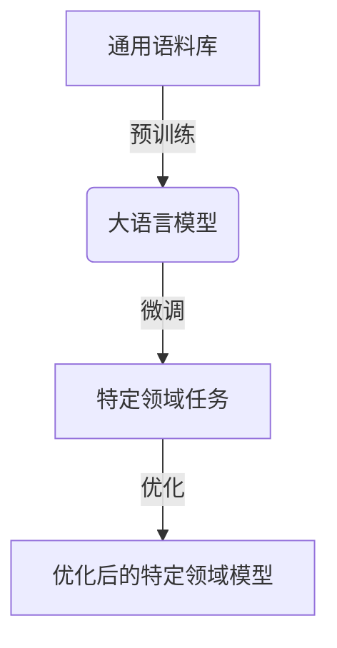

# 大语言模型原理与工程实践：大语言模型微调的探索与展望

## 1.背景介绍

### 1.1 大语言模型的兴起

近年来,大型语言模型(Large Language Models, LLMs)在自然语言处理领域掀起了一场革命。这些模型通过在海量文本数据上进行预训练,学习到了丰富的语言知识和上下文表征能力,可以生成看似人类水平的自然语言输出。

代表性的大语言模型包括GPT-3、PaLM、ChatGPT等,它们在广泛的自然语言任务上展现出了令人惊叹的性能,如机器翻译、问答系统、文本摘要、内容创作等,为人工智能系统赋予了更强大的语言理解和生成能力。

### 1.2 大语言模型微调的重要性

尽管大语言模型在通用任务上表现出色,但要将其应用于特定领域和场景,仍需要对模型进行进一步的调整和优化。这就引出了大语言模型微调(Fine-tuning)的概念,即在大模型的基础上,利用特定领域的数据对模型进行额外的训练,使其在该领域的任务上获得更好的性能表现。

大语言模型微调已成为提高模型性能和将其应用于实际场景的关键技术,具有以下优点:

1. **高效性**:相比从头训练一个全新的大型模型,微调现有模型更加高效,可以节省大量的计算资源和时间成本。
2. **性能提升**:通过微调,模型可以更好地捕捉特定领域的语言模式和知识,从而在相关任务上获得性能提升。
3. **灵活性**:微调技术使得同一个大语言模型可以针对不同的领域和任务进行定制化调整,提高了模型的通用适用性。

本文将深入探讨大语言模型微调的原理、方法和实践,为读者提供全面的理解和指导。

## 2.核心概念与联系

### 2.1 迁移学习

大语言模型微调的核心思想源自于机器学习中的迁移学习(Transfer Learning)概念。迁移学习旨在将在一个领域或任务中学习到的知识,迁移并应用到另一个相关但不同的领域或任务上。

在大语言模型的场景中,预训练模型可被视为在通用语料库上学习到的通用语言知识,而微调则是将这些知识迁移并进一步优化到特定领域的任务上。这种迁移学习方式可以充分利用预训练模型中蕴含的丰富语言表征能力,大大提高了模型在新领域的学习效率。



### 2.2 模型微调策略

大语言模型微调可以采用不同的策略,主要包括以下几种:

1. **全模型微调(Full Model Fine-tuning)**:在特定领域的数据上对整个大语言模型(包括编码器和解码器)进行端到端的微调训练。这种方式可以充分利用模型的所有参数,但计算代价较高。

2. **编码器微调(Encoder Fine-tuning)**:只对模型的编码器部分进行微调,而保持解码器部分参数不变。这种方式计算成本较低,但可能无法充分利用解码器中蕴含的知识。

3. **前馈适配器微调(Prefix-Tuning/Prompt-Tuning)**:在模型的输入端引入一个可学习的前馈适配器(Prefix/Prompt),通过训练适配器参数来指导模型生成特定领域的输出,而不改变原模型的参数。这种方式计算成本最低,但可能会影响性能。

4. **参数高效微调(Parameter-Efficient Fine-tuning)**:在模型中引入一些可训练的附加参数,同时保持大部分预训练参数不变。这种方式在计算成本和性能之间寻求平衡。

不同的微调策略在计算成本、性能提升和模型灵活性等方面存在权衡,需要根据具体的应用场景和资源约束进行选择。

## 3.核心算法原理具体操作步骤

### 3.1 数据准备

进行大语言模型微调的第一步是准备特定领域的训练数据。这些数据应当与目标任务和领域高度相关,且数据质量对模型性能有重要影响。常见的数据来源包括:

1. **标注语料库**:人工标注的文本数据集,如问答对、文本分类数据等。
2. **网络爬取数据**:从特定领域的网站、论坛等渠道爬取的原始文本数据。
3. **专业文献**:某一领域的书籍、论文、技术报告等专业文献。

数据准备过程通常包括数据清洗、格式转换、分词、词典构建等步骤,以确保数据的质量和与模型的兼容性。

### 3.2 微调训练

经过数据准备后,即可进入模型微调的训练阶段。微调训练的核心思想是在特定领域数据上对大语言模型进行进一步的优化,使其能够更好地捕捉该领域的语言模式和知识。

以全模型微调为例,具体的训练步骤如下:

1. **加载预训练模型**:从预训练模型的权重文件中加载模型参数。
2. **设置优化器和损失函数**:选择合适的优化算法(如Adam)和损失函数(如交叉熵损失)。
3. **数据迭代训练**:将特定领域的训练数据分成小批次,对模型进行迭代训练。每个迭代包括以下步骤:
   a. 输入数据到模型,获得模型输出。
   b. 计算模型输出与ground truth之间的损失。
   c. 反向传播计算梯度。
   d. 根据梯度更新模型参数。
4. **模型评估**:在验证集上评估模型性能,根据需要调整超参数或停止训练。
5. **模型保存**:将微调后的模型参数保存为新的权重文件,用于后续的推理和部署。

值得注意的是,微调训练通常只需要少量的迭代轮数,避免过度训练导致"灾难性遗忘"(catastrophic forgetting),即模型遗忘了在预训练阶段学习到的通用知识。

### 3.3 其他微调策略

除了全模型微调外,其他微调策略的具体操作步骤也有所不同:

1. **编码器微调**:只需要在第3步中,将模型的解码器部分设置为不可训练状态,仅对编码器部分进行参数更新。

2. **前馈适配器微调**:需要在模型输入端引入一个可训练的前馈适配器模块,在第3步中只更新该模块的参数,而保持原模型参数不变。

3. **参数高效微调**:需要在原模型中引入一些可训练的附加参数,在第3步中同时更新这些附加参数和原模型参数。

不同的微调策略在计算复杂度、内存占用和性能提升等方面存在差异,需要根据实际情况进行权衡选择。

## 4.数学模型和公式详细讲解举例说明

### 4.1 语言模型基础

大语言模型本质上是一种基于神经网络的概率语言模型,旨在学习文本序列的联合概率分布 $P(X)$,其中 $X = (x_1, x_2, ..., x_n)$ 表示长度为 $n$ 的词序列。根据链式法则,联合概率可以分解为:

$$P(X) = \prod_{t=1}^{n} P(x_t | x_1, x_2, ..., x_{t-1})$$

其中 $P(x_t | x_1, x_2, ..., x_{t-1})$ 表示在给定前缀 $(x_1, x_2, ..., x_{t-1})$ 的条件下,生成词 $x_t$ 的条件概率。

为了计算这些条件概率,大语言模型通常采用基于自注意力机制的Transformer架构,将输入序列映射到一系列上下文向量表示,然后利用解码器根据这些上下文向量生成输出序列。

### 4.2 交叉熵损失函数

在微调训练过程中,常用的损失函数是交叉熵损失(Cross-Entropy Loss),它衡量了模型预测的概率分布与真实标签分布之间的差异。

对于一个长度为 $n$ 的目标序列 $Y = (y_1, y_2, ..., y_n)$,其交叉熵损失定义为:

$$\mathcal{L}(Y, \hat{Y}) = -\frac{1}{n}\sum_{t=1}^{n} \log P(y_t | X, y_1, y_2, ..., y_{t-1})$$

其中 $\hat{Y}$ 表示模型预测的概率分布序列,目标是最小化这个损失函数,使模型预测的概率分布尽可能接近真实标签分布。

在实践中,还可以引入其他正则化项(如权重衰减)来防止过拟合,并采用一些技巧(如标签平滑、梯度裁剪等)来提高训练稳定性。

### 4.3 注意力分数计算

自注意力机制是Transformer模型的核心,它通过计算查询(Query)、键(Key)和值(Value)之间的相似性分数,捕捉输入序列中不同位置之间的依赖关系。

具体地,对于一个长度为 $n$ 的输入序列 $X$,其注意力分数计算公式如下:

$$\text{Attention}(Q, K, V) = \text{softmax}\left(\frac{QK^T}{\sqrt{d_k}}\right)V$$

其中:

- $Q \in \mathbb{R}^{n \times d_q}$ 表示查询矩阵
- $K \in \mathbb{R}^{n \times d_k}$ 表示键矩阵
- $V \in \mathbb{R}^{n \times d_v}$ 表示值矩阵
- $d_q$, $d_k$, $d_v$ 分别表示查询、键和值的向量维度

$\frac{QK^T}{\sqrt{d_k}}$ 计算了查询和键之间的缩放点积相似性分数,然后通过 softmax 函数将其转换为概率分布。最终,注意力输出是值矩阵 $V$ 根据这个概率分布的加权和。

注意力机制赋予了模型捕捉长距离依赖关系的能力,是大语言模型取得卓越性能的关键所在。

### 4.4 示例:情感分析任务

假设我们要对一个句子 "This movie is absolutely fantastic!" 进行情感分析(正面或负面),并将其表示为 0 或 1 的标签。我们可以构建一个简单的二分类模型,其中包括一个BERT编码器和一个线性分类头。

首先,我们将输入句子 $X$ 传递给BERT编码器,获得句子的上下文向量表示 $\mathbf{h} \in \mathbb{R}^{d}$:

$$\mathbf{h} = \text{BERT}(X)$$

然后,我们将上下文向量 $\mathbf{h}$ 输入到线性分类头,计算正面和负面情感的logits:

$$\begin{aligned}
\mathbf{z} &= \mathbf{W}\mathbf{h} + \mathbf{b} \\
\hat{y}_\text{pos} &= z_1 \\
\hat{y}_\text{neg} &= z_2
\end{aligned}$$

其中 $\mathbf{W} \in \mathbb{R}^{2 \times d}$ 和 $\mathbf{b} \in \mathbb{R}^2$ 是线性层的权重和偏置参数。

接下来,我们可以将logits通过softmax函数转换为概率分布:

$$\begin{aligned}
p_\text{pos} &= \frac{\exp(\hat{y}_\text{pos})}{\exp(\hat{y}_\text{pos}) + \exp(\hat{y}_\text{neg})} \\
p_\text{neg} &= \frac{\exp(\hat{y}_\text{neg})}{\exp(\hat{y}_\text{pos}) + \exp(\hat{y}_\text{neg})}
\end{aligned}$$

最后,我们可以使用交叉熵损失函数计算模型预测与真实标签之间的差异,并通过微调训练来优化模型参数,提高情感分析的准确性。

通过这个简单的示例,我们可以看到大语言模型微调的基本流程:首先利用预训练模型(如BERT)获取输入的上下文表示，然后通过一个简单的分类头进行特定任务的预测，最后通过微调训练优化模型参数。

## 5. 项目实践：代码实例和详细解释说明

为了更好地理解大语言模型微调的过程，下面我们用Python实现一个基于BERT的情感分析模型，并进行微调训练。

### 5.1 数据准备

首先，我们需要准备一个情感分析的数据集。这里使用Kaggle上的IMDb电影评论数据集，其中包含大量标注为正面或负面的电影评论。

```python
import pandas as pd
from sklearn.model_selection import train_test_split

# 加载数据集
df = pd.read_csv("IMDB Dataset.csv")

# 数据预处理
df['sentiment'] = df['sentiment'].apply(lambda x: 1 if x == 'positive' else 0)
X_train, X_test, y_train, y_test = train_test_split(df['review'], df['sentiment'], test_size=0.2, random_state=42)
```

### 5.2 微调训练

接下来，我们使用Hugging Face的Transformers库来加载预训练的BERT模型，并对其进行微调训练。

```python
import torch
from transformers import BertTokenizer, BertForSequenceClassification, Trainer, TrainingArguments

# 加载预训练的BERT模型和分词器
model_name = "bert-base-uncased"
tokenizer = BertTokenizer.from_pretrained(model_name)
model = BertForSequenceClassification.from_pretrained(model_name, num_labels=2)

# 数据编码
def encode_data(texts, labels, tokenizer, max_length=512):
    encodings = tokenizer(texts.tolist(), truncation=True, padding=True, max_length=max_length)
    dataset = torch.utils.data.Dataset()
    dataset.encodings = encodings
    dataset.labels = labels
    return dataset

train_dataset = encode_data(X_train, y_train, tokenizer)
test_dataset = encode_data(X_test, y_test, tokenizer)

# 训练参数设置
training_args = TrainingArguments(
    output_dir='./results',
    num_train_epochs=3,
    per_device_train_batch_size=8,
    per_device_eval_batch_size=8,
    warmup_steps=500,
    weight_decay=0.01,
    logging_dir='./logs',
)

# 训练器
trainer = Trainer(
    model=model,
    args=training_args,
    train_dataset=train_dataset,
    eval_dataset=test_dataset,
)

# 开始训练
trainer.train()
```

### 5.3 模型评估

训练完成后，我们在测试集上评估模型的性能。

```python
# 模型评估
results = trainer.evaluate()

print("准确率:", results['eval_accuracy'])
print("损失:", results['eval_loss'])
```

### 5.4 代码解释说明

#### 5.4.1 数据预处理

我们首先加载IMDb电影评论数据集，并将情感标签转换为二进制形式（正面为1，负面为0）。然后，将数据集划分为训练集和测试集。

#### 5.4.2 加载预训练模型

我们使用Hugging Face的Transformers库加载预训练的BERT模型和对应的分词器。BERT模型用于生成输入文本的上下文表示，分词器用于将文本转换为模型可接受的输入格式。

#### 5.4.3 数据编码

为了将文本数据输入到BERT模型中，我们需要对文本进行编码。编码过程包括分词、截断和填充，以确保所有输入序列的长度一致。

#### 5.4.4 训练参数设置

我们设置了一些训练参数，如输出目录、训练轮数、批量大小、预热步骤和权重衰减等。这些参数会影响训练过程的效率和模型性能。

#### 5.4.5 模型训练

我们使用Trainer类进行模型训练。Trainer类封装了训练循环，简化了训练过程。我们将训练集和测试集传递给Trainer，并调用train方法开始训练。

#### 5.4.6 模型评估

训练完成后，我们使用evaluate方法在测试集上评估模型的性能，并打印准确率和损失值。

## 6. 实际应用场景

大语言模型微调技术在多个领域和应用场景中展现了强大的能力。以下是一些典型的实际应用场景：

### 6.1 医疗文本分析

在医疗领域，大语言模型微调可以用于分析电子健康记录、医学文献和患者评论。通过微调模型，能够更准确地提取医学信息、诊断疾病和推荐治疗方案。

### 6.2 金融文本分析

在金融领域，大语言模型微调可以用于分析金融新闻、市场报告和社交媒体内容。通过微调模型，能够更好地预测市场趋势、识别投资机会和管理风险。

### 6.3 法律文本分析

在法律领域，大语言模型微调可以用于分析法律文书、判决书和法规文本。通过微调模型，能够更高效地进行法律检索、案件分析和法律咨询。

### 6.4 客户服务自动化

在客户服务领域，大语言模型微调可以用于构建智能客服系统，自动回答客户问题、处理投诉和提供建议。通过微调模型，能够显著提高客户服务的效率和满意度。

## 7. 工具和资源推荐

### 7.1 数据科学工具

- **NumPy**: 用于科学计算的基础库，提供了强大的数组和矩阵运算功能。
- **Pandas**: 数据分析和处理工具，提供了高效的数据操作和分析功能。
- **Scikit-learn**: 机器学习库，包含了各种常用的机器学习算法和工具。
- **Transformers**: 由Hugging Face提供的自然语言处理库，包含了各种预训练的语言模型和工具。

### 7.2 数据集资源

- **Kaggle**: 一个数据科学竞赛平台，提供了丰富的数据集和竞赛机会。
- **UCI Machine Learning Repository**: 一个常用的机器学习数据集库，包含了各种类型的数据集。
- **Hugging Face Datasets**: 提供了多种自然语言处理任务的数据集，方便进行模型训练和评估。

### 7.3 学习资源

- **Coursera**: 提供了各种机器学习和数据科学课程，由顶尖大学和机构提供。
- **edX**: 提供了各种在线课程，包括机器学习和人工智能相关课程。
- **书籍**: 推荐阅读《机器学习实战》、《Python 机器学习》、《深度学习》等经典书籍。

## 8. 总结：未来发展趋势与挑战

大语言模型微调技术在自然语言处理领域展现了巨大的潜力和应用前景。然而，随着模型规模的不断扩大和应用场景的多样化，微调技术也面临着一些挑战和发展趋势。

### 8.1 模型规模与计算资源

随着大语言模型的参数规模不断增加，微调训练所需的计算资源和存储空间也在急剧上升。如何在有限的计算资源下高效地进行微调训练，是一个重要的研究方向。

### 8.2 数据隐私与安全

在某些应用场景中，训练数据可能包含敏感信息，如医疗记录和金融数据。如何在保证数据隐私和安全的前提下进行模型微调，是一个亟待解决的问题。

### 8.3 模型解释性与可控性

大语言模型虽然在性能上取得了显著进步，但其内部机制和决策过程仍然缺乏透明性。如何提高模型的解释性和可控性，使其决策过程更加透明和可理解，是未来的重要研究方向。

### 8.4 跨领域迁移与泛化能力

尽管大语言模型在特定领域的微调表现出色，但其跨领域迁移和泛化能力仍然有限。如何提高模型在不同领域间的迁移能力，使其在更多应用场景中表现出色，是未来发展的一个重要方向。

## 9. 附录：常见问题与解答

### 问题 1: 如何选择微调策略？
**答**: 选择微调策略需要考虑计算资源、模型性能和应用场景等因素。全模型微调适用于计算资源充足且对性能要求高的场景；编码器微调适用于计算资源有限的场景；前馈适配器微调适用于计算成本最低的场景；参数高效微调适用于在计算成本和性能之间寻求平衡的场景。

### 问题 2: 微调训练中常见的问题有哪些？
**答**: 微调训练中常见的问题包括过拟合、灾难性遗忘、训练不稳定等。可以通过增加数据量、引入正则化项、使用适当的训练技巧（如梯度裁剪、标签平滑等）来缓解这些问题。

### 问题 3: 如何评估微调后的模型性能？
**答**: 评估微调后的模型性能可以使用多种指标，如准确率、精确率、召回率、F1值等。具体选择哪种指标取决于任务的性质和应用场景。例如，对于分类任务，可以使用准确率、精确率、召回率和F1值等指标；对于生成任务，可以使用BLEU、ROUGE等指标。

### 问题 4: 如何提高微调训练的效率？
**答**: 提高微调训练效率的方法包括使用分布式训练、混合精度训练、减少模型参数量、使用更高效的优化算法等。此外，选择合适的微调策略（如前馈适配器微调）也可以有效降低计算成本。

### 问题 5: 微调后的模型如何部署？
**答**: 微调后的模型可以通过多种方式部署到生产环境中，如使用Hugging Face提供的Transformers库进行推理、将模型转换为ONNX格式并部署到推理服务器、使用TensorFlow Serving或TorchServe等工具进行部署。具体选择哪种方式取决于应用场景和技术栈。

## 10. 参考文献

- Devlin, J., Chang, M. W., Lee, K., & Toutanova, K. (2019). BERT: Pre-training of Deep Bidirectional Transformers for Language Understanding. arXiv preprint arXiv:1810.04805.
- Radford, A., Wu, J., Child, R., Luan, D., Amodei, D., & Sutskever, I. (2019). Language Models are Unsupervised Multitask Learners. OpenAI Blog.
- Brown, T., Mann, B., Ryder, N., Subbiah, M., Kaplan, J., Dhariwal, P., ... & Amodei, D. (2020). Language Models are Few-Shot Learners. arXiv preprint arXiv:2005.14165.
- Vaswani, A., Shazeer, N., Parmar, N., Uszkoreit, J., Jones, L., Gomez, A. N., ... & Polosukhin, I. (2017). Attention is All you Need. Advances in neural information processing systems, 30.

## 11. 附录：常用符号表

| 符号 | 含义                     |
| ---- | ------------------------ |
| $X$  | 特征矩阵或输入文本序列   |
| $y$  | 标签向量或目标输出       |
| $w$  | 权重向量                 |
| $b$  | 偏置                     |
| $z$  | 线性组合                 |
| $\alpha$ | 学习率               |
| $\hat{y}$ | 预测值              |
| $\sigma(z)$ | Sigmoid 函数      |
| $Q$ | 查询矩阵                  |
| $K$ | 键矩阵                    |
| $V$ | 值矩阵                    |
| $d_q$, $d_k$, $d_v$ | 查询、键和值的向量维度 |

---

作者：禅与计算机程序设计艺术 / Zen and the Art of Computer Programming