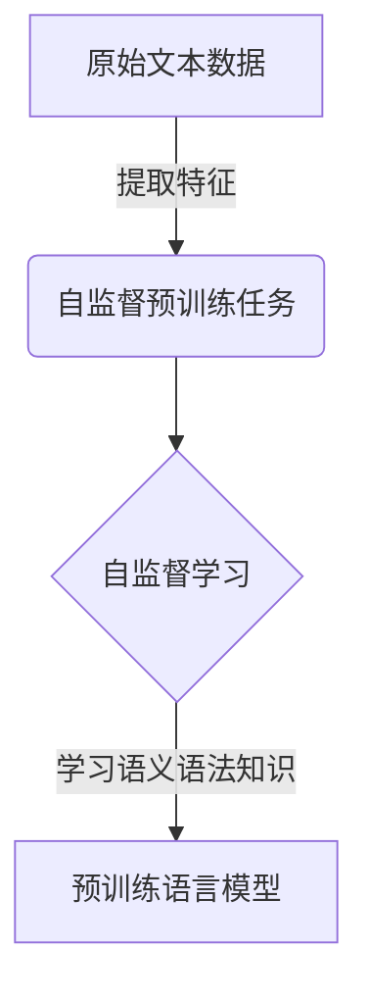
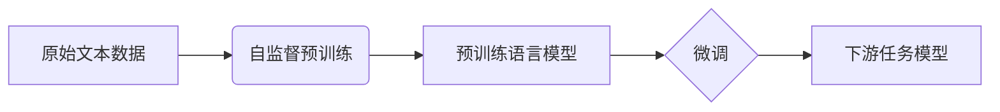
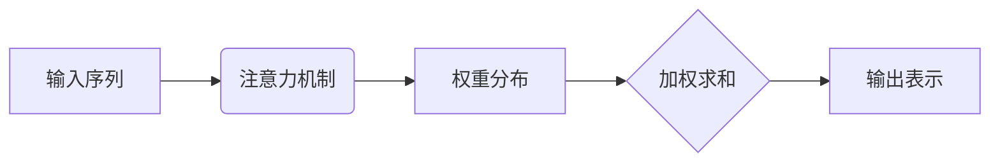
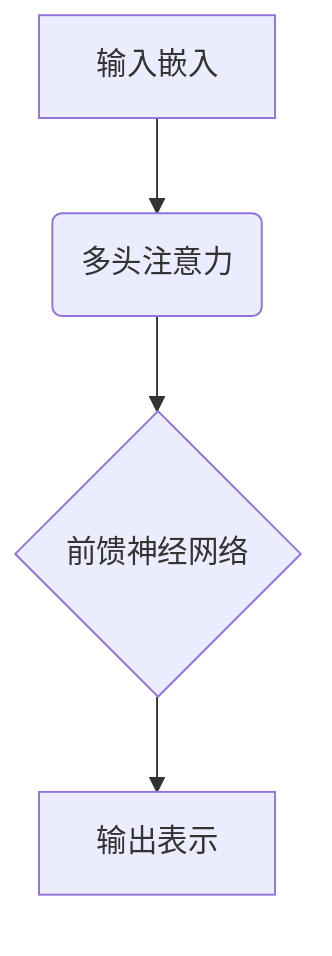
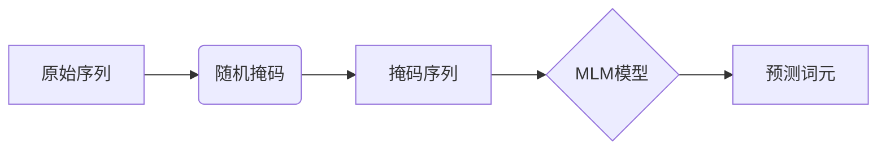
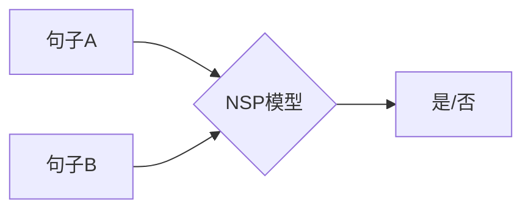
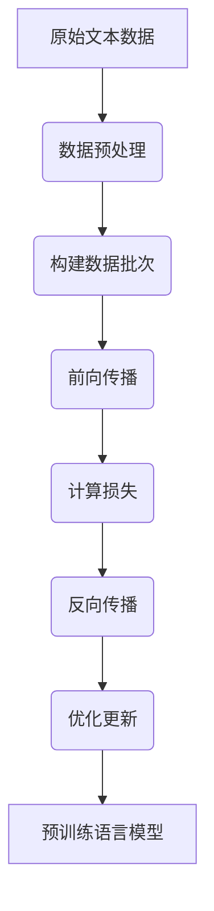

# 大语言模型应用指南：神经网络中的自监督学习

## 1. 背景介绍

### 1.1 人工智能的发展历程

人工智能(Artificial Intelligence, AI)是一门研究如何使机器模拟人类智能行为的学科。自20世纪50年代诞生以来,人工智能经历了几个重要的发展阶段。早期的人工智能系统主要基于符号主义和逻辑推理,但在处理复杂问题时存在局限性。

### 1.2 深度学习的兴起

21世纪初,深度学习(Deep Learning)的兴起,标志着人工智能进入了一个新的里程碑。深度学习是机器学习的一种技术,它通过对数据进行表示学习,并在多层神经网络中对抽象特征进行组合,从而实现对复杂问题的建模和预测。

### 1.3 大语言模型的崛起

随着计算能力的不断提高和大量数据的积累,自然语言处理(Natural Language Processing, NLP)成为深度学习应用的一个重要领域。大语言模型(Large Language Model, LLM)作为NLP的核心技术,通过在海量文本数据上进行自监督学习,展现出了惊人的语言理解和生成能力,推动了人工智能在自然语言领域的飞速发展。

## 2. 核心概念与联系

### 2.1 自监督学习

自监督学习(Self-Supervised Learning)是一种机器学习范式,它不需要人工标注的数据,而是利用原始数据本身的结构和统计特性进行学习。在自然语言处理领域,自监督学习通过设计合理的预训练任务,使语言模型能够从大量未标注的文本数据中捕获语义和语法信息。



### 2.2 预训练与微调

大语言模型通常采用预训练与微调(Pre-training and Fine-tuning)的范式。在预训练阶段,模型在大规模未标注文本数据上进行自监督学习,获取通用的语言知识。在微调阶段,模型在特定的下游任务数据上进行进一步训练,使其能够适应具体的应用场景。



### 2.3 注意力机制

注意力机制(Attention Mechanism)是大语言模型中的关键技术。它允许模型在处理序列数据时,动态地关注输入序列的不同部分,捕捉长距离依赖关系,从而提高模型的表现能力。



### 2.4 transformer架构

Transformer是一种革命性的神经网络架构,它完全基于注意力机制,摒弃了传统的循环神经网络和卷积神经网络结构。Transformer架构在大语言模型中得到了广泛应用,展现出了卓越的性能。



## 3. 核心算法原理具体操作步骤

### 3.1 自监督预训练任务

大语言模型的预训练通常采用以下两种自监督任务:

1. **掩码语言模型(Masked Language Modeling, MLM)**: 随机掩码输入序列中的一部分词元,模型需要根据上下文预测被掩码的词元。



2. **下一句预测(Next Sentence Prediction, NSP)**: 给定两个句子,模型需要判断第二个句子是否为第一个句子的下一句。



### 3.2 预训练过程

预训练过程包括以下步骤:

1. 数据预处理: 将原始文本数据转换为模型可以处理的格式,例如词元化、填充等。
2. 构建数据批次: 从预处理后的数据中采样构建训练批次。
3. 前向传播: 将训练批次输入到模型中,计算预测输出。
4. 计算损失: 根据预训练任务的目标,计算模型预测与真实值之间的损失。
5. 反向传播: 根据损失值,计算模型参数的梯度。
6. 优化更新: 使用优化算法(如Adam)更新模型参数。



## 4. 数学模型和公式详细讲解举例说明

### 4.1 自注意力机制

自注意力机制是transformer架构的核心组件,它允许模型捕捉输入序列中任意两个位置之间的依赖关系。给定一个长度为$n$的输入序列$X = (x_1, x_2, \dots, x_n)$,自注意力机制的计算过程如下:

1. 线性投影: 将输入序列$X$分别投影到查询(Query)、键(Key)和值(Value)空间,得到$Q$、$K$和$V$。

$$Q = XW^Q, K = XW^K, V = XW^V$$

其中$W^Q$、$W^K$和$W^V$是可学习的权重矩阵。

2. 计算注意力分数: 通过查询$Q$和键$K$的点积,计算每个位置对其他位置的注意力分数。

$$\text{Attention}(Q, K, V) = \text{softmax}(\frac{QK^T}{\sqrt{d_k}})V$$

其中$d_k$是缩放因子,用于防止内积过大导致的梯度饱和问题。

3. 多头注意力: 为了捕捉不同的子空间特征,transformer采用了多头注意力机制。每个注意力头都独立计算注意力分数,然后将所有头的结果拼接起来。

$$\text{MultiHead}(Q, K, V) = \text{Concat}(head_1, \dots, head_h)W^O$$

其中$head_i = \text{Attention}(QW_i^Q, KW_i^K, VW_i^V)$,而$W_i^Q$、$W_i^K$、$W_i^V$和$W^O$都是可学习的权重矩阵。

### 4.2 位置编码

由于transformer没有像RNN那样的递归结构,因此需要一种机制来捕捉序列中元素的位置信息。位置编码就是一种将位置信息注入到输入序列中的方法。

对于序列中的第$i$个位置,其位置编码$PE_{(pos, 2i)}$和$PE_{(pos, 2i+1)}$分别计算如下:

$$PE_{(pos, 2i)} = \sin(pos / 10000^{2i / d_{model}})$$
$$PE_{(pos, 2i+1)} = \cos(pos / 10000^{2i / d_{model}})$$

其中$pos$是位置索引,而$d_{model}$是模型的隐状态维度。位置编码会直接加到输入嵌入上,使模型能够捕捉位置信息。

### 4.3 掩码语言模型损失函数

在掩码语言模型(MLM)任务中,模型需要预测被掩码的词元。假设输入序列中有$n$个被掩码的词元,模型的预测输出为$\hat{Y} = (\hat{y}_1, \hat{y}_2, \dots, \hat{y}_n)$,而真实标签为$Y = (y_1, y_2, \dots, y_n)$,则MLM任务的损失函数可以定义为:

$$\mathcal{L}_{MLM} = -\frac{1}{n}\sum_{i=1}^{n}\log P(y_i | \hat{y}_i)$$

其中$P(y_i | \hat{y}_i)$是模型预测$\hat{y}_i$时,真实标签$y_i$的条件概率。通过最小化这个损失函数,模型可以学习到更准确的语言知识。

## 5. 项目实践: 代码实例和详细解释说明

以下是使用PyTorch实现transformer模型的简化代码示例,包括自注意力机制和位置编码的实现。

```python
import torch
import torch.nn as nn
import math

class MultiHeadAttention(nn.Module):
    def __init__(self, d_model, num_heads):
        super(MultiHeadAttention, self).__init__()
        self.d_model = d_model
        self.num_heads = num_heads
        self.head_dim = d_model // num_heads

        self.q_linear = nn.Linear(d_model, d_model)
        self.k_linear = nn.Linear(d_model, d_model)
        self.v_linear = nn.Linear(d_model, d_model)
        self.out_linear = nn.Linear(d_model, d_model)

    def forward(self, q, k, v, mask=None):
        batch_size = q.size(0)

        q = self.q_linear(q).view(batch_size, -1, self.num_heads, self.head_dim).transpose(1, 2)
        k = self.k_linear(k).view(batch_size, -1, self.num_heads, self.head_dim).transpose(1, 2)
        v = self.v_linear(v).view(batch_size, -1, self.num_heads, self.head_dim).transpose(1, 2)

        scores = torch.matmul(q, k.transpose(-2, -1)) / math.sqrt(self.head_dim)
        if mask is not None:
            scores = scores.masked_fill(mask == 0, -1e9)
        attention_weights = nn.Softmax(dim=-1)(scores)
        out = torch.matmul(attention_weights, v).transpose(1, 2).contiguous().view(batch_size, -1, self.d_model)
        out = self.out_linear(out)

        return out

class PositionalEncoding(nn.Module):
    def __init__(self, d_model, max_len=5000):
        super(PositionalEncoding, self).__init__()
        pe = torch.zeros(max_len, d_model)
        position = torch.arange(0, max_len, dtype=torch.float).unsqueeze(1)
        div_term = torch.exp(torch.arange(0, d_model, 2).float() * (-math.log(10000.0) / d_model))
        pe[:, 0::2] = torch.sin(position * div_term)
        pe[:, 1::2] = torch.cos(position * div_term)
        pe = pe.unsqueeze(0)
        self.register_buffer('pe', pe)

    def forward(self, x):
        return x + self.pe[:, :x.size(1)]
```

在上面的代码中:

- `MultiHeadAttention`类实现了多头自注意力机制。`forward`函数计算了查询(`q`)、键(`k`)和值(`v`)的注意力分数,并输出加权后的值向量。
- `PositionalEncoding`类实现了位置编码。它预计算了一个位置编码张量,在前向传播时将其添加到输入序列的嵌入中。

使用这些模块,我们可以构建transformer模型的编码器和解码器,并将其应用于各种自然语言处理任务。

## 6. 实际应用场景

大语言模型在自然语言处理领域有着广泛的应用,包括但不限于:

### 6.1 机器翻译

机器翻译是大语言模型的一个典型应用场景。通过在大量平行语料库上进行预训练,模型可以学习到不同语言之间的语义映射,从而实现高质量的翻译。

### 6.2 文本生成

大语言模型擅长捕捉文本的语义和语法结构,因此可以用于各种文本生成任务,如新闻摘要、对话系统、创作写作等。

### 6.3 文本分类

通过在特定领域的文本数据上进行微调,大语言模型可以用于各种文本分类任务,如情感分析、垃圾邮件检测、主题分类等。

### 6.4 问答系统

大语言模型可以从海量文本数据中学习到丰富的知识,并通过微调应用于问答系统,为用户提供准确的答复。

### 6.5 信息抽取

大语言模型在捕捉文本中的实体、关系和事件方面