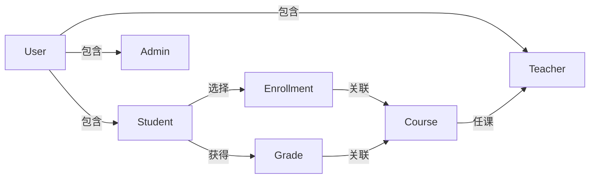

# 学生在线选课系统详细设计与具体代码实现

## 1.背景介绍

随着在线教育的快速发展,学生在线选课系统已经成为现代教育体系中不可或缺的重要组成部分。传统的选课方式存在诸多问题,如信息不对称、流程低效、管理困难等,而在线选课系统的出现很好地解决了这些痛点。学生可以通过系统方便地查看课程信息、选择感兴趣的课程、管理个人课程等,极大地提高了选课效率。同时,教师和管理员也可以借助系统高效地发布课程、分配资源、监控选课情况。因此,构建一个功能完善、性能优秀的在线选课系统,对于提升教学质量和用户体验至关重要。

## 2.核心概念与联系

在线选课系统的核心概念包括:

### 2.1 用户 (User)

系统主要包含三种用户角色:学生(Student)、教师(Teacher)和管理员(Admin)。每个用户角色拥有不同的权限和功能。

### 2.2 课程 (Course)  

课程是系统的核心实体,包括课程名称、描述、学分、上课时间、上课地点、任课教师等信息。

### 2.3 选课 (Enrollment)

选课记录了学生选择的课程,是学生和课程之间的关联关系。

### 2.4 评分 (Grade)

评分记录了学生在每门课程的最终成绩。

这些核心概念之间的关系如下所示:



## 3.核心算法原理具体操作步骤

### 3.1 用户认证与授权

为确保系统安全性,需要对用户进行身份认证和权限控制。常用的用户认证方式有用户名密码登录、第三方OAuth等。授权则根据用户角色分配不同的系统权限。

具体步骤如下:

1. 用户输入用户名和密码
2. 系统验证用户名密码是否正确
3. 如果正确,根据用户角色分配相应权限,如学生可选课、教师可管理课程等
4. 否则拒绝访问,返回错误信息

### 3.2 课程管理

课程管理是系统的核心功能,包括课程创建、修改、删除等操作。

1. 教师或管理员发起创建课程请求
2. 系统验证发起者的身份和权限
3. 如果有权限,显示创建课程表单,输入课程详细信息
4. 系统保存课程信息到数据库
5. 课程创建成功,返回新建课程ID
6. 修改和删除课程的流程类似

### 3.3 选课算法

选课算法需要考虑多方面的约束条件,如课程余量、学生已选课程冲突等,以保证选课过程的公平性和合理性。

1. 学生发起选课请求
2. 系统检查所选课程的余量是否足够
3. 检查学生的已选课程是否与所选课程时间冲突
4. 如果满足条件,保存选课记录到数据库
5. 更新课程余量
6. 否则返回错误信息

### 3.4 成绩录入与查询

教师可以录入学生的成绩,学生可以查询自己的成绩。

1. 教师输入课程ID和学生成绩
2. 系统验证教师是否为该课程的任课教师
3. 如果有权限,保存学生成绩到数据库
4. 学生输入课程ID查询自己的成绩
5. 系统检索该课程下该学生的成绩,返回结果

## 4.数学模型和公式详细讲解举例说明  

在线选课系统中,需要对课程余量、选课时间冲突等因素进行建模和计算,以保证选课过程的合理性和公平性。

### 4.1 课程余量计算

设某门课程的总容量为$C$,已选学生人数为$n$,则剩余可选名额为:

$$
余量 = C - n
$$

当余量为0时,该课程将无法继续选课。

### 4.2 选课时间冲突检测

对于学生$i$已选的课程集合$S_i$,欲选课程的上课时间为$T_c$,则检测时间冲突的算法为:

```python
def has_conflict(S_i, T_c):
    for course in S_i:
        if course.time_slot.overlaps(T_c):
            return True
    return False
```

其中`time_slot.overlaps`是检测两个时间段是否重叠的函数。如果存在时间冲突,则不允许选课。

### 4.3 选课批次优先级算法

如果同时存在多个选课请求,需要一个公平的调度算法来确定优先级。一种常见的做法是根据学生年级、绩点等条件赋予不同的优先级值,然后按优先级高低排序处理请求。

设学生$i$的优先级值为$p_i$,其中$p_i$可由多个条件计算得到,如:

$$
p_i = \alpha_1 \times \text{年级系数} + \alpha_2 \times \text{绩点} + \cdots
$$

其中$\alpha_1, \alpha_2, \cdots$是各个条件的权重系数,可根据实际需求调整。

## 5.项目实践:代码实例和详细解释说明

接下来,我们通过一个基于Python Django框架的在线选课系统实例,来进一步说明系统的设计和实现。

### 5.1 models.py

首先定义系统的核心模型:

```python
from django.db import models
from django.contrib.auth.models import User

class Student(models.Model):
    user = models.OneToOneField(User, on_delete=models.CASCADE)
    grade = models.IntegerField(default=1)
    
class Teacher(models.Model):
    user = models.OneToOneField(User, on_delete=models.CASCADE)
    
class Course(models.Model):
    name = models.CharField(max_length=100)
    description = models.TextField()
    credits = models.IntegerField()
    teacher = models.ForeignKey(Teacher, on_delete=models.CASCADE)
    
class Enrollment(models.Model):
    student = models.ForeignKey(Student, on_delete=models.CASCADE)
    course = models.ForeignKey(Course, on_delete=models.CASCADE)
    
class Grade(models.Model):
    enrollment = models.ForeignKey(Enrollment, on_delete=models.CASCADE)
    score = models.IntegerField()
```

- `Student`和`Teacher`模型分别与Django内置的`User`模型一对一关联
- `Course`模型包含课程基本信息,与`Teacher`模型存在一对多关系
- `Enrollment`模型记录选课信息,是`Student`和`Course`的多对多关联关系
- `Grade`模型记录学生的成绩,与`Enrollment`一对一关联

### 5.2 views.py

```python
from django.contrib.auth.decorators import login_required
from .models import Course, Enrollment, Grade

@login_required
def enroll_course(request, course_id):
    course = Course.objects.get(id=course_id)
    student = request.user.student
    
    # 检查课程余量
    if course.enrollment_set.count() >= course.capacity:
        return HttpResponse('课程已满员')
    
    # 检查时间冲突
    enrollments = student.enrollment_set.all()
    for enrollment in enrollments:
        if enrollment.course.time_slot.overlaps(course.time_slot):
            return HttpResponse('选课时间冲突')
            
    # 保存选课记录
    enrollment = Enrollment(student=student, course=course)
    enrollment.save()
    
    return HttpResponse('选课成功')
    
@login_required    
def course_grades(request, course_id):
    enrollments = Enrollment.objects.filter(course_id=course_id)
    grades = []
    for enrollment in enrollments:
        try:
            grade = Grade.objects.get(enrollment=enrollment)
            grades.append({
                'student': enrollment.student.user.username,
                'score': grade.score
            })
        except Grade.DoesNotExist:
            pass
            
    return render(request, 'grades.html', {'grades': grades})
```

- `enroll_course`视图函数实现了选课功能,包括检查课程余量、时间冲突等逻辑
- `course_grades`视图函数用于教师查看某门课程的学生成绩

### 5.3 前端模板

```html
<!-- courses.html -->

<div>
    <h3>{{ course.name }}</h3>
    <p>{{ course.description }}</p>
    <p>学分: {{ course.credits }}</p>
    <p>任课教师: {{ course.teacher.user.username }}</p>
    <a href="">选课</a>
</div>


<!-- grades.html -->
<table>
    <tr>
        <th>学生</th>
        <th>成绩</th>
    </tr>
    
    <tr>
        <td>{{ grade.student }}</td>
        <td>{{ grade.score }}</td>
    </tr>
    
</table>
```

- `courses.html`模板用于展示所有可选课程,并提供选课链接
- `grades.html`模板用于展示某门课程的学生成绩

通过上述代码实例,我们可以看到Django框架的强大功能,能够快速构建一个功能完备的在线选课系统。当然,在实际项目中还需要考虑更多的细节,如用户权限控制、表单验证、异常处理等,以确保系统的安全性和可用性。

## 6.实际应用场景

在线选课系统在教育领域有着广泛的应用,包括:

### 6.1 高等院校

大学、学院等高等院校是在线选课系统的主要应用场景。学生可以通过系统方便地查看并选择自己感兴趣的课程,教师也可以高效地管理课程和成绩。

### 6.2 在线教育平台

随着在线教育的兴起,越来越多的在线教育平台开始提供选课服务。学员可以根据自身需求,选择合适的课程进行学习。

### 6.3 企业内训

一些大型企业也会为员工提供内部培训课程,在线选课系统可以帮助企业高效地管理培训资源,实现精准的人力资源培养。

### 6.4 社区教育

在线选课系统还可以应用于社区教育领域,方便社区居民选择感兴趣的课程,促进终身学习。

## 7.工具和资源推荐

在开发在线选课系统时,可以使用以下工具和资源:

### 7.1 开发框架

- Python Django: 一个高度封装的Python Web框架,适合快速构建选课系统
- Node.js Express: 一个简洁高效的Node.js Web框架
- Spring Boot: 流行的Java企业级应用开发框架

### 7.2 前端框架

- React: 构建交互式前端界面
- Vue.js: 渐进式JavaScript框架
- Bootstrap: 响应式前端框架,方便构建美观的UI界面

### 7.3 数据库

- MySQL: 经典的开源关系型数据库
- MongoDB: 领先的NoSQL文档型数据库
- Redis: 高性能的键值对缓存数据库

### 7.4 云服务

- AWS
- Azure
- 阿里云

云服务提供了可扩展的计算资源、存储和CDN等功能,有助于应对高并发访问。

### 7.5 项目管理

- Git: 分布式版本控制系统
- GitHub/GitLab: 代码托管和协作平台

## 8.总结:未来发展趋势与挑战

在线选课系统大大提高了教育资源的利用效率,但也面临着一些新的挑战:

### 8.1 个性化推荐

未来的在线选课系统需要提供个性化的课程推荐功能,根据学生的兴趣爱好、学习能力等因素,推荐最合适的课程。这需要结合大数据分析和机器学习等技术。

### 8.2 智能辅助

系统可以通过自然语言处理等AI技术,提供智能的课程查询、选课辅助等服务,进一步提升用户体验。

### 8.3 教学资源整合

未来的在线选课系统需要与教学资源系统、学习管理系统等紧密整合,为学生提供一站式的学习体验。

### 8.4 隐私和安全

随着系统涉及更多个人信息和教学资源,如何保护用户隐私和防止数据泄露,将是一个重要的安全挑战。

## 9.附录:常见问题与解答

### 9.1 如何处理选课人数超过课程容量的情况?

可以按照一定的优先级规则(如年级、绩点等)对选课请求进行排序,优先处理优先级高的请求。同时可以考虑增加课程