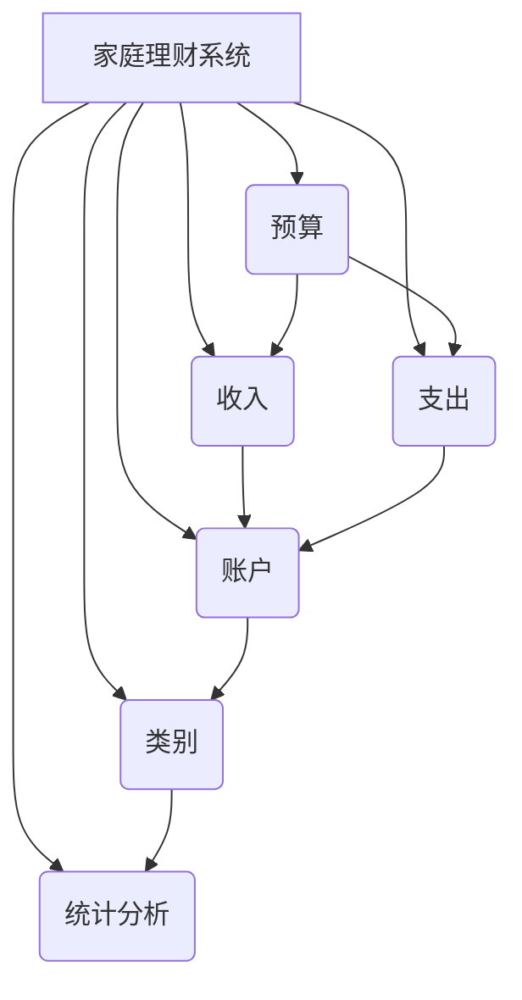
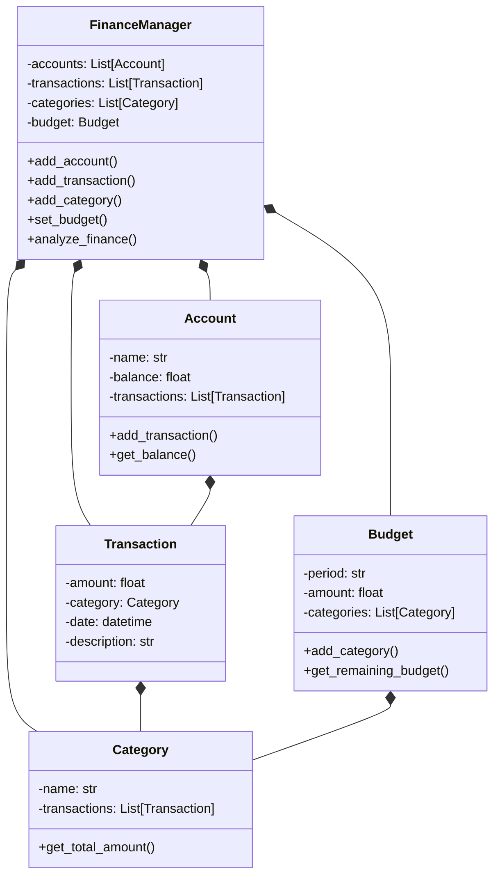

# 家庭理财系统的设计与实现

## 1.背景介绍

随着生活水平的不断提高,人们对于家庭财务管理的需求也日益增长。传统的记账方式已经无法满足现代家庭对于精细化、可视化的理财需求。因此,设计并实现一个功能完善、操作便捷的家庭理财系统,对于帮助家庭科学管理收支、合理安排开支、实现财务目标具有重要意义。

## 2.核心概念与联系

家庭理财系统的核心概念包括:

1. **收入**:指家庭成员通过工作、投资等方式获得的经济收入。
2. **支出**:指家庭生活、教育、娱乐等方面产生的各种开支。
3. **预算**:根据家庭收入情况,对未来一段时间内的支出进行合理规划和分配。
4. **账户**:用于记录和管理家庭收支情况的账户,可分为现金账户、信用卡账户等。
5. **类别**:将收入和支出按照不同的种类进行分类,如工资收入、房租支出等。
6. **统计分析**:对家庭收支数据进行统计和分析,了解资金流向,为制定理财策略提供决策依据。

这些核心概念相互关联、环环相扣,构成了家庭理财系统的基本框架。



## 3.核心算法原理具体操作步骤

家庭理财系统的核心算法主要包括以下几个方面:

### 3.1 收支记录算法

收支记录算法负责将用户输入的收入和支出信息准确地记录到相应的账户中,具体步骤如下:

1. 获取用户输入的收支信息,包括金额、类别、账户、备注等。
2. 根据输入的账户类型,找到对应的账户对象。
3. 创建一个新的收支记录对象,并将用户输入的信息赋值给对象的相应属性。
4. 将新创建的收支记录对象添加到账户对象的记录列表中。
5. 更新账户对象的当前余额。

### 3.2 预算管理算法

预算管理算法用于帮助用户合理分配资金,控制支出,具体步骤如下:

1. 获取用户设置的预算周期(月/季度/年)和预算金额。
2. 根据预算周期,计算出预算的起止日期。
3. 遍历该时间段内的所有支出记录,累加支出金额。
4. 将累加的支出金额与预算金额进行比较,判断是否超支。
5. 如果超支,给出提醒;如果未超支,显示剩余的可用预算金额。

### 3.3 统计分析算法

统计分析算法负责对家庭收支数据进行多维度的统计和分析,为用户提供决策支持,具体步骤如下:

1. 获取用户设置的统计分析周期(月/季度/年)。
2. 根据统计周期,从收支记录中筛选出符合条件的记录。
3. 按照不同的维度(类别、账户等)对记录进行分组统计,计算每个组的收入总额和支出总额。
4. 根据统计结果,生成多种形式的报表或图表,如饼图、柱状图等,直观展示家庭收支情况。

## 4.数学模型和公式详细讲解举例说明

在家庭理财系统中,我们需要对收支数据进行统计分析,以便更好地了解资金流向情况。以下是一些常用的数学模型和公式:

### 4.1 收支比率

收支比率反映了一段时间内支出占收入的比例,用于评估家庭的消费水平。计算公式如下:

$$
收支比率 = \frac{支出总额}{收入总额} \times 100\%
$$

例如,某家庭一个月的总收入为10000元,总支出为8000元,则该月的收支比率为:

$$
收支比率 = \frac{8000}{10000} \times 100\% = 80\%
$$

一般认为,收支比率在70%以下较为合理。

### 4.2 剩余收入

剩余收入是指扣除所有支出后剩余的可用收入,可用于储蓄或投资。计算公式如下:

$$
剩余收入 = 收入总额 - 支出总额
$$

假设某家庭一年的总收入为120000元,总支出为90000元,则该年的剩余收入为:

$$
剩余收入 = 120000 - 90000 = 30000 (元)
$$

### 4.3 收支增长率

收支增长率反映了收入或支出在不同时期的变化趋势,有助于预测未来的收支情况。计算公式如下:

$$
收入(支出)增长率 = \frac{本期收入(支出)总额 - 上期收入(支出)总额}{上期收入(支出)总额} \times 100\%
$$

例如,某家庭2022年的总收入为100000元,2023年的总收入为110000元,则2023年的收入增长率为:

$$
收入增长率 = \frac{110000 - 100000}{100000} \times 100\% = 10\%
$$

通过计算和分析这些指标,我们可以更清晰地了解家庭的财务状况,为制定理财策略提供依据。

## 5.项目实践:代码实例和详细解释说明

为了更好地理解家庭理财系统的实现,我们将通过一个简单的Python项目实例来演示。

### 5.1 系统架构

我们将采用面向对象的设计方式,将系统划分为以下几个核心模块:

- `Account`类:表示家庭账户,包括现金账户、信用卡账户等。
- `Transaction`类:表示单笔收支记录。
- `Category`类:表示收支类别,如工资收入、房租支出等。
- `Budget`类:用于管理家庭预算。
- `FinanceManager`类:系统的主要控制模块,负责协调其他模块的工作。



### 5.2 核心代码实现

以下是一些核心模块的代码实现,供参考:

#### Account类

```python
class Account:
    def __init__(self, name):
        self.name = name
        self.balance = 0.0
        self.transactions = []

    def add_transaction(self, transaction):
        self.transactions.append(transaction)
        if transaction.amount > 0:
            self.balance += transaction.amount
        else:
            self.balance -= transaction.amount

    def get_balance(self):
        return self.balance
```

#### Transaction类

```python
class Transaction:
    def __init__(self, amount, category, date, description):
        self.amount = amount
        self.category = category
        self.date = date
        self.description = description
```

#### Category类

```python
class Category:
    def __init__(self, name):
        self.name = name
        self.transactions = []

    def add_transaction(self, transaction):
        self.transactions.append(transaction)

    def get_total_amount(self, start_date, end_date):
        total = 0.0
        for transaction in self.transactions:
            if start_date <= transaction.date <= end_date:
                total += transaction.amount
        return total
```

#### Budget类

```python
class Budget:
    def __init__(self, period, amount):
        self.period = period
        self.amount = amount
        self.categories = []

    def add_category(self, category):
        self.categories.append(category)

    def get_remaining_budget(self, start_date, end_date):
        total_expense = sum(
            category.get_total_amount(start_date, end_date)
            for category in self.categories
        )
        return self.amount - total_expense
```

#### FinanceManager类

```python
class FinanceManager:
    def __init__(self):
        self.accounts = []
        self.transactions = []
        self.categories = []
        self.budget = None

    def add_account(self, account):
        self.accounts.append(account)

    def add_transaction(self, transaction):
        self.transactions.append(transaction)
        account = next(
            (acc for acc in self.accounts if acc.name == transaction.account_name),
            None,
        )
        if account:
            account.add_transaction(transaction)

    def add_category(self, category):
        self.categories.append(category)

    def set_budget(self, period, amount):
        self.budget = Budget(period, amount)
        for category in self.categories:
            self.budget.add_category(category)

    def analyze_finance(self, start_date, end_date):
        total_income = sum(
            transaction.amount
            for transaction in self.transactions
            if transaction.amount > 0
            and start_date <= transaction.date <= end_date
        )
        total_expense = sum(
            transaction.amount
            for transaction in self.transactions
            if transaction.amount < 0
            and start_date <= transaction.date <= end_date
        )
        category_expenses = {
            category.name: category.get_total_amount(start_date, end_date)
            for category in self.categories
        }
        if self.budget:
            remaining_budget = self.budget.get_remaining_budget(start_date, end_date)
        else:
            remaining_budget = None

        return {
            "total_income": total_income,
            "total_expense": total_expense,
            "category_expenses": category_expenses,
            "remaining_budget": remaining_budget,
        }
```

通过这些代码,我们实现了家庭理财系统的基本功能,包括账户管理、收支记录、类别管理、预算管理和数据分析等。用户可以根据需求进行扩展和定制。

## 6.实际应用场景

家庭理财系统可以应用于以下几个典型场景:

1. **个人理财**:个人用户可以使用该系统记录和管理自己的收入和支出,了解资金流向,控制开支,实现理性消费。

2. **家庭理财**:家庭成员可以共享同一个理财系统,协同管理家庭收支,制定家庭预算,为孩子的教育、老年生活等做好财务规划。

3. **小微企业理财**:一些规模较小的企业或个体工商户,也可以使用该系统来记录和管理企业的收支情况,掌握资金流向,提高经营效率。

4. **个人理财教育**:该系统还可以作为个人理财教育的辅助工具,通过实际操作来培养学生的理财意识和能力。

无论是个人还是家庭,合理的财务管理都是非常重要的。通过使用家庭理财系统,用户可以更好地掌控财务状况,做出明智的理财决策。

## 7.工具和资源推荐

在设计和实现家庭理财系统的过程中,我们可以借助一些优秀的工具和资源:

1. **Python**:作为一种简单高效的编程语言,Python非常适合快速开发原型和构建应用程序。我们可以使用Python的多种库和框架,如Flask、Django等,来开发Web应用或移动应用。

2. **数据库**:我们需要一个数据库来存储家庭收支记录、账户信息等数据。常用的数据库有SQLite、MySQL、PostgreSQL等。

3. **前端框架**:为了提供良好的用户体验,我们可以使用流行的前端框架,如React、Vue.js或Angular,来构建现代化的Web用户界面。

4. **可视化库**:数据可视化对于理解和分析家庭财务状况非常重要。我们可以使用Python的Matplotlib、Plotly或JavaScript的D3.js等库,生成各种图表和报表。

5. **开源项目**:开源社区中有许多优秀的家庭理财系统项目,我们可以借鉴它们的设计思路和代码实现,避免重复造轮子。

6. **在线课程和教程**:网上有大量优质的编程、数据分析和理财相关的在线课程和教程,可以帮助我们快速掌握所需的知识和技能。