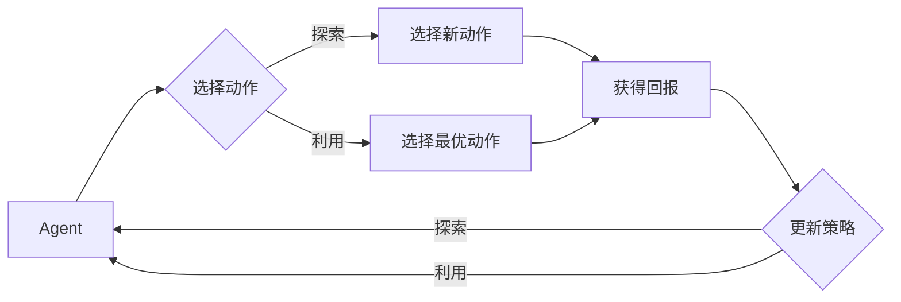

# 强化学习中的探索与利用权衡

## 1. 背景介绍
### 1.1 强化学习概述
#### 1.1.1 强化学习的定义
#### 1.1.2 强化学习的特点
#### 1.1.3 强化学习与其他机器学习范式的区别

### 1.2 探索与利用权衡的重要性  
#### 1.2.1 探索的必要性
#### 1.2.2 利用的重要性
#### 1.2.3 探索与利用的矛盾

## 2. 核心概念与联系
### 2.1 探索(Exploration)
#### 2.1.1 探索的定义
#### 2.1.2 探索的目的
#### 2.1.3 探索的策略

### 2.2 利用(Exploitation)  
#### 2.2.1 利用的定义
#### 2.2.2 利用的目的 
#### 2.2.3 利用的策略

### 2.3 探索与利用的关系
#### 2.3.1 探索与利用的权衡 
#### 2.3.2 探索与利用的平衡
#### 2.3.3 探索与利用的转换

### 2.4 探索与利用权衡的 Mermaid 流程图

## 3. 核心算法原理具体操作步骤
### 3.1 ε-贪婪算法
#### 3.1.1 算法原理
#### 3.1.2 算法步骤
#### 3.1.3 算法优缺点

### 3.2 Upper Confidence Bound(UCB)算法
#### 3.2.1 算法原理  
#### 3.2.2 算法步骤
#### 3.2.3 算法优缺点

### 3.3 Thompson Sampling算法
#### 3.3.1 算法原理
#### 3.3.2 算法步骤  
#### 3.3.3 算法优缺点

## 4. 数学模型和公式详细讲解举例说明
### 4.1 Multi-Armed Bandit问题
#### 4.1.1 问题定义
#### 4.1.2 数学模型
#### 4.1.3 解决方案

### 4.2 ε-贪婪算法的数学模型 
#### 4.2.1 数学模型
$$ 
\pi(a|s) = 
\begin{cases}
\arg\max_{a'} Q(s,a') & \text{with probability } 1-\varepsilon \\
\text{random action} & \text{with probability } \varepsilon
\end{cases}
$$
#### 4.2.2 参数说明
#### 4.2.3 算法优化

### 4.3 UCB算法的数学模型
#### 4.3.1 数学模型  
$$
a_t = \arg\max_{a} \left[ Q(a) + c \sqrt{\frac{\ln t}{N_t(a)}} \right]
$$
#### 4.3.2 参数说明
#### 4.3.3 算法优化

## 5. 项目实践：代码实例和详细解释说明
### 5.1 环境搭建
#### 5.1.1 安装依赖库
#### 5.1.2 导入必要的模块

### 5.2 ε-贪婪算法的代码实现
#### 5.2.1 定义 ε-贪婪 类
#### 5.2.2 实现 ε-贪婪 算法
#### 5.2.3 测试 ε-贪婪 算法

### 5.3 UCB算法的代码实现  
#### 5.3.1 定义 UCB 类
#### 5.3.2 实现 UCB 算法
#### 5.3.3 测试 UCB 算法

### 5.4 Thompson Sampling算法的代码实现
#### 5.4.1 定义 Thompson Sampling 类 
#### 5.4.2 实现 Thompson Sampling 算法
#### 5.4.3 测试 Thompson Sampling 算法

## 6. 实际应用场景
### 6.1 推荐系统
#### 6.1.1 探索与利用在推荐系统中的应用
#### 6.1.2 常用的探索与利用算法
#### 6.1.3 案例分析

### 6.2 自动驾驶
#### 6.2.1 探索与利用在自动驾驶中的应用
#### 6.2.2 常用的探索与利用算法 
#### 6.2.3 案例分析

### 6.3 智能医疗
#### 6.3.1 探索与利用在智能医疗中的应用
#### 6.3.2 常用的探索与利用算法
#### 6.3.3 案例分析

## 7. 工具和资源推荐
### 7.1 强化学习平台
#### 7.1.1 OpenAI Gym
#### 7.1.2 DeepMind Lab
#### 7.1.3 Unity ML-Agents

### 7.2 强化学习库  
#### 7.2.1 Stable Baselines
#### 7.2.2 RLlib
#### 7.2.3 TensorFlow Agents

### 7.3 学习资源
#### 7.3.1 在线课程
#### 7.3.2 书籍推荐
#### 7.3.3 论文推荐

## 8. 总结：未来发展趋势与挑战
### 8.1 探索与利用权衡的研究现状
#### 8.1.1 当前主流算法
#### 8.1.2 算法的优缺点比较
#### 8.1.3 算法的适用场景

### 8.2 探索与利用权衡的未来发展趋势
#### 8.2.1 理论研究方向 
#### 8.2.2 算法改进方向
#### 8.2.3 应用拓展方向

### 8.3 探索与利用权衡面临的挑战
#### 8.3.1 高维状态空间的探索 
#### 8.3.2 非平稳环境下的探索与利用
#### 8.3.3 多智能体探索与利用的协调

## 9. 附录：常见问题与解答
### 9.1 探索与利用权衡的本质是什么？
### 9.2 ε-贪婪算法的 ε 值如何选取？ 
### 9.3 UCB算法的置信区间为什么是 $\sqrt{\frac{\ln t}{N_t(a)}}$ ？
### 9.4 Thompson Sampling算法的贝叶斯更新过程是怎样的？
### 9.5 如何权衡探索与利用在实际应用中的比重？

作者：禅与计算机程序设计艺术 / Zen and the Art of Computer Programming