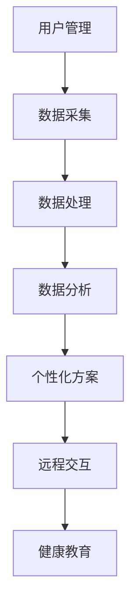

# 微信小程序糖尿病居家健康管理系统

## 1.背景介绍

糖尿病是一种严重影响人类健康的慢性代谢性疾病,全球约有4.22亿人患有糖尿病。糖尿病患者需要长期监测血糖水平、用药情况、饮食运动等,并根据这些数据制定个性化的治疗方案。然而,传统的就医模式下,患者需要定期到医院就诊,医生难以及时全面了解患者的健康状况,给患者的生活和治疗带来诸多不便。

随着移动互联网和可穿戴设备的发展,糖尿病远程管理系统应运而生。这种系统利用智能手机、可穿戴设备等终端采集患者的生理数据,通过云端处理后将分析结果反馈给患者和医生,实现糖尿病的居家远程管理。这不仅提高了患者的生活质量,也减轻了医疗机构的压力。

微信小程序作为一种轻量级的移动应用,具有开发成本低、无需安装即可使用等优势,非常适合作为糖尿病居家健康管理系统的客户端。本文将介绍基于微信小程序的糖尿病居家健康管理系统的设计与实现。

## 2.核心概念与联系

微信小程序糖尿病居家健康管理系统的核心概念包括:

1. **用户管理**:系统需要对患者、医生等用户进行身份认证和权限管理。

2. **数据采集**:通过连接可穿戴设备(如血糖仪)和手动输入,采集患者的血糖、饮食、运动、用药等数据。

3. **数据处理**:对采集的原始数据进行清洗、标准化等预处理,为后续分析做准备。

4. **数据分析**:基于机器学习算法,分析患者的健康数据,发现潜在规律和风险。

5. **个性化方案**:根据分析结果,为患者制定个性化的饮食、运动、用药等健康干预方案。

6. **远程交互**:患者可以与医生进行远程视频问诊,医生也可以查看患者的健康数据。

7. **健康教育**:向患者推送糖尿病相关的健康知识,提高患者的疾病认知度。

这些核心概念相互关联、环环相扣,构成了一个完整的糖尿病居家健康管理系统。



## 3.核心算法原理具体操作步骤

### 3.1 数据预处理

原始采集的患者健康数据通常存在缺失、异常、不一致等问题,需要进行预处理才能为后续分析提供高质量的数据。常用的预处理方法包括:

1. **缺失值处理**:使用均值插补、多重插补等方法填补缺失值。

2. **异常值处理**:通过箱线图、3σ原则等方法检测并修正异常值。

3. **数据标准化**:将数据转换到统一的量纲和分布,方便进行分析和建模。

4. **数据编码**:将分类数据(如症状类型)转换为one-hot编码或数值编码。

预处理后的数据可以输入到机器学习模型中进行分析。

### 3.2 血糖预测模型

预测患者未来的血糖水平是糖尿病管理的关键环节。常用的血糖预测模型包括:

1. **线性回归模型**:利用患者的饮食、运动、用药等数据,建立线性回归方程预测血糖变化。

2. **时序模型**:将血糖数据看作时间序列,使用ARIMA、RNN等模型对其进行预测。

3. **决策树模型**:根据患者的多维度数据,构建决策树模型预测患者的血糖水平。

4. **集成学习模型**:将多个基础模型(如随机森林)集成,提高血糖预测的准确性。

模型训练时需要使用大量真实的患者数据,并进行交叉验证等方法防止过拟合。预测时将患者的最新数据输入模型,即可得到未来血糖的预测值。

### 3.3 个性化健康方案

根据血糖预测结果和患者的其他健康数据,系统可以为患者制定个性化的健康干预方案,主要包括:

1. **饮食方案**:推荐适合患者的饮食结构、食物热量和营养成分。

2. **运动方案**:推荐适合患者的运动强度、时长和类型。

3. **用药方案**:根据患者的血糖水平,推荐调整胰岛素或口服药的剂量。

4. **生活方式**:根据患者的生活作息、工作强度等,提出改善生活方式的建议。

制定方案时,需要结合患者的年龄、性别、体重指数等基本信息,并遵循相关的临床指南。方案制定可以使用基于规则的专家系统,或基于机器学习的推荐系统。

## 4.数学模型和公式详细讲解举例说明

### 4.1 线性回归模型

线性回归是一种常用的监督学习算法,可以用于血糖预测。假设有 $n$ 个样本 $(x_i, y_i)$,其中 $x_i = (x_i^{(1)}, x_i^{(2)}, \ldots, x_i^{(m)})$ 是 $m$ 维特征向量,表示患者的饮食、运动、用药等数据, $y_i$ 是血糖值。线性回归试图学习一个线性函数:

$$f(x) = w_0 + w_1x^{(1)} + w_2x^{(2)} + \ldots + w_mx^{(m)}$$

使得 $f(x_i)$ 尽可能接近 $y_i$。学习过程是求解参数 $w = (w_0, w_1, \ldots, w_m)$,使损失函数 $J(w)$ 最小化:

$$J(w) = \frac{1}{2n}\sum_{i=1}^n(f(x_i) - y_i)^2$$

通过最小二乘法或梯度下降法可以求解最优参数 $w^*$,从而得到线性回归模型 $f(x) = w_0^* + w_1^*x^{(1)} + \ldots + w_m^*x^{(m)}$。

对于新的患者数据 $x_{new}$,可以通过 $f(x_{new})$ 预测其血糖值。线性回归模型简单易用,但对于非线性数据效果可能不佳。

### 4.2 逻辑回归模型

逻辑回归常用于二分类问题,可以用于判断患者是否有糖尿病风险。假设有 $n$ 个样本 $(x_i, y_i)$,其中 $x_i$ 是特征向量, $y_i \in \{0, 1\}$ 表示是否患有糖尿病。逻辑回归模型为:

$$f(x) = P(y=1|x) = \frac{1}{1 + e^{-(w_0 + w_1x^{(1)} + \ldots + w_mx^{(m)})}}$$

其中 $w = (w_0, w_1, \ldots, w_m)$ 是模型参数。学习过程是求解最优参数 $w^*$,使损失函数 $J(w)$ 最小化:

$$J(w) = -\frac{1}{n}\sum_{i=1}^n[y_i\log f(x_i) + (1-y_i)\log(1-f(x_i))]$$

通过梯度下降法等优化算法可以求解 $w^*$。对于新的患者数据 $x_{new}$,若 $f(x_{new}) > 0.5$,则判断患有糖尿病风险,否则无风险。

逻辑回归模型可以处理线性不可分的数据,但对于非线性复杂数据,效果可能不佳。此时可以考虑使用核技巧或深度学习模型。

## 5.项目实践:代码实例和详细解释说明

### 5.1 数据采集模块

```python
import wechatpy

# 连接微信小程序
app = wechatpy.WeChatApp(appid='wx1234567890abcdef', secret='abcdef1234567890abcdefghijkl')

# 获取用户授权
auth = app.oauth.get_user_info()
openid = auth.openid

# 采集用户数据
blood_sugar = app.data.get_blood_sugar(openid)
diet = app.data.get_diet(openid)
exercise = app.data.get_exercise(openid)
medication = app.data.get_medication(openid)
```

上述代码示例展示了如何通过微信小程序 API 采集患者的血糖、饮食、运动和用药数据。首先需要连接微信小程序服务,获取用户的授权和唯一标识 `openid`。然后调用相应的 API 接口,传入 `openid` 即可获取该用户的各类健康数据。

这些数据将被存储在云端数据库中,为后续的数据处理和分析提供原始数据源。

### 5.2 数据分析模型

```python
import pandas as pd
from sklearn.linear_model import LinearRegression
from sklearn.model_selection import train_test_split

# 加载数据
data = pd.read_csv('patient_data.csv')
X = data[['diet', 'exercise', 'medication']]
y = data['blood_sugar']

# 划分训练集和测试集
X_train, X_test, y_train, y_test = train_test_split(X, y, test_size=0.2)

# 训练线性回归模型
model = LinearRegression()
model.fit(X_train, y_train)

# 评估模型
score = model.score(X_test, y_test)
print(f'Model accuracy: {score}')

# 预测新数据
new_data = [[1800, 60, 40]]
prediction = model.predict(new_data)
print(f'Predicted blood sugar: {prediction[0]}')
```

上述代码示例使用 Scikit-learn 库构建了一个线性回归模型,用于预测患者的血糖值。首先从 CSV 文件中加载患者的饮食、运动、用药和血糖数据,并划分为训练集和测试集。然后使用 `LinearRegression` 类训练线性回归模型,并在测试集上评估模型的准确性。

最后,我们可以使用训练好的模型对新的患者数据进行血糖值预测。这个简单的示例说明了如何将机器学习模型应用于糖尿病数据分析。在实际项目中,可以尝试更复杂的模型和特征工程技术,以提高预测精度。

## 6.实际应用场景

糖尿病居家健康管理系统可以广泛应用于以下场景:

1. **个人健康管理**:患者可以使用微信小程序随时记录和查看自己的健康数据,掌握血糖变化趋势,并根据系统推荐调整生活方式。

2. **医患远程互动**:患者可以通过小程序与医生进行视频问诊,医生也可以查看患者的历史数据,为患者提供更精准的指导。

3. **社区医疗服务**:糖尿病健康管理系统可以与社区医疗机构对接,为居民提供基层的慢病管理服务。

4. **医疗大数据分析**:系统采集的海量患者数据可以用于糖尿病相关的医疗大数据分析,发现疾病规律、风险因素等,为临床决策提供支持。

5. **医疗保险**:保险公司可以将糖尿病健康管理系统作为增值服务,为客户提供远程健康管理,降低理赔风险。

6. **健康教育**:通过小程序推送健康知识、饮食运动指导等,提高公众的糖尿病防治意识。

总的来说,糖尿病居家健康管理系统有助于实现精准医疗、分级诊疗、持续管理等目标,是未来医疗健康领域的重要发展方向。

## 7.工具和资源推荐

在开发糖尿病居家健康管理系统时,可以使用以下工具和资源:

1. **微信小程序开发工具**:微信官方提供的小程序开发者工具,集成了编辑、测试、调试等功能。

2. **Taro 框架**:一款多端统一的框架,支持用 React 的开发方式编写一次代码,生成微信/百度/支付宝/字节跳动小程序。

3. **ColorUI 组件库**:一款高颜值的小程序组件库,提供