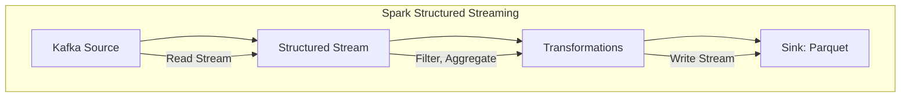

# 数据湖ETL代码示例：使用Spark进行数据转换

## 1.背景介绍

在当今的大数据时代，企业需要处理来自各种来源的海量数据,以发现隐藏的见解和洞察力。然而,原始数据通常存在于不同的格式和位置,需要进行提取、转换和加载(ETL)过程,以便在数据湖中集中存储并供进一步分析使用。Apache Spark作为一种快速、通用的大数据处理引擎,已成为执行数据湖ETL任务的流行选择。

### 1.1 数据湖概念

数据湖是一种用于存储各种格式原始数据的集中式存储库,不同于传统的数据仓库,它没有预定义的模式,可以存储结构化、半结构化和非结构化数据。数据湖的主要优势包括:

- 存储成本低廉
- 灵活性高,可存储任何类型数据
- 支持快速数据接入
- 适合机器学习和数据探索

### 1.2 ETL在数据湖中的重要性

ETL(提取、转换、加载)过程对于确保数据湖中的数据质量和可用性至关重要。它包括以下步骤:

1. **提取(Extract)**: 从各种来源(如数据库、文件、API等)收集原始数据。
2. **转换(Transform)**: 根据业务需求对数据进行清理、过滤、聚合等转换操作。
3. **加载(Load)**: 将转换后的数据加载到数据湖中,通常以分区或分块的方式存储,以提高查询效率。

使用Spark进行ETL可以获得以下优势:

- 高性能和可扩展性
- 支持批处理和流式处理
- 内置丰富的数据转换API
- 与Hadoop生态系统无缝集成

## 2.核心概念与联系

在使用Spark进行数据湖ETL之前,需要了解以下核心概念:

### 2.1 Spark Core

Spark Core是整个Spark生态系统的基础,提供了分布式计算的基本功能,如任务调度、内存管理、故障恢复等。它引入了弹性分布式数据集(RDD)的概念,用于存储分区数据和执行并行操作。

### 2.2 Spark SQL

Spark SQL是Spark用于结构化数据处理的模块,支持SQL查询和DataFrame/Dataset API。它提供了一种高效、统一的方式来处理各种格式的结构化数据,如CSV、JSON、Parquet等。

### 2.3 Spark Streaming

Spark Streaming用于构建可扩展、高吞吐量的流处理应用程序。它将实时流数据分成小批次,并使用Spark Core的RDD API进行处理。

### 2.4 数据源和接收器

Spark支持从各种数据源读取数据,如HDFS、Hive、Kafka等。同时,它也提供了不同类型的接收器(Receiver)来接收流式数据。

### 2.5 数据格式

在数据湖中,常见的数据格式包括CSV、JSON、Parquet、ORC等。选择合适的格式可以提高查询性能和存储效率。

## 3.核心算法原理具体操作步骤

使用Spark进行数据湖ETL通常包括以下步骤:

### 3.1 初始化SparkSession

```python
from pyspark.sql import SparkSession

spark = SparkSession.builder \
    .appName("DataLakeETL") \
    .getOrCreate()
```

### 3.2 读取数据源

根据数据源的类型和格式,使用适当的方法读取数据。例如,从HDFS读取CSV文件:

```python
df = spark.read.csv("hdfs://namenode:8020/data/input/*.csv")
```

### 3.3 数据转换

使用Spark SQL的DataFrame API进行各种转换操作,如选择列、过滤、聚合等。

```python
transformed_df = df.select("col1", "col2") \
                   .filter(df.col3 > 100) \
                   .groupBy("col1") \
                   .agg(avg("col2").alias("avg_col2"))
```

### 3.4 写入数据湖

将转换后的数据写入数据湖,通常以分区或分块的方式存储,以提高查询效率。

```python
transformed_df.write \
    .mode("overwrite") \
    .partitionBy("year", "month") \
    .parquet("hdfs://namenode:8020/data/output/")
```

### 3.5 流式处理

对于流式数据,需要先创建一个输入流,然后应用转换操作,最后启动流处理。

```python
kafka_stream = spark.readStream \
    .format("kafka") \
    .option("kafka.bootstrap.servers", "host1:port1,host2:port2") \
    .option("subscribe", "topic1") \
    .load()

transformed_stream = kafka_stream.select(...)

query = transformed_stream.writeStream \
    .format("parquet") \
    .option("path", "hdfs://namenode:8020/data/output/") \
    .option("checkpointLocation", "/tmp/checkpoint") \
    .trigger(processingTime="30 seconds") \
    .start()

query.awaitTermination()
```

## 4.数学模型和公式详细讲解举例说明

在数据湖ETL过程中,常见的数学模型和公式包括:

### 4.1 数据采样

在处理大数据集时,通常需要进行数据采样以提高效率。常用的采样方法包括简单随机采样、分层采样和系统采样。

简单随机采样的公式为:

$$P(X=x) = \frac{1}{N}$$

其中,N是总体样本数,x是样本值。

### 4.2 数据标准化

对于某些机器学习算法,需要对数据进行标准化处理,使其服从标准正态分布。常用的标准化方法是Z-Score标准化:

$$z = \frac{x - \mu}{\sigma}$$

其中,x是原始数据值,$\mu$是均值,$\sigma$是标准差。

### 4.3 数据聚合

在ETL过程中,常需要对数据进行聚合操作,例如计算平均值、求和等。给定一个数据集$\{x_1, x_2, \ldots, x_n\}$,求和公式为:

$$\sum_{i=1}^{n}x_i$$

计算平均值的公式为:

$$\bar{x} = \frac{1}{n}\sum_{i=1}^{n}x_i$$

## 5.项目实践：代码实例和详细解释说明

下面是一个使用Spark进行数据湖ETL的完整示例,包括从Kafka读取数据、数据转换和写入Parquet文件。

### 5.1 初始化SparkSession

```python
from pyspark.sql import SparkSession

spark = SparkSession.builder \
    .appName("DataLakeETL") \
    .getOrCreate()
```

### 5.2 读取Kafka数据流

```python
kafka_stream = spark.readStream \
    .format("kafka") \
    .option("kafka.bootstrap.servers", "host1:9092,host2:9092") \
    .option("subscribe", "topic1") \
    .load()
```

### 5.3 数据转换

假设输入数据是JSON格式,包含字段"id"、"name"、"age"和"score"。我们需要过滤掉age小于18的记录,并计算每个name的平均score。

```python
from pyspark.sql.functions import col, avg

transformed_stream = kafka_stream.select(
    col("value").cast("string")
).filter(
    col("age") >= lit(18)
).select(
    from_json(col("value"), schema).alias("data")
).select(
    "data.id",
    "data.name",
    "data.age",
    "data.score"
).groupBy(
    "name"
).agg(
    avg("score").alias("avg_score")
)
```

### 5.4 写入Parquet文件

将转换后的数据流写入HDFS上的Parquet文件,按年和月分区。

```python
query = transformed_stream.writeStream \
    .format("parquet") \
    .option("path", "hdfs://namenode:8020/data/output/") \
    .option("checkpointLocation", "/tmp/checkpoint") \
    .partitionBy("year", "month") \
    .trigger(processingTime="30 seconds") \
    .start()

query.awaitTermination()
```

在上面的代码中:

- `readStream`从Kafka读取数据流
- `select`和`filter`用于转换数据,包括过滤记录和计算聚合
- `writeStream`将转换后的数据流写入HDFS上的Parquet文件,按年和月分区
- `trigger`设置微批次的间隔时间为30秒
- `awaitTermination`等待流处理结束

### 5.5 Mermaid流程图



上图展示了使用Spark Structured Streaming进行数据湖ETL的整个流程。首先从Kafka读取数据流,然后应用一系列转换操作(如过滤、聚合等),最后将转换后的结果写入HDFS上的Parquet文件。

## 6.实际应用场景

使用Spark进行数据湖ETL可以应用于多个场景,包括但不限于:

### 6.1 网络日志处理

从Web服务器、应用程序等收集日志数据,进行清理、解析和聚合,用于网站性能监控、用户行为分析等。

### 6.2 物联网数据处理

从各种传感器和设备收集物联网数据,进行实时处理和分析,用于预测维护、优化资源利用等。

### 6.3 金融交易处理

实时处理金融交易数据,进行欺诈检测、风险评估和合规性检查。

### 6.4 推荐系统

从用户浏览记录、购买历史等数据中提取特征,构建推荐模型,为用户提供个性化推荐。

## 7.工具和资源推荐

在使用Spark进行数据湖ETL时,以下工具和资源可能会有所帮助:

### 7.1 Apache Kafka

作为分布式流处理平台,Kafka常被用作Spark Streaming的数据源。

### 7.2 Apache Hive

Hive提供了SQL接口来查询和管理存储在Hadoop生态系统中的数据,可以与Spark无缝集成。

### 7.3 Apache Zeppelin

Zeppelin是一个基于Web的笔记本,支持交互式数据分析和可视化,适合用于探索性数据分析和原型开发。

### 7.4 Delta Lake

Delta Lake是一种开源存储层,提供ACID事务、元数据操作和统一批流处理,可以提高数据湖的可靠性和性能。

### 7.5 Spark官方文档

Spark官方文档(https://spark.apache.org/docs/latest/)提供了详细的API参考、编程指南和最佳实践。

## 8.总结：未来发展趋势与挑战

数据湖和Spark将在未来继续扮演重要角色,但也面临一些挑战和发展趋势:

### 8.1 实时流处理

随着5G、物联网等技术的发展,实时流处理将变得越来越重要,需要提高Spark Streaming的性能和可靠性。

### 8.2 机器学习和AI

数据湖不仅用于存储数据,还将成为训练机器学习模型的重要数据源。Spark MLlib和其他AI框架的集成将变得更加紧密。

### 8.3 云原生架构

随着云计算的普及,数据湖和Spark将需要更好地支持云原生架构,如Kubernetes集成、自动扩缩容等。

### 8.4 安全性和治理

随着数据量和复杂性的增加,确保数据湖的安全性和数据治理将变得更加重要,需要采用更严格的访问控制和审计机制。

### 8.5 开源生态系统

Apache Spark作为开源项目,其生态系统将继续扩展和发展,吸引更多的贡献者和用户。

## 9.附录：常见问题与解答

### 9.1 Spark与Hadoop MapReduce的区别是什么?

Spark和Hadoop MapReduce都是大数据处理框架,但有以下主要区别:

- **内存计算**:Spark基于内存计算,而MapReduce主要基于磁盘计算。
- **延迟**:Spark的延迟较低,适合迭代计算和交互式查询。
- **通用性**:Spark支持批处理、流处理、机器学习和图计算等多种工作负载。
- **容错性**:Spark使用RDD的lineage实现容错,而MapReduce依赖于重复执行任务。

### 9.2 如何选择合适的数据格式存储在数据湖中?

选择合适的数据格式取决于多个因素,包括:

- **数据类型**:结构化、半结构化或非结构化数据。
- **查询模式**:是否需要快速的随机