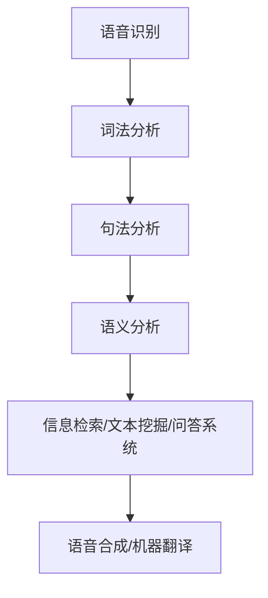

# 案例二：自然语言处理任务

## 1.背景介绍

自然语言处理(Natural Language Processing, NLP)是人工智能领域的一个重要分支,旨在让计算机能够理解和生成人类语言。随着大数据时代的到来,海量的非结构化文本数据激增,对自然语言处理技术的需求与日俱增。自然语言处理广泛应用于机器翻译、智能问答系统、信息检索、情感分析等领域,为人类高效处理大量文本信息提供了有力支持。

## 2.核心概念与联系

自然语言处理涉及多个核心概念,包括:

1. **语音识别(Speech Recognition)**: 将语音信号转换为文本的过程。

2. **词法分析(Lexical Analysis)**: 将文本拆分为单词、标点符号等词素的过程。

3. **句法分析(Syntactic Analysis)**: 确定句子中单词之间的语法关系。

4. **语义分析(Semantic Analysis)**: 理解句子的实际含义。

5. **语音合成(Speech Synthesis)**: 将文本转换为语音的过程。

6. **机器翻译(Machine Translation)**: 将一种自然语言转换为另一种语言。

7. **信息检索(Information Retrieval)**: 从大量文本数据中检索相关信息。

8. **文本挖掘(Text Mining)**: 从大量非结构化文本中发现有价值的模式和知识。

9. **问答系统(Question Answering System)**: 针对用户提出的自然语言问题给出准确答复。

这些概念相互关联,共同构建了自然语言处理的完整流程。



## 3.核心算法原理具体操作步骤

自然语言处理任务通常包括以下核心算法步骤:

### 3.1 文本预处理

1. **标记化(Tokenization)**: 将文本拆分为单词、标点符号等词素。
2. **去除停用词(Stop Words Removal)**: 移除常见的无意义词语,如"的"、"了"等。
3. **词干提取(Stemming)**: 将单词还原为词根形式,如"playing"还原为"play"。
4. **词性标注(Part-of-Speech Tagging)**: 为每个词素标注其词性,如名词、动词等。

### 3.2 特征提取

1. **TF-IDF(Term Frequency-Inverse Document Frequency)**: 计算每个词语在文档中的重要性。
2. **Word Embedding**: 将单词映射到低维向量空间,保留语义信息。
3. **N-gram模型**: 基于历史上N-1个词预测下一个词的概率模型。

### 3.3 模型训练

1. **监督学习模型**: 使用标注好的训练数据,如朴素贝叶斯、决策树、支持向量机等。
2. **非监督学习模型**: 无需标注数据,如聚类、主题模型等。
3. **深度学习模型**: 利用神经网络自动提取特征,如卷积神经网络、循环神经网络等。

### 3.4 模型评估与优化

1. 选择合适的评估指标,如准确率、F1值、困惑度等。
2. 通过调整超参数、特征工程、模型集成等方式优化模型性能。

## 4.数学模型和公式详细讲解举例说明

自然语言处理中常用的数学模型和公式包括:

### 4.1 N-gram模型

N-gram模型是一种基于统计的语言模型,用于预测下一个词的概率。其基本思想是:一个词的出现概率仅取决于前面的 N-1 个词。

对于长度为 m 的句子 $W = w_1, w_2, ..., w_m$,其概率可以表示为:

$$P(W) = \prod_{i=1}^{m}P(w_i|w_1,...,w_{i-1})$$

由于计算复杂度太高,通常使用 N-gram 近似:

$$P(W) \approx \prod_{i=1}^{m}P(w_i|w_{i-N+1},...,w_{i-1})$$

其中,$P(w_i|w_{i-N+1},...,w_{i-1})$ 是 N-gram 概率,可以通过训练语料库估计得到。

### 4.2 TF-IDF

TF-IDF(Term Frequency-Inverse Document Frequency)是一种常用的特征加权技术,用于评估一个词对于一个文档集或语料库中的一个文档的重要程度。

对于词语 $t$ 和文档 $d$,TF-IDF 定义为:

$$\text{tfidf}(t,d) = \text{tf}(t,d) \times \text{idf}(t)$$

其中:

- $\text{tf}(t,d)$ 是词频(Term Frequency),表示词语 $t$ 在文档 $d$ 中出现的次数。
- $\text{idf}(t) = \log\frac{N}{\text{df}(t)}$ 是逆向文档频率(Inverse Document Frequency),其中 $N$ 是语料库中文档的总数,$\text{df}(t)$ 是包含词语 $t$ 的文档数量。

$\text{idf}(t)$ 的作用是降低常见词语的权重,提高稀有词语的权重。

### 4.3 Word Embedding

Word Embedding 是将单词映射到低维实数向量空间的技术,使得语义相似的词语在向量空间中彼此靠近。常用的 Word Embedding 模型有 Word2Vec 和 GloVe 等。

以 Word2Vec 的 Skip-gram 模型为例,给定中心词 $w_c$ 和上下文窗口大小 $m$,目标是最大化上下文词 $w_{c-m}, ..., w_{c-1}, w_{c+1}, ..., w_{c+m}$ 的对数似然:

$$\max_{\theta} \frac{1}{T}\sum_{t=1}^{T}\sum_{-m \leq j \leq m, j \neq 0}\log P(w_{t+j}|w_t;\theta)$$

其中,$\theta$ 是模型参数,$T$ 是语料库中的词语个数。$P(w_{t+j}|w_t;\theta)$ 是 Softmax 函数:

$$P(w_O|w_I) = \frac{\exp(v_{w_O}^{\top}v_{w_I})}{\sum_{w=1}^{V}\exp(v_w^{\top}v_{w_I})}$$

$v_w$ 和 $v_{w_I}$ 分别是词语 $w$ 和 $w_I$ 的向量表示,$V$ 是词汇表大小。通过训练,语义相似的词语会获得相近的向量表示。

## 5.项目实践: 代码实例和详细解释说明

以下是一个使用 Python 和 NLTK 库进行文本分类的示例:

```python
import nltk
from nltk.corpus import stopwords
from nltk.stem import PorterStemmer
from nltk.tokenize import word_tokenize
from sklearn.feature_extraction.text import TfidfVectorizer
from sklearn.naive_bayes import MultinomialNB

# 加载数据
texts = [...] # 文本列表
labels = [...] # 标签列表

# 预处理
stop_words = set(stopwords.words('english'))
stemmer = PorterStemmer()

processed_texts = []
for text in texts:
    tokens = word_tokenize(text.lower())
    filtered_tokens = [stemmer.stem(token) for token in tokens if token not in stop_words]
    processed_texts.append(' '.join(filtered_tokens))

# 特征提取
vectorizer = TfidfVectorizer()
X = vectorizer.fit_transform(processed_texts)

# 模型训练
model = MultinomialNB()
model.fit(X, labels)

# 模型评估和预测
accuracy = model.score(X, labels)
print(f'Accuracy: {accuracy:.2f}')

new_text = '...' # 新文本
processed_new_text = ' '.join([stemmer.stem(token) for token in word_tokenize(new_text.lower()) if token not in stop_words])
new_text_vector = vectorizer.transform([processed_new_text])
prediction = model.predict(new_text_vector)[0]
print(f'Prediction: {prediction}')
```

代码解释:

1. 导入所需的库。
2. 加载文本数据和标签。
3. 预处理文本:转换为小写、标记化、去除停用词和词干提取。
4. 使用 TfidfVectorizer 将文本转换为 TF-IDF 特征向量。
5. 使用朴素贝叶斯分类器(MultinomialNB)训练模型。
6. 评估模型在训练数据上的准确率。
7. 对新文本进行预处理,并使用训练好的模型进行预测。

## 6.实际应用场景

自然语言处理技术在以下领域有广泛的应用:

1. **机器翻译**: 谷歌翻译、百度翻译等,实现跨语言的自动翻译。
2. **智能问答系统**: 如苹果的 Siri、亚马逊的 Alexa、微软的 Cortana 等,可以回答用户提出的自然语言问题。
3. **文本分类**: 如新闻分类、垃圾邮件过滤、情感分析等,将文本划分到预定义的类别中。
4. **信息检索**: 如网页搜索引擎、知识库查询等,从海量文本数据中检索相关信息。
5. **自动摘要**: 自动生成文本的摘要,提高信息获取效率。
6. **对话系统**: 如客服机器人、智能助手等,与用户进行自然语言对话交互。
7. **关系提取**: 从文本中自动识别实体之间的关系,构建知识图谱。

## 7.工具和资源推荐

以下是一些常用的自然语言处理工具和资源:

1. **NLTK**: 领先的 Python 自然语言处理库,提供预处理、标注、分类等功能。
2. **SpaCy**: 高性能的 Python 自然语言处理库,支持多种语言。
3. **Hugging Face Transformers**: 基于 Transformer 的自然语言处理预训练模型库。
4. **Stanford CoreNLP**: 斯坦福大学开发的 Java 自然语言处理工具包。
5. **BERT**: 谷歌开源的预训练语言模型,在多项任务上取得了优异表现。
6. **Word2Vec**: 高效的词嵌入工具,可以学习词语的语义向量表示。
7. **Kaggle 数据集**: 包含多个自然语言处理任务的标注数据集。
8. **语料库**: 如布朗语料库、宾州树库等,提供大量标注语料用于训练和评估模型。

## 8.总结: 未来发展趋势与挑战

自然语言处理是一个充满挑战的领域,未来的发展趋势包括:

1. **预训练语言模型**: 利用大规模无监督语料库预训练通用语言模型,再通过微调应用到下游任务,有望进一步提升性能。
2. **多模态学习**: 融合文本、图像、视频等多种模态的信息,实现更全面的理解和生成能力。
3. **Few-shot 学习**: 在有限的标注数据下快速学习新任务,降低数据标注成本。
4. **可解释性**: 提高模型的可解释性,使预测结果更加透明和可信。
5. **鲁棒性**: 增强模型对噪声、对抗样本等的鲁棒性,提高在实际应用中的可靠性。
6. **知识融合**: 将结构化知识和常识融入自然语言处理模型中,提升理解和推理能力。

与此同时,自然语言处理也面临一些挑战,如:

1. **语义理解**: 准确捕捉语言的隐含意义和上下文信息,深入理解语义。
2. **长期依赖**: 有效捕捉长距离的语义依赖关系,提高对长文本的处理能力。
3. **多语言支持**: 为多种语言提供高质量的自然语言处理服务。
4. **算力和数据需求**: 大规模预训练模型对计算资源和数据的需求巨大。
5. **隐私和安全**: 确保个人隐私不受侵犯,防止生成有害或不当内容。

未来,自然语言处理技术必将在人机交互、智能助理、内容生成等领域发挥越来越重要的作用。

## 9.附录: 常见问题与解答

1. **什么是自然语言处理?**

自然语言处理(NLP)是人工智能的一个分支,旨在让计算机能够理解和生成人类语言。它涉及多个子任务,如语音识别、词法分析、句法分析、语义分析、机器