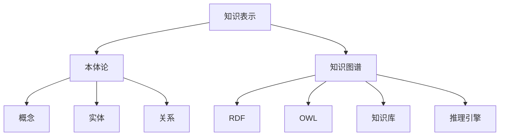

# 知识表示与知识图谱原理与代码实战案例讲解

## 1.背景介绍

### 1.1 知识表示的重要性

在当今信息时代,数据和知识是企业和组织最宝贵的资产之一。有效地表示和管理知识对于各种应用程序至关重要,包括智能系统、语义搜索、推理和决策支持系统等。传统的数据库系统主要关注结构化数据的存储和检索,但它们无法很好地处理复杂的、异构的和语义丰富的知识。因此,需要一种新的范式来表示和管理知识,这就是知识表示和知识图谱的用武之地。

### 1.2 知识图谱概述

知识图谱是一种结构化的知识表示形式,它将实体(entities)、概念(concepts)和它们之间的关系(relations)以图形化的方式表示出来。知识图谱不仅能够存储事实数据,还能捕获语义信息和背景知识,从而支持更高级的推理和决策。知识图谱已被广泛应用于各种领域,如搜索引擎、问答系统、推荐系统、医疗保健和金融服务等。

## 2.核心概念与联系



知识表示是指将知识以某种形式存储和组织的过程,以便于计算机系统理解和操作。本体论(Ontology)是知识表示的一种重要形式,它定义了一个领域内的概念、实体、属性和它们之间的关系。

知识图谱是一种基于图形的知识表示方式,它使用节点(nodes)表示实体和概念,使用边(edges)表示它们之间的关系。常用的知识图谱表示语言包括RDF(Resource Description Framework)和OWL(Web Ontology Language)。

知识图谱通常与知识库(Knowledge Base)相关联,知识库是存储知识图谱数据的存储库。推理引擎(Reasoning Engine)则是用于从知识库中推导新知识的工具,它基于一组规则和算法对知识进行推理和查询。

## 3.核心算法原理具体操作步骤

构建知识图谱通常包括以下几个主要步骤:

### 3.1 实体识别和链接

实体识别是指从非结构化文本中识别出实体(如人物、地点、组织等),实体链接则是将这些实体与知识库中的现有实体进行匹配和链接。这个过程通常涉及到命名实体识别(Named Entity Recognition, NER)和实体链接(Entity Linking)等自然语言处理技术。

### 3.2 关系抽取

关系抽取是指从文本中识别出实体之间的语义关系,例如"出生于"、"工作于"、"位于"等。这个过程通常涉及到关系抽取(Relation Extraction)算法,如基于监督学习的统计模型或基于规则的方法。

### 3.3 本体构建

本体是知识图谱的基础,它定义了领域内的概念、实体、属性和它们之间的关系。本体构建通常是一个半自动化的过程,需要领域专家和知识工程师的参与。常用的本体构建工具包括Protégé、TopBraid Composer等。

### 3.4 知识融合

由于知识可能来自多个异构的数据源,因此需要将这些知识进行融合和整合。这个过程涉及到实体解析、数据清洗、冲突解决等步骤,以确保知识的一致性和完整性。

### 3.5 知识存储和查询

构建好的知识图谱需要存储在知识库中,以便于查询和推理。常用的知识库包括基于RDF的三元组存储(如Jena、Virtuoso)和基于图数据库的存储(如Neo4j、Amazon Neptune)。查询语言通常采用SPARQL,它是一种用于查询和操作RDF数据的语言。

### 3.6 推理和应用

知识图谱的真正价值在于支持推理和应用。推理引擎可以基于一组规则和算法从知识库中推导出新的知识。应用层则利用知识图谱提供各种智能服务,如问答系统、推荐系统、决策支持系统等。

## 4.数学模型和公式详细讲解举例说明

在知识图谱的构建和推理过程中,涉及到一些数学模型和算法,下面将详细介绍其中的一些重要模型和公式。

### 4.1 TransE模型

TransE是一种用于知识图谱表示学习的经典模型,它将实体和关系映射到低维向量空间中,并通过简单的向量运算来模拟三元组(head, relation, tail)之间的关系。

对于一个三元组$(h, r, t)$,TransE模型的目标是使得:

$$\vec{h} + \vec{r} \approx \vec{t}$$

其中$\vec{h}$、$\vec{r}$和$\vec{t}$分别表示头实体、关系和尾实体的向量表示。

TransE模型的目标函数定义为:

$$L = \sum_{(h,r,t) \in S} \sum_{(h',r',t') \in S'} [\gamma + d(\vec{h} + \vec{r}, \vec{t}) - d(\vec{h'} + \vec{r'}, \vec{t'})]_+$$

其中$S$是训练集中的三元组集合,$S'$是负采样得到的三元组集合,$\gamma$是边距超参数,$ d(\cdot)$是距离函数(如$L_1$范数或$L_2$范数),$ [\cdot]_+$是正值函数。

通过优化该目标函数,TransE模型可以学习出实体和关系的向量表示,从而支持知识图谱的各种应用。

### 4.2 Node2Vec模型

Node2Vec是一种用于学习图结构数据中节点表示的算法,它可以捕获节点的结构信息和语义信息。Node2Vec基于Word2Vec模型,将图结构中的随机游走序列视为语料库,并学习节点的向量表示。

Node2Vec算法的核心思想是通过设计一个随机游走策略来平衡广度优先搜索(BFS)和深度优先搜索(DFS)的探索,从而捕获节点的多尺度邻域结构信息。具体来说,Node2Vec定义了一个参数$p$和$q$,分别控制游走过程中重新访问已访问节点的概率和访问新节点的概率。

对于一个节点$v$,Node2Vec算法首先执行多次随机游走,得到多个游走序列$\{S_1, S_2, \ldots, S_r\}$。然后,将这些序列视为语料库,并使用Skip-Gram模型最大化目标函数:

$$\max_f \sum_{v \in V} \log \operatorname{Pr}(\{N(v) \mid f(v)\})$$

其中$f$是将节点映射到向量空间的函数,$N(v)$是节点$v$的邻居节点集合。

通过优化该目标函数,Node2Vec可以学习出节点的向量表示,这些向量表示可以用于各种图数据挖掘任务,如节点分类、链接预测和聚类等。

## 5.项目实践:代码实例和详细解释说明

为了更好地理解知识图谱的构建和应用,我们将通过一个实际项目案例来演示相关的代码实现。在这个案例中,我们将使用Python和一些开源库(如RDFLib、OWLRL等)来构建一个简单的知识图谱,并进行基本的查询和推理操作。

### 5.1 定义本体

首先,我们需要定义知识图谱的本体,描述领域内的概念、实体、属性和关系。下面是一个简单的本体定义示例,使用OWL语言:

```python
from owlready2 import *

# 创建一个新的本体
onto = get_ontology("http://example.org/university.owl")

# 定义类
with onto:
    class Person(Thing):
        pass

    class Student(Person):
        pass

    class Professor(Person):
        pass

    class Course(Thing):
        pass

    class Department(Thing):
        pass

    # 定义对象属性
    teaches = ObjectProperty(domain=Professor, range=Course)
    takes = ObjectProperty(domain=Student, range=Course)
    belongs_to = ObjectProperty(domain=Person, range=Department)

    # 定义数据属性
    age = DataProperty(domain=Person, range=int)
    name = DataProperty(domain=Thing, range=str)

# 保存本体
onto.save("university.owl", format="rdfxml")
```

在这个示例中,我们定义了`Person`、`Student`、`Professor`、`Course`和`Department`等类,以及`teaches`、`takes`、`belongs_to`等对象属性和`age`、`name`等数据属性。最后,我们将本体保存为OWL文件。

### 5.2 构建知识图谱

接下来,我们将基于上面定义的本体来构建知识图谱,添加实体和断言:

```python
from owlready2 import *

# 加载本体
onto = get_ontology("university.owl").load()

# 创建实体
with onto:
    john = Professor("John")
    mary = Student("Mary")
    cs101 = Course("CS101")
    cs_dept = Department("Computer Science")

    # 添加断言
    john.teaches.append(cs101)
    mary.takes.append(cs101)
    john.belongs_to.append(cs_dept)
    mary.belongs_to.append(cs_dept)
    john.age = 45
    mary.age = 20

# 保存知识图谱
onto.save("university_kb.owl", format="rdfxml")
```

在这个示例中,我们创建了`John`(教授)、`Mary`(学生)、`CS101`(课程)和`Computer Science`(系)等实体,并添加了一些断言,如`John`教授`CS101`课程,`Mary`选修`CS101`课程,`John`和`Mary`都属于计算机系等。最后,我们将知识图谱保存为OWL文件。

### 5.3 查询和推理

有了知识图谱后,我们就可以进行查询和推理操作了。下面是一些示例代码:

```python
from owlready2 import *

# 加载知识图谱
onto = get_ontology("university_kb.owl").load()

# 查询所有教授
professors = onto.search(type=onto.Professor)
print("Professors:")
for p in professors:
    print(p.name)

# 查询Mary所选修的课程
mary = onto.search_one(name="Mary")
courses = mary.takes
print(f"\nMary takes courses:")
for c in courses:
    print(c.name)

# 推理: 查询所有学生
sync_reasoner()
students = onto.search(type=onto.Student)
print("\nStudents:")
for s in students:
    print(s.name)
```

在这个示例中,我们首先加载了之前保存的知识图谱。然后,我们执行了以下操作:

1. 查询所有教授实体
2. 查询`Mary`所选修的课程
3. 使用推理引擎推导出所有学生实体

通过这些示例,你可以看到如何使用Python和OWL库来构建、保存、查询和推理知识图谱。当然,在实际应用中,知识图谱往往会更加复杂,需要处理更多的实体、关系和规则。但是,基本的原理和流程是相似的。

## 6.实际应用场景

知识图谱在许多领域都有广泛的应用,下面是一些典型的应用场景:

### 6.1 智能问答系统

知识图谱可以为问答系统提供结构化的知识库,支持自然语言问题的理解和答案的生成。例如,IBM Watson、Wolfram Alpha等智能问答系统都使用了知识图谱技术。

### 6.2 推荐系统

知识图谱可以捕获实体之间的语义关联,从而为推荐系统提供更丰富的背景知识。例如,亚马逊的产品推荐系统就利用了知识图谱技术。

### 6.3 生物医疗领域

在生物医疗领域,知识图谱可以整合来自不同数据源的基因、蛋白质、疾病等信息,支持药物发现、精准医疗等应用。例如,Genia知识库就是一个生物医学知识图谱。

### 6.4 金融服务

知识图谱可以帮助金融机构整合客户、产品、风险等信息,支持风险管理、反欺诈、投资决策等应用。例如,花旗银行就在使用知识图谱技术。

### 6.5 智能搜索

知识图谱可以增强搜索引擎的语义理解能力,提供更准确、更相关的搜索结果。谷歌、