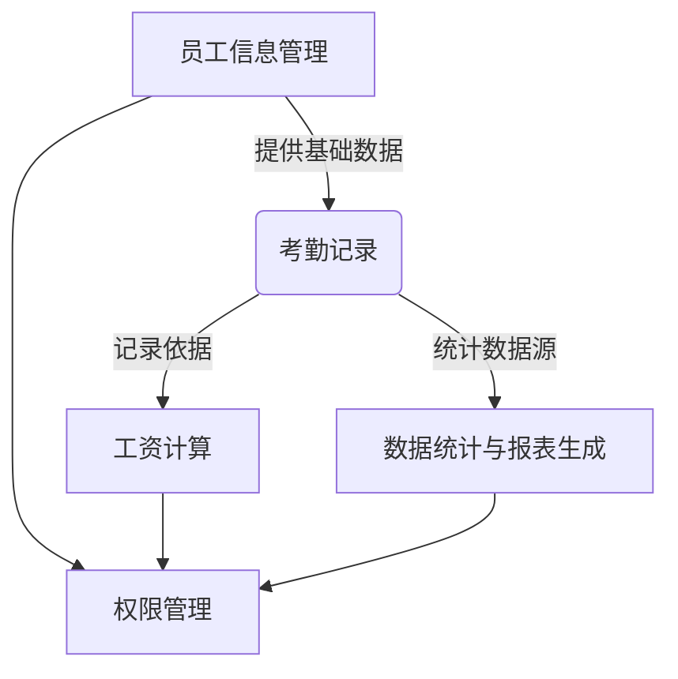

# 考勤管理系统详细设计与具体代码实现

## 1.背景介绍

随着企业规模的不断扩大和人力资源管理的日益复杂化,构建一个高效、可靠的考勤管理系统已经成为当前企业的迫切需求。考勤管理系统不仅能够精准记录员工的上下班时间、加班情况等,还可以自动计算工资、统计各类数据报表,为企业的决策提供依据。因此,设计并实现一个功能完备、易于使用的考勤管理系统,对于提高企业运营效率、降低人力成本具有重要意义。

## 2.核心概念与联系

考勤管理系统的核心概念包括:

1. **员工信息管理**: 维护员工的基本信息、职位、部门、工资等数据。
2. **考勤记录**: 准确记录员工的上下班打卡时间、迟到、早退、加班等情况。
3. **工资计算**: 根据考勤记录和工资规则,自动计算员工的工资。
4. **数据统计与报表生成**: 统计各类考勤数据,生成报表以供分析和决策。
5. **权限管理**: 对不同角色的用户设置合理的操作权限。

这些核心概念相互关联、相互影响。员工信息是考勤记录的基础,考勤记录又是工资计算的依据,而数据统计和报表生成则需要依赖员工信息和考勤记录。权限管理则贯穿整个系统,确保数据安全和操作有序。



## 3.核心算法原理具体操作步骤

### 3.1 考勤记录算法

考勤记录算法的主要任务是根据员工的打卡记录,判断其考勤状态(正常、迟到、早退、加班等),并记录相应的时间段。算法流程如下:

1. 获取员工的上下班时间规则(上班时间、下班时间等)
2. 遍历员工的打卡记录
3. 对每条打卡记录:
    - 如果打卡时间在上班时间之前,则记录为正常上班
    - 如果打卡时间在上班时间之后,则记录为迟到,并计算迟到时长
    - 如果打卡时间在下班时间之前,则记录为早退,并计算早退时长
    - 如果打卡时间在下班时间之后,则记录为加班,并计算加班时长
4. 根据规则,合并相邻的考勤状态时间段
5. 将最终的考勤记录存储到数据库中

### 3.2 工资计算算法

工资计算算法需要根据员工的考勤记录、工资级别等信息,准确计算其应得工资。算法流程如下:

1. 获取员工的基本工资、加班费率等工资规则
2. 从数据库获取员工当月的考勤记录
3. 遍历考勤记录,累计计算正常工作时长、加班时长等
4. 根据工资规则,计算员工的:
    - 基本工资 = 基本工资
    - 加班工资 = 加班时长 * 加班费率
    - 扣款(如有迟到、早退等) 
5. 员工应得工资 = 基本工资 + 加班工资 - 扣款
6. 将计算结果存储到数据库中

## 4.数学模型和公式详细讲解举例说明

在考勤管理系统中,一些关键计算需要使用数学模型和公式,下面将详细讲解其中的一些核心公式:

### 4.1 工作时长计算

假设员工的考勤记录为一系列时间段 $T = \{(t_1^{start}, t_1^{end}), (t_2^{start}, t_2^{end}), \ldots, (t_n^{start}, t_n^{end})\}$,其中 $t_i^{start}$ 和 $t_i^{end}$ 分别表示第 i 个时间段的开始和结束时间。

则员工的总工作时长可以计算为:

$$
\text{总工作时长} = \sum_{i=1}^{n}(t_i^{end} - t_i^{start})
$$

例如,假设一个员工的考勤记录为:

- 08:30 - 12:00 (上午工作)
- 13:30 - 18:00 (下午工作)
- 19:00 - 21:30 (加班)

则该员工的总工作时长为:

$$
\begin{aligned}
\text{总工作时长} &= (12:00 - 08:30) + (18:00 - 13:30) + (21:30 - 19:00) \\
                &= 3.5 + 4.5 + 2.5 \\
                &= 10.5 \text{小时}
\end{aligned}
$$

### 4.2 加班工资计算

假设员工的基本工资为 $B$,加班费率为 $R$ (即加班 1 小时的工资为基本工资的 $R$ 倍),加班时长为 $O$,则该员工的加班工资可以计算为:

$$
\text{加班工资} = B \times R \times O
$$

例如,假设一个员工的基本工资为 8000 元/月,加班费率为 1.5 倍,当月加班时长为 20 小时,则该员工的加班工资为:

$$
\begin{aligned}
\text{加班工资} &= 8000 \times 1.5 \times \frac{20}{(8 \times 21.75)} \\
                &= 12000 \times \frac{20}{174} \\
                &= 1379 \text{元}
\end{aligned}
$$

其中, $(8 \times 21.75)$ 为按照每月平均 21.75 个工作日,每天工作 8 小时计算的月工作总时长。

## 5.项目实践: 代码实例和详细解释说明

为了更好地理解考勤管理系统的实现,下面将给出一些核心代码示例,并进行详细说明。

### 5.1 员工信息管理

```python
class Employee:
    def __init__(self, id, name, department, position, base_salary):
        self.id = id
        self.name = name 
        self.department = department
        self.position = position
        self.base_salary = base_salary

class EmployeeManager:
    def __init__(self):
        self.employees = {}

    def add_employee(self, employee):
        self.employees[employee.id] = employee

    def remove_employee(self, id):
        if id in self.employees:
            del self.employees[id]

    def get_employee(self, id):
        if id in self.employees:
            return self.employees[id]
        else:
            return None
```

在上面的代码中,我们定义了 `Employee` 类来表示员工的基本信息,包括员工ID、姓名、部门、职位和基本工资。`EmployeeManager` 类则用于管理员工信息,提供了添加、删除和获取员工信息的方法。

### 5.2 考勤记录管理

```python
from datetime import datetime, timedelta

class AttendanceRecord:
    def __init__(self, employee_id, date, clock_in, clock_out):
        self.employee_id = employee_id
        self.date = date
        self.clock_in = clock_in
        self.clock_out = clock_out

class AttendanceManager:
    def __init__(self, work_start, work_end):
        self.work_start = work_start
        self.work_end = work_end
        self.records = {}

    def add_record(self, record):
        date = record.date.strftime('%Y-%m-%d')
        if date not in self.records:
            self.records[date] = []
        self.records[date].append(record)

    def calculate_attendance(self, employee_id, date):
        records = self.records.get(date.strftime('%Y-%m-%d'), [])
        work_duration = timedelta()
        late_duration = timedelta()
        early_leave_duration = timedelta()
        overtime_duration = timedelta()

        for record in records:
            if record.employee_id == employee_id:
                clock_in = max(record.clock_in, self.work_start)
                clock_out = min(record.clock_out, self.work_end)
                work_duration += clock_out - clock_in
                late_duration += max(clock_in - self.work_start, timedelta())
                early_leave_duration += max(self.work_end - clock_out, timedelta())
                overtime_duration += max(record.clock_out - self.work_end, timedelta())

        return {
            'work_duration': work_duration,
            'late_duration': late_duration,
            'early_leave_duration': early_leave_duration,
            'overtime_duration': overtime_duration
        }
```

在上面的代码中,我们定义了 `AttendanceRecord` 类来表示一条考勤记录,包括员工ID、日期、上班打卡时间和下班打卡时间。`AttendanceManager` 类则用于管理考勤记录,提供了添加记录和计算考勤情况的方法。

`calculate_attendance` 方法根据员工的打卡记录和工作时间规则,计算出该员工的工作时长、迟到时长、早退时长和加班时长。

### 5.3 工资计算

```python
from datetime import timedelta

class PayrollCalculator:
    def __init__(self, base_salary_rules, overtime_rate):
        self.base_salary_rules = base_salary_rules
        self.overtime_rate = overtime_rate

    def calculate_payroll(self, employee, attendance_data, date):
        base_salary = self.base_salary_rules.get(employee.position, 0)
        work_duration = attendance_data['work_duration']
        overtime_duration = attendance_data['overtime_duration']

        regular_pay = base_salary
        overtime_pay = (base_salary / timedelta(days=21.75*8).total_seconds()) * overtime_duration.total_seconds() * self.overtime_rate

        return {
            'regular_pay': regular_pay,
            'overtime_pay': overtime_pay,
            'total_pay': regular_pay + overtime_pay
        }
```

在上面的代码中,我们定义了 `PayrollCalculator` 类来计算员工的工资。它需要提供基本工资规则和加班费率作为输入。

`calculate_payroll` 方法根据员工的基本信息、考勤数据和日期,计算该员工的基本工资、加班工资和总工资。其中,基本工资由基本工资规则确定,加班工资则根据加班时长和加班费率计算得出。

## 6.实际应用场景

考勤管理系统在现实生活中有着广泛的应用场景,包括但不限于:

1. **企业人力资源管理**: 企业可以使用考勤管理系统来精准记录员工的上下班时间、加班情况等,并自动计算工资,提高管理效率。

2. **政府机构和事业单位**: 政府部门和事业单位也需要对员工进行考勤管理,确保工作时间的合理性和工资的公平性。

3. **学校教育机构**: 学校可以使用考勤管理系统来记录教职工的上下班情况,并根据工作时长计算相应的工资。

4. **服务行业**: 一些服务行业(如餐饮、零售等)的员工工作时间较为灵活,考勤管理系统可以帮助企业更好地管理员工的工作时间和薪酬。

5. **智能楼宇管理**: 在智能楼宇中,考勤管理系统可以与门禁系统、视频监控系统等集成,实现自动化的考勤管理。

总的来说,任何需要对员工进行时间和薪酬管理的组织或企业,都可以从考勤管理系统中获益。

## 7.工具和资源推荐

在实现考勤管理系统时,可以使用各种编程语言和框架,下面列出了一些常用的工具和资源:

1. **Python**: Python 是一种通用编程语言,具有简洁的语法和丰富的第三方库,非常适合快速开发。可以使用 Flask 或 Django 等 Web 框架来构建考勤管理系统的后端。

2. **Java**: Java 是一种广泛使用的企业级编程语言,具有良好的可移植性和安全性。可以使用 Spring 框架和 Hibernate ORM 等工具来开发考勤管理系统。

3. **JavaScript**: JavaScript 是前端开发的核心语言,可以配合 React、Angular 或 Vue 等框架来构建考勤管理系统的前端界面。

4. **数据库**: 可以使用关系型数据库(如 MySQL、PostgreSQL)或 NoSQL 数据库(如 MongoDB)来存储员工信息、考勤记录和工资数据。

5. **版本控制工具**: 使用 Git 等版本控制工具可以更好地管理代码,支持团队协作开发。

6. **项目管理工具**: 可以使用 Jira、Trello 等项目管理工具来规划任务、跟踪进度和协调团队工作。

7. **云服务**: 考虑使用云