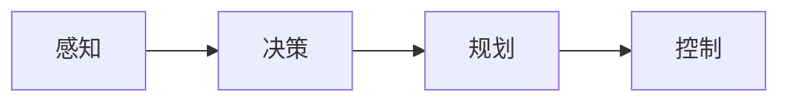

# AI人工智能 Agent：在无人驾驶中的应用

## 1. 背景介绍

### 1.1 无人驾驶技术的兴起

近年来，随着人工智能技术的飞速发展，无人驾驶技术受到了越来越多的关注。无人驾驶汽车利用计算机视觉、雷达、GPS等传感器实时感知道路环境，通过人工智能算法自主规划行驶路线并控制车辆，有望大幅提高交通效率和安全性，彻底改变未来交通出行方式。

### 1.2 Agent在无人驾驶中的重要作用

要实现无人驾驶，车辆必须能够像人一样观察分析路况，做出正确驾驶决策。这就需要赋予无人车智能Agent的能力。Agent作为无人驾驶系统的核心，负责感知、决策、规划、控制等关键任务，是实现无人驾驶的关键。

### 1.3 本文的主要内容

本文将重点探讨AI Agent在无人驾驶领域的应用。首先介绍Agent的核心概念和与无人驾驶的关系；然后讲解Agent的关键算法；接着通过数学模型和代码实例说明如何实现Agent；并分析Agent在无人驾驶中的实际应用场景。最后，展望Agent技术在无人驾驶领域的发展趋势与面临的挑战。

## 2. 核心概念与联系

### 2.1 Agent的定义与特点

Agent是一个可以感知环境并自主行动以达成目标的实体。与传统程序相比，Agent具有自主性、社会性、反应性、主动性等特点。Agent可以根据感知到的环境状态，自主地做出决策与行动，无需人工干预。

### 2.2 马尔可夫决策过程(MDP)

马尔可夫决策过程是理解Agent的重要理论基础。MDP由状态空间、动作空间、状态转移概率和奖励函数组成，描述了Agent与环境的交互过程。Agent的目标就是寻找一个最优策略函数，使得在MDP中获得的累积奖励最大化。

### 2.3 无人驾驶中的感知、决策、规划、控制

- 感知：通过摄像头、雷达、激光雷达等传感器获取车辆周围的环境信息，如道路、车辆、行人、交通标识等。这是无人驾驶的基础。

- 决策：根据感知到的信息，判断当前状态，基于知识和经验做出行动决策，如加速、减速、变道、停车等。这是无人驾驶的核心。

- 规划：根据决策目标，如行驶路线、到达时间等，规划出一系列的行动序列。这需要考虑道路约束、交通规则、安全等因素。

- 控制：根据规划出的行动序列，控制车辆的油门、刹车、方向盘等执行器，使车辆按计划行驶。这是无人驾驶的执行层面。

Agent技术在无人驾驶中的感知、决策、规划环节都有重要应用。下图展示了Agent在无人驾驶系统中的作用：



## 3. 核心算法原理具体操作步骤

### 3.1 深度强化学习(DRL)

深度强化学习是实现无人驾驶Agent的重要算法。它结合了深度学习和强化学习，可以从原始的高维传感器数据中直接学习控制策略。DRL的一般流程如下：

1. 随机初始化深度神经网络作为Q函数的近似。
2. Agent根据当前状态选择一个动作，通常使用 $\epsilon$-greedy 探索策略。
3. Agent执行动作与环境交互，获得奖励，并观察到新的状态。 
4. 将(状态、动作、奖励、新状态)的四元组存储到经验回放缓冲区中。
5. 从经验回放中随机采样一批四元组，计算Q学习的目标值，即TD目标。
6. 用TD目标和Q函数的当前值的均方差作为损失，通过梯度下降算法更新深度Q网络的参数。
7. 重复步骤2-6，直到收敛。

### 3.2 Deep Q Network (DQN)

DQN是DRL的代表算法之一，实现了用深度神经网络逼近Q函数。DQN在Q学习的基础上加入了两个机制：

- 经验回放(Experience Replay)：用一个缓冲区存储Agent与环境交互的经验数据，之后进行训练时从中随机采样。这样打破了数据的相关性，稳定了训练。

- 目标网络(Target Network)：每隔一定步数将当前的Q网络参数复制给目标网络，用目标网络来计算TD目标。这样避免了目标值发生震荡。

DQN的损失函数为：

$$
L(\theta)=\mathbb{E}_{(s,a,r,s')\sim U(D)}[(r+\gamma \max_{a'}Q(s',a';\theta^-)-Q(s,a;\theta))^2]
$$

其中，$\theta$为当前Q网络参数，$\theta^-$为目标网络参数，$\gamma$为折扣因子。

### 3.3 基于DQN的无人驾驶决策

在无人驾驶中，状态可以是车辆周围的环境信息，如车道线、其他车辆、行人等；动作可以是方向盘转角、油门刹车等控制量；奖励可以根据安全、舒适、效率等指标来设计，如车辆偏离车道、发生碰撞可以给予较大的负奖励，而平稳行驶、快速到达目的地可以给予正奖励。

通过DQN算法，Agent可以学习到一个最优的无人驾驶决策策略，在给定状态下选择最优动作，最终实现安全、高效、舒适的无人驾驶。

## 4. 数学模型和公式详细讲解举例说明

### 4.1 马尔可夫决策过程(MDP)的数学定义

MDP是一个五元组 $M=(S,A,P,R,\gamma)$，其中：

- $S$是有限的状态集合
- $A$是有限的动作集合
- $P$是状态转移概率矩阵，$P(s'|s,a)$表示在状态$s$下执行动作$a$后转移到状态$s'$的概率
- $R$是奖励函数，$R(s,a)$表示在状态$s$下执行动作$a$获得的即时奖励
- $\gamma \in [0,1]$是折扣因子，表示未来奖励的重要程度

在MDP中，Agent的目标是寻找一个最优策略 $\pi^*:S \rightarrow A$，使得从任意状态$s$出发，执行该策略获得的期望累积奖励最大化：

$$
\pi^* = \arg\max_{\pi} \mathbb{E}[\sum_{t=0}^{\infty} \gamma^t R(s_t,\pi(s_t))|s_0=s,\pi] 
$$

### 4.2 Q学习的贝尔曼方程

Q学习是一种常用的强化学习算法，用于估计最优动作值函数 $Q^*(s,a)$，它表示在状态$s$下执行动作$a$，之后遵循最优策略可获得的期望累积奖励：

$$
Q^*(s,a) = \mathbb{E}[R(s,a)+\gamma \max_{a'} Q^*(s',a')|s,a]
$$

上式即为Q学习的贝尔曼方程。Q学习的目标就是不断迭代更新Q值函数，使其收敛到 $Q^*$。

### 4.3 无人驾驶中的MDP建模示例

以一个简单的无人驾驶场景为例，假设状态空间只包含车辆的横向位置(距离车道中心线的偏移)和航向角两个变量，动作空间只包含方向盘转角，奖励函数设置为：

- 若车辆偏离车道则给予-10的奖励
- 否则，车辆偏离中心线越小，获得的奖励越高，最大奖励为+1

那么，无人驾驶的MDP可以表示为：

$$
\begin{aligned}
S &= \{x,\theta | x \in [-1,1], \theta \in [-\pi/4, \pi/4]\} \\
A &= \{\delta | \delta \in [-\pi/6, \pi/6] \} \\
R(s,a) &= \begin{cases}
-10, & \text{if } |x|>1 \\
1-|x|, & \text{otherwise}
\end{cases} \\
P(s'|s,a) &= \text{由车辆动力学模型确定}
\end{aligned}
$$

Agent的目标就是在该MDP中学习一个最优策略，使得车辆能始终稳定行驶在车道中央。DQN算法可以用于求解该问题。

## 5. 项目实践：代码实例和详细解释说明

下面给出一个简单的PyTorch实现的DQN代码示例，用于解决上述无人驾驶问题：

```python
import torch
import torch.nn as nn
import torch.optim as optim
import numpy as np
import random
from collections import deque

# 定义Q网络
class QNetwork(nn.Module):
    def __init__(self, state_size, action_size, hidden_size=64):
        super(QNetwork, self).__init__()
        self.fc1 = nn.Linear(state_size, hidden_size)
        self.relu = nn.ReLU()
        self.fc2 = nn.Linear(hidden_size, action_size)
        
    def forward(self, state):
        x = self.fc1(state)
        x = self.relu(x)
        x = self.fc2(x)
        return x

# 经验回放缓冲区        
class ReplayBuffer:
    def __init__(self, capacity):
        self.buffer = deque(maxlen=capacity)
    
    def push(self, state, action, reward, next_state, done):
        self.buffer.append((state, action, reward, next_state, done))
    
    def sample(self, batch_size):
        experiences = random.sample(self.buffer, batch_size)
        states, actions, rewards, next_states, dones = zip(*experiences)
        return states, actions, rewards, next_states, dones
    
    def __len__(self):
        return len(self.buffer)

# DQN Agent
class DQNAgent:
    def __init__(self, state_size, action_size):
        self.state_size = state_size
        self.action_size = action_size
        self.gamma = 0.99  # 折扣因子
        self.epsilon = 1.0 # 探索概率
        self.epsilon_min = 0.01
        self.epsilon_decay = 0.995
        self.learning_rate = 1e-3
        self.update_freq = 4 # 目标网络更新频率
        
        self.q_net = QNetwork(state_size, action_size)
        self.target_net = QNetwork(state_size, action_size)
        self.optimizer = optim.Adam(self.q_net.parameters(), lr=self.learning_rate)
        self.replay_buffer = ReplayBuffer(10000)
        
        self.update_target_net()
        
    def update_target_net(self):
        self.target_net.load_state_dict(self.q_net.state_dict())
        
    def act(self, state):
        if np.random.rand() <= self.epsilon:
            return random.randrange(self.action_size)
        
        state = torch.FloatTensor(state).unsqueeze(0)
        q_values = self.q_net(state)
        return q_values.argmax().item()
    
    def learn(self, batch_size):
        if len(self.replay_buffer) < batch_size:
            return
        
        states, actions, rewards, next_states, dones = self.replay_buffer.sample(batch_size)
        states = torch.FloatTensor(states)
        actions = torch.LongTensor(actions).unsqueeze(1)
        rewards = torch.FloatTensor(rewards).unsqueeze(1)
        next_states = torch.FloatTensor(next_states)
        dones = torch.FloatTensor(dones).unsqueeze(1)
        
        q_values = self.q_net(states).gather(1, actions)
        next_q_values = self.target_net(next_states).max(1)[0].detach().unsqueeze(1)
        expected_q_values = rewards + self.gamma * next_q_values * (1 - dones)
        
        loss = nn.MSELoss()(q_values, expected_q_values)
        self.optimizer.zero_grad()
        loss.backward()
        self.optimizer.step()
        
        if self.epsilon > self.epsilon_min:
            self.epsilon *= self.epsilon_decay
            
    def train(self, env, num_episodes, batch_size):
        for episode in range(num_episodes):
            state = env.reset()
            done = False
            total_reward = 0
            
            while not done:
                action = self.act(state)
                next_state, reward, done, _ = env.step(action)
                self.replay_buffer.push(state, action, reward, next_state, done)
                self.learn(batch_size)
                state = next_state
                total_reward += reward
                
            if episode % self