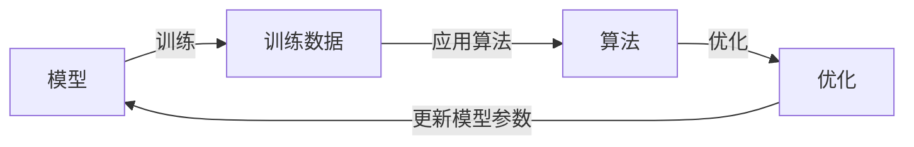

## 1.背景介绍

在过去的十年中，人工智能（AI）在我们的生活中发挥了越来越重要的作用。无论是在搜索引擎、社交媒体、电子商务网站，还是在自动驾驶汽车和智能家居设备中，AI都在不断改变我们的生活方式。然而，AI的核心是什么？是什么使AI如此强大？答案就是模型训练。

模型训练是AI的核心部分，它是通过使用大量的数据和算法来“教”计算机如何完成特定的任务。这个过程可以被看作是一种“学习”，在这个过程中，计算机通过不断的试错和调整，最终找到最优的解决方案。在本文中，我们将深入探讨AI模型训练的核心算法原理，并通过代码实例进行详细的讲解。

## 2.核心概念与联系

在我们开始讨论模型训练的具体步骤之前，我们首先需要理解一些核心的概念。

- **模型（Model）**：在AI中，模型是一个用来描述或预测现象的数学表达式。简单的模型可能只包含几个参数，而复杂的模型可能包含数百万个参数。

- **训练数据（Training Data）**：训练数据是用来训练模型的数据集。这些数据通常包含一些输入（例如图片、文本或声音）和对应的输出（例如标签或类别）。

- **算法（Algorithm）**：算法是一系列用于训练模型的步骤。这些步骤通常包括初始化模型参数、计算模型的预测和真实值之间的差距（也称为损失），以及调整模型参数以减小损失。

- **优化（Optimization）**：优化是寻找最优模型参数的过程。这通常涉及到一种称为梯度下降的技术，该技术通过计算损失函数的梯度来更新模型参数。

这些概念之间的联系可以用下面的Mermaid流程图来表示：



## 3.核心算法原理具体操作步骤

模型训练的过程可以分为以下几个步骤：

1. **数据准备**：首先，我们需要收集并准备训练数据。这可能包括数据清洗、预处理和标签化。

2. **模型初始化**：然后，我们需要选择一个模型并初始化其参数。这通常涉及到随机选择参数值。

3. **前向传播**：在前向传播阶段，我们将训练数据输入到模型中，并计算模型的预测值。

4. **损失计算**：接下来，我们需要计算模型预测值和真实值之间的差距，也就是损失。

5. **反向传播**：在反向传播阶段，我们计算损失函数的梯度，并使用这些梯度来更新模型参数。

6. **参数更新**：最后，我们使用优化算法（如梯度下降）来更新模型参数，以减少损失。

这个过程会反复进行，直到模型的性能达到满意的水平，或者达到预设的迭代次数。

## 4.数学模型和公式详细讲解举例说明

让我们通过一个简单的线性回归模型来说明这个过程。线性回归模型的公式为：

$$
y = wx + b
$$

其中，$y$是模型的预测值，$x$是输入值，$w$和$b$是模型参数。

假设我们的训练数据是一系列的$(x, y)$对，我们的目标是找到$w$和$b$的值，使得模型的预测值$y$尽可能接近真实值$y$。为了衡量预测值和真实值之间的差距，我们可以使用均方误差（MSE）作为损失函数：

$$
L = \frac{1}{n}\sum_{i=1}^{n}(y_i - (wx_i + b))^2
$$

我们的目标是找到$w$和$b$的值，使得$L$最小。这就是一个优化问题，可以使用梯度下降算法来解决。梯度下降算法的基本思想是，如果我们沿着损失函数的梯度方向改变$w$和$b$的值，那么$L$就会减小。梯度下降算法的更新规则为：

$$
w = w - \eta \frac{\partial L}{\partial w}
$$

$$
b = b - \eta \frac{\partial L}{\partial b}
$$

其中，$\eta$是学习率，是一个需要提前设定的超参数。$\frac{\partial L}{\partial w}$和$\frac{\partial L}{\partial b}$是损失函数$L$对$w$和$b$的偏导数，表示$L$在$w$和$b$方向上的梯度。

通过反复进行前向传播、损失计算、反向传播和参数更新，我们就可以逐渐找到最优的$w$和$b$，使得模型的预测值尽可能接近真实值。

## 5.项目实践：代码实例和详细解释说明

让我们通过一个简单的Python代码示例来说明模型训练的过程。在这个示例中，我们将使用Numpy库来实现线性回归模型的训练。

首先，我们需要导入必要的库，并生成一些训练数据。

```python
import numpy as np

# 生成训练数据
np.random.seed(0)
x = np.random.rand(100, 1)
y = 2 * x + 1 + 0.1 * np.random.randn(100, 1)

# 初始化模型参数
w = np.random.rand(1)
b = np.random.rand(1)
```

然后，我们定义前向传播、损失计算和反向传播的函数。

```python
def forward(x, w, b):
    return w * x + b

def compute_loss(y, y_pred):
    return np.mean((y - y_pred) ** 2)

def backward(x, y, y_pred):
    dw = -2 * np.mean((y - y_pred) * x)
    db = -2 * np.mean(y - y_pred)
    return dw, db
```

最后，我们进行模型训练。

```python
lr = 0.1  # 学习率
for i in range(100):  # 迭代100次
    # 前向传播
    y_pred = forward(x, w, b)
    
    # 计算损失
    loss = compute_loss(y, y_pred)
    print(f'Iteration {i}, loss {loss}')
    
    # 反向传播
    dw, db = backward(x, y, y_pred)
    
    # 更新参数
    w -= lr * dw
    b -= lr * db
```

这个代码示例展示了模型训练的基本过程：前向传播、损失计算、反向传播和参数更新。通过反复进行这个过程，我们可以逐渐找到最优的模型参数。

## 6.实际应用场景

模型训练在许多实际应用中都发挥着重要的作用。例如，搜索引擎可以通过模型训练来优化其搜索结果排序；社交媒体可以通过模型训练来推荐用户可能感兴趣的内容；电子商务网站可以通过模型训练来预测用户的购买行为；自动驾驶汽车可以通过模型训练来识别道路上的障碍物和行人；智能家居设备可以通过模型训练来理解用户的语音命令等等。

## 7.工具和资源推荐

如果你对模型训练感兴趣，以下是一些可能对你有用的工具和资源：

- **Python**：Python是一种广泛用于AI和机器学习的编程语言。它有许多强大的库，如Numpy、Pandas、Matplotlib和Scikit-learn，可以帮助你进行数据处理、模型训练和结果可视化。

- **TensorFlow和PyTorch**：TensorFlow和PyTorch是两种流行的深度学习框架，可以帮助你更方便地进行模型训练。

- **Google Colab**：Google Colab是一个在线的Python开发环境，提供了免费的GPU资源，非常适合进行模型训练。

- **Coursera和edX**：Coursera和edX提供了许多优质的在线课程，可以帮助你学习AI和机器学习的基础知识。

## 8.总结：未来发展趋势与挑战

模型训练是AI的核心部分，也是AI能够在各种应用中发挥作用的关键。随着技术的发展，我们可以预见到模型训练将会有以下的发展趋势：

- **数据的重要性**：数据是模型训练的基础，没有数据就没有模型训练。随着大数据的发展，我们将能够获取到更多、更丰富的数据，这将极大地推动模型训练的发展。

- **算法的进步**：虽然我们已经有了许多强大的算法，但是算法的发展仍然是模型训练的重要方向。例如，深度学习是近年来算法发展的一个重要趋势，它已经在图像识别、语音识别和自然语言处理等领域取得了显著的成果。

- **计算能力的提升**：模型训练需要大量的计算资源，因此计算能力的提升将直接影响模型训练的效率和效果。随着GPU、TPU等硬件技术的发展，我们将能够更快、更有效地进行模型训练。

- **模型的解释性**：虽然我们可以通过模型训练得到强大的预测能力，但是模型的解释性仍然是一个挑战。如何理解和解释模型的行为，使其更加透明和可信，将是模型训练未来的一个重要研究方向。

## 9.附录：常见问题与解答

1. **Q: 什么是过拟合和欠拟合？**

   A: 过拟合和欠拟合是模型训练中常见的两种问题。过拟合是指模型在训练数据上表现得过于优秀，但在未见过的测试数据上表现得较差；欠拟合是指模型在训练数据上的表现就已经很差。解决过拟合和欠拟合的方法包括增加数据、使用正则化、调整模型复杂度等。

2. **Q: 什么是梯度消失和梯度爆炸？**

   A: 梯度消失和梯度爆炸是深度学习中常见的两种问题。梯度消失是指在反向传播过程中，梯度的值变得非常小，导致模型参数更新非常缓慢；梯度爆炸是指梯度的值变得非常大，导致模型参数更新过于剧烈，从而影响模型的稳定性。解决这两个问题的方法包括使用激活函数、批量归一化、梯度裁剪等。

3. **Q: 如何选择模型和算法？**

   A: 选择模型和算法需要考虑问题的性质、数据的特性、计算资源的限制等因素。一般来说，没有哪一种模型或算法是适用于所有问题的，需要根据具体情况进行选择和调整。

4. **Q: 如何调整模型参数？**

   A: 调整模型参数是一个试错的过程，需要根据模型在验证集上的表现进行调整。常用的方法包括网格搜索、随机搜索、贝叶斯优化等。

我希望这篇文章能帮助你理解AI模型训练的基本原理和过程。如果你有任何问题或建议，欢迎留言交流。

作者：禅与计算机程序设计艺术 / Zen and the Art of Computer Programming