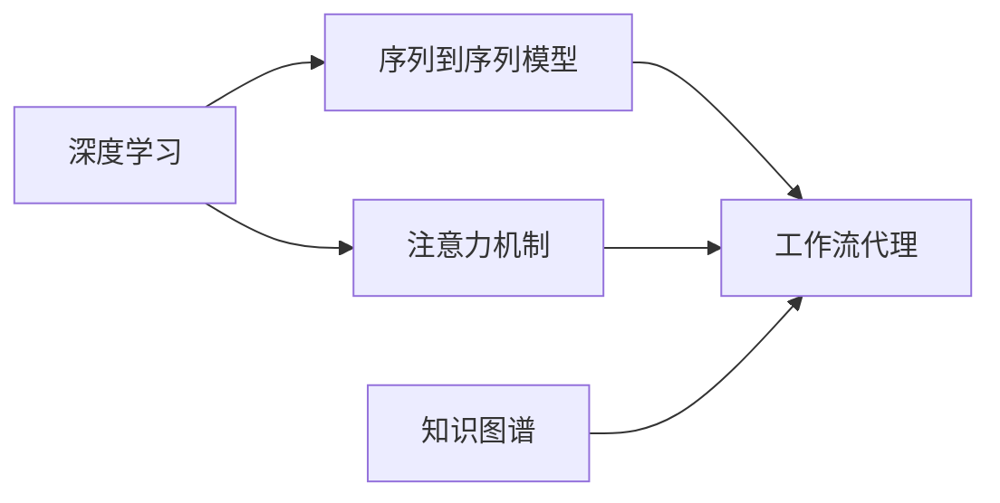

# AI人工智能深度学习算法：自然语言处理在工作流代理中的运用

## 1.背景介绍
### 1.1 人工智能与自然语言处理概述
人工智能(Artificial Intelligence, AI)是计算机科学的一个分支,旨在创造能够执行通常需要人类智能的任务的智能机器。自然语言处理(Natural Language Processing, NLP)是人工智能的一个重要分支,专注于使计算机能够理解、生成和处理人类语言。

### 1.2 工作流代理的兴起
工作流代理(Workflow Agent)是一种新兴的技术,旨在通过自动化和优化业务流程来提高组织的效率和生产力。工作流代理利用人工智能技术,特别是自然语言处理,来理解和执行人类的指令,从而实现业务流程的自动化。

### 1.3 自然语言处理在工作流代理中的应用前景
将自然语言处理技术应用于工作流代理,可以大大提高工作流代理的智能化水平,使其能够更好地理解人类的需求,并自主完成复杂的任务。这将极大地提高组织的效率和生产力,并为企业带来巨大的经济效益。

## 2.核心概念与联系
### 2.1 深度学习
深度学习(Deep Learning)是机器学习的一个分支,它通过使用多层神经网络来学习数据的表示。深度学习在自然语言处理领域取得了显著的成果,如语言模型、机器翻译、情感分析等。

### 2.2 序列到序列模型
序列到序列(Sequence-to-Sequence, Seq2Seq)模型是一种广泛应用于自然语言处理的深度学习模型。它由编码器(Encoder)和解码器(Decoder)两部分组成,能够将一个序列转换为另一个序列。在工作流代理中,Seq2Seq模型可用于将人类的自然语言指令转换为计算机可执行的任务序列。

### 2.3 注意力机制
注意力机制(Attention Mechanism)是一种用于提高序列到序列模型性能的技术。它允许模型在生成输出序列时关注输入序列的不同部分。在工作流代理中,注意力机制可以帮助模型更好地理解人类指令的关键部分,从而生成更准确的任务序列。

### 2.4 知识图谱
知识图谱(Knowledge Graph)是一种结构化的知识表示方法,它将实体及其之间的关系表示为图形结构。在工作流代理中,知识图谱可以用来表示业务流程中的各个任务及其之间的依赖关系,从而帮助模型更好地理解和执行任务。

### 2.5 核心概念之间的联系
下图展示了上述核心概念之间的联系:



## 3.核心算法原理具体操作步骤
### 3.1 Seq2Seq模型
Seq2Seq模型的具体操作步骤如下:

1. 将输入序列传入编码器,编码器将其转换为一个固定长度的向量表示(通常称为上下文向量)。
2. 将上下文向量传入解码器,解码器根据上下文向量和之前生成的词,预测下一个词。
3. 重复步骤2,直到生成完整的输出序列。

### 3.2 注意力机制
注意力机制的具体操作步骤如下:

1. 在每个解码步骤中,计算解码器隐藏状态与编码器所有隐藏状态之间的相似度。
2. 根据相似度对编码器隐藏状态进行加权求和,得到注意力向量。
3. 将注意力向量与解码器隐藏状态拼接,作为解码器的输入,预测下一个词。

### 3.3 知识图谱构建
构建知识图谱的具体操作步骤如下:

1. 定义业务流程中的任务(实体)及其属性。
2. 定义任务之间的关系(如依赖关系、先后顺序等)。
3. 将任务及其关系表示为三元组(主语,谓语,宾语),构建知识图谱。

## 4.数学模型和公式详细讲解举例说明
### 4.1 Seq2Seq模型
Seq2Seq模型可以表示为:

$$p(y_1, ..., y_T | x_1, ..., x_S) = \prod_{t=1}^T p(y_t | y_1, ..., y_{t-1}, c)$$

其中,$x_1, ..., x_S$为输入序列,$y_1, ..., y_T$为输出序列,$c$为上下文向量。

例如,在机器翻译任务中,输入序列可以是"I love you",输出序列可以是"我爱你"。

### 4.2 注意力机制
注意力机制可以表示为:

$$a_t = \sum_{s=1}^S \alpha_{ts} h_s$$

其中,$a_t$为第$t$步的注意力向量,$h_s$为编码器第$s$步的隐藏状态,$\alpha_{ts}$为第$t$步对第$s$步的注意力权重,可以通过下式计算:

$$\alpha_{ts} = \frac{\exp(score(s_t, h_s))}{\sum_{s'=1}^S \exp(score(s_t, h_{s'}))}$$

其中,$s_t$为解码器第$t$步的隐藏状态,$score$为计算相似度的函数,常用的有点积、拼接等。

例如,在机器翻译任务中,注意力机制可以帮助模型在翻译"you"时更关注输入序列中的"你"。

## 5.项目实践：代码实例和详细解释说明
下面是一个使用PyTorch实现Seq2Seq模型的代码示例:

```python
import torch
import torch.nn as nn

class Encoder(nn.Module):
    def __init__(self, input_size, hidden_size):
        super(Encoder, self).__init__()
        self.hidden_size = hidden_size
        self.embedding = nn.Embedding(input_size, hidden_size)
        self.gru = nn.GRU(hidden_size, hidden_size)

    def forward(self, input, hidden):
        embedded = self.embedding(input).view(1, 1, -1)
        output, hidden = self.gru(embedded, hidden)
        return output, hidden

class Decoder(nn.Module):
    def __init__(self, hidden_size, output_size):
        super(Decoder, self).__init__()
        self.hidden_size = hidden_size
        self.embedding = nn.Embedding(output_size, hidden_size)
        self.gru = nn.GRU(hidden_size, hidden_size)
        self.out = nn.Linear(hidden_size, output_size)
        self.softmax = nn.LogSoftmax(dim=1)

    def forward(self, input, hidden):
        output = self.embedding(input).view(1, 1, -1)
        output = F.relu(output)
        output, hidden = self.gru(output, hidden)
        output = self.softmax(self.out(output[0]))
        return output, hidden

class Seq2Seq(nn.Module):
    def __init__(self, encoder, decoder, device):
        super().__init__()
        self.encoder = encoder
        self.decoder = decoder
        self.device = device

    def forward(self, src, trg, teacher_forcing_ratio=0.5):
        batch_size = trg.shape[1]
        trg_len = trg.shape[0]
        trg_vocab_size = self.decoder.output_dim
        outputs = torch.zeros(trg_len, batch_size, trg_vocab_size).to(self.device)
        hidden = self.encoder.initHidden()
        for t in range(1, trg_len):
            output, hidden = self.decoder(input, hidden)
            outputs[t] = output
            teacher_force = random.random() < teacher_forcing_ratio
            top1 = output.argmax(1)
            input = trg[t] if teacher_force else top1
        return outputs
```

代码解释:

1. 定义了编码器`Encoder`和解码器`Decoder`类,它们都继承自`nn.Module`。
2. 编码器使用GRU对输入序列进行编码,将其转换为固定长度的上下文向量。
3. 解码器使用另一个GRU根据上下文向量和之前生成的词,预测下一个词。
4. `Seq2Seq`类将编码器和解码器组合在一起,实现完整的序列到序列模型。
5. 在`forward`方法中,使用`teacher_forcing`技术随机决定是否将真实的目标词作为下一步的输入,以提高训练效率。

## 6.实际应用场景
工作流代理可以应用于各种业务场景,如:

1. 客户服务:通过自然语言交互,自动处理客户询问,提供智能化服务。
2. 销售管理:自动生成销售报告,分析销售数据,优化销售流程。
3. 人力资源:自动处理员工请假、加班等申请,优化人力资源管理流程。
4. 财务管理:自动生成财务报表,分析财务数据,提高财务管理效率。
5. IT运维:自动处理故障工单,监控系统运行状况,提高运维效率。

## 7.工具和资源推荐
以下是一些常用的自然语言处理工具和资源:

1. NLTK:一个Python自然语言处理工具包,提供了常用的NLP算法和数据集。
2. spaCy:一个高性能的Python自然语言处理库,提供了多语言支持和工业级性能。
3. Stanford CoreNLP:一个Java自然语言处理工具包,提供了多种NLP任务的实现。
4. Hugging Face Transformers:一个基于Transformer架构的自然语言处理库,提供了多种预训练模型。
5. Google BERT:一个基于Transformer架构的预训练语言模型,在多种NLP任务上取得了最先进的结果。

## 8.总结：未来发展趋势与挑战
自然语言处理在工作流代理中的应用前景广阔,但仍面临一些挑战:

1. 领域适应:不同领域的业务流程和术语差异较大,需要开发领域特定的自然语言处理模型。
2. 可解释性:自然语言处理模型通常是黑盒模型,需要提高模型的可解释性,以增强用户信任。
3. 数据隐私:工作流代理需要处理大量敏感数据,需要开发隐私保护技术,确保数据安全。
4. 人机协作:工作流代理需要与人类用户进行自然语言交互,需要研究人机协作的最佳实践。

未来,自然语言处理技术将继续发展,工作流代理将变得更加智能化,为企业带来更大的效益。同时,需要加强自然语言处理模型的可解释性、隐私保护和人机协作等方面的研究,以推动工作流代理的广泛应用。

## 9.附录：常见问题与解答
1. 问:工作流代理与传统的工作流管理系统有何区别?
   答:工作流代理利用人工智能技术,特别是自然语言处理,能够通过自然语言交互实现业务流程的自动化,而传统的工作流管理系统通常需要人工配置和操作。

2. 问:工作流代理是否会取代人类员工?
   答:工作流代理旨在自动化重复性的任务,释放人类员工的时间和精力,使其能够专注于更具创造性和战略性的工作。工作流代理与人类员工是互补的关系,而非替代关系。

3. 问:如何评估工作流代理的性能?
   答:可以从任务完成率、任务完成时间、用户满意度等方面评估工作流代理的性能。同时,还需要评估工作流代理生成的任务序列的准确性和可执行性。

4. 问:如何确保工作流代理生成的任务序列是安全和合规的?
   答:需要在工作流代理中加入安全和合规检查机制,根据预定义的规则和约束条件,对生成的任务序列进行验证和修正,确保其安全性和合规性。

5. 问:工作流代理是否支持多语言?
   答:工作流代理可以支持多语言,但需要针对不同语言开发相应的自然语言处理模型。同时,还需要考虑不同语言之间的差异,如语法、语义、词汇等,以确保工作流代理在多语言环境下的适用性。

作者：禅与计算机程序设计艺术 / Zen and the Art of Computer Programming