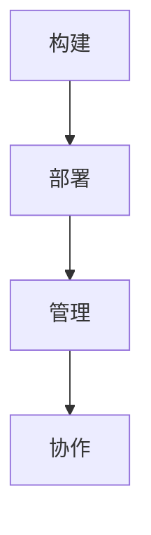

## 背景介绍

随着人工智能技术的不断发展，AI模型部署和管理变得越来越重要。ModelOps是指在企业中构建、部署和管理AI模型的过程。它旨在提高模型的效率、质量和安全性，从而实现业务目标。

本篇博客将深入探讨ModelOps的原理、核心概念以及实际应用场景。我们将通过具体的代码示例和实际项目案例，帮助读者理解如何使用ModelOps来优化AI模型部署和管理。

## 核心概念与联系

ModelOps包括以下几个核心概念：

1. **构建**:创建和训练AI模型。
2. **部署**:将模型部署到生产环境。
3. **管理**:监控和维护模型性能。
4. **协作**:跨团队协作，确保模型的可持续发展。

这些概念之间相互关联，共同构成了ModelOps的完整生命周期。下面是一个简化的Mermaid流程图，展示了ModelOps的基本流程：



## 核心算法原理具体操作步骤

在开始探讨ModelOps的实际应用之前，我们需要了解其背后的核心算法原理。以下是ModelOps的一些主要组成部分及其对应的操作步骤：

1. **数据预处理**:清洗、转换和标准化数据，以便用于训练模型。
2. **模型选择**:根据业务需求选择合适的模型，如深度学习、随机森林等。
3. **模型训练**:使用选定的模型对数据进行训练，并优化参数。
4. **模型评估**:通过验证集和测试集来评估模型的性能。
5. **模型部署**:将训练好的模型部署到生产环境，供业务方使用。

## 数学模型和公式详细讲解举例说明

在本节中，我们将介绍一些常见的数学模型以及它们的公式。这些模型将帮助我们更好地理解AI模型的构建过程。

例如，线性回归是一种常用的统计模型，它可以用来预测连续型变量之间的关系。其基本公式如下：

$$
y = \\beta_0 + \\beta_1x_1 + \\beta_2x_2 +... + \\beta_nx_n + \\epsilon
$$

其中，$y$是目标变量，$\\beta_i$是系数，$x_i$是自变量，$\\epsilon$是误差项。

## 项目实践：代码实例和详细解释说明

为了帮助读者更好地理解ModelOps，我们将通过一个实际项目案例进行演示。在这个案例中，我们将使用Python和TensorFlow来实现一个简单的图像识别系统。

### 数据准备

首先，我们需要准备数据集。以下是一个简化的数据准备流程：

```python
import tensorflow as tf
from tensorflow.keras.preprocessing.image import ImageDataGenerator

# 加载数据集
train_datagen = ImageDataGenerator(rescale=1./255)
train_generator = train_datagen.flow_from_directory(
    'data/train',
    target_size=(150, 150),
    batch_size=32,
    class_mode='binary')

validation_datagen = ImageDataGenerator(rescale=1./255)
validation_generator = validation_datagen.flow_from_directory(
    'data/validation',
    target_size=(150, 150),
    batch_size=32,
    class_mode='binary')
```

### 模型构建

接下来，我们需要构建模型。以下是一个简化的卷积神经网络（CNN）模型示例：

```python
model = tf.keras.models.Sequential([
    tf.keras.layers.Conv2D(32, (3, 3), activation='relu', input_shape=(150, 150, 3)),
    tf.keras.layers.MaxPooling2D((2, 2)),
    tf.keras.layers.Conv2D(64, (3, 3), activation='relu'),
    tf.keras.layers.MaxPooling2D((2, 2)),
    tf.keras.layers.Conv2D(128, (3, 3), activation='relu'),
    tf.keras.layers.MaxPooling2D((2, 2)),
    tf.keras.layers.Flatten(),
    tf.keras.layers.Dense(512, activation='relu'),
    tf.keras.layers.Dense(1, activation='sigmoid')
])

# 编译模型
model.compile(optimizer='adam',
              loss='binary_crossentropy',
              metrics=['accuracy'])
```

### 模型训练

然后，我们需要训练模型。以下是一个简化的训练过程示例：

```python
history = model.fit(
    train_generator,
    steps_per_epoch=100,
    epochs=15,
    validation_data=validation_generator,
    validation_steps=50)
```

### 模型评估

最后，我们需要对模型进行评估。以下是一个简化的评估过程示例：

```python
loss, accuracy = model.evaluate(validation_generator)
print(f'Validation accuracy: {accuracy:.4f}')
```

## 实际应用场景

ModelOps在各种实际应用场景中都有广泛的应用，例如：

1. **金融行业**:用于信用评估、风险管理等。
2. **医疗健康**:用于疾病诊断、药物研发等。
3. **制造业**:用于质量控制、生产预测等。

通过以上案例，我们可以看到ModelOps在不同领域中的广泛应用，并且不断地推动着AI技术的发展。

## 工具和资源推荐

如果您想深入了解ModelOps及其相关技术，可以参考以下工具和资源：

1. **TensorFlow**:一个开源的机器学习框架，支持ModelOps。
2. **Keras**:一个高级神经网络API，基于TensorFlow。
3. **Scikit-learn**:一个Python机器学习库，提供了许多常用的算法和模型。
4. **AI Platform**:谷歌云端平台上的AI服务，包括ModelOps功能。

## 总结：未来发展趋势与挑战

随着AI技术的不断发展，ModelOps将继续演进和优化。未来，ModelOps可能面临以下挑战：

1. **数据安全性**:保护数据的隐私和安全性至关重要。
2. **模型性能**:持续提高模型性能，以满足不断变化的业务需求。
3. **跨领域协作**:实现不同领域之间的协作，共同推动AI技术的发展。

## 附录：常见问题与解答

在本篇博客中，我们探讨了ModelOps的原理、核心概念以及实际应用场景。如果您还有其他问题，请参考以下常见问题与解答：

1. **如何选择合适的模型？**
选择合适的模型需要根据具体的业务需求和数据特点进行评估。可以尝试不同的模型，并通过实验来确定最适合您的模型。
2. **如何确保模型的可持续性？**
为了确保模型的可持续性，您需要定期对模型进行更新和优化。此外，还可以采用ModelOps中的协作机制，跨团队协作，共同推动模型的持续发展。
3. **如何解决模型过拟合的问题？**
过拟合是指模型在训练集上表现良好，但在测试集或生产环境中表现不佳的一种现象。要解决过拟合问题，可以尝试使用更复杂的数据增强技术、正则化方法等。

作者：禅与计算机程序设计艺术 / Zen and the Art of Computer Programming

以上就是我们关于AI系统ModelOps原理与代码实战案例讲解的全部内容。在本篇博客中，我们深入探讨了ModelOps的核心概念、原理以及实际应用场景，并通过具体的代码示例帮助读者理解如何使用ModelOps来优化AI模型部署和管理。如果您有任何疑问，请随时留言，我们将尽力为您解答。同时，也欢迎您分享您的ModelOps经验和心得，以便我们共同学习和进步。