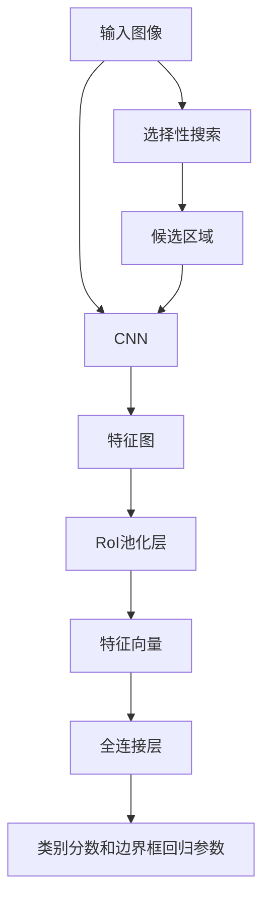

## 1.背景介绍

在计算机视觉领域，目标检测是一项重要的任务，它的目标是确定图像中特定对象的位置和类别。Fast R-CNN是一种用于目标检测的深度学习模型，它是由Ross Girshick在2015年提出的。Fast R-CNN是R-CNN（Regions with Convolutional Neural Networks）和SPP-net（Spatial Pyramid Pooling in Deep Convolutional Networks）的改进版本，它解决了这两种方法的一些问题，比如训练速度慢，检测精度低等。

## 2.核心概念与联系

Fast R-CNN的主要思想是将卷积神经网络（CNN）应用于提取的区域（Region of Interest, RoI），而不是整个图像。这样做的好处是能够减少计算量，提高检测速度。Fast R-CNN的工作流程主要包括以下几个步骤：

1. 利用选择性搜索（Selective Search）算法从输入图像中生成大约2000个候选区域。
2. 将整个图像和候选区域一起输入到CNN中，通过卷积和最大池化操作，提取特征图（Feature Map）。
3. 对每个候选区域，利用RoI池化层将其映射到固定大小的特征向量。
4. 将特征向量输入到全连接层，得到每个候选区域的类别分数和边界框回归参数。



## 3.核心算法原理具体操作步骤

Fast R-CNN的训练过程主要包括以下几个步骤：

1. 利用选择性搜索算法从训练图像中生成候选区域。
2. 对每个候选区域，标注其类别和边界框。如果候选区域与真实物体的交并比（Intersection over Union, IoU）大于0.5，则标注为正样本，类别为物体类别；否则，标注为负样本，类别为背景。
3. 将整个图像和候选区域一起输入到CNN中，通过卷积和最大池化操作，提取特征图。
4. 对每个候选区域，利用RoI池化层将其映射到固定大小的特征向量。
5. 将特征向量输入到全连接层，得到每个候选区域的类别分数和边界框回归参数。
6. 计算类别分数的交叉熵损失和边界框回归参数的平滑L1损失，将两者相加得到总损失。
7. 利用反向传播算法和随机梯度下降（Stochastic Gradient Descent, SGD）优化总损失。

Fast R-CNN的检测过程主要包括以下几个步骤：

1. 利用选择性搜索算法从测试图像中生成候选区域。
2. 将整个图像和候选区域一起输入到CNN中，通过卷积和最大池化操作，提取特征图。
3. 对每个候选区域，利用RoI池化层将其映射到固定大小的特征向量。
4. 将特征向量输入到全连接层，得到每个候选区域的类别分数和边界框回归参数。
5. 对每个候选区域，如果类别分数大于阈值，则判定为物体，类别为分数最高的类别，位置由边界框回归参数确定。

## 4.数学模型和公式详细讲解举例说明

Fast R-CNN的损失函数包括两部分：类别分数的交叉熵损失和边界框回归参数的平滑L1损失。

类别分数的交叉熵损失定义为：

$$
L_{cls}(p, u) = -\log p_u
$$

其中$p$是预测的类别概率分布，$u$是真实的类别。

边界框回归参数的平滑L1损失定义为：

$$
L_{loc}(t, v) = \sum_{i\in\{x, y, w, h\}} smooth_{L1}(t_i - v_i)
$$

其中$t$是预测的边界框回归参数，$v$是真实的边界框回归参数，$smooth_{L1}$是平滑L1函数，定义为：

$$
smooth_{L1}(x) = \begin{cases} 
0.5x^2 & \text{if } |x| < 1 \\
|x| - 0.5 & \text{otherwise}
\end{cases}
$$

总损失定义为：

$$
L(p, u, t, v) = L_{cls}(p, u) + \lambda[u \geq 1] L_{loc}(t, v)
$$

其中$\lambda$是类别分数的交叉熵损失和边界框回归参数的平滑L1损失之间的权重，$[u \geq 1]$是指示函数，如果$u$大于等于1则返回1，否则返回0。

## 5.项目实践：代码实例和详细解释说明

以下是使用PyTorch实现Fast R-CNN的一个简单例子：

```python
import torch
import torchvision
from torchvision.models.detection import FasterRCNN
from torchvision.models.detection.rpn import AnchorGenerator

# 加载预训练的模型
backbone = torchvision.models.mobilenet_v2(pretrained=True).features
backbone.out_channels = 1280

# 定义RPN
anchor_generator = AnchorGenerator(sizes=((32, 64, 128, 256, 512),),
                                   aspect_ratios=((0.5, 1.0, 2.0),))

# 定义Fast R-CNN
model = FasterRCNN(backbone,
                   num_classes=2,
                   rpn_anchor_generator=anchor_generator)
```

在这个例子中，我们首先加载了预训练的MobileNetV2模型作为Fast R-CNN的主干网络，然后定义了一个区域提议网络（RPN），最后定义了Fast R-CNN模型。我们可以使用这个模型进行训练和检测。

## 6.实际应用场景

Fast R-CNN可以应用于各种目标检测任务，例如：

- 行人检测：在自动驾驶、视频监控等领域，我们需要检测图像中的行人。
- 车辆检测：在自动驾驶、交通流量分析等领域，我们需要检测图像中的车辆。
- 物体检测：在机器人视觉、图像搜索等领域，我们需要检测图像中的各种物体。

## 7.工具和资源推荐

- PyTorch：一个用于深度学习的开源库，提供了丰富的模型和工具，包括Fast R-CNN。
- torchvision：一个用于计算机视觉的开源库，提供了丰富的数据集、模型和工具，包括Fast R-CNN。
- CUDA：一个用于并行计算的平台和API，可以加速深度学习的训练和检测。
- cuDNN：一个用于深度神经网络的GPU加速库，可以进一步加速深度学习的训练和检测。

## 8.总结：未来发展趋势与挑战

Fast R-CNN是目标检测的重要里程碑，它通过将CNN应用于RoI，显著提高了检测速度和精度。然而，Fast R-CNN仍然有一些挑战和限制：

- Fast R-CNN依赖于选择性搜索算法生成候选区域，这个过程是固定的，不能通过学习优化。
- Fast R-CNN的训练过程包括两个阶段，不能端到端（end-to-end）训练。
- Fast R-CNN对于小物体的检测效果不佳，因为小物体在特征图上的区域较小，可能被最大池化操作忽略。

为了解决这些问题，后来提出了Faster R-CNN，它引入了区域提议网络（RPN），使得候选区域的生成也能通过学习优化，而且可以实现端到端训练。此外，也有一些方法尝试改进RoI池化层，使其更适应小物体，例如RoIAlign。

Fast R-CNN和后续的改进方法已经在各种目标检测任务上取得了显著的效果，但是目标检测仍然是一个活跃的研究领域，还有许多问题等待我们去解决。

## 9.附录：常见问题与解答

Q: Fast R-CNN和R-CNN有什么区别？

A: R-CNN是将CNN应用于整个图像和候选区域，然后提取特征，最后用SVM分类和线性回归定位。Fast R-CNN是将CNN应用于整个图像，然后对每个候选区域，通过RoI池化层提取固定大小的特征向量，最后用全连接层分类和回归定位。Fast R-CNN相比R-CNN，检测速度更快，精度更高。

Q: Fast R-CNN可以检测多少种类别的物体？

A: Fast R-CNN可以检测任意种类的物体，只需要在训练时提供相应的标注数据。

Q: Fast R-CNN的训练需要多少时间？

A: Fast R-CNN的训练时间取决于许多因素，包括图像的数量和大小，物体的类别和数量，硬件的性能等。在一台具有现代GPU的计算机上，训练Fast R-CNN通常需要几小时到几天。

作者：禅与计算机程序设计艺术 / Zen and the Art of Computer Programming