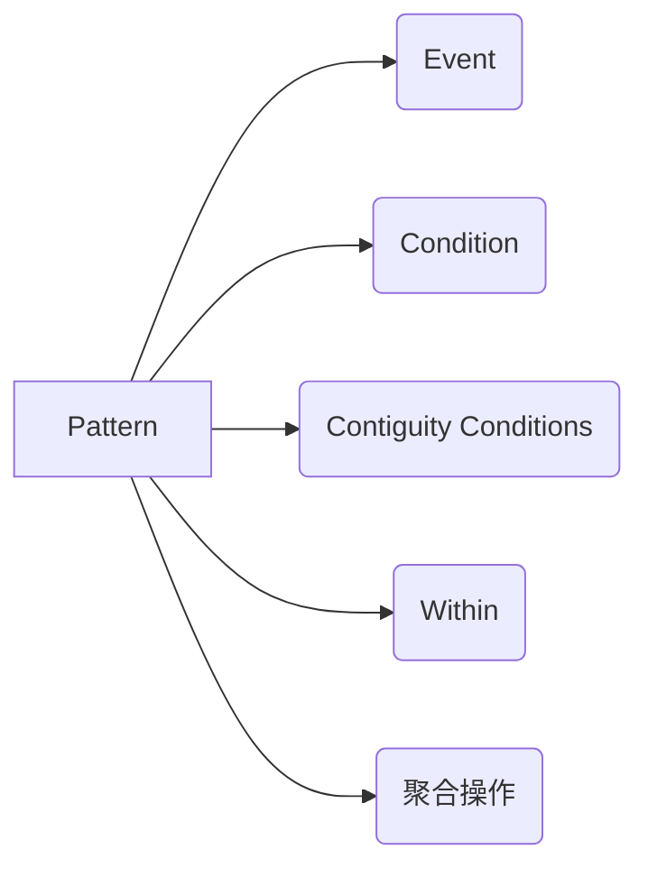
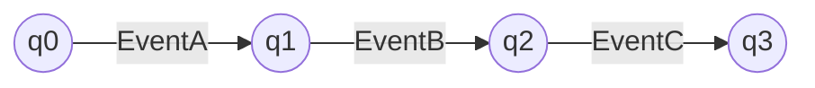

# Flink PatternAPI原理与代码实例讲解

## 1.背景介绍

### 1.1 Flink简介
Apache Flink是一个开源的分布式流处理和批处理框架,专注于有状态计算。它具有高吞吐、低延迟、高性能和高可用等特点,广泛应用于实时数据处理、实时数据分析、实时数据集成等场景。

### 1.2 Flink CEP简介
Flink CEP(Complex Event Processing)是Flink提供的复杂事件处理库,用于从事件流中检测事件模式。CEP允许在流中指定要检测的复杂事件模式,一旦检测到匹配的事件序列,就会触发计算。

### 1.3 PatternAPI简介
PatternAPI是Flink CEP提供的一种声明式API,用于定义和检测复杂事件模式。通过PatternAPI,用户可以使用直观的语法描述要查找的模式,例如事件序列、时间约束等。PatternAPI简化了复杂事件处理的实现。

## 2.核心概念与联系

### 2.1 Pattern
Pattern表示要检测的复杂事件模式,由一个或多个事件以及它们之间的关系组成。每个Pattern都有一个名称,用于后续引用匹配到的事件。

### 2.2 Event
Event表示输入的事件流中的单个事件。每个事件都有时间戳和携带的数据。

### 2.3 Condition
Condition用于定义事件必须满足的条件。可以是简单的属性比较,也可以是自定义的条件函数。只有满足条件的事件才会被纳入模式匹配。

### 2.4 Contiguity Conditions
Contiguity Conditions定义事件之间的连续性约束,包括:
- strict contiguity: 严格连续,要求匹配的事件严格按照定义的顺序出现,中间不允许有其他事件。  
- relaxed contiguity: 宽松连续,允许匹配的事件之间有其他的事件。
- non-deterministic relaxed contiguity: 非确定性宽松连续,进一步放宽连续性,允许忽略满足条件的事件。

### 2.5 Within
Within用于指定模式的时间约束,即要求匹配的事件序列必须在指定的时间范围内发生。

### 2.6 聚合操作
PatternAPI支持在检测到匹配事件序列后进行聚合操作,如提取事件的属性、计算统计值等。

下面是这些概念之间的关系图:



## 3.核心算法原理具体操作步骤

PatternAPI的核心算法是NFA(非确定性有限自动机)。具体步骤如下:

### 3.1 定义Pattern
首先使用Pattern API定义要检测的复杂事件模式。例如:

```java
Pattern<Event, ?> pattern = Pattern.<Event>begin("start")
    .where(new SimpleCondition<Event>() {
        @Override
        public boolean filter(Event event) {
            return event.getId() == 42;
        }
    })
    .next("middle")
    .subtype(SubEvent.class)
    .where(new SimpleCondition<SubEvent>() {
        @Override
        public boolean filter(SubEvent subEvent) {
            return subEvent.getVolume() >= 10.0;
        }
    })
    .followedBy("end")
    .where(new SimpleCondition<Event>() {
        @Override
        public boolean filter(Event event) {
            return event.getName().equals("end");
        }
    });
```

### 3.2 将Pattern应用到DataStream
将定义好的Pattern应用到输入的DataStream上:

```java
PatternStream<Event> patternStream = CEP.pattern(inputStream, pattern);
```

### 3.3 指定匹配后的处理逻辑
指定检测到匹配事件序列后的处理逻辑,即根据名称选择事件并处理:

```java
DataStream<Alert> alertStream = patternStream.select(
    new PatternSelectFunction<Event, Alert>() {
        @Override
        public Alert select(Map<String, List<Event>> pattern) throws Exception {
            return createAlert(pattern);
        }
    }
);
```

### 3.4 处理匹配事件
在select方法中,可以根据Pattern中的名称,从匹配到的事件序列中提取出相应的事件,然后进行处理,如生成告警、更新状态等。

## 4.数学模型和公式详细讲解举例说明

PatternAPI的数学模型可以用NFA(非确定性有限自动机)来表示。NFA由以下元素组成:

- 状态集合 $Q$
- 字母表 $\Sigma$
- 转移函数 $\delta$
- 初始状态 $q_0$
- 接受状态集合 $F$

NFA可以形式化地表示为一个五元组: 

$A = (Q, \Sigma, \delta, q_0, F)$

其中:
- $Q$: 有限状态集合
- $\Sigma$: 有限字母表
- $\delta$: 转移函数,定义为 $Q \times \Sigma \to P(Q)$
- $q_0$: 初始状态,$q_0 \in Q$
- $F$: 接受状态集合,$F \subseteq Q$

举例说明:

假设我们要检测如下模式: 
- 先出现一个EventA
- 紧接着出现一个EventB
- 最后出现一个EventC

我们可以构建如下的NFA:



其中:
- 状态集合 $Q = \{q_0, q_1, q_2, q_3\}$
- 字母表 $\Sigma = \{EventA, EventB, EventC\}$
- 转移函数 $\delta$:
    - $\delta(q_0, EventA) = q_1$
    - $\delta(q_1, EventB) = q_2$
    - $\delta(q_2, EventC) = q_3$
- 初始状态 $q_0$
- 接受状态集合 $F = \{q_3\}$

当输入的事件流匹配这个NFA时,就说明检测到了指定的复杂事件模式。

## 5.项目实践：代码实例和详细解释说明

下面通过一个实际的代码示例,演示如何使用PatternAPI检测复杂事件模式。

假设我们有一个事件流,包含了用户的登录行为。我们希望检测以下模式:
- 同一用户在2分钟内连续登录失败3次

```java
// 定义输入事件类
public class LoginEvent {
    private String userId;
    private String ipAddress;
    private boolean success;
    private long timestamp;
    
    // 构造函数、getter和setter方法
}

// 定义Pattern
Pattern<LoginEvent, LoginEvent> loginFailPattern = Pattern.<LoginEvent>begin("firstFail")
    .where(new SimpleCondition<LoginEvent>() {
        @Override
        public boolean filter(LoginEvent event) {
            return !event.isSuccess();
        }
    })
    .next("secondFail")
    .where(new SimpleCondition<LoginEvent>() {
        @Override
        public boolean filter(LoginEvent event) {
            return !event.isSuccess();
        }
    })
    .next("thirdFail")
    .where(new SimpleCondition<LoginEvent>() {
        @Override
        public boolean filter(LoginEvent event) {
            return !event.isSuccess();
        }
    })
    .within(Time.seconds(120));

// 将Pattern应用到输入流
PatternStream<LoginEvent> patternStream = CEP.pattern(
    loginEventStream.keyBy(LoginEvent::getUserId),
    loginFailPattern);

// 指定匹配后的处理逻辑
SingleOutputStreamOperator<String> loginFailDataStream = patternStream.select(
    new PatternSelectFunction<LoginEvent, String>() {
        @Override
        public String select(Map<String, List<LoginEvent>> pattern) throws Exception {
            LoginEvent firstFailEvent = pattern.get("firstFail").get(0);
            LoginEvent thirdFailEvent = pattern.get("thirdFail").get(0);
            return "用户 " + firstFailEvent.getUserId() + 
                " 在2分钟内连续登录失败3次,时间范围: " + 
                firstFailEvent.getTimestamp() + " - " + thirdFailEvent.getTimestamp();
        }
    }
);
```

代码详细解释:

1. 首先定义输入事件类LoginEvent,包含用户ID、IP地址、登录是否成功、时间戳等字段。

2. 定义Pattern,描述要检测的复杂事件模式:
- 以一次登录失败事件开始
- 接着是第二次登录失败
- 最后是第三次登录失败
- 要求这三次失败在2分钟内发生

3. 将Pattern应用到输入流上,同时按用户ID进行keyBy,保证每个用户的登录事件在同一个流分区内。

4. 指定匹配到事件序列后的处理逻辑,即从匹配到的事件中提取相关信息,生成报警信息。

5. 最终得到了一个新的DataStream,包含了检测到的连续登录失败事件的报警信息。

## 6.实际应用场景

PatternAPI可以应用于各种实际的复杂事件处理场景,例如:

### 6.1 实时欺诈检测
在金融领域,可以使用PatternAPI检测异常的交易模式,实时预防欺诈行为。例如,检测短时间内同一账户的多笔大额交易、跨地域的可疑交易等。

### 6.2 设备故障预警
在工业场景中,设备通常会持续产生各种事件数据。使用PatternAPI可以实时检测设备的异常事件模式,提前预警可能发生的故障,避免设备停机造成损失。

### 6.3 用户行为分析
在电商、社交等领域,用户行为数据是非常重要的分析对象。使用PatternAPI可以发现用户的典型行为模式,如浏览->收藏->下单->支付等,从而优化产品设计和营销策略。

### 6.4 网络安全监控
在网络安全领域,PatternAPI可用于检测异常的网络访问模式,及时发现潜在的安全威胁,如DDOS攻击、暴力破解等。

## 7.工具和资源推荐

### 7.1 Flink官方文档
Flink官网提供了详尽的用户文档,其中包括了CEP和PatternAPI的介绍和使用指南,是学习和使用Flink的权威资料。
https://ci.apache.org/projects/flink/flink-docs-release-1.12/

### 7.2 Flink CEP示例
Flink官方提供的CEP示例代码,包含了使用PatternAPI的各种场景示例,可以作为学习和参考的素材。 
https://github.com/apache/flink/tree/master/flink-examples/flink-examples-streaming/src/main/java/org/apache/flink/streaming/examples/cep

### 7.3 Flink社区
Flink拥有活跃的社区,可以通过邮件列表、Slack等渠道与其他用户和开发者交流,获取帮助和最新的资讯。
https://flink.apache.org/community.html

## 8.总结：未来发展趋势与挑战

### 8.1 更丰富的模式支持
目前PatternAPI已经支持了多种常见的模式定义,如序列、选择、循环等。未来有望支持更多的模式类型,如基于图的模式、层次化事件模式等,以应对更加复杂的事件处理需求。

### 8.2 模式的并行检测
随着事件的数量和复杂度不断增加,对PatternAPI的性能提出了更高的要求。如何实现高效的并行模式检测,充分利用分布式环境的计算能力,是一个值得研究的课题。

### 8.3 与其他Flink API的集成
除了DataStream API,Flink还提供了Table API、SQL等上层API。如何将PatternAPI与这些API更好地集成,提供统一的事件处理方案,是一个有趣的方向。

### 8.4 机器学习的应用
复杂事件处理与机器学习有许多结合的可能性。例如,利用机器学习算法自动学习和生成事件模式,或者将事件处理的结果作为机器学习的输入,形成实时学习和预测的闭环。

## 9.附录：常见问题与解答

### Q1: PatternAPI与CEP的关系是什么?
A1: CEP是更广泛的复杂事件处理的概念,而PatternAPI是Flink提供的一种声明式API,用于在Flink CEP库中定义复杂事件模式。可以说,PatternAPI是Flink CEP的核心组件和抽象。

### Q2: PatternAPI支持哪些类型的模式?
A2: PatternAPI支持以下类型的模式:
- 单个事件模式
- 事件序列模式
- 事件选择模式(or)
- 事件循环模式(oneOrMore, times)
- 事件否定模式(not)
- 事件条件模