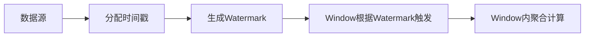

# Flink Window原理与代码实例讲解

## 1. 背景介绍

### 1.1 流式计算的发展历程

随着大数据时代的到来,数据的实时性和时效性变得越来越重要。传统的批处理模式已经无法满足实时数据处理的需求。流式计算应运而生,成为了大数据领域的热门技术之一。

### 1.2 Flink在流式计算中的地位

Apache Flink是目前最受欢迎的开源流式计算框架之一。它提供了高吞吐、低延迟、exactly-once语义保证等特性,在实时数据处理领域有着广泛的应用。Flink的一个核心概念就是Window,它为流式数据的聚合计算提供了强大的支持。

### 1.3 理解Window的重要性

Window是Flink中处理无界数据流的关键抽象。在现实场景中,我们经常需要对一段时间内的数据进行聚合分析,比如统计过去1小时的订单总金额、计算5分钟内的平均温度等。Window提供了一种灵活的方式来定义这些时间窗口,让我们能够方便地进行复杂的流式数据分析。

## 2. 核心概念与联系

### 2.1 Window的定义

Window可以理解为流数据的一个"桶"或"窗口",它将无界的数据流切分成有界的数据集,方便我们进行聚合计算。Window根据不同的触发条件,可以分为以下几类:

- Time Window:根据时间划分窗口,如每5分钟一个窗口。
- Count Window:根据数据数量划分窗口,如每100条数据一个窗口。  
- Session Window:根据Session间隔划分窗口,如Session超过30分钟则触发窗口闭合。

### 2.2 Window API概览

Flink提供了丰富的Window API,主要包括:

- window():定义Window的类型和大小。
- trigger():定义Window的触发条件。  
- evictor():定义Window中数据的剔除策略。
- allowedLateness():定义Window允许的最大延迟时间。
- sideOutputLateData():将迟到的数据输出到侧输出流。
- reduce()/aggregate()/process():定义Window中的数据处理逻辑。

### 2.3 Window、Time和Watermark的关系

在Flink中,Window的触发是基于EventTime的,而Watermark用来衡量EventTime的进展。Watermark是一种特殊的时间戳,它表示在此之前的数据都已经到达。当Watermark超过Window的结束时间时,该Window将被触发计算。所以Window、Time和Watermark的关系可以总结为:



## 3. 核心算法原理具体操作步骤

### 3.1 滑动窗口(Sliding Window)算法

滑动窗口以固定的时间间隔滑动,每次滑动都会产生一个新的窗口。其核心步骤如下:

1. 根据滑动步长,确定窗口的起始和结束时间。
2. 当数据的EventTime落入窗口范围内时,将数据分配到对应的窗口。
3. 当Watermark超过窗口的结束时间时,触发该窗口的计算。
4. 对窗口内的数据进行聚合计算。
5. 窗口滑动,重复步骤1-4。

### 3.2 滚动窗口(Tumbling Window)算法

滚动窗口是滑动窗口的一个特例,窗口之间没有重叠,每个数据只属于一个窗口。其核心步骤如下:

1. 根据窗口大小,确定窗口的起始和结束时间。
2. 当数据的EventTime落入窗口范围内时,将数据分配到对应的窗口。 
3. 当Watermark超过窗口的结束时间时,触发该窗口的计算。
4. 对窗口内的数据进行聚合计算。
5. 窗口前进,重复步骤1-4。

### 3.3 会话窗口(Session Window)算法

会话窗口通过Session间隔来划分,如果两个数据的间隔超过了指定的时间,就会触发窗口闭合。其核心步骤如下:

1. 设定Session Gap作为触发窗口的时间间隔。
2. 每条数据到达时,更新该数据所在窗口的结束时间为 max(当前结束时间,数据时间+Gap)。
3. 如果下一条数据的时间已经超过当前窗口的结束时间,则触发当前窗口闭合,并将该数据分配到新窗口。
4. 对已闭合的窗口内的数据进行聚合计算。

## 4. 数学模型和公式详细讲解举例说明

Window的数学模型可以用如下的公式来表示:

$$Window=\{D_i|T_s \leq T(D_i) < T_e\}$$

其中:
- $D_i$ 表示第i条数据
- $T(D_i)$ 表示数据 $D_i$ 的时间戳
- $T_s$ 和 $T_e$ 分别表示窗口的起始时间和结束时间

举个例子,假设我们要统计每5分钟的订单总金额,订单数据如下:

| 订单ID | 下单时间 | 金额 |
|--------|----------|------|
| 1      | 10:01:00 | 100  |
| 2      | 10:02:30 | 150  | 
| 3      | 10:04:00 | 200  |
| 4      | 10:06:00 | 80   |
| 5      | 10:07:30 | 120  |

根据滑动窗口模型,我们可以得到以下几个窗口:

- 窗口1: $\{D_1,D_2,D_3|10:00:00 \leq T(D_i) < 10:05:00\}$,总金额为450。
- 窗口2: $\{D_3,D_4|10:05:00 \leq T(D_i) < 10:10:00\}$,总金额为280。

可以看到,通过数学模型,我们可以清晰地定义Window的范围,并对窗口内的数据进行聚合计算。

## 5. 项目实践：代码实例和详细解释说明

下面我们通过一个具体的代码实例,来演示如何使用Flink的Window API进行流式数据聚合。

### 5.1 需求描述

假设我们有一个实时的温度传感器数据流,每条数据包含了传感器ID、时间戳和温度值。我们需要每5秒钟统计一次每个传感器的平均温度。

### 5.2 代码实现

```java
// 定义数据源
DataStream<Tuple3<String, Long, Double>> sensorData = ...

// 定义Window和聚合函数
DataStream<Tuple3<String, Long, Double>> avgTemp = sensorData
    .keyBy(data -> data.f0) // 按照传感器ID分组
    .window(TumblingProcessingTimeWindows.of(Time.seconds(5))) // 定义5秒的滚动窗口
    .aggregate(new AvgTempAggregateFunction()); // 定义聚合函数

// 自定义聚合函数
public static class AvgTempAggregateFunction 
    implements AggregateFunction<Tuple3<String, Long, Double>, Tuple2<Double, Integer>, Double> {
    
    @Override
    public Tuple2<Double, Integer> createAccumulator() {
        return new Tuple2<>(0.0, 0);
    }
    
    @Override
    public Tuple2<Double, Integer> add(Tuple3<String, Long, Double> value, Tuple2<Double, Integer> accumulator) {
        return new Tuple2<>(accumulator.f0 + value.f2, accumulator.f1 + 1);
    }
    
    @Override
    public Double getResult(Tuple2<Double, Integer> accumulator) {
        return accumulator.f0 / accumulator.f1;
    }
    
    @Override
    public Tuple2<Double, Integer> merge(Tuple2<Double, Integer> a, Tuple2<Double, Integer> b) {
        return new Tuple2<>(a.f0 + b.f0, a.f1 + b.f1);
    }
}
```

### 5.3 代码解释

- 首先我们定义了数据源`sensorData`,它是一个包含了传感器ID、时间戳和温度值的元组流。
- 然后我们通过`keyBy`按照传感器ID对数据流进行分组,因为我们要对每个传感器单独统计。
- 接着我们通过`window`定义了一个5秒的滚动窗口,这意味着每5秒钟会输出一次结果。
- 最后我们通过`aggregate`定义了一个自定义的聚合函数`AvgTempAggregateFunction`,用来计算平均温度。

在`AvgTempAggregateFunction`中,我们定义了以下几个方法:

- `createAccumulator`:创建一个初始的累加器,用来累加温度值和数据条数。
- `add`:每条数据到来时调用,将温度值添加到累加器中。
- `getResult`:窗口触发时调用,计算平均温度。
- `merge`:窗口合并时调用,将两个累加器合并。

通过这样的代码,我们就可以实现每5秒钟统计一次每个传感器的平均温度了。

## 6. 实际应用场景

Flink的Window API可以应用于很多实际的场景,比如:

- 实时监控:通过滑动窗口,实时统计系统的各项指标,如QPS、响应时间等。
- 日志分析:通过滚动窗口,定时分析日志数据,如统计每小时的错误数量。
- 电商大屏:通过滑动窗口,实时显示最近一段时间内的销售额、订单量等。
- 传感器数据分析:通过会话窗口,分析传感器的连续数据,如温度连续超标时触发报警。

总之,只要是需要对实时数据进行周期性聚合分析的场景,都可以使用Flink的Window API来实现。

## 7. 工具和资源推荐

- Flink官方文档:https://ci.apache.org/projects/flink/flink-docs-stable/
- Flink中文社区:https://flink-learning.org.cn/
- Flink Window API详解:https://www.ververica.com/blog/introduction-to-apache-flink-window-functions
- Flink Window源码解析:http://wuchong.me/blog/2016/05/25/flink-internals-window-mechanism/

通过学习这些资料,可以更深入地理解Flink Window的原理和使用。

## 8. 总结：未来发展趋势与挑战

Flink Window是流式计算领域的一个重要话题,未来还有很大的发展空间,主要体现在以下几个方面:

- 更丰富的Window类型:除了目前常见的时间窗口、数量窗口和会话窗口,未来可能会出现更多样化的Window定义方式,以满足更复杂的业务需求。

- 更灵活的触发机制:目前Window的触发主要还是依赖于Watermark,但实际上Watermark并不一定能及时反映数据的完整性。未来可能会引入更多的触发机制,如外部事件触发、自定义触发器等。

- 更高效的Window管理:Window的管理涉及到状态的存储和清理、Window的合并和触发等,如何高效地管理大量的Window将是一个挑战。

- 更智能的Window优化:通过智能分析Window的数据分布和计算特点,自动优化Window的大小、触发时机等,将是提升性能的一个重要手段。

总的来说,Flink Window作为流式计算的核心概念,还有很大的研究和优化空间,也必将在未来得到更广泛的应用。

## 9. 附录：常见问题与解答

### 9.1 Window和State的区别是什么?

Window是一种将无界数据流切分成有界数据集的方式,关注的是数据的时间范围。而State是Flink中保存中间计算结果的机制,可以跨Window存在。它们的区别主要在于:

- Window是一种数据组织方式,State是数据存储方式。
- Window有固定的生命周期,State可以长期存在。
- Window主要用于数据聚合,State主要用于中间结果缓存。

### 9.2 Window的时间类型有哪些?

Flink Window支持两种时间类型:

- ProcessingTime:以机器的本地时间为准,不考虑数据本身的时间戳。
- EventTime:以数据本身的时间戳为准,可以处理乱序数据。

在实际使用中,我们更多地使用EventTime,因为它更符合数据产生的时序性。而ProcessingTime主要用于一些对实时性要求高,但对准确性要求不高的场景。

### 9.3