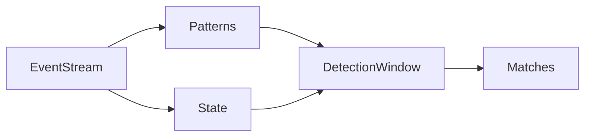

# FlinkCEP代码实例精讲：事件流处理与分析

## 1. 背景介绍
### 1.1 事件流处理的重要性
在当今数据驱动的世界中,实时处理和分析海量事件流数据变得越来越重要。无论是在金融、物联网、电商还是安全等领域,从源源不断的事件流中及时发现有价值的信息和洞察,对企业的决策和运营至关重要。

### 1.2 FlinkCEP的优势
Apache Flink是一个优秀的分布式流处理框架,而FlinkCEP作为其复杂事件处理(Complex Event Processing)类库,为Flink赋予了强大的事件流实时处理和分析能力。FlinkCEP可以在事件流上进行模式匹配,检测复杂的事件模式,实现基于事件时间或处理时间的窗口计算等。

### 1.3 文章的目标和内容安排
本文将通过FlinkCEP的代码实例,深入讲解事件流处理的核心概念、CEP编程模型、模式匹配的API,以及常见的应用场景和最佳实践。通过学习本文,读者可以快速掌握利用FlinkCEP进行事件流实时处理与分析的方法。

## 2. 核心概念与联系
### 2.1 事件(Event)
事件是事件流处理的基本单元,通常以Java POJO的形式定义,包含时间戳和一些属性字段。例如一个用户点击事件:
```java
public class ClickEvent {
  public String userId;
  public String url;
  public Long timestamp;
}
```

### 2.2 事件流(Event Stream)
事件流是一系列持续产生的事件数据的集合,具有时间属性。事件以某种顺序(如事件发生的时间)持续不断地流入系统。

### 2.3 模式(Pattern)
模式定义了我们感兴趣的、要在事件流中检测的事件序列,通过一些关系运算符(如followedBy, where...)组合单个事件或其他模式而成。例如:
```java
Pattern.<Event>begin("start")
  .where(event -> event.getName().equals("A"))
  .followedBy("end")
  .where(event -> event.getName().equals("B"));
```

### 2.4 匹配(Match)
匹配是输入的事件流与定义好的模式相匹配的事件序列。匹配到的事件序列可以被提取出来做进一步的处理。

### 2.5 检测窗口(Detection Window)
指定事件序列要在多长的时间内被检测,可以基于事件时间(Event Time)或处理时间(Processing Time)。

### 2.6 状态(State)
CEP引擎在事件流上进行模式匹配时,需要维护一些状态,如部分匹配的事件序列、已匹配的事件序列等。状态存储和管理是流处理的重要话题。

### 2.7 关键概念之间的关系
下图展示了上述核心概念之间的关系:



## 3. 核心算法原理与具体操作步骤
FlinkCEP的核心算法是一种非确定有限自动机(NFA),用于在事件流上进行模式匹配。具体步骤如下:

### 3.1 定义事件模式
通过Pattern API定义要检测的事件模式,指定事件之间的关系、条件、时间约束等。

### 3.2 将模式应用到事件流上 
调用CEP.pattern(eventStream, pattern)方法,将定义好的模式应用到输入的事件流上。CEP引擎会在事件流上进行模式匹配。

### 3.3 选择匹配事件
通过PatternStream的select或flatSelect方法,从匹配到的事件序列中选择和提取出感兴趣的事件。

### 3.4 处理匹配的复杂事件
对提取出的匹配事件进行进一步的处理和分析,如统计聚合、异常检测、数据富化等。

## 4. 数学模型和公式详细讲解举例说明
在CEP中,时间在模式匹配中扮演重要角色。我们常用两个重要的时间概念:

### 4.1 事件时间(Event Time)
事件实际发生的时间,在事件进入CEP引擎时指定,如:
$EventTime = Timestamp_{event}$

### 4.2 处理时间(Processing Time)  
事件进入CEP引擎被处理的时间,由系统的时钟决定,如:
$ProcessingTime = CurrentSystemTime$

在定义事件模式时,可以指定时间约束,如:

- 模式在多长时间内匹配: 
$within(Time)$

- 限制两个事件之间的时间间隔:
$event1.timestamp + x < event2.timestamp$

例如,找出5秒内连续两次登录失败的事件模式:
```java
Pattern.<Event>begin("first", AfterMatchSkipStrategy.skipPastLastEvent())
  .where(event -> event.getType().equals("fail"))
  .next("second")
  .where(event -> event.getType().equals("fail"))
  .within(Time.seconds(5));
```
这里使用了事件时间,要求两次登录失败事件在5秒内发生。

## 5. 项目实践：代码实例和详细解释说明
下面通过一个实际的代码例子,展示如何使用FlinkCEP进行事件流的模式匹配与处理。

### 5.1 场景描述
假设我们要监控用户的点击行为,找出那些在1分钟内连续点击了三个及以上不同商品的用户。

### 5.2 代码实现

#### 5.2.1 定义事件类
```java
public class ClickEvent {
    public String userId;
    public String productId;
    public Long timestamp;
}
```

#### 5.2.2 定义模式
```java
Pattern<ClickEvent, ?> pattern = Pattern.<ClickEvent>begin("start")
    .where(event -> event.productId.equals("A"))
    .next("middle")
    .where(event -> !event.productId.equals("A"))
    .next("end")
    .where(event -> !event.productId.equals("A"))
    .within(Time.minutes(1));
```
该模式要求:
- 第一个点击事件的商品是A
- 接下来的两个点击事件的商品都不是A
- 整个模式在1分钟内完成匹配

#### 5.2.3 在事件流上应用模式
```java
DataStream<ClickEvent> clickStream = ...
PatternStream<ClickEvent> patternStream = CEP.pattern(
    clickStream.keyBy(event -> event.userId),
    pattern);
```
这里先对事件流按用户id进行keyBy分区,然后在每个用户的点击流上应用模式。

#### 5.2.4 选择匹配事件并处理
```java
patternStream.select(new PatternSelectFunction<ClickEvent, String>() {
    @Override
    public String select(Map<String, List<ClickEvent>> pattern) {
        List<ClickEvent> start = pattern.get("start");
        List<ClickEvent> middle = pattern.get("middle");
        List<ClickEvent> end = pattern.get("end");
        return start.get(0).userId;
    }
}).print();
```
当模式匹配成功时,select方法会收到匹配到的事件,这里我们只选择打印出匹配的用户id。

## 6. 实际应用场景
FlinkCEP可以应用于多种实际的业务场景中,如:

### 6.1 实时风控
如信用卡盗刷检测,通过CEP识别出一段时间内异常的多次刷卡行为。

### 6.2 实时营销
如电商中基于用户行为序列的实时推荐,通过CEP发现特定的用户行为模式,触发相应的推荐。

### 6.3 设备监控与故障检测
通过CEP分析物联网设备的状态事件流,及时发现设备故障的模式并预警。

### 6.4 复杂事件溯源
CEP可以建立事件之间的因果关系,方便故障诊断和行为溯源。

## 7. 工具和资源推荐
- [Flink官网](https://flink.apache.org/)：Flink各个模块的权威文档，包括FlinkCEP
- [Flink Patterns](https://flink.apache.org/news/2016/04/06/cep-monitoring.html)：Flink官方的CEP模式介绍
- [复杂事件处理](https://www.oreilly.com/library/view/complex-event-processing/9781449366186/)：OReilly的CEP电子书
- [Flink CEP Patterns](https://github.com/streaming-with-flink/flink-cep-patterns)：常见CEP模式的示例代码库

## 8. 总结：未来发展趋势与挑战
随着实时数据处理的需求不断增长,基于Flink的CEP应用也将更加广泛。但同时CEP也面临一些挑战:

### 8.1 模式的表达能力
很多复杂场景下的模式难以用CEP的API表达,需要更强大的模式定义语言。

### 8.2 状态的存储和管理
CEP引擎需要管理大量的状态,需要开发更高效的状态存储机制。

### 8.3 与机器学习的结合
将CEP与机器学习算法相结合,从数据中自动挖掘和学习有价值的模式,将是一个有前景的方向。

### 8.4 更多数据源的支持
除了事件流,CEP还需要处理图、文本等更多类型的数据,需要扩展相应的模式匹配算法。

## 9. 附录：常见问题与解答

### 9.1 Flink CEP和Flink SQL如何选择？
Flink CEP适合事件流上的模式匹配,Flink SQL适合对流数据的查询分析,两者可以结合使用。

### 9.2 Flink CEP支持多大的状态？
Flink CEP的状态存储可以利用RocksDB等嵌入式存储,支持海量状态。

### 9.3 Flink CEP的延迟如何？
得益于Flink优秀的流处理引擎,CEP可以做到毫秒级别的延迟,满足大多数实时场景的需求。

### 9.4 Flink CEP如何保证exactly-once语义？
通过Flink的checkpoint机制,可以周期性地将CEP的状态存盘,在故障恢复时保证数据一致性。

作者：禅与计算机程序设计艺术 / Zen and the Art of Computer Programming