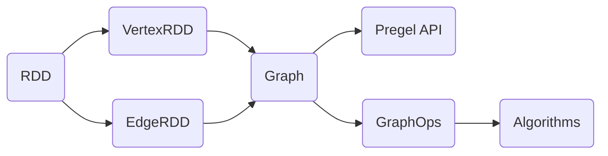

# GraphX原理与代码实例讲解

## 1. 背景介绍
### 1.1 大数据时代下的图计算需求
随着大数据时代的到来,各行各业产生了海量的数据,很多数据之间存在复杂的关联关系,例如社交网络、金融风控、电商推荐等领域。如何高效地分析和挖掘这些图结构数据蕴含的价值,成为了大数据处理领域的一大挑战。传统的数据处理模型如MapReduce,对于图数据的处理效率较低。因此,迫切需要一种高效的分布式图计算框架。
### 1.2 Spark生态中的GraphX
Apache Spark作为新一代大数据分布式计算引擎,以其快速、通用、易用等特点受到广泛关注。GraphX是Spark生态中专门用于图计算的组件,它将图计算抽象为一个分布式的图数据结构,并提供了一系列图算法和图操作原语,使得用户能够方便地基于GraphX进行复杂的图分析。
### 1.3 GraphX的应用价值
GraphX为大规模图数据处理提供了高效、易用的解决方案,在社交网络分析、推荐系统、自然语言处理、网络安全等诸多领域有广泛应用。学习和掌握GraphX,对于从事大数据处理、数据挖掘等工作的技术人员具有重要意义。

## 2. 核心概念与联系
### 2.1 Property Graph
GraphX使用Property Graph(属性图)来表示一个图,它由一组顶点(Vertex)和一组边(Edge)组成。每个顶点和边都可以带有属性。形式化定义为:
G = (V, E, P_V, P_E)
其中,V为顶点集,E为边集,P_V为顶点属性,P_E为边属性。
### 2.2 RDD
RDD(Resilient Distributed Dataset)是Spark的核心数据抽象,它代表一个分布式的、不可变的对象集合,可以并行操作。GraphX基于RDD来表示图数据:
- VertexRDD[VD]:顶点集合,VD为顶点属性的数据类型
- EdgeRDD[ED]:边集合,ED为边属性的数据类型
通过RDD,GraphX继承了Spark的容错性、可伸缩性等优点。
### 2.3 Graph
Graph是GraphX的核心抽象,它包含了图的结构(Structure)和属性(Properties)信息:
```scala
class Graph[VD, ED] {
  val vertices: VertexRDD[VD] 
  val edges: EdgeRDD[ED]
  ...
}
```
Graph提供了一系列基本的图操作,如subgraph、joinVertices、aggregateMessages等,是GraphX进行图计算的基础。
### 2.4 Pregel
Pregel是Google提出的大规模图计算框架,GraphX借鉴了其思想。Pregel将图计算抽象为一个顶点程序,通过迭代的方式不断向邻居顶点发送消息、聚合消息,更新顶点状态,直到达到全局终止条件。GraphX通过Pregel API提供了这种"思维方式"编程图计算的能力。

### 2.5 核心概念关系图


## 3. 核心算法原理与操作步骤
### 3.1 基本图操作
#### 3.1.1 创建图
可以从RDD或者Collection等数据源创建出Graph:
```scala
val vertices = sc.parallelize(Array((1L, "A"), (2L, "B"), (3L, "C"))) 
val edges = sc.parallelize(Array(Edge(1L, 2L, 10), Edge(2L, 3L, 20))) 
val graph = Graph(vertices, edges)
```
#### 3.1.2 属性操作
- mapVertices/mapEdges:对所有顶点/边应用一个函数,修改其属性值
- vertices/edges:获取图的顶点/边RDD
- inDegrees/outDegrees:计算顶点的入度/出度
- degrees:计算顶点的度(出度+入度)
#### 3.1.3 结构操作  
- subgraph:根据顶点和边的条件过滤出子图
- reverse:将图中所有边反向
- mask:根据另一图删除该图中不存在的顶点和边

### 3.2 关联操作
#### 3.2.1 joinVertices
将顶点RDD与图进行join,修改图中顶点的属性值:
```scala
val newGraph = graph.joinVertices(newVertexRDD)(mapFunc)
```
#### 3.2.2 outerJoinVertices 
类似joinVertices,但是保留图中属性修改前的顶点。

### 3.3 聚合操作
#### 3.3.1 aggregateMessages
以顶点为中心聚合邻边的信息,是GraphX的核心操作之一:
```scala
val aggregated = graph.aggregateMessages(
  sendMsg = e => {  // 向目标顶点发送消息
    e.sendToDst(e.srcAttr + e.attr)
  },
  mergeMsg = (a, b) => a + b // 聚合收到的消息
)
```
#### 3.3.2 reduce
以边为中心对triplets进行聚合:
```scala
val reduced = graph.edges.mapValues(e => e.attr).reduce((a, b) => a + b)
```

### 3.4 Pregel API
#### 3.4.1 基本概念
Pregel将图计算抽象为一个顶点程序,每个顶点接收消息、更新状态、向邻居顶点发送消息,迭代多轮直到全局终止。
#### 3.4.2 Pregel函数
GraphX通过Graph.pregel函数提供Pregel API:
```scala
def pregel[A](
  initialMsg: A, // 初始消息
  maxIterations: Int = Int.MaxValue, // 最大迭代次数
  activeDirection: EdgeDirection = EdgeDirection.Either // 发消息的方向
)(
  vprog: (VertexId, VD, A) => VD, // 顶点程序,负责接收消息、更新顶点状态
  sendMsg: EdgeTriplet[VD, ED] => Iterator[(VertexId, A)], // 发送消息
  mergeMsg: (A, A) => A // 聚合消息
)
```
#### 3.4.3 单源最短路径(SSSP)
基于Pregel API可以很容易实现SSSP:
```scala
val g: Graph[Double, Int] = ...
val sourceId: VertexId = ...
val initialGraph = g.mapVertices((id, _) => if (id == sourceId) 0.0 else Double.PositiveInfinity)
val sssp = initialGraph.pregel(Double.PositiveInfinity)(
  (id, dist, newDist) => math.min(dist, newDist), // 顶点程序
  triplet => { // 发送消息
    if (triplet.srcAttr + triplet.attr < triplet.dstAttr) {
      Iterator((triplet.dstId, triplet.srcAttr + triplet.attr))
    } else {
      Iterator.empty
    }
  },
  (a, b) => math.min(a, b) // 聚合消息
)
println(sssp.vertices.collect.mkString("\n"))
```

## 4. 数学模型和公式详解
### 4.1 图的数学表示
#### 4.1.1 无向图
G = (V, E),其中V为顶点集,E为边集,每条边是一个无序二元组(u, v),其中u, v ∈ V。
#### 4.1.2 有向图  
G = (V, E),其中V为顶点集,E为有向边集,每条边是一个有序二元组<u, v>,表示从顶点u到v有一条有向边,其中u, v ∈ V。
#### 4.1.3 加权图
G = (V, E, W),在无向图或有向图的基础上,每条边赋予一个权值,W为权值集合。

### 4.2 图的矩阵表示
设图G = (V, E),V中有n个顶点,则:
#### 4.2.1 邻接矩阵
A = (a_{ij})_{n \times n},其中
$$a_{ij} = \begin{cases} 1, & 如果(v_i, v_j) \in E 或 <v_i, v_j> \in E \\ 0, & 其他 \end{cases}$$
#### 4.2.2 度矩阵
$$D = diag(d_1, d_2, ..., d_n),其中d_i = \sum_{j=1}^n a_{ij}$$
表示第i个顶点的度。
#### 4.2.3 Laplacian矩阵
$$L = D - A$$
其中D为度矩阵,A为邻接矩阵。

### 4.3 图算法示例
#### 4.3.1 PageRank
PageRank是一种用于评估网页重要性的算法,其基本思想是:如果一个网页被很多其他网页链接到,说明这个网页比较重要,它的PageRank值就高。PageRank值计算公式:
$$PR(i) = \frac{1-d}{N} + d \sum_{j \in B(i)} \frac{PR(j)}{L(j)}$$
其中:
- PR(i):网页i的PageRank值
- N:所有网页的数量
- d:阻尼系数,一般取0.85
- B(i):存在指向网页i的链接的网页集合
- L(j):网页j的出链数量

在GraphX中,可以使用Pregel API实现分布式PageRank:
```scala
// 初始化,每个网页PR值为1/N
val ranks = graph.outDegrees.map(t => (t._1, 1.0 / t._2)) 

// 迭代计算
val numIter = 10
for (i <- 1 to numIter) {
  val ranksUpdated = graph.joinVertices(ranks) {
    (id, oldRank, inDegree) => 0.15 / numVertices + 0.85 * inDegree
  }
  ranks = ranksUpdated.aggregateMessages(
    e => e.sendToDst(e.srcAttr * e.attr), // 向目标顶点发送rank值
    (a, b) => a + b // 聚合收到的rank值
  )
}
```

## 5. 项目实践:PageRank代码实例
下面给出使用GraphX实现PageRank的完整代码:
```scala
import org.apache.spark._
import org.apache.spark.graphx._
import org.apache.spark.rdd.RDD

object PageRank {
  def main(args: Array[String]): Unit = {
    val conf = new SparkConf().setAppName("PageRank")
    val sc = new SparkContext(conf)
    
    // 从边文件读取数据
    val edges: RDD[Edge[Double]] = sc.textFile("data/edges.txt").map {
      line => 
        val fields = line.split("\\s+")
        Edge(fields(0).toLong, fields(1).toLong, 1.0)
    }
    
    // 构建图
    val graph: Graph[Double, Double] = Graph.fromEdges(edges, 1.0).cache()
    
    // 初始化,每个顶点PR值为1/N
    val numVertices = graph.numVertices
    var ranks: VertexRDD[Double] = graph.outDegrees.map(t => (t._1, 1.0 / numVertices))
    
    // 迭代计算
    val numIter = 10
    for (i <- 1 to numIter) {
      val ranksUpdated = graph.joinVertices(ranks) {
        (id, oldRank, inDegree) => 0.15 / numVertices + 0.85 * inDegree
      }
      ranks = ranksUpdated.aggregateMessages(
        e => e.sendToDst(e.srcAttr * e.attr), // 向目标顶点发送rank值
        (a, b) => a + b // 聚合收到的rank值
      )
    }
    
    // 输出结果
    println(ranks.collect().mkString("\n"))
    
    sc.stop()
  }
}
```
代码说明:
1. 从HDFS读取边数据,每行格式为"srcId dstId",转换为Edge RDD
2. 使用Graph.fromEdges从边RDD构建图,顶点和边的初始属性都为1.0
3. 初始化每个顶点的PR值为1/N,N为顶点总数
4. 迭代计算PR值:
   - joinVertices:将当前ranks值"发送"到每个顶点,并根据公式更新顶点的PR值
   - aggregateMessages:每个顶点将其对应边上的信息聚合,得到新一轮的ranks
5. 输出最终的PR值
6. 停止SparkContext

可以看到,使用GraphX编写PageRank算法是非常简洁和自然的,体现了其易用性和表达力。

## 6. 实际应用场景
GraphX在许多领域都有广泛应用,下面列举几个典型场景:
### 6.1 社交网络分析
- 社交关系挖掘:使用GraphX构建用户社交关系图,挖掘用户社区、影响力等
- 社交推荐:利用PageRank等图算法实现基于社交关