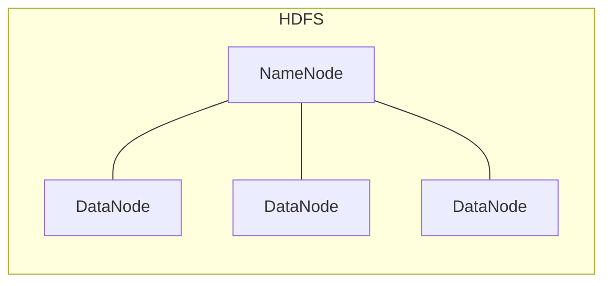
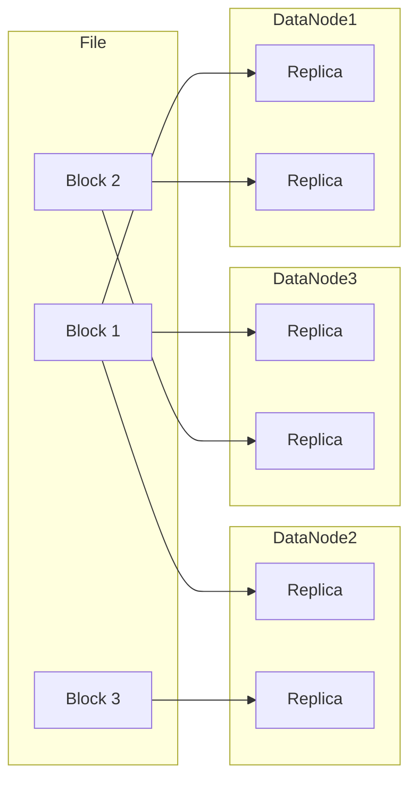

好的,我明白了您的要求。以下是题为《HDFS原理与代码实例讲解》的技术博客文章正文:

# HDFS原理与代码实例讲解

## 1.背景介绍

### 1.1 大数据时代的到来

随着互联网、移动互联网、物联网的快速发展,海量的结构化和非结构化数据被迅速产生,传统的数据存储和处理方式已经无法满足日益增长的需求。大数据时代的到来,对存储和处理大规模数据提出了新的挑战。

### 1.2 分布式文件系统的需求

为了解决大规模数据存储和处理的问题,分布式文件系统应运而生。传统的文件系统无法有效管理大规模数据,存在单点故障、扩展性差、数据冗余等问题。分布式文件系统通过在多台服务器上存储数据,提供了高容错性、高可扩展性和高吞吐量等优势。

### 1.3 HDFS概述

Apache Hadoop分布式文件系统(HDFS)是一种高度容错的分布式文件系统,旨在运行在廉价的机器上。它具有高容错性、高吞吐量、可以存储超大文件等特点,非常适合大数据分析场景。HDFS被广泛应用于大数据处理框架如Apache Hadoop和Apache Spark等。

## 2.核心概念与联系

### 2.1 HDFS架构

HDFS采用主从架构,包括一个NameNode(名称节点)和多个DataNode(数据节点)。



- **NameNode**负责管理文件系统的命名空间和客户端对文件的访问,维护文件系统树及数据块映射信息。
- **DataNode**负责存储实际数据块,并定期向NameNode发送心跳和块报告。

### 2.2 文件块

HDFS将文件分割成一个个块(默认128MB),并在DataNode上存储多个副本,以提供容错能力和数据局部性。



### 2.3 读写流程

- 写入流程:客户端先与NameNode通信获取文件块位置信息,然后直接与DataNode进行数据传输。
- 读取流程:客户端先从NameNode获取文件块位置信息,然后从最近的DataNode读取数据。

## 3.核心算法原理具体操作步骤

### 3.1 NameNode工作原理

NameNode负责维护整个文件系统的元数据,包括命名空间映射、文件到块的映射以及块到DataNode的映射等。它主要执行以下操作:

1. **处理客户端请求**:接收并响应客户端的文件系统操作请求,如打开、关闭、重命名或者删除文件或目录等。
2. **执行数据块映射**:记录文件到块的映射,以及块所在的DataNode信息。
3. **处理复制管理**:确定并维护每个块的复制系数,并在必要时启动复制过程。
4. **处理心跳和块报告**:周期性地接收来自DataNode的心跳和块报告信息,并维护整个HDFS的健康状态。
5. **处理集群元数据**:持久化存储文件系统元数据到本地磁盘。

### 3.2 DataNode工作原理

DataNode负责实际存储文件数据块,并执行数据块的读写操作。它主要执行以下操作:

1. **存储数据块**:在本地文件系统上持久化存储文件数据块。
2. **数据块服务**:处理来自客户端的数据块读写请求。
3. **块复制**:在需要时从其他DataNode复制数据块,以维护指定的复制系数。
4. **发送心跳和块报告**:定期向NameNode发送心跳信号和块报告,汇报本节点存储块的信息。

### 3.3 客户端操作流程

1. **写入流程**:
   - 客户端先与NameNode通信,获取文件的块位置信息。
   - 客户端根据块位置信息,直接与相应的DataNode建立连接,写入数据。
   - 在写入过程中,客户端会周期性地与NameNode通信,获取新分配的块位置。
   - 写入完成后,客户端通知NameNode完成写入操作。

2. **读取流程**:
   - 客户端先从NameNode获取文件的块位置信息。
   - 客户端根据块位置信息,直接从最近的DataNode读取数据。
   - 如果读取失败,客户端会从其他DataNode重新读取数据。

## 4.数学模型和公式详细讲解举例说明

### 4.1 数据块放置策略

HDFS采用机架感知数据块放置策略,以提高容错能力和数据局部性。具体来说,对于具有复制系数N的文件块:

- 第一个副本放置在上传文件的DataNode所在的节点。
- 第二个副本放置在与第一个副本不同的机架节点上。
- 剩余的N-2个副本分散放置在不同的机架节点上。

该策略可以用以下公式表示:

$$
\begin{align*}
&\text{写入第一个副本:} \\
&\qquad node_1 = \text{clientNode} \\
&\text{写入第二个副本:} \\
&\qquad \begin{cases}
    node_2 \in \text{different rack from } node_1, \\
    \qquad \text{if possible} \\
    node_2 \in \text{same rack as } node_1, \\
    \qquad \text{otherwise}
\end{cases}\\
&\text{写入第三个及后续副本:} \\
&\qquad node_x \in \text{different rack from } node_1, node_2, \ldots \\
&\qquad \qquad \qquad \qquad \text{and different nodes in same rack}
\end{align*}
$$

其中$node_x$表示第x个副本所在的DataNode。

这种策略可以最大程度地利用机架之间的网络带宽,并提供良好的容错能力和数据局部性。

### 4.2 复制放置选择

在进行块复制时,HDFS需要选择合适的DataNode来存储新的副本。这个过程由一个称为Replicator的组件执行,它根据以下几个因素来选择目标节点:

1. **避免堆积写入**:尽量选择空闲的DataNode,避免写入操作堆积在少数节点上。
2. **考虑节点可用空间**:选择有足够可用空间的DataNode。
3. **遵循机架感知策略**:确保新副本的放置符合机架感知策略。

Replicator使用一个成本函数来评估每个DataNode的适合程度,成本函数定义如下:

$$
\begin{align*}
\text{Cost} = &\lambda_1 \times \text{WriteCost} + \lambda_2 \times \text{ReadCost} \\
            &+ \lambda_3 \times \text{RackCost} + \lambda_4 \times \text{AdminCost}
\end{align*}
$$

其中:

- $\text{WriteCost}$衡量写入操作的开销,与DataNode上现有写入操作的数量成正比。
- $\text{ReadCost}$衡量读取操作的开销,与DataNode上现有读取操作的数量成正比。
- $\text{RackCost}$衡量是否符合机架感知策略,如果与现有副本位于同一机架,则成本较高。
- $\text{AdminCost}$是管理员设置的手动调整因子。
- $\lambda_1, \lambda_2, \lambda_3, \lambda_4$是对应的权重系数。

Replicator会选择成本最小的DataNode来存储新副本。

## 5.项目实践:代码实例和详细解释说明

下面是一个使用Java编写的简单HDFS客户端示例,演示如何在HDFS上创建目录、上传文件和读取文件内容。

```java
import org.apache.hadoop.conf.Configuration;
import org.apache.hadoop.fs.FileSystem;
import org.apache.hadoop.fs.Path;
import org.apache.hadoop.fs.FSDataOutputStream;
import org.apache.hadoop.fs.FSDataInputStream;
import org.apache.hadoop.io.IOUtils;

import java.io.BufferedInputStream;
import java.io.FileInputStream;
import java.io.InputStream;
import java.net.URI;

public class HDFSExample {

    public static void main(String[] args) throws Exception {
        // 配置HDFS URI
        String hdfsUri = "hdfs://namenode:9000";
        Configuration conf = new Configuration();
        conf.set("fs.defaultFS", hdfsUri);

        // 获取HDFS文件系统实例
        FileSystem fs = FileSystem.get(URI.create(hdfsUri), conf);

        // 创建目录
        Path dirPath = new Path("/user/example/input");
        if (!fs.exists(dirPath)) {
            fs.mkdirs(dirPath);
            System.out.println("Created directory: " + dirPath);
        }

        // 上传本地文件到HDFS
        String localFilePath = "data/input.txt";
        Path hdfsFilePath = new Path(dirPath + "/input.txt");
        uploadFile(fs, localFilePath, hdfsFilePath);

        // 读取HDFS文件内容
        readFile(fs, hdfsFilePath);

        // 关闭文件系统
        fs.close();
    }

    private static void uploadFile(FileSystem fs, String localFilePath, Path hdfsFilePath) throws Exception {
        try (BufferedInputStream inputStream = new BufferedInputStream(new FileInputStream(localFilePath))) {
            FSDataOutputStream outputStream = fs.create(hdfsFilePath);
            IOUtils.copyBytes(inputStream, outputStream, 1024, true);
            System.out.println("Uploaded file: " + hdfsFilePath);
        }
    }

    private static void readFile(FileSystem fs, Path hdfsFilePath) throws Exception {
        try (FSDataInputStream inputStream = fs.open(hdfsFilePath)) {
            System.out.println("File content:");
            IOUtils.copyBytes(inputStream, System.out, 1024, true);
        }
    }
}
```

代码解释:

1. 首先配置HDFS的URI,并获取HDFS文件系统实例。
2. 创建目录`/user/example/input`。如果目录不存在,则调用`mkdirs()`方法创建。
3. 调用`uploadFile()`方法将本地文件`data/input.txt`上传到HDFS路径`/user/example/input/input.txt`。
   - 使用`FileInputStream`读取本地文件内容。
   - 调用`fs.create()`方法创建HDFS文件输出流。
   - 使用`IOUtils.copyBytes()`方法将本地文件内容复制到HDFS文件输出流。
4. 调用`readFile()`方法读取HDFS文件`/user/example/input/input.txt`的内容。
   - 调用`fs.open()`方法获取HDFS文件输入流。
   - 使用`IOUtils.copyBytes()`方法将HDFS文件内容输出到控制台。
5. 最后关闭HDFS文件系统实例。

通过这个示例,您可以了解如何使用Java代码与HDFS进行交互,包括创建目录、上传文件和读取文件内容等基本操作。

## 6.实际应用场景

HDFS作为Apache Hadoop生态系统的核心组件,被广泛应用于各种大数据处理场景,包括但不限于:

### 6.1 大数据分析

HDFS为大数据分析框架(如Apache Hadoop MapReduce、Apache Spark等)提供了可靠的数据存储和访问方式。这些框架可以并行处理存储在HDFS上的大规模数据集,执行各种分析任务,如数据挖掘、机器学习、图分析等。

### 6.2 日志处理

许多大型网站和服务会产生海量的日志数据,HDFS可以有效存储和处理这些日志数据。通过在HDFS上存储日志数据,可以对日志进行分布式处理,提取有价值的信息,用于网站优化、用户行为分析、安全监控等。

### 6.3 物联网数据处理

物联网设备会产生大量的传感器数据,HDFS可以用于存储和处理这些数据。通过对物联网数据进行分析,可以提取有价值的信息,用于设备监控、预测维护、优化控制策略等。

### 6.4