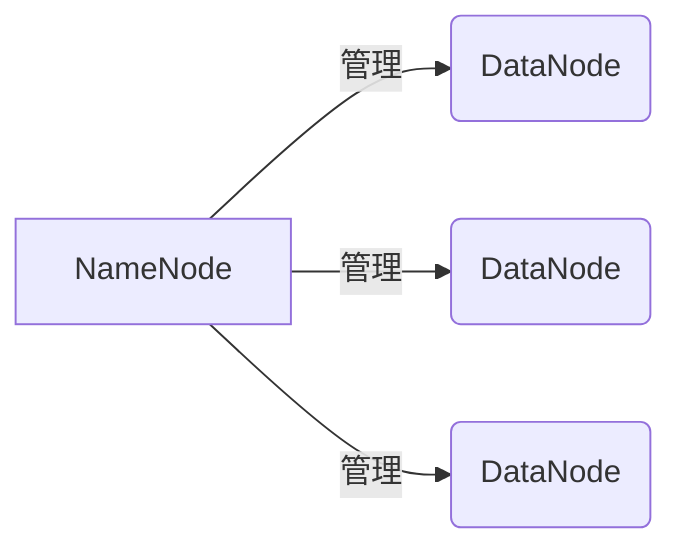
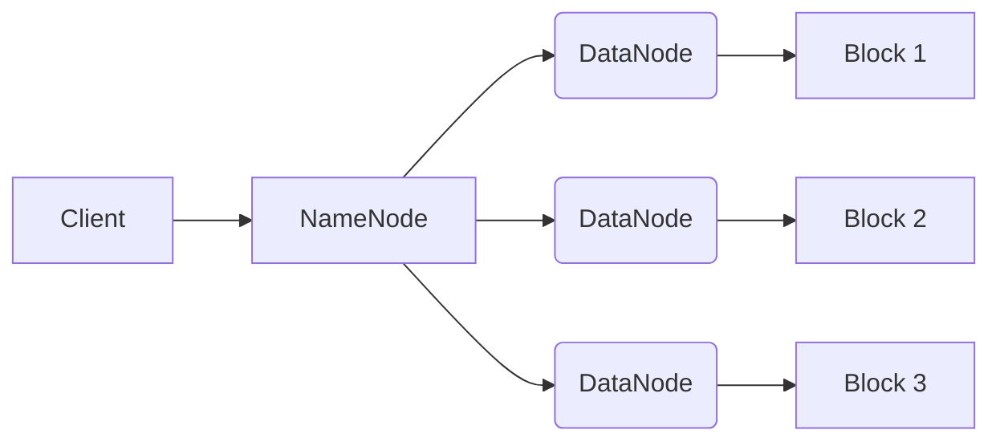
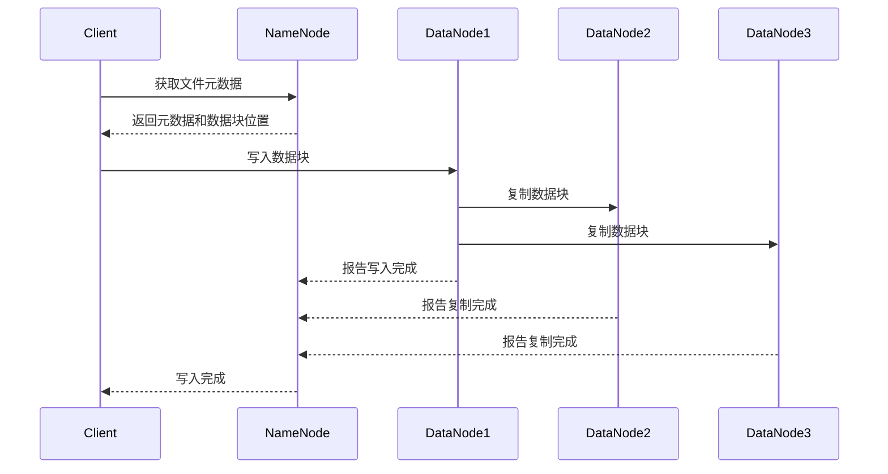
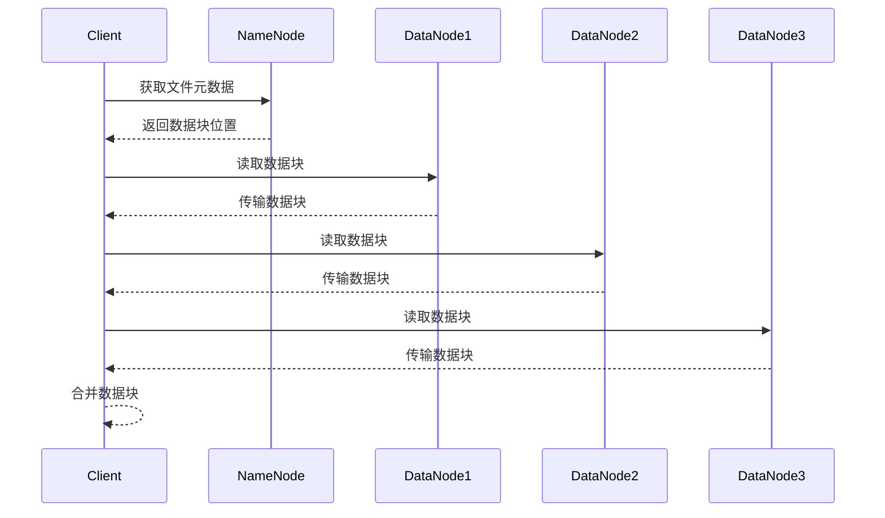

# HDFS原理与代码实例讲解专栏

## 1.背景介绍

### 1.1 大数据时代的到来

在当今时代,数据已经成为了一种新型的战略资源。随着互联网、物联网、移动互联网等新兴技术的快速发展,海量的数据正以前所未有的速度被产生和积累。据统计,2020年全球数据总量已达到59ZB(1ZB=1万亿GB),预计到2025年将达到175ZB。传统的数据存储和处理系统已经无法满足如此庞大数据量的需求,迫切需要一种全新的大数据处理架构。

### 1.2 Hadoop生态系统

Apache Hadoop是一个开源的分布式系统基础架构,主要由以下两个核心组件构成:

- **HDFS(Hadoop Distributed File System)**: 一种高可靠、高吞吐量的分布式文件系统,用于存储海量数据。
- **MapReduce**: 一种分布式数据处理模型,用于在大规模集群上并行处理海量数据。

Hadoop生态系统囊括了大数据处理的方方面面,除了HDFS和MapReduce之外,还包括了诸如HBase、Hive、Spark、Kafka等众多重要组件。

### 1.3 HDFS在大数据生态中的重要地位

作为Hadoop生态系统的核心组件之一,HDFS在大数据领域扮演着至关重要的角色。它为上层的数据访问模式(如MapReduce)提供了可靠的大规模数据存储服务。HDFS的设计目标是提供一个高容错性的文件系统,能够在廉价的商用硬件上可靠地运行。它具有以下主要特点:

- 高容错性:通过数据块的复制和机架感知策略,能够有效地应对节点故障。
- 高吞吐量:支持数据的并行传输,能够高效地传输海量数据。
- 大规模扩展:可以通过简单地增加更多的节点来线性扩展存储容量。

## 2.核心概念与联系

### 2.1 HDFS架构

HDFS遵循主从架构模式,主要由以下三个组件构成:



- **NameNode**: 集群的主节点,负责管理文件系统的命名空间和客户端对文件的访问。
- **DataNode**: 集群的从节点,负责实际存储文件数据块并执行读写操作。
- **Client**: 客户端,用于向HDFS发送读写请求。

### 2.2 文件块存储

HDFS采用了块存储的设计,一个文件被分割为多个块(默认128MB),并存储在不同的DataNode上。每个块都有多个副本(默认3个),以提供数据冗余和容错能力。



### 2.3 数据复制

HDFS通过复制数据块的方式来实现数据的容错性。当一个DataNode发生故障时,HDFS可以从其他存有相同块副本的DataNode上获取数据,从而保证数据的可用性。

### 2.4 机架感知策略

为了提高容错能力和数据可用性,HDFS采用了机架感知策略。在写入数据时,HDFS会尽量将块副本分散存储在不同的机架上,这样即使整个机架发生故障,数据也不会丢失。

## 3.核心算法原理具体操作步骤

### 3.1 写数据流程

当客户端向HDFS写入数据时,会经历以下步骤:

1. **客户端与NameNode通信**: 客户端首先与NameNode通信,获取文件的元数据信息。
2. **NameNode分配数据块**: NameNode根据机架感知策略,选择合适的DataNode,并分配数据块的存储位置。
3. **客户端写入数据块**: 客户端将数据块写入到指定的DataNode中。
4. **DataNode存储数据块**: DataNode在本地磁盘上存储数据块,并将数据块复制到其他DataNode上。
5. **DataNode向NameNode报告**: 当数据块写入完成后,DataNode会向NameNode报告操作结果。
6. **NameNode更新元数据**: NameNode更新文件系统的元数据信息,以反映数据块的存储位置。



### 3.2 读数据流程

当客户端从HDFS读取数据时,会经历以下步骤:

1. **客户端与NameNode通信**: 客户端首先与NameNode通信,获取文件的元数据信息。
2. **NameNode返回数据块位置**: NameNode返回文件对应的数据块位置信息。
3. **客户端读取数据块**: 客户端从最近的DataNode读取数据块。
4. **DataNode传输数据块**: DataNode将数据块传输给客户端。
5. **客户端合并数据块**: 客户端合并所有数据块,重构出完整的文件数据。



## 4.数学模型和公式详细讲解举例说明

### 4.1 数据块大小选择

HDFS中数据块的大小是一个非常重要的参数,它直接影响着系统的吞吐量和存储效率。数据块大小的选择需要权衡以下几个因素:

- 大数据块有利于提高吞吐量,减少寻址开销。
- 小数据块有利于提高存储效率,减少内存空间浪费。
- 小数据块有利于提高并行度,加快数据传输速度。

假设文件大小为$F$,数据块大小为$B$,则文件被划分为$\frac{F}{B}$个数据块。在HDFS中,每个数据块都有$R$个副本,因此总的存储空间需求为:

$$
S = F \times R \times \left( 1 + \frac{M}{B} \right)
$$

其中$M$为元数据开销。

为了最小化存储空间需求,我们可以对$B$求导:

$$
\frac{\partial S}{\partial B} = -\frac{F \times R \times M}{B^2} = 0
$$

解得$B = \sqrt{M \times F \times R}$。

例如,对于一个1TB的文件,元数据开销为1KB,副本数为3,则最优的数据块大小约为256MB。

### 4.2 数据块放置策略

HDFS采用机架感知策略来放置数据块副本,目的是提高容错能力和数据可用性。具体来说,对于每个数据块,HDFS会尽量将其副本分散存储在不同的机架上,以防止整个机架发生故障导致数据丢失。

假设集群中有$N$个机架,每个机架有$D$个DataNode,数据块副本数为$R$。我们希望最大化每个数据块在不同机架上的副本数量,从而提高容错能力。令$X_i$表示第$i$个数据块在不同机架上的副本数量,则我们需要最大化目标函数:

$$
\max \sum_{i=1}^{R} X_i
$$

subject to:

$$
\sum_{i=1}^{R} X_i \leq N \\
X_i \leq D, \quad \forall i
$$

这是一个整数线性规划问题,可以使用各种优化算法求解。

## 5.项目实践:代码实例和详细解释说明

以下是一个简单的Java示例代码,演示了如何在HDFS上创建目录、上传文件和读取文件的过程。

```java
import org.apache.hadoop.conf.Configuration;
import org.apache.hadoop.fs.FileSystem;
import org.apache.hadoop.fs.Path;
import java.io.InputStream;
import java.net.URI;

public class HDFSExample {
    public static void main(String[] args) throws Exception {
        // 配置HDFS URI
        Configuration conf = new Configuration();
        conf.set("fs.defaultFS", "hdfs://namenode:9000");
        FileSystem fs = FileSystem.get(URI.create("hdfs://namenode:9000"), conf);

        // 创建目录
        Path dir = new Path("/user/example");
        if (!fs.exists(dir)) {
            fs.mkdirs(dir);
            System.out.println("Created directory: " + dir);
        }

        // 上传文件
        Path file = new Path("/user/example/data.txt");
        InputStream in = HDFSExample.class.getResourceAsStream("/data.txt");
        fs.copyFromLocalFile(new Path(in.toString()), file);
        System.out.println("Uploaded file: " + file);

        // 读取文件
        InputStream inputStream = fs.open(file);
        byte[] buffer = new byte[inputStream.available()];
        inputStream.read(buffer);
        System.out.println("File contents: " + new String(buffer));

        // 关闭文件系统
        fs.close();
    }
}
```

代码解释:

1. 首先配置HDFS的URI,指定NameNode的地址和端口号。
2. 通过`FileSystem.get()`方法获取HDFS文件系统实例。
3. 使用`mkdirs()`方法在HDFS上创建目录。
4. 使用`copyFromLocalFile()`方法将本地文件上传到HDFS。
5. 使用`open()`方法打开HDFS上的文件,并读取其内容。
6. 最后关闭文件系统实例。

## 6.实际应用场景

HDFS作为一种高可靠、高吞吐量的分布式文件系统,在大数据领域有着广泛的应用场景:

1. **大数据分析**: HDFS为大数据分析平台(如Hadoop MapReduce、Spark)提供了可靠的数据存储服务,支持海量数据的并行处理。
2. **日志收集**: HDFS可以用于收集和存储各种系统日志数据,为日志分析和数据挖掘提供数据源。
3. **网络文件存储**: HDFS可以作为一种廉价且可靠的网络文件存储系统,用于存储各种大文件。
4. **数据备份**: HDFS的数据冗余机制使其非常适合用于数据备份和归档。
5. **物联网数据**: 物联网设备产生的海量数据可以存储在HDFS中,为后续的数据分析和处理提供支持。

## 7.工具和资源推荐

以下是一些常用的HDFS工具和学习资源:

- **HDFS命令行工具**: HDFS自带了一系列命令行工具,如`hdfs dfs`、`hdfs fsck`等,用于管理和维护HDFS文件系统。
- **HDFS Web UI**: HDFS提供了一个基于Web的用户界面,可以方便地查看集群状态、文件系统信息等。
- **Apache Hadoop官方文档**: Apache Hadoop项目的官方文档,包含了HDFS的详细介绍和使用指南。
- **HDFS权威指南**: 由Doug Cutting等Hadoop创始人撰写的经典书籍,深入剖析了HDFS的设计原理和实现细节。
- **Hadoop HDFS在线课程**: 一些知名在线教育平台(如Coursera、Udacity)提供了HDFS相关的视频课程。

## 8.总结:未来发展趋势与挑战

### 8.1 HDFS的未来发展趋势

- **异构存储支持**: 未来HDFS将支持多种异构存储介质(如SSD、Intel Optane等),以提高存储性能。
- **智能存储管理**: HDFS将采用更加智能的存储管理策略,自动优化数据布局和副本放置。
- **安全性和隐私性增强**: HDFS将加强对数据安全和隐私保护