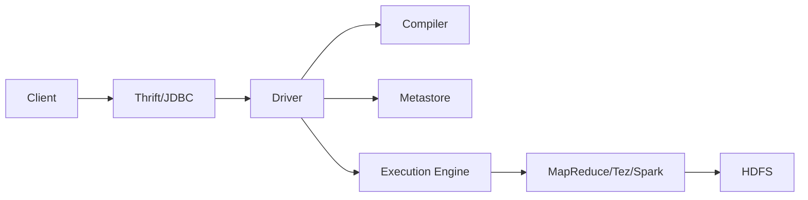

# HiveQL原理与代码实例讲解

## 1.背景介绍

### 1.1 大数据处理的需求
在当今大数据时代,企业每天都会产生海量的数据。如何高效地存储、处理和分析这些数据,成为企业面临的重大挑战。传统的关系型数据库已经无法满足大数据处理的需求,因此,大数据技术应运而生。

### 1.2 Hadoop生态系统
Hadoop作为大数据处理的事实标准,提供了一套完整的大数据处理解决方案。Hadoop生态系统包括HDFS分布式文件系统、MapReduce分布式计算框架、HBase分布式列存数据库、Hive数据仓库等组件,可以满足大数据存储、计算和分析的各种需求。

### 1.3 Hive的诞生
Hive最初由Facebook开发,后来成为Apache顶级开源项目。Hive定位于基于Hadoop的数据仓库工具,可以将结构化数据文件映射为一张数据库表,并提供HiveQL(类SQL)查询功能,底层由MapReduce实现。这使得具有SQL知识的分析师能够快速上手Hive进行大数据分析。

## 2.核心概念与联系

### 2.1 Hive与传统数据库对比

Hive在很多方面与传统关系数据库类似,但也有一些关键区别:

- 存储:Hive将数据存储在HDFS上,而不是本地文件系统。
- 计算:Hive查询由MapReduce任务执行,延迟较高但可扩展性强。 
- 模式:Hive使用Schema-on-Read,允许随时向表中添加字段。
- 事务:Hive不支持完整ACID事务,只能提供有限的更新删除操作。
- 索引:Hive 0.8后引入索引,但功能有限,使用较少。

### 2.2 HiveQL语法

HiveQL是Hive提供的类SQL语言,用于查询和管理Hive中的数据。HiveQL支持绝大部分标准SQL语法,同时也扩展了一些特性以更好地适应MapReduce计算模型:

- DDL语句:CREATE、ALTER、DROP等语句用于定义和管理Hive表。
- DML语句:SELECT、INSERT、UPDATE、DELETE等语句操作Hive表数据。
- 自定义函数(UDF):Hive允许用户使用Java扩展SQL的功能。
- 多表插入:一次查询可将数据插入到多个表。
- 分区:Hive表可以按照某个字段划分为多个分区,便于数据管理。

### 2.3 Hive系统架构

下面是一个简单的Hive系统架构图:



- Client:用户可通过Hive CLI、Beeline、Thrift/JDBC等多种方式提交HiveQL。
- Driver:解析HiveQL,生成执行计划。
- Compiler:将HiveQL编译为MapReduce/Tez/Spark任务。
- Metastore:存储Hive元数据,如表结构定义等。
- Execution Engine:执行生成的任务。

## 3.核心算法原理具体操作步骤

### 3.1 SQL到MapReduce的转换

Hive最关键的一点是将SQL查询转换为MapReduce任务。这个过程分为几个阶段:

1. 解析器:将SQL语句解析为抽象语法树AST。
2. 语义分析:分析表结构定义,解析表达式和生成查询块。
3. 逻辑计划生成:基于查询块生成逻辑查询计划。
4. 物理计划生成:将逻辑计划转换为MapReduce任务。
5. 优化器:对生成的MapReduce任务进行优化。

### 3.2 查询执行流程

一个HiveQL查询会被转换为一到多个MapReduce任务,执行流程如下:

1. 提交查询:用户通过CLI或其他接口提交HiveQL查询。
2. 生成任务:Hive根据查询生成MapReduce任务。
3. 提交任务:将任务提交到Hadoop集群执行。
4. 执行Map:从HDFS读取数据,按照查询要求进行处理。
5. 执行Reduce:汇总Map结果,进行聚合、排序、连接等操作。
6. 写回结果:将最终结果写回HDFS或返回给用户。

## 4.数学模型和公式详细讲解举例说明

### 4.1 JOIN操作原理

JOIN是HiveQL中最常用也是最复杂的操作之一。Hive中JOIN操作可以分为Map端JOIN和Reduce端JOIN。

#### Map端JOIN

如果一个表很小,Hive会将其全部加载到内存,在Map端直接进行JOIN。假设有表R和L,满足条件:

$$ \left | R \right | \ll \left | L \right | $$

则在Map端,对于L的每一行,Hive会遍历整个R表,找到所有满足JOIN条件的行,输出结果。这种方式避免了在Reduce端进行大量的数据传输。

#### Reduce端JOIN

如果两个表都很大,无法在Map端完成JOIN,则只能在Reduce端进行。过程如下:

1. Map端将两表的JOIN字段作为Key,将其余字段和表名作为Value输出。
2. Reduce端获得Key相同的数据,根据表名将数据分为两类。
3. 对两类数据进行笛卡尔积,找出所有满足JOIN条件的行输出。

这个过程可以表示为:

$$ R \bowtie L = \sigma _{R.a=L.a}(R \times L) $$

其中$\bowtie$表示JOIN操作,$\sigma$表示选择,R.a和L.a分别表示两表的JOIN字段。

### 4.2 数据倾斜问题

Hive中经常会遇到数据倾斜问题,即某些Key对应的数据量远大于其他Key,导致整个任务的执行时间很长。解决思路主要有:

1. 大表JOIN小表:尽量将小表放在右边,利用Map端JOIN。
2. 大表JOIN大表:将倾斜的Key单独处理,随机分配到Reduce任务。
3. 大表JOIN大表:将倾斜Key对应的数据单独存放,最后与JOIN结果合并。

## 5.项目实践：代码实例和详细解释说明

下面通过一个具体的例子来说明HiveQL的使用。假设有两个表:用户表(user)和订单表(order),结构如下:

```sql
-- 用户表
CREATE TABLE user(
  user_id INT,
  user_name STRING, 
  age INT
) ROW FORMAT DELIMITED FIELDS TERMINATED BY ',';

-- 订单表 
CREATE TABLE order(
  order_id INT,
  user_id INT,
  amount DOUBLE
) ROW FORMAT DELIMITED FIELDS TERMINATED BY ',';
```

### 5.1 加载数据

首先需要将数据文件加载到Hive表中:

```sql
-- 加载用户数据
LOAD DATA LOCAL INPATH '/path/to/user.txt' 
OVERWRITE INTO TABLE user;

-- 加载订单数据
LOAD DATA LOCAL INPATH '/path/to/order.txt' 
OVERWRITE INTO TABLE order;
```

### 5.2 SELECT查询

最基本的查询就是SELECT语句:

```sql
-- 查询用户ID、用户名和年龄
SELECT user_id, user_name, age 
FROM user
WHERE age > 20;
```

### 5.3 JOIN操作

JOIN操作用于关联两个表:

```sql
-- 查询用户名和订单金额
SELECT u.user_name, o.amount
FROM order o
JOIN user u ON o.user_id = u.user_id;
```

### 5.4 聚合操作

聚合操作包括COUNT、SUM、AVG、MAX、MIN等:

```sql
-- 查询每个用户的订单总金额
SELECT u.user_name, SUM(o.amount) AS total_amount
FROM order o
JOIN user u ON o.user_id = u.user_id
GROUP BY u.user_name;
```

### 5.5 窗口函数

Hive从0.11版本开始支持窗口函数,用于分组内的数据处理:

```sql
-- 查询每个用户的订单金额占总金额的比例
SELECT user_id,
  amount,
  SUM(amount) OVER(PARTITION BY user_id) AS total,
  amount/SUM(amount) OVER(PARTITION BY user_id) AS ratio
FROM order;  
```

## 6.实际应用场景

Hive在很多业务场景中都有广泛应用,下面列举几个典型案例:

### 6.1 日志分析

互联网公司每天都会产生大量的用户访问日志,如点击、浏览、搜索等。将这些日志导入Hive中,可以进行用户行为分析、流量统计等。

### 6.2 用户画像

电商、社交网站等都需要构建用户画像,即从用户的注册、访问、购买等信息中抽取用户特征。将这些数据导入Hive中,通过SQL分析可以实现用户画像的建立。

### 6.3 数据仓库

Hive是构建数据仓库的理想工具。将企业各个业务系统的数据导入Hive,可以进行联合分析,支持企业的决策分析。

## 7.工具和资源推荐

### 7.1 HUE
HUE是一个基于Web的交互式Hive查询工具,用户可以在浏览器中方便地编写和执行HiveQL。

### 7.2 Ambari
Ambari是Hadoop管理平台,提供了Hive的可视化管理界面,如启动停止服务、监控查询进度等。

### 7.3 官方文档
Hive的官方文档是学习和使用Hive的权威资料,网址为 https://cwiki.apache.org/confluence/display/Hive 。

## 8.总结：未来发展趋势与挑战

### 8.1 SQL标准化
Hive的SQL支持在不断完善,向标准SQL靠拢。未来Hive有望成为大数据领域通用的SQL方言。

### 8.2 查询引擎
MapReduce已经不能满足日益增长的交互式查询分析需求,Hive先后引入了Tez和Spark作为计算引擎,大幅提升了查询性能。未来Hive将支持更加高效、智能的计算引擎。

### 8.3 存储格式 
Hive早期使用TextFile存储,后来引入了SequenceFile、RCFile、ORC、Parquet等更高效的列式存储格式。未来列式存储将成为Hive的主流。

### 8.4 数据治理
如何管理Hive中的元数据、血缘、安全性是一个挑战。Hive需要与Atlas等数据治理工具深度集成,建立企业级的数据地图。

## 9.附录：常见问题与解答

### 9.1 Hive与HBase的区别？
Hive是数据仓库工具,主要用于数据分析;HBase是NoSQL数据库,主要用于数据存储。Hive可以借助HBase实现更快的查询。

### 9.2 Hive的数据存储在哪里？
Hive将元数据存储在关系数据库中,如MySQL、Derby等;表数据存储在HDFS上,可以为TextFile、SequenceFile、ORC等格式。

### 9.3 Hive支持Update和Delete吗？
Hive从0.14版本开始支持Update和Delete,但功能有限,使用时需谨慎。Hive不适合频繁的数据更新操作。

### 9.4 Hive如何优化查询？
可以通过以下方式优化Hive查询:
- 使用分区表和分桶表。
- 使用列式存储如ORC、Parquet。
- 使用索引(如果数据量不大)。
- 使用Map端JOIN。
- 开启中间压缩。
- 调整Mapper和Reducer数量。
- 使用Tez或Spark执行引擎。

作者：禅与计算机程序设计艺术 / Zen and the Art of Computer Programming