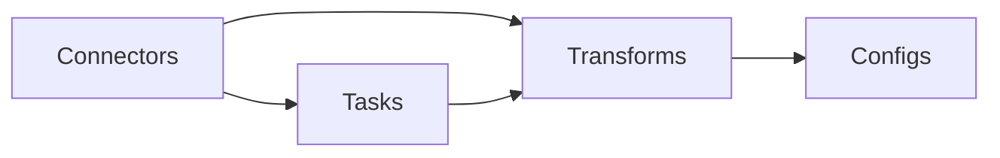
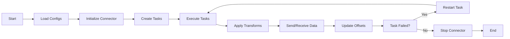

## 1.背景介绍

Apache Kafka 是一个分布式流处理平台，它的设计目标是提供高吞吐量的实时数据管道，以满足今天数据驱动的世界对实时数据处理的需求。Kafka Connect 是 Kafka 的一个组件，它提供了一个简单易用的方式来将数据从各种数据源导入 Kafka，以及将数据从 Kafka 导出到各种数据存储系统。

Kafka Connect 是一个可扩展的工具，可以运行在单个 Kafka broker 上，也可以作为一个分布式系统运行，处理大量的数据流。它的设计目标是让开发者和系统管理员能够轻松地构建和运行可重复使用的数据连接器，从而简化了数据导入/导出的工作。

## 2.核心概念与联系

在 Kafka Connect 的架构中，有几个核心概念需要理解：连接器(Connectors)，任务(Tasks)，转换器(Transforms)和转换器配置(Configs)。

- 连接器(Connectors)：连接器是 Kafka Connect 的主要组件，它负责管理数据的导入和导出。每个连接器都是一个独立的运行时实体，它可以运行在一个或多个 Kafka Connect worker 节点上。

- 任务(Tasks)：任务是连接器的工作单元，每个连接器可以有一个或多个任务。任务的数量取决于连接器的配置和数据源的性质。每个任务负责处理一部分数据，从而实现数据处理的并行化。

- 转换器(Transforms)：转换器是 Kafka Connect 的一个重要特性，它允许在数据导入或导出的过程中对数据进行转换。转换器可以是内置的，也可以是自定义的。

- 转换器配置(Configs)：转换器配置定义了转换器的行为。例如，一个日期格式化的转换器可能需要一个日期格式的配置。

这些概念之间的关系可以通过下面的 Mermaid 图表来展示：



## 3.核心算法原理具体操作步骤

Kafka Connect 的工作流程可以分为以下几个步骤：

1. Kafka Connect worker 启动并加载配置。

2. Kafka Connect worker 初始化并启动指定的连接器。

3. 连接器创建任务，并将任务分配给 Kafka Connect worker。

4. Kafka Connect worker 执行任务，从数据源读取数据或向数据存储系统写入数据。

5. Kafka Connect worker 应用转换器对数据进行转换。

6. Kafka Connect worker 将转换后的数据发送到 Kafka 或从 Kafka 接收数据。

7. Kafka Connect worker 在数据发送或接收完成后，更新任务的偏移量。

8. 如果任务失败，Kafka Connect worker 会尝试重新启动任务。

9. 当连接器停止时，Kafka Connect worker 会停止所有相关的任务。

这个过程可以通过下面的 Mermaid 图表来展示：



## 4.数学模型和公式详细讲解举例说明

在 Kafka Connect 中，数据分区和任务的分配是通过一种叫做一致性哈希(Consistent Hashing)的技术来实现的。一致性哈希是一种特殊的哈希技术，它在数据和任务的分配上有很好的均衡性和稳定性。

一致性哈希的基本思想是将所有的数据和任务映射到一个环形的哈希空间中，然后通过数据的哈希值来确定它应该被分配到哪个任务。这种方法的优点是，当任务的数量发生变化时，只有一小部分的数据需要被重新分配。

一致性哈希的数学模型可以使用以下的公式来描述：

假设我们有 $n$ 个数据项，$m$ 个任务，那么每个数据项 $d_i$ 被分配到任务 $t_j$ 的概率为：

$$ P(d_i \rightarrow t_j) = \frac{1}{m} $$

当任务的数量发生变化时，需要被重新分配的数据的比例为：

$$ \Delta = \frac{|m - m'|}{m} $$

其中，$m'$ 是任务数量变化后的值。

## 5.项目实践：代码实例和详细解释说明

下面是一个简单的 Kafka Connect 连接器的实现示例，这个连接器从一个文件中读取数据，并将数据发送到 Kafka。这个示例主要展示了如何创建连接器，以及如何在任务中处理数据。

```java
public class FileSourceConnector extends SourceConnector {
    private String filename;
    private String topic;

    @Override
    public void start(Map<String, String> props) {
        filename = props.get("file");
        topic = props.get("topic");
    }

    @Override
    public Class<? extends Task> taskClass() {
        return FileSourceTask.class;
    }

    @Override
    public List<Map<String, String>> taskConfigs(int maxTasks) {
        ArrayList<Map<String, String>> configs = new ArrayList<>();
        for (int i = 0; i < maxTasks; i++) {
            Map<String, String> config = new HashMap<>();
            config.put("file", filename);
            config.put("topic", topic);
            configs.add(config);
        }
        return configs;
    }

    @Override
    public void stop() {
        // Nothing to do
    }

    @Override
    public ConfigDef config() {
        return new ConfigDef().define("file", Type.STRING, Importance.HIGH, "Source filename.")
                              .define("topic", Type.STRING, Importance.HIGH, "Destination Kafka topic.");
    }

    @Override
    public String version() {
        return "1.0.0";
    }
}
```

在这个示例中，`start()` 方法用来初始化连接器，`taskClass()` 方法返回任务的类，`taskConfigs()` 方法用来生成任务的配置，`stop()` 方法用来停止连接器，`config()` 方法用来定义连接器的配置，`version()` 方法返回连接器的版本。

## 6.实际应用场景

Kafka Connect 在许多实际应用场景中都有广泛的应用，下面列举了几个典型的应用场景：

- 实时数据同步：Kafka Connect 可以用来实现数据库的实时数据同步，例如，将 MySQL 的数据实时同步到 Elasticsearch 中，以便进行实时的搜索和分析。

- 日志收集：Kafka Connect 可以用来收集各种系统的日志数据，然后将日志数据发送到 Kafka，再由其他系统进行处理和分析。

- 数据迁移：Kafka Connect 可以用来进行数据的批量迁移，例如，将数据从一个数据库迁移到另一个数据库。

- 数据备份：Kafka Connect 可以用来实现数据的实时备份，例如，将数据库的数据实时备份到 Hadoop HDFS。

## 7.工具和资源推荐

以下是一些有用的 Kafka Connect 相关的工具和资源：

- [Confluent Hub](https://www.confluent.io/hub/)：这是一个 Kafka Connect 连接器的市场，你可以在这里找到各种开源和商业的 Kafka Connect 连接器。

- [Kafka Connect API](https://kafka.apache.org/documentation/#connect_api)：这是 Kafka Connect API 的官方文档，你可以在这里找到关于如何开发 Kafka Connect 连接器的详细信息。

- [Kafka Connect GitHub](https://github.com/apache/kafka/tree/trunk/connect)：这是 Kafka Connect 的源码，你可以在这里找到 Kafka Connect 的最新代码和开发进度。

## 8.总结：未来发展趋势与挑战

随着数据驱动的应用越来越多，对实时数据处理的需求也越来越大。Kafka Connect 作为一个简单易用、可扩展的数据导入/导出工具，有很大的发展潜力。然而，Kafka Connect 也面临一些挑战，例如，如何处理大规模的数据流，如何处理各种复杂的数据源和数据存储系统，如何提供更好的故障恢复和数据一致性保证等。

## 9.附录：常见问题与解答

1. **问题：Kafka Connect 支持哪些数据源和数据存储系统？**

    答：Kafka Connect 支持各种数据源和数据存储系统，包括但不限于关系数据库，NoSQL 数据库，消息队列，文件系统，日志系统，搜索引擎，数据仓库，数据湖等。

2. **问题：Kafka Connect 如何保证数据的一致性？**

    答：Kafka Connect 使用偏移量来跟踪数据的位置，当任务失败并重新启动时，它会从最后一个成功的偏移量开始处理数据，从而保证数据的一致性。

3. **问题：Kafka Connect 支持哪些语言开发连接器？**

    答：Kafka Connect 的 API 是用 Java 开发的，因此，开发连接器通常使用 Java。然而，也有一些工具和库支持使用其他语言开发连接器，例如，[librdkafka](https://github.com/edenhill/librdkafka) 支持使用 C 和 C++ 开发连接器。

4. **问题：Kafka Connect 如何处理大规模的数据流？**

    答：Kafka Connect 可以作为一个分布式系统运行，处理大规模的数据流。它通过将数据分区和任务分配给多个 Kafka Connect worker 来实现数据处理的并行化。

5. **问题：Kafka Connect 如何处理各种复杂的数据源和数据存储系统？**

    答：Kafka Connect 提供了一个可扩展的插件架构，开发者可以为各种数据源和数据存储系统开发自定义的连接器。此外，市场上也有许多开源和商业的连接器可供选择。

作者：禅与计算机程序设计艺术 / Zen and the Art of Computer Programming