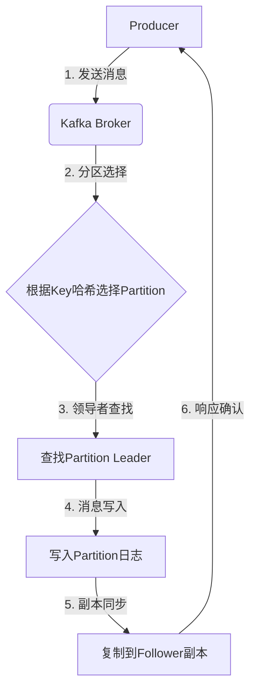
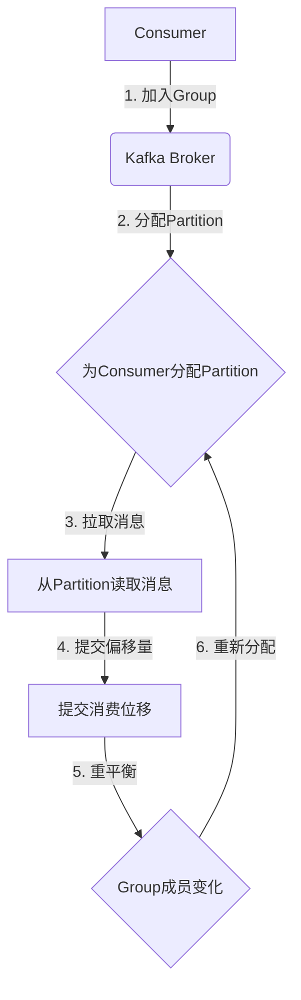

# Kafka Topic 原理与代码实例讲解

## 1. 背景介绍

Apache Kafka 是一个分布式流处理平台,它提供了一种统一、高吞吐、低延迟的方式来处理实时数据流。Kafka 被广泛应用于日志收集、消息系统、数据管道、流处理、事件源等场景。其核心概念之一就是 Topic,本文将深入探讨 Kafka Topic 的原理、实现和使用方式。

### 1.1 Kafka 简介

Apache Kafka 起源于 LinkedIn,后来被开源并加入 Apache 基金会。它是一个分布式流处理平台,具有以下关键特性:

- 高吞吐量、低延迟
- 可扩展性和容错性
- 持久化和可重放
- 分区和复制

Kafka 被设计用于构建实时数据管道和流应用程序。它可以实时获取数据,并将其持久化到磁盘,以供后续处理。

### 1.2 Topic 概念

在 Kafka 中,消息流被组织为 Topic。Topic 是一个逻辑概念,用于将消息分类和组织。每个 Topic 由一个或多个 Partition 组成,每个 Partition 是一个有序的、不可变的消息序列。

消息以追加的方式写入 Partition,并被分配一个连续的偏移量(offset)。消费者可以从任意偏移量开始读取消息,并按顺序消费。这种设计确保了消息的有序性和可重放性。

## 2. 核心概念与联系

### 2.1 Topic 与 Partition

Topic 是逻辑上的消息组织单元,而 Partition 是物理上的消息存储单元。一个 Topic 可以包含多个 Partition,每个 Partition 在集群中可以分布在不同的 Broker 上。

Partition 的引入带来了以下好处:

1. **水平扩展**: 通过增加 Partition 数量,可以提高 Topic 的吞吐量。
2. **并行处理**: 消费者可以同时从多个 Partition 读取消息,实现并行消费。
3. **容错性**: 通过复制机制,每个 Partition 可以有多个副本,确保数据的可靠性。

### 2.2 Topic 与 Producer

生产者(Producer)负责向 Topic 发送消息。发送消息时,Producer 可以指定消息的 Key,Kafka 会根据 Key 的哈希值将消息发送到对应的 Partition。如果没有指定 Key,Kafka 会使用循环分派算法将消息均匀分布到不同的 Partition。

### 2.3 Topic 与 Consumer

消费者(Consumer)从 Topic 中读取消息。Consumer 可以从任意偏移量开始读取消息,并按顺序消费。Kafka 提供了两种消费模式:

1. **单播(单个消费者)**: 一个 Partition 只能被一个 Consumer Group 内的一个消费者消费。
2. **广播(多个消费者)**: 一个 Partition 可以被多个 Consumer Group 内的多个消费者消费。

Consumer Group 是 Kafka 用于实现负载均衡和容错的关键概念。一个 Consumer Group 内的多个消费者协作消费 Topic 中的所有 Partition,每个消费者只消费一部分 Partition。

### 2.4 Topic 配置

每个 Topic 都有一些关键配置参数,用于控制其行为:

- `replication-factor`: 复制因子,即每个 Partition 的副本数量。
- `partition-count`: Topic 中 Partition 的数量。
- `retention.ms`: 消息在 Kafka 中保留的最长时间。
- `segment.bytes`: 单个日志段文件的最大大小。

## 3. 核心算法原理具体操作步骤

### 3.1 消息发送流程

当生产者向 Topic 发送消息时,Kafka 会执行以下步骤:

1. **分区选择**: 根据消息的 Key 计算哈希值,选择目标 Partition。
2. **领导者查找**: 查找该 Partition 的领导者(Leader) Broker。
3. **消息写入**: 将消息写入该 Partition 的日志文件。
4. **副本同步**: 将消息复制到该 Partition 的所有副本。
5. **响应确认**: 当所需的副本同步完成后,向生产者返回确认响应。



### 3.2 消息消费流程

当消费者从 Topic 读取消息时,Kafka 会执行以下步骤:

1. **Consumer Group 加入**: 消费者加入一个 Consumer Group。
2. **分区分配**: Kafka 为该 Consumer Group 内的每个消费者分配一部分 Partition。
3. **消息拉取**: 消费者从分配的 Partition 拉取消息。
4. **位移提交**: 消费者定期向 Kafka 提交已消费的消息偏移量。
5. **重平衡**: 当 Consumer Group 成员变化时,Kafka 会重新分配 Partition。



## 4. 数学模型和公式详细讲解举例说明

### 4.1 分区选择算法

Kafka 使用一致性哈希算法将消息分配到不同的 Partition。该算法基于消息的 Key 计算哈希值,并将哈希值映射到一个环形空间。

假设有 $n$ 个 Partition,消息的 Key 为 $k$,哈希函数为 $hash(k)$,则目标 Partition 的索引为:

$$
partition = hash(k) \bmod n
$$

这种算法可以确保相同的 Key 总是被映射到同一个 Partition,从而保证消息的有序性。

### 4.2 复制与容错

为了提高可靠性,Kafka 为每个 Partition 维护多个副本。其中,一个副本被选为领导者(Leader),其他副本为跟随者(Follower)。

当生产者向 Topic 发送消息时,消息首先被写入领导者副本,然后由领导者将消息复制到所有跟随者副本。只有当所需的副本数量(通过 `min.insync.replicas` 配置)已同步时,生产者才会收到确认响应。

如果领导者副本失效,Kafka 会从剩余的同步副本中选举一个新的领导者。这种复制和故障转移机制确保了 Kafka 的高可用性和容错性。

## 5. 项目实践: 代码实例和详细解释说明

### 5.1 创建 Topic

使用 Kafka 自带的 `kafka-topics.sh` 脚本可以创建新的 Topic:

```bash
bin/kafka-topics.sh --create \
    --bootstrap-server localhost:9092 \
    --replication-factor 3 \
    --partitions 6 \
    --topic my-topic
```

- `--replication-factor 3`: 设置复制因子为 3,即每个 Partition 有 3 个副本。
- `--partitions 6`: 设置 Topic 包含 6 个 Partition。

### 5.2 生产者示例

以下是使用 Java 编写的 Kafka 生产者示例:

```java
Properties props = new Properties();
props.setProperty("bootstrap.servers", "localhost:9092");
props.setProperty("key.serializer", "org.apache.kafka.common.serialization.StringSerializer");
props.setProperty("value.serializer", "org.apache.kafka.common.serialization.StringSerializer");

Producer<String, String> producer = new KafkaProducer<>(props);

for (int i = 0; i < 100; i++) {
    String key = "key-" + i;
    String value = "value-" + i;
    ProducerRecord<String, String> record = new ProducerRecord<>("my-topic", key, value);
    producer.send(record);
}

producer.flush();
producer.close();
```

- 首先配置 Kafka Broker 地址和序列化器。
- 创建 `KafkaProducer` 实例。
- 循环发送 100 条消息,每条消息包含一个 Key 和一个 Value。
- 最后关闭生产者。

### 5.3 消费者示例

以下是使用 Java 编写的 Kafka 消费者示例:

```java
Properties props = new Properties();
props.setProperty("bootstrap.servers", "localhost:9092");
props.setProperty("group.id", "my-group");
props.setProperty("key.deserializer", "org.apache.kafka.common.serialization.StringDeserializer");
props.setProperty("value.deserializer", "org.apache.kafka.common.serialization.StringDeserializer");

KafkaConsumer<String, String> consumer = new KafkaConsumer<>(props);
consumer.subscribe(Collections.singletonList("my-topic"));

while (true) {
    ConsumerRecords<String, String> records = consumer.poll(Duration.ofMillis(100));
    for (ConsumerRecord<String, String> record : records) {
        System.out.printf("offset = %d, key = %s, value = %s%n", record.offset(), record.key(), record.value());
    }
}
```

- 首先配置 Kafka Broker 地址、Consumer Group 和反序列化器。
- 创建 `KafkaConsumer` 实例,并订阅 `my-topic` Topic。
- 循环调用 `poll` 方法从 Topic 拉取消息。
- 打印每条消息的偏移量、Key 和 Value。

## 6. 实际应用场景

Kafka Topic 在许多实际应用场景中发挥着重要作用:

1. **日志收集**: 将应用程序日志发送到 Kafka Topic,实现集中式日志收集和处理。
2. **消息队列**: 使用 Kafka Topic 作为可靠的消息队列,实现异步通信和解耦。
3. **数据管道**: 将数据从各种来源(如数据库、传感器等)发送到 Kafka Topic,构建实时数据管道。
4. **流处理**: 从 Kafka Topic 消费数据,进行实时流处理和分析。
5. **事件源(Event Sourcing)**: 将应用程序的状态变更记录到 Kafka Topic,实现事件溯源和重放。

## 7. 工具和资源推荐

以下是一些有用的 Kafka 工具和资源:

- **Kafka Tool**: 一个基于 Web 的 Kafka 集群管理工具,提供了监控、主题管理等功能。
- **Kafka Manager**: 另一个流行的 Kafka 集群管理工具,具有丰富的功能和友好的 UI。
- **Kafka Streams**: Kafka 提供的一个流处理库,可以在 Kafka 集群内部进行流处理。
- **Confluent Platform**: Confluent 公司提供的一套商业化 Kafka 产品,包括集群管理、监控等工具。
- **Apache Kafka 官方文档**: Kafka 官方文档,包含了详细的概念解释和使用指南。

## 8. 总结: 未来发展趋势与挑战

Kafka 作为一个成熟的分布式流处理平台,在未来仍将面临一些挑战和发展趋势:

1. **云原生支持**: 随着云计算的普及,Kafka 需要更好地支持云原生环境,如 Kubernetes 集成。
2. **流处理集成**: Kafka 与其他流处理框架(如 Apache Flink、Apache Spark)的集成将变得更加紧密。
3. **事件驱动架构**: 事件驱动架构(Event-Driven Architecture)将成为主流,Kafka 作为事件源将扮演更加重要的角色。
4. **机器学习集成**: Kafka 将与机器学习框架更好地集成,支持实时数据的机器学习训练和推理。
5. **安全性和隐私性**:随着数据安全和隐私性要求的提高,Kafka 需要提供更强大的安全和隐私保护措施。

## 9. 附录: 常见问题与解答

### 9.1 如何选择合适的 Partition 数量?

选择合适的 Partition 数量是一个权衡的过程,需要考虑以下因素:

- **吞吐量**: 更多的 Partition 可以提高吞吐量,因为它们可以并行处理。
- **消费者数量**: Partition 数量应该大于或等于消费者数量,以实现有效的负载均衡。
- **数据大小**: 如果预期数据量很大,可以增加 Partition 数量,以避免单个 Partition 过大。

通常,建议将 Partition 数量设置为消费者数量的 2-3 倍,以