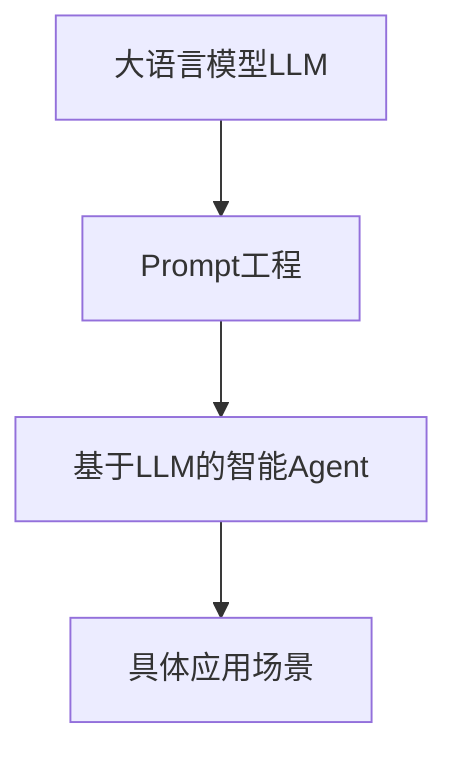

# LLM-based Agent的开源工具与框架

## 1. 背景介绍
### 1.1 人工智能与自然语言处理的发展
#### 1.1.1 人工智能的起源与发展历程
#### 1.1.2 自然语言处理技术的演进
#### 1.1.3 大语言模型(LLM)的出现与影响

### 1.2 LLM在人工智能领域的应用
#### 1.2.1 LLM在问答系统中的应用  
#### 1.2.2 LLM在文本生成任务中的应用
#### 1.2.3 LLM在知识图谱构建中的应用

### 1.3 LLM-based Agent的概念与优势
#### 1.3.1 LLM-based Agent的定义
#### 1.3.2 LLM-based Agent相比传统AI系统的优势
#### 1.3.3 LLM-based Agent的应用前景

## 2. 核心概念与联系
### 2.1 大语言模型(LLM)
#### 2.1.1 LLM的定义与原理
#### 2.1.2 LLM的训练方法
#### 2.1.3 常见的LLM模型介绍

### 2.2 Prompt工程
#### 2.2.1 Prompt的概念与作用
#### 2.2.2 如何设计高质量的Prompt
#### 2.2.3 Prompt工程的最佳实践

### 2.3 基于LLM的智能Agent
#### 2.3.1 智能Agent的定义与特点 
#### 2.3.2 LLM在构建智能Agent中的作用
#### 2.3.3 基于LLM的Agent的工作流程



## 3. 核心算法原理具体操作步骤
### 3.1 LLM的训练流程
#### 3.1.1 数据预处理
#### 3.1.2 模型结构设计
#### 3.1.3 模型训练与优化

### 3.2 基于LLM的文本生成算法
#### 3.2.1 Beam Search
#### 3.2.2 Top-k Sampling
#### 3.2.3 Nucleus Sampling

### 3.3 基于LLM的问答算法
#### 3.3.1 基于检索的问答
#### 3.3.2 基于生成的问答  
#### 3.3.3 Retrieval-Augmented Generation

## 4. 数学模型和公式详细讲解举例说明
### 4.1 Transformer模型
#### 4.1.1 Self-Attention机制
$Attention(Q,K,V) = softmax(\frac{QK^T}{\sqrt{d_k}})V$
#### 4.1.2 Multi-Head Attention
$$MultiHead(Q,K,V) = Concat(head_1,...,head_h)W^O$$
$$head_i=Attention(QW_i^Q,KW_i^K,VW_i^V)$$
#### 4.1.3 位置编码
$PE_{(pos,2i)} = sin(pos/10000^{2i/d_{model}})$
$PE_{(pos,2i+1)} = cos(pos/10000^{2i/d_{model}})$

### 4.2 GPT模型
#### 4.2.1 语言模型与极大似然估计
$L(\theta)=\sum_{i=1}^{m}logP(w_i|w_{i-1},...,w_1;\theta)$
#### 4.2.2 Masked Self-Attention
$Attention(Q,K,V)=softmax(\frac{QK^T+M}{\sqrt{d_k}})V$
#### 4.2.3 因果语言模型
$P(w_1, w_2, ..., w_n) = \prod_{i=1}^n P(w_i | w_1, ..., w_{i-1})$

## 5. 项目实践：代码实例和详细解释说明
### 5.1 使用Hugging Face的Transformers库
#### 5.1.1 加载预训练模型
```python
from transformers import AutoModelForCausalLM, AutoTokenizer

model_name = "gpt2"
model = AutoModelForCausalLM.from_pretrained(model_name)
tokenizer = AutoTokenizer.from_pretrained(model_name)
```
#### 5.1.2 文本生成
```python
prompt = "Once upon a time"
input_ids = tokenizer.encode(prompt, return_tensors='pt')

output = model.generate(input_ids, 
                        max_length=100, 
                        num_beams=5,
                        no_repeat_ngram_size=2,
                        early_stopping=True)

print(tokenizer.decode(output[0], skip_special_tokens=True))
```

### 5.2 使用OpenAI的API
#### 5.2.1 安装openai库
```bash
pip install openai
```
#### 5.2.2 设置API密钥
```python
import openai
openai.api_key = "your_api_key"
```
#### 5.2.3 调用API生成文本
```python
prompt = "写一个励志故事"
response = openai.Completion.create(
  engine="text-davinci-002",
  prompt=prompt,
  max_tokens=200,
  n=1,
  stop=None,
  temperature=0.7,
)

print(response.choices[0].text)
```

## 6. 实际应用场景
### 6.1 智能客服
#### 6.1.1 客户意图识别
#### 6.1.2 问题解答与对话
#### 6.1.3 个性化服务推荐

### 6.2 智能写作助手  
#### 6.2.1 文章写作辅助
#### 6.2.2 文本纠错与润色
#### 6.2.3 创意灵感激发

### 6.3 智能教育
#### 6.3.1 智能导师与答疑
#### 6.3.2 个性化学习路径规划
#### 6.3.3 作业批改与反馈

## 7. 工具和资源推荐
### 7.1 开源LLM模型
- [GPT-2](https://github.com/openai/gpt-2) 
- [GPT-Neo](https://github.com/EleutherAI/gpt-neo)
- [BLOOM](https://huggingface.co/bigscience/bloom)

### 7.2 LLM开发框架与平台
- [Hugging Face Transformers](https://huggingface.co/docs/transformers/index)
- [OpenAI API](https://openai.com/api/)  
- [LangChain](https://github.com/hwchase17/langchain)

### 7.3 Prompt工程资源
- [Prompt Engineering Guide](https://github.com/dair-ai/Prompt-Engineering-Guide)
- [Awesome Prompt Engineering](https://github.com/promptslab/Awesome-Prompt-Engineering)

## 8. 总结：未来发展趋势与挑战
### 8.1 LLM-based Agent的发展趋势
#### 8.1.1 模型规模与性能的持续提升
#### 8.1.2 多模态Agent的兴起 
#### 8.1.3 个性化与定制化趋势

### 8.2 LLM-based Agent面临的挑战
#### 8.2.1 数据隐私与安全问题
#### 8.2.2 模型鲁棒性与可解释性
#### 8.2.3 伦理与法律风险

### 8.3 展望未来
#### 8.3.1 人机协作新范式
#### 8.3.2 赋能传统行业转型升级
#### 8.3.3 开启人工智能新纪元

## 9. 附录：常见问题与解答
### 9.1 如何选择合适的LLM模型？
- 根据任务需求选择模型规模与类型
- 考虑计算资源与预算限制
- 评估模型在特定领域的表现

### 9.2 如何优化Prompt以提升效果？
- 明确任务目标与约束条件
- 提供必要的背景知识与指示
- 设计反例与对比来引导模型

### 9.3 如何处理LLM生成的不可控内容？
- 在Prompt中明确禁止生成有害内容
- 对生成结果进行内容过滤
- 持续优化与调整模型

作者：禅与计算机程序设计艺术 / Zen and the Art of Computer Programming