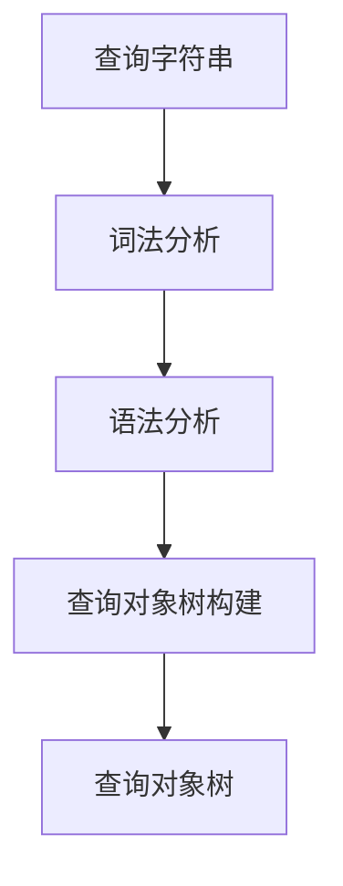

# Lucene查询解析：剖析查询过程

## 1.背景介绍

在现代信息时代,海量数据的高效检索和管理成为了一个关键的技术挑战。Apache Lucene作为一个高性能、全功能的搜索引擎库,已经广泛应用于各种场景,如网站搜索、电子邮件过滤、企业数据集成等。其核心功能之一就是支持灵活强大的查询语法,能够满足复杂查询需求。本文将深入探讨Lucene查询解析的内部原理,揭示查询是如何被解析和执行的。

## 2.核心概念与联系

### 2.1 查询语法

Lucene支持丰富的查询语法,包括:

- 基本术语查询(Term Query)
- 短语查询(Phrase Query)
- 布尔查询(Boolean Query)
- 通配符查询(Wildcard Query)
- 前缀查询(Prefix Query)
- 范围查询(Range Query)
- ...

这些查询可以单独使用,也可以通过布尔逻辑(AND、OR、NOT)组合使用,构建复杂的查询表达式。

### 2.2 查询解析器

查询解析器(QueryParser)是Lucene查询子系统的核心组件。它的职责是将查询字符串转换为Lucene内部的查询对象(Query)表示。查询对象树描述了查询的语义,用于指导后续的搜索过程。

Lucene提供了标准查询解析器(StandardQueryParser),也支持自定义解析器以满足特定需求。

### 2.3 查询重写

查询重写(Query Rewriting)是查询执行过程中的一个重要环节。它的目的是将原始查询转换为等效但更高效的形式,以提升查询性能。常见的重写技术包括:

- 查询规范化(Query Normalization)
- 查询常量折叠(Constant Scoring Rewrite)
- 块查询(Block Query)

### 2.4 查询执行

经过解析和重写后,查询对象将被传递给查询执行组件(Searcher)。Searcher负责在索引中查找匹配文档,并根据相关性打分,最终返回排序后的结果集。

## 3.核心算法原理具体操作步骤

### 3.1 查询解析流程

查询解析的核心流程如下:



1. **词法分析(Lexical Analysis)**: 将查询字符串分割为一个个有意义的词法单元(Token),如术语、短语、运算符等。
2. **语法分析(Syntax Analysis)**: 根据查询语法规则,分析词法单元之间的关系,构建语法树(Syntax Tree)。
3. **查询对象树构建**: 遍历语法树,为每个节点生成对应的查询对象(Query),并构建查询对象树。

### 3.2 查询重写算法

查询重写算法的核心思想是将原始查询转换为一个等效但更高效的形式。常见的重写技术包括:

1. **查询规范化**: 将查询中的同义词、拼写错误等进行规范化处理,以提高召回率。
2. **查询常量折叠**: 对于不依赖于索引的查询部分(如常量值),直接计算并折叠结果,避免不必要的搜索。
3. **块查询(Block Query)**: 将查询拆分为多个独立的子查询,并行执行,最后合并结果,以提高查询效率。

### 3.3 查询执行算法

查询执行算法的核心思路是:

1. **倒排索引查找**: 根据查询对象,在倒排索引中查找匹配的文档列表。
2. **相关性计算**: 对匹配文档进行相关性打分,常用的相关性模型包括TF-IDF、BM25等。
3. **结果排序**: 根据相关性分数对匹配文档进行排序。
4. **分页与优化**: 根据需求返回排序结果的一个子集,并应用各种优化策略(如缓存、预取等)以提升性能。

## 4.数学模型和公式详细讲解举例说明

### 4.1 TF-IDF相关性模型

TF-IDF(Term Frequency-Inverse Document Frequency)是一种经典的相关性计算模型。它将文档相关性分解为两个部分:

1. **词频(TF)**: 描述查询词在文档中出现的频率,用于衡量词与文档的相关程度。常用的TF计算公式如下:

$$
tf(t,d) = \frac{n_{t,d}}{\sum_{t' \in d} n_{t',d}}
$$

其中 $n_{t,d}$ 表示词 $t$ 在文档 $d$ 中出现的次数。

2. **逆文档频率(IDF)**: 描述查询词在整个文档集中的稀有程度,用于衡量词的区分能力。IDF计算公式如下:

$$
idf(t,D) = \log \frac{|D|}{|\{d \in D: t \in d\}|}
$$

其中 $|D|$ 表示文档集的总文档数, $|\{d \in D: t \in d\}|$ 表示包含词 $t$ 的文档数。

综合TF和IDF,文档 $d$ 对于查询 $q$ 的相关性分数可以表示为:

$$
\text{score}(q,d) = \sum_{t \in q} tf(t,d) \cdot idf(t,D)
$$

### 4.2 BM25相关性模型

BM25是一种概率模型,常用于信息检索领域。它的核心思想是根据查询词在文档和文档集中的统计信息,估计文档与查询的相关概率。BM25分数计算公式如下:

$$
\text{score}(q,d) = \sum_{t \in q} idf(t) \cdot \frac{tf(t,d) \cdot (k_1 + 1)}{tf(t,d) + k_1 \cdot (1 - b + b \cdot \frac{|d|}{avgdl})}
$$

其中:

- $tf(t,d)$ 表示词 $t$ 在文档 $d$ 中出现的次数
- $idf(t)$ 表示词 $t$ 的逆文档频率
- $|d|$ 表示文档 $d$ 的长度(字数)
- $avgdl$ 表示文档集的平均文档长度
- $k_1$ 和 $b$ 是调节参数,用于控制词频和文档长度的影响程度

BM25模型综合考虑了词频、逆文档频率和文档长度等多个因素,能够更准确地估计文档相关性。

## 5.项目实践:代码实例和详细解释说明

下面是一个使用Lucene进行查询的Java代码示例:

```java
// 1. 创建IndexReader
Directory indexDir = FSDirectory.open(Paths.get("/path/to/index"));
IndexReader reader = DirectoryReader.open(indexDir);

// 2. 创建IndexSearcher
IndexSearcher searcher = new IndexSearcher(reader);

// 3. 创建查询解析器
Analyzer analyzer = new StandardAnalyzer();
QueryParser parser = new QueryParser("content", analyzer);

// 4. 解析查询字符串
Query query = parser.parse("lucene search");

// 5. 执行查询并获取TopDocs
TopDocs topDocs = searcher.search(query, 10);

// 6. 遍历TopDocs获取结果
ScoreDoc[] hits = topDocs.scoreDocs;
for (ScoreDoc hit : hits) {
    Document doc = searcher.doc(hit.doc);
    System.out.println(doc.get("title"));
}

// 7. 关闭资源
reader.close();
indexDir.close();
```

代码解释:

1. 首先创建`IndexReader`来读取索引目录。
2. 使用`IndexReader`创建`IndexSearcher`对象,用于执行查询。
3. 创建`QueryParser`对象,指定要查询的字段和分析器。
4. 调用`parser.parse()`方法解析查询字符串,得到`Query`对象。
5. 调用`searcher.search()`方法执行查询,传入`Query`对象和需要返回的最大结果数。
6. 遍历`TopDocs`中的`ScoreDoc`对象,获取每个匹配文档的详细信息。
7. 最后关闭`IndexReader`和`Directory`以释放资源。

## 6.实际应用场景

Lucene查询解析技术在以下场景中发挥着重要作用:

1. **网站搜索**: 网站搜索引擎需要支持丰富的查询语法,满足用户的各种搜索需求。
2. **电子邮件搜索**: 在海量邮件中快速查找特定内容,常用于电子邮件客户端和企业邮件系统。
3. **日志分析**: 通过查询日志数据,快速定位和分析问题。
4. **企业数据集成**: 在异构数据源中进行联合搜索,实现数据集成。
5. **电商产品搜索**: 在海量产品数据中支持多维度、模糊查询,提升用户体验。
6. **社交媒体内容检索**: 对用户生成的大量社交媒体内容进行索引和搜索。

## 7.工具和资源推荐

以下是一些与Lucene查询解析相关的有用工具和资源:

1. **Luke**: 一款方便的Lucene索引浏览和诊断工具,可以查看索引结构、术语统计信息等。
2. **Lucene查询语法在线测试工具**: 如 [https://lucene.apache.org/core/](https://lucene.apache.org/core/) 提供的在线查询语法测试工具,方便快速验证查询语法。
3. **Lucene官方文档**: Apache Lucene官方文档 [https://lucene.apache.org/core/](https://lucene.apache.org/core/) 是学习Lucene查询语法和原理的权威资源。
4. **Lucene查询解析源码**: 阅读Lucene源码(如`org.apache.lucene.queryparser.classic`包)有助于深入理解查询解析的实现细节。
5. **Elastic Stack**: Elastic Stack(包括Elasticsearch、Kibana等)基于Lucene,提供了强大的搜索、分析和可视化功能,适用于各种应用场景。

## 8.总结:未来发展趋势与挑战

### 8.1 发展趋势

1. **自然语言查询**: 支持更自然、友好的查询方式,降低使用门槛。
2. **语义搜索**: 利用自然语言处理和知识图谱技术,实现基于语义的更精准查询。
3. **个性化和上下文化查询**: 根据用户画像、历史行为和上下文信息,提供个性化、智能化的查询体验。
4. **多模态查询**: 支持除文本外的多种模态输入(如图像、语音等),拓展查询的表达能力。
5. **可解释性和可信赖性**: 提高查询结果的可解释性和可信赖性,增强用户对系统的信任度。

### 8.2 挑战

1. **查询性能**: 随着数据量的不断增长,如何提高查询效率将是一个持续的挑战。
2. **查询相关性**: 准确捕捉用户查询意图,提高结果相关性,是一个长期的研究课题。
3. **查询语义理解**: 深入理解查询语义,实现更智能、更人性化的查询交互,需要自然语言处理等多学科知识的支持。
4. **隐私和安全**: 在查询过程中保护用户隐私,防止敏感信息泄露,是一个需要重视的问题。
5. **可解释性**: 提高查询结果的可解释性,让用户能够理解系统的决策过程,是一个值得关注的方向。

## 9.附录:常见问题与解答

1. **什么是查询解析?**

查询解析是将用户输入的查询字符串转换为Lucene内部的查询对象表示的过程。它包括词法分析、语法分析和查询对象树构建等步骤。

2. **Lucene支持哪些查询语法?**

Lucene支持多种查询语法,包括基本术语查询、短语查询、布尔查询、通配符查询、前缀查询、范围查询等。这些查询可以单独使用,也可以通过布尔逻辑组合使用。

3. **什么是查询重写?为什么需要查询重写?**

查询重写是将原始查询转换为等效但更高效的形式的过程。它的目的是提升查询性能。常见的重写技术包括查询规范化、查询常量折叠和块查询等。

4. **如何计算文档相关性分数?**

Lucene使用多种相关性模型来计算文档与查询的相关性分数,如TF-IDF模型和BM25模型。这些模型综合考虑了词频