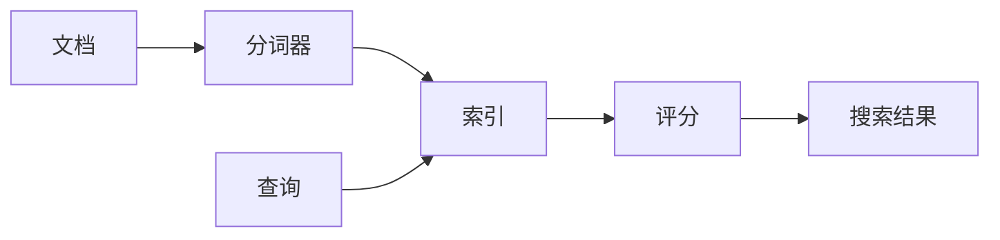

# Lucene：Java全文搜索引擎的王者

## 1. 背景介绍
### 1.1 全文搜索引擎的发展历程
#### 1.1.1 早期的全文搜索引擎
#### 1.1.2 现代全文搜索引擎的特点
#### 1.1.3 全文搜索引擎的应用场景

### 1.2 Lucene的诞生与发展
#### 1.2.1 Lucene的起源
#### 1.2.2 Lucene的发展历程
#### 1.2.3 Lucene在全文搜索领域的地位

### 1.3 为什么选择Lucene
#### 1.3.1 Lucene的优势
#### 1.3.2 Lucene与其他全文搜索引擎的比较
#### 1.3.3 Lucene在Java生态系统中的重要性

## 2. 核心概念与联系
### 2.1 索引(Index)
#### 2.1.1 索引的定义与作用
#### 2.1.2 索引的结构
#### 2.1.3 索引的构建过程

### 2.2 文档(Document)
#### 2.2.1 文档的定义
#### 2.2.2 文档的字段(Field)
#### 2.2.3 文档的分析与处理

### 2.3 分词器(Analyzer)
#### 2.3.1 分词器的作用
#### 2.3.2 Lucene内置的分词器
#### 2.3.3 自定义分词器

### 2.4 查询(Query)
#### 2.4.1 查询的类型
#### 2.4.2 查询的构建
#### 2.4.3 查询的执行与结果处理

### 2.5 评分(Scoring)
#### 2.5.1 评分的概念
#### 2.5.2 Lucene的评分机制
#### 2.5.3 自定义评分函数

### 2.6 核心概念之间的关系


## 3. 核心算法原理具体操作步骤
### 3.1 倒排索引
#### 3.1.1 倒排索引的原理
#### 3.1.2 倒排索引的构建步骤
#### 3.1.3 倒排索引的优化技巧

### 3.2 文档分析
#### 3.2.1 文档分析的流程
#### 3.2.2 分词算法
#### 3.2.3 词干提取与词形还原

### 3.3 查询解析
#### 3.3.1 查询解析的过程
#### 3.3.2 查询语法与查询树
#### 3.3.3 查询优化策略

### 3.4 相关性评分
#### 3.4.1 TF-IDF算法
#### 3.4.2 BM25算法
#### 3.4.3 向量空间模型

### 3.5 索引压缩
#### 3.5.1 索引压缩的必要性
#### 3.5.2 常见的索引压缩算法
#### 3.5.3 索引压缩的权衡

## 4. 数学模型和公式详细讲解举例说明
### 4.1 布尔模型
#### 4.1.1 布尔模型的定义
#### 4.1.2 布尔查询的表示
#### 4.1.3 布尔模型的局限性

### 4.2 向量空间模型
#### 4.2.1 向量空间模型的基本概念
#### 4.2.2 文档向量与查询向量
#### 4.2.3 余弦相似度计算

### 4.3 概率模型
#### 4.3.1 概率模型的理论基础
#### 4.3.2 语言模型
#### 4.3.3 BM25模型

### 4.4 TF-IDF权重计算
$$
w_{i,j} = tf_{i,j} \times \log{\frac{N}{df_i}}
$$
其中：
- $w_{i,j}$表示词项$t_i$在文档$d_j$中的权重
- $tf_{i,j}$表示词项$t_i$在文档$d_j$中的词频
- $N$表示文档集合中的文档总数
- $df_i$表示包含词项$t_i$的文档数

### 4.5 BM25相关性评分
$$
score(D,Q) = \sum_{i=1}^n IDF(q_i) \cdot \frac{f(q_i,D) \cdot (k_1+1)}{f(q_i,D) + k_1 \cdot (1-b+b \cdot \frac{|D|}{avgdl})}
$$
其中：
- $IDF(q_i)$表示查询词$q_i$的逆文档频率
- $f(q_i,D)$表示查询词$q_i$在文档$D$中的频率
- $|D|$表示文档$D$的长度
- $avgdl$表示文档集合的平均长度
- $k_1$和$b$是调节参数

## 5. 项目实践：代码实例和详细解释说明
### 5.1 创建索引
```java
Directory directory = FSDirectory.open(Paths.get("index"));
Analyzer analyzer = new StandardAnalyzer();
IndexWriterConfig config = new IndexWriterConfig(analyzer);
IndexWriter indexWriter = new IndexWriter(directory, config);

Document doc = new Document();
doc.add(new TextField("title", "Lucene in Action", Field.Store.YES));
doc.add(new TextField("content", "Lucene is a powerful search engine library.", Field.Store.YES));

indexWriter.addDocument(doc);
indexWriter.close();
```
上述代码创建了一个基于文件系统的索引目录，使用标准分词器，并添加了一个包含标题和内容字段的文档到索引中。

### 5.2 查询索引
```java
Directory directory = FSDirectory.open(Paths.get("index"));
IndexReader indexReader = DirectoryReader.open(directory);
IndexSearcher indexSearcher = new IndexSearcher(indexReader);

QueryParser queryParser = new QueryParser("content", new StandardAnalyzer());
Query query = queryParser.parse("lucene");

TopDocs topDocs = indexSearcher.search(query, 10);
ScoreDoc[] scoreDocs = topDocs.scoreDocs;

for (ScoreDoc scoreDoc : scoreDocs) {
    int docId = scoreDoc.doc;
    Document doc = indexSearcher.doc(docId);
    System.out.println("Title: " + doc.get("title"));
    System.out.println("Content: " + doc.get("content"));
}

indexReader.close();
```
上述代码打开之前创建的索引目录，创建索引读取器和搜索器，使用查询解析器解析查询字符串，执行查询并获取排名靠前的搜索结果，最后输出每个结果文档的标题和内容。

### 5.3 自定义分词器
```java
public class MyAnalyzer extends Analyzer {
    @Override
    protected TokenStreamComponents createComponents(String fieldName) {
        Tokenizer tokenizer = new WhitespaceTokenizer();
        TokenStream tokenStream = new LowerCaseFilter(tokenizer);
        tokenStream = new StopFilter(tokenStream, EnglishAnalyzer.ENGLISH_STOP_WORDS_SET);
        tokenStream = new PorterStemFilter(tokenStream);
        return new TokenStreamComponents(tokenizer, tokenStream);
    }
}
```
上述代码定义了一个自定义分词器，它使用空白字符分词，将词项转换为小写，去除停用词，并应用Porter词干提取算法。

### 5.4 高亮显示
```java
QueryScorer queryScorer = new QueryScorer(query);
Fragmenter fragmenter = new SimpleSpanFragmenter(queryScorer);
SimpleHTMLFormatter formatter = new SimpleHTMLFormatter("<em>", "</em>");
Highlighter highlighter = new Highlighter(formatter, queryScorer);
highlighter.setTextFragmenter(fragmenter);

String highlightedText = highlighter.getBestFragment(analyzer, "content", doc.get("content"));
```
上述代码使用Lucene的高亮功能，根据查询对文档内容进行高亮显示。它创建了一个查询评分器、片段生成器和HTML格式化器，并使用高亮器获取最佳的高亮片段。

## 6. 实际应用场景
### 6.1 网站搜索
#### 6.1.1 网站内容的索引与搜索
#### 6.1.2 搜索结果的排序与分页
#### 6.1.3 搜索建议与自动补全

### 6.2 文档管理系统
#### 6.2.1 文档的索引与分类
#### 6.2.2 文档的全文搜索与关键词提取
#### 6.2.3 文档的相似度计算

### 6.3 日志分析
#### 6.3.1 日志数据的索引与查询
#### 6.3.2 异常日志的检测与告警
#### 6.3.3 日志的统计与可视化

### 6.4 电商搜索
#### 6.4.1 商品信息的索引与检索
#### 6.4.2 多字段搜索与过滤
#### 6.4.3 搜索结果的个性化与推荐

### 6.5 社交媒体分析
#### 6.5.1 用户生成内容的索引与搜索
#### 6.5.2 情感分析与舆情监测
#### 6.5.3 热点话题与趋势分析

## 7. 工具和资源推荐
### 7.1 Lucene官方文档
### 7.2 Lucene源码
### 7.3 Solr - 基于Lucene的企业级搜索服务器
### 7.4 Elasticsearch - 基于Lucene的分布式搜索和分析引擎
### 7.5 Lucene社区与论坛
### 7.6 相关书籍推荐
#### 7.6.1 《Lucene in Action》
#### 7.6.2 《Elasticsearch: The Definitive Guide》
#### 7.6.3 《Solr in Action》

## 8. 总结：未来发展趋势与挑战
### 8.1 Lucene的发展方向
#### 8.1.1 性能优化与可扩展性
#### 8.1.2 多语言支持与语义搜索
#### 8.1.3 机器学习与智能搜索

### 8.2 全文搜索领域的挑战
#### 8.2.1 大数据量下的索引与查询效率
#### 8.2.2 非结构化数据的处理与分析
#### 8.2.3 用户意图理解与个性化搜索

### 8.3 Lucene在未来的应用前景
#### 8.3.1 企业级搜索与知识管理
#### 8.3.2 智能问答与对话系统
#### 8.3.3 数据挖掘与商业智能

## 9. 附录：常见问题与解答
### 9.1 如何选择合适的分词器？
### 9.2 如何优化索引的构建速度？
### 9.3 如何实现多字段搜索与权重调整？
### 9.4 如何处理中文分词与搜索？
### 9.5 如何实现实时索引更新？
### 9.6 如何进行分布式搜索？
### 9.7 如何评估搜索结果的质量？
### 9.8 如何实现搜索结果的高亮显示？
### 9.9 如何处理同义词与词义消歧？
### 9.10 如何进行相关性反馈与查询扩展？

作者：禅与计算机程序设计艺术 / Zen and the Art of Computer Programming