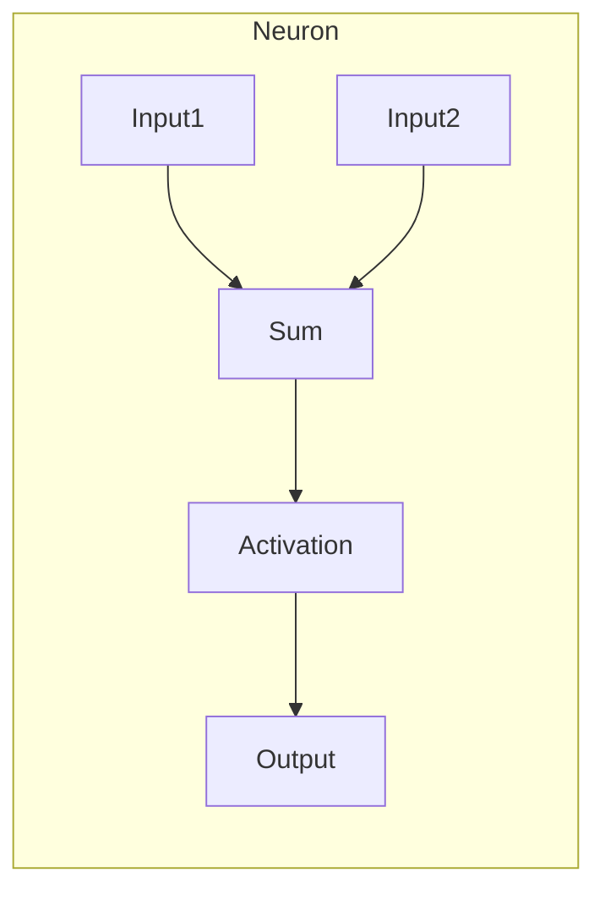
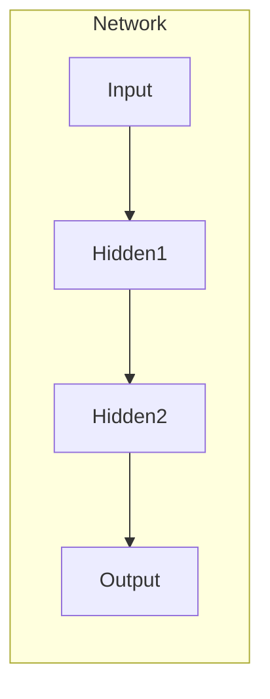
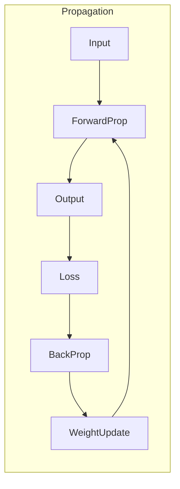

# Neural Network

## 1.背景介绍

神经网络是一种灵活且强大的机器学习模型,其设计灵感来源于生物神经系统的结构和功能。它由大量互连的节点(称为神经元)组成,这些节经元通过加权连接进行信息传递和处理。神经网络擅长从大量数据中自动学习模式和特征,并对新的输入数据进行预测或决策。

神经网络在过去几十年中经历了多次复兴,并在多个领域取得了卓越的成就,如计算机视觉、自然语言处理、语音识别等。随着算力的不断提升和大量数据的积累,神经网络展现出了强大的学习和泛化能力,成为当前人工智能领域最成功的技术之一。

## 2.核心概念与联系

### 2.1 神经元

神经网络的基本计算单元是神经元(Neuron),它接收来自其他神经元或输入数据的信号,对这些信号进行加权求和,然后通过一个非线性激活函数产生输出信号。每个神经元都有一组可调整的权重参数,这些参数在训练过程中不断更新,以最小化预测误差。



### 2.2 网络结构

神经元通过大量的连接组织成层次结构,形成神经网络。一个典型的神经网络由输入层、隐藏层和输出层组成。输入层接收原始数据,隐藏层对数据进行特征提取和转换,输出层产生最终的预测或决策结果。



### 2.3 前向传播与反向传播

在神经网络的工作过程中,输入数据沿着网络层次结构向前传播,每个神经元根据加权输入和激活函数计算输出。在训练阶段,网络的输出与期望输出之间的误差会通过反向传播算法,自动调整每个神经元的权重参数,使得整个网络逐步优化,最小化预测误差。



## 3.核心算法原理具体操作步骤  

### 3.1 前向传播算法

前向传播算法描述了输入数据在神经网络中的传播过程,具体步骤如下:

1. 初始化网络权重参数,通常使用小的随机值。
2. 对于每个输入样本:
    a. 将输入数据传递到输入层。
    b. 对于每一个隐藏层:
        i. 计算每个神经元的加权输入。
        ii. 将加权输入传递到激活函数,获得神经元的输出。
        iii. 将输出传递到下一层。
    c. 输出层的输出就是网络对该输入样本的预测结果。

### 3.2 反向传播算法

反向传播算法用于根据预测误差调整网络权重参数,具体步骤如下:

1. 计算输出层的预测误差(损失函数)。
2. 对于每一层(从输出层开始,向输入层反向传播):
    a. 计算每个神经元的误差梯度。
    b. 根据误差梯度和学习率,更新每个神经元的权重参数。
3. 重复步骤1和2,直到网络收敛或达到最大迭代次数。

### 3.3 优化算法

为了加快训练过程和提高模型性能,通常会使用一些优化算法来更新网络权重,如:

- **随机梯度下降(SGD)**: 在每个小批量数据上更新权重。
- **动量优化**: 在梯度方向上加入动量项,加速收敛。
- **自适应学习率优化**: 根据梯度的历史信息自适应调整每个参数的学习率,如AdaGrad、RMSProp、Adam等。

## 4.数学模型和公式详细讲解举例说明

### 4.1 神经元模型

单个神经元的数学模型可以表示为:

$$
y = \phi\left(\sum_{i=1}^{n}w_ix_i + b\right)
$$

其中:
- $x_i$是第$i$个输入
- $w_i$是第$i$个输入的权重
- $b$是偏置项
- $\phi$是激活函数,如Sigmoid、ReLU等

### 4.2 损失函数

为了评估网络的预测误差,通常会定义一个损失函数(Loss Function),如均方误差、交叉熵等。以均方误差为例:

$$
L = \frac{1}{2N}\sum_{i=1}^{N}(y_i - t_i)^2
$$

其中:
- $N$是训练样本数量
- $y_i$是网络对第$i$个样本的预测输出
- $t_i$是第$i$个样本的真实标签

### 4.3 反向传播

反向传播算法的核心是通过链式法则计算每个权重参数的梯度,以便更新参数。以单层神经网络为例:

$$
\frac{\partial L}{\partial w_j} = \frac{\partial L}{\partial y}\frac{\partial y}{\partial z}\frac{\partial z}{\partial w_j}
$$

其中:
- $\frac{\partial L}{\partial y}$是损失函数对输出的梯度
- $\frac{\partial y}{\partial z}$是激活函数对加权输入的梯度
- $\frac{\partial z}{\partial w_j}$是加权输入对第$j$个权重的梯度

通过反向传播,可以计算出每个权重参数的梯度,并根据梯度下降法更新参数值。

### 4.4 示例:二分类问题

考虑一个二分类问题,输入是一个二维向量$\mathbf{x} = (x_1, x_2)$,输出是一个0或1的标量。我们可以构建一个单层神经网络:

$$
z = w_1x_1 + w_2x_2 + b\\
y = \sigma(z)
$$

其中$\sigma$是Sigmoid激活函数。

对于一个训练样本$(\mathbf{x}, t)$,我们可以定义二元交叉熵损失函数:

$$
L = -[t\log(y) + (1-t)\log(1-y)]
$$

通过反向传播,我们可以计算出权重参数的梯度:

$$
\begin{aligned}
\frac{\partial L}{\partial w_1} &= \frac{\partial L}{\partial y}\frac{\partial y}{\partial z}\frac{\partial z}{\partial w_1}\\
&= (y - t)y(1-y)x_1\\
\frac{\partial L}{\partial w_2} &= (y - t)y(1-y)x_2\\
\frac{\partial L}{\partial b} &= (y - t)y(1-y)
\end{aligned}
$$

根据梯度下降法,我们可以更新权重参数:

$$
\begin{aligned}
w_1 &\leftarrow w_1 - \eta\frac{\partial L}{\partial w_1}\\
w_2 &\leftarrow w_2 - \eta\frac{\partial L}{\partial w_2}\\
b &\leftarrow b - \eta\frac{\partial L}{\partial b}
\end{aligned}
$$

其中$\eta$是学习率。重复这个过程,直到网络收敛或达到最大迭代次数。

## 5.项目实践:代码实例和详细解释说明

以下是一个使用Python和PyTorch框架实现的简单前馈神经网络示例,用于解决二分类问题。

```python
import torch
import torch.nn as nn
import torch.optim as optim

# 定义网络结构
class Net(nn.Module):
    def __init__(self, input_size, hidden_size, output_size):
        super(Net, self).__init__()
        self.fc1 = nn.Linear(input_size, hidden_size)
        self.relu = nn.ReLU()
        self.fc2 = nn.Linear(hidden_size, output_size)
        self.sigmoid = nn.Sigmoid()

    def forward(self, x):
        out = self.fc1(x)
        out = self.relu(out)
        out = self.fc2(out)
        out = self.sigmoid(out)
        return out

# 准备数据
X = torch.randn(100, 2)  # 100个二维输入样本
y = torch.randint(0, 2, (100,)).float()  # 100个0或1的标签

# 初始化网络和优化器
net = Net(2, 10, 1)
criterion = nn.BCELoss()
optimizer = optim.SGD(net.parameters(), lr=0.01)

# 训练网络
for epoch in range(1000):
    outputs = net(X)
    loss = criterion(outputs, y.unsqueeze(1))
    optimizer.zero_grad()
    loss.backward()
    optimizer.step()

    if epoch % 100 == 0:
        print(f'Epoch {epoch}, Loss: {loss.item():.4f}')
```

代码解释:

1. 我们定义了一个简单的前馈神经网络`Net`,包含一个隐藏层和一个输出层。
2. 生成了100个二维输入样本`X`和对应的0或1标签`y`。
3. 初始化网络`net`、损失函数`criterion`(二元交叉熵)和优化器`optimizer`(随机梯度下降)。
4. 在训练循环中,我们执行以下步骤:
    a. 通过`net(X)`获取网络输出。
    b. 计算输出与标签之间的损失。
    c. 反向传播计算梯度。
    d. 更新网络参数。
5. 每100个epoch打印一次当前的损失值。

通过这个示例,您可以了解如何使用PyTorch构建、训练和优化一个简单的神经网络模型。您还可以尝试修改网络结构、超参数或优化算法,观察对模型性能的影响。

## 6.实际应用场景

神经网络在许多领域都有广泛的应用,下面列举了一些典型的应用场景:

1. **计算机视觉**:图像分类、目标检测、语义分割、图像生成等。
2. **自然语言处理**:机器翻译、文本生成、情感分析、问答系统等。
3. **语音识别**:自动语音识别、语音合成等。
4. **推荐系统**:个性化推荐、内容推荐等。
5. **金融领域**:股票预测、欺诈检测、风险评估等。
6. **医疗健康**:医学图像分析、疾病诊断、药物发现等。
7. **游戏AI**:下棋AI、游戏AI代理等。
8. **控制系统**:机器人控制、自动驾驶等。

随着计算能力的不断提高和数据量的增加,神经网络在更多领域展现出了强大的能力,并不断推动着人工智能技术的发展。

## 7.工具和资源推荐

为了更好地学习和应用神经网络技术,以下是一些推荐的工具和资源:

1. **深度学习框架**:
    - PyTorch: https://pytorch.org/
    - TensorFlow: https://www.tensorflow.org/
    - Keras: https://keras.io/

2. **在线课程**:
    - Deep Learning Specialization (Coursera)
    - Deep Learning (fast.ai)
    - Neural Networks and Deep Learning (Deeplearning.ai)

3. **书籍**:
    - "Deep Learning" by Ian Goodfellow, Yoshua Bengio, and Aaron Courville
    - "Neural Networks and Deep Learning" by Michael Nielsen

4. **论文**:
    - ImageNet Classification with Deep Convolutional Neural Networks (AlexNet)
    - Attention Is All You Need (Transformer)
    - Generative Adversarial Nets (GAN)

5. **开源库和工具**:
    - NumPy: 科学计算库
    - Pandas: 数据分析库
    - Matplotlib: 数据可视化库
    - OpenCV: 计算机视觉库
    - NLTK: 自然语言处理库
    - Scikit-learn: 机器学习库

6. **在线社区**:
    - Reddit: /r/MachineLearning, /r/DeepLearning
    - GitHub: 各种开源深度学习项目和资源
    - Stack Overflow: 技术问题讨论

利用这些工具和资源,您可以更深入地学习神经网络的理论和实践,并将其应用于各种领域的实际问题中。

## 8.总结:未来发展趋势与挑战

神经网络技术在过去几年取得了长足的进步,但仍然面临着一些挑战和未来发展方向:

1. **可解释性和可信赖性**:当前的神经网络模型通常被视为"黑箱",缺乏可解释性和透明度,这在一些关键领域(如医疗、金融等)可能会带来风险。未来需要开发更加可解释和可信