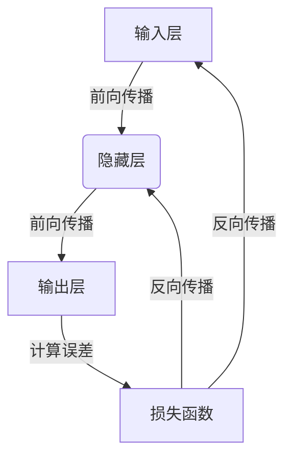

# Neural Networks原理与代码实例讲解

## 1.背景介绍

神经网络是一种受生物神经系统启发而设计的机器学习模型,旨在模仿人脑的工作原理。它由大量互连的节点(神经元)组成,这些节点可以传递信号并进行运算。神经网络具有自动学习和模式识别的能力,能够从数据中提取特征并进行预测或决策。

神经网络在深度学习领域得到了广泛应用,涉及图像识别、自然语言处理、语音识别等多个领域。随着算力的提升和大数据时代的到来,神经网络展现出了强大的数据处理能力,成为人工智能领域的核心技术之一。

## 2.核心概念与联系

### 2.1 神经元

神经元是神经网络的基本计算单元,它接收一个或多个输入信号,对这些信号进行加权求和,然后通过一个激活函数产生输出信号。每个神经元都有自己的权重和偏置值,这些参数在训练过程中会不断调整,以最小化预测误差。

### 2.2 网络结构

神经网络通常由多层神经元组成,包括输入层、隐藏层和输出层。输入层接收原始数据,隐藏层对数据进行特征提取和转换,输出层产生最终的预测或决策结果。不同层次之间的神经元通过权重连接进行信息传递。

### 2.3 前向传播

前向传播是神经网络进行预测的过程。输入数据从输入层开始,经过隐藏层的多次变换,最终到达输出层产生结果。在这个过程中,每个神经元根据其权重和激活函数对输入信号进行加权求和和非线性变换。

### 2.4 反向传播

反向传播是神经网络进行训练的过程。它根据实际输出和期望输出之间的误差,通过链式法则计算每个权重的梯度,然后使用优化算法(如梯度下降)调整权重和偏置,以最小化误差。这个过程会不断重复,直到网络达到预期的性能水平。



## 3.核心算法原理具体操作步骤

神经网络的训练过程可以概括为以下步骤:

1. **初始化权重和偏置**：通常使用小的随机值对权重和偏置进行初始化。

2. **前向传播**：输入数据通过网络层层传递,每个神经元根据权重和激活函数进行计算,产生输出结果。

3. **计算损失**：将网络输出与期望输出进行比较,计算损失函数(如均方误差或交叉熵)。

4. **反向传播**：使用链式法则计算每个权重相对于损失函数的梯度。

5. **更新权重和偏置**：根据梯度和学习率,使用优化算法(如梯度下降)更新权重和偏置。

6. **重复训练**：重复步骤2-5,直到网络达到预期的性能或达到最大迭代次数。

以下是一个简化的反向传播算法示例:

```python
# 前向传播
for layer in network:
    inputs = layer.forward(inputs)

# 计算损失
loss = loss_function(outputs, targets)

# 反向传播
gradients = []
for layer in reversed(network):
    gradients = layer.backward(gradients, loss)
    loss = update_weights(layer, gradients)
```

## 4.数学模型和公式详细讲解举例说明

### 4.1 神经元计算

对于单个神经元,其计算过程可以用以下公式表示:

$$
y = f\left(\sum_{i=1}^{n}w_ix_i + b\right)
$$

其中:
- $x_i$是第$i$个输入
- $w_i$是第$i$个输入对应的权重
- $b$是神经元的偏置
- $f$是激活函数,如Sigmoid、ReLU等

激活函数引入非线性,使神经网络能够拟合复杂的函数。常用的激活函数包括:

- Sigmoid: $f(x) = \frac{1}{1 + e^{-x}}$
- ReLU: $f(x) = \max(0, x)$
- Tanh: $f(x) = \frac{e^x - e^{-x}}{e^x + e^{-x}}$

### 4.2 反向传播

反向传播使用链式法则计算每个权重相对于损失函数的梯度。对于单层神经网络,权重梯度可以表示为:

$$
\frac{\partial L}{\partial w_{ij}} = \frac{\partial L}{\partial y_j}\frac{\partial y_j}{\partial u_j}\frac{\partial u_j}{\partial w_{ij}}
$$

其中:
- $L$是损失函数
- $y_j$是第$j$个神经元的输出
- $u_j$是第$j$个神经元的加权输入
- $w_{ij}$是连接第$i$个输入和第$j$个神经元的权重

对于多层神经网络,需要使用反向传播算法逐层计算梯度。

### 4.3 优化算法

梯度下降是最常用的优化算法之一,用于更新权重和偏置。其公式为:

$$
w_{ij}^{(t+1)} = w_{ij}^{(t)} - \eta\frac{\partial L}{\partial w_{ij}}
$$

其中$\eta$是学习率,控制更新的步长。

除了普通的梯度下降,还有一些变体算法,如动量梯度下降、RMSProp、Adam等,可以提高收敛速度和稳定性。

## 5.项目实践:代码实例和详细解释说明

以下是一个使用PyTorch实现的简单前馈神经网络示例,用于对MNIST手写数字数据集进行分类。

```python
import torch
import torch.nn as nn
import torch.nn.functional as F

# 定义网络结构
class Net(nn.Module):
    def __init__(self):
        super(Net, self).__init__()
        self.fc1 = nn.Linear(28 * 28, 512)  # 输入层到隐藏层
        self.fc2 = nn.Linear(512, 256)  # 隐藏层到隐藏层
        self.fc3 = nn.Linear(256, 10)  # 隐藏层到输出层

    def forward(self, x):
        x = x.view(-1, 28 * 28)  # 将输入数据展平
        x = F.relu(self.fc1(x))  # 激活函数ReLU
        x = F.relu(self.fc2(x))
        x = self.fc3(x)
        return x

# 实例化网络
net = Net()

# 定义损失函数和优化器
criterion = nn.CrossEntropyLoss()
optimizer = torch.optim.SGD(net.parameters(), lr=0.01)

# 训练循环
for epoch in range(10):
    running_loss = 0.0
    for i, data in enumerate(trainloader, 0):
        inputs, labels = data
        optimizer.zero_grad()  # 梯度清零

        outputs = net(inputs)  # 前向传播
        loss = criterion(outputs, labels)  # 计算损失
        loss.backward()  # 反向传播
        optimizer.step()  # 更新权重

        running_loss += loss.item()
        if i % 1000 == 999:
            print('[%d, %5d] loss: %.3f' %
                  (epoch + 1, i + 1, running_loss / 1000))
            running_loss = 0.0

print('Finished Training')
```

代码解释:

1. 定义网络结构:
   - 输入层接收展平的28x28像素图像
   - 两个隐藏层,分别有512和256个神经元
   - 输出层有10个神经元,对应10个数字类别

2. 实例化网络、损失函数和优化器。

3. 训练循环:
   - 对每个批次的数据进行前向传播,计算损失
   - 反向传播,计算梯度
   - 使用优化器更新权重
   - 每1000次迭代打印当前损失

该示例展示了如何使用PyTorch构建、训练和优化一个简单的神经网络模型。在实际应用中,您可以根据具体任务调整网络结构、超参数和优化策略。

## 6.实际应用场景

神经网络在以下领域有着广泛的应用:

1. **计算机视觉**:图像分类、目标检测、语义分割等。
2. **自然语言处理**:机器翻译、文本生成、情感分析等。
3. **语音识别**:语音转文本、语音合成等。
4. **推荐系统**:个性化推荐、内容过滤等。
5. **金融**:股票预测、欺诈检测、风险管理等。
6. **医疗**:医学影像分析、疾病诊断、药物发现等。
7. **游戏**:人工智能代理、游戏策略等。

神经网络的应用范围正在不断扩大,它已成为各个领域人工智能应用的核心技术之一。

## 7.工具和资源推荐

以下是一些常用的神经网络工具和资源:

1. **深度学习框架**:
   - PyTorch: https://pytorch.org/
   - TensorFlow: https://www.tensorflow.org/
   - Keras: https://keras.io/

2. **数据集**:
   - MNIST: http://yann.lecun.com/exdb/mnist/
   - ImageNet: http://www.image-net.org/
   - COCO: https://cocodataset.org/

3. **在线课程**:
   - Deep Learning Specialization (Coursera): https://www.coursera.org/specializations/deep-learning
   - Deep Learning (fast.ai): https://course.fast.ai/

4. **书籍**:
   - Deep Learning Book (Ian Goodfellow et al.): https://www.deeplearningbook.org/
   - Neural Networks and Deep Learning (Michael Nielsen): http://neuralnetworksanddeeplearning.com/

5. **论文**:
   - ArXiv: https://arxiv.org/

6. **社区**:
   - Reddit: https://www.reddit.com/r/MachineLearning/
   - Stack Overflow: https://stackoverflow.com/questions/tagged/neural-network

这些资源可以帮助您深入学习神经网络的理论和实践,并了解最新的研究进展和应用案例。

## 8.总结:未来发展趋势与挑战

神经网络在过去几年取得了长足的进步,但仍面临一些挑战和发展方向:

1. **可解释性**:神经网络常被视为"黑箱",缺乏可解释性,这在一些关键领域(如医疗、金融)可能会受到质疑。提高模型的可解释性是一个重要方向。

2. **鲁棒性**:神经网络对于对抗性攻击和噪声数据较为脆弱,提高模型的鲁棒性是一个挑战。

3. **少样本学习**:神经网络通常需要大量的训练数据,而在一些领域获取大量标注数据困难。发展少样本学习技术是一个重要方向。

4. **模型压缩**:神经网络模型通常体积庞大,不利于部署到资源受限的设备上。模型压缩和加速技术将有助于模型的实际应用。

5. **自监督学习**:如何利用大量未标注数据进行有效学习,是一个具有挑战性的研究方向。

6. **新型架构**:探索新的网络架构和计算模型,以提高神经网络的表现力和效率,是一个持续的研究课题。

7. **硬件加速**:专门设计的硬件加速器(如GPU、TPU等)将进一步推动神经网络的发展和应用。

总的来说,神经网络仍有广阔的发展空间,未来将在理论、算法、应用等多个方面取得突破性进展。

## 9.附录:常见问题与解答

1. **什么是过拟合?如何避免过拟合?**

过拟合是指模型过于复杂,以至于对训练数据拟合得太好,但在新的数据上表现较差。避免过拟合的方法包括:
- 增加训练数据量
- 使用正则化技术(如L1/L2正则化)
- 采用dropout等技术
- 提前停止训练
- 使用适当的网络结构和超参数

2. **什么是梯度消失/爆炸问题?如何解决?**

梯度消失/爆炸是深度神经网络训练时常见的问题。梯度值在反向传播时可能会exponentially衰减或爆炸,导致权重无法正常更新。解决方案包括:
- 使用ReLU等不饱和的激活函数
- 使用批量归一化
- 使用梯度剪裁
- 