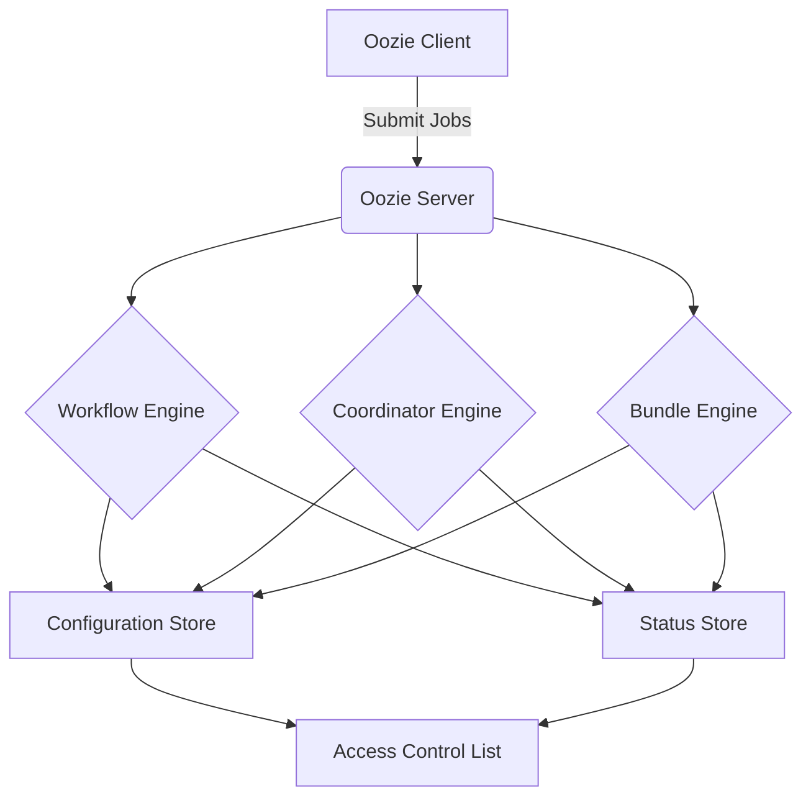

# Oozie原理与代码实例讲解

## 1.背景介绍

### 1.1 什么是Oozie?

Apache Oozie是一个用于管理Hadoop作业(如MapReduce、Pig、Hive等)的工作流调度系统。它可以将多个作业组合成一个逻辑上的工作流,并提供了一种简单而强大的方式来定义执行顺序和执行条件。Oozie使用DAG(有向无环图)的概念来设计工作流,允许用户创建复杂的数据处理流程。

### 1.2 为什么需要Oozie?

在大数据处理中,通常需要执行多个相互依赖的作业。手动执行和管理这些作业是一项艰巨的任务,容易出错且效率低下。Oozie的出现就是为了解决这个问题,它提供了一种集中式的方式来定义、调度和监控复杂的数据处理流程。

### 1.3 Oozie的优势

- **可靠性**:Oozie能够自动处理作业失败和重新执行,确保作业的可靠性。
- **可扩展性**:Oozie可以轻松地管理大量的作业和工作流。
- **操作简单**:Oozie提供了一种声明式的XML语言来定义工作流,易于理解和维护。
- **安全性**:Oozie支持基于Kerberos的安全认证。
- **监控和报告**:Oozie提供了详细的作业执行日志和报告,方便监控和故障排查。

## 2.核心概念与联系

### 2.1 Oozie的核心概念

- **Workflow**:工作流是由多个动作(Action)组成的有向无环图(DAG)。
- **Action**:动作是工作流中的基本单位,可以是MapReduce作业、Pig作业、Hive作业等。
- **Coordinator**:协调器用于定义基于时间(如每天、每小时等)或数据可用性(如新文件到达HDFS)的重复工作流。
- **Bundle**:捆绑包是多个协调器和工作流的集合,用于管理更大规模的数据处理流程。

### 2.2 Oozie的体系结构

Oozie的体系结构由以下几个主要组件组成:

1. **Workflow Engine**:负责执行和管理工作流。
2. **Coordinator Engine**:负责执行和管理协调器。
3. **Bundle Engine**:负责执行和管理捆绑包。
4. **Configuration Store**:存储Oozie的配置信息。
5. **Status Store**:存储作业的状态和执行日志。
6. **Access Control List**:管理Oozie的权限控制。



## 3.核心算法原理具体操作步骤

### 3.1 工作流执行原理

Oozie工作流的执行过程如下:

1. **定义工作流**:使用Oozie工作流定义语言(XML)定义工作流,包括动作的类型、执行顺序和依赖关系等。

2. **提交工作流**:将工作流定义提交给Oozie服务器。

3. **解析工作流**:Oozie服务器解析工作流定义,构建内部表示。

4. **执行动作**:按照工作流定义中的顺序和依赖关系执行每个动作。

5. **监控状态**:Oozie监控每个动作的执行状态,并根据状态决定后续操作。

6. **失败处理**:如果某个动作失败,Oozie可以根据配置决定重试或终止整个工作流。

7. **完成工作流**:所有动作执行完毕后,工作流结束。

### 3.2 协调器执行原理

Oozie协调器的执行过程如下:

1. **定义协调器**:使用Oozie协调器定义语言(XML)定义协调器,包括执行时间、输入数据等。

2. **提交协调器**:将协调器定义提交给Oozie服务器。

3. **解析协调器**:Oozie服务器解析协调器定义,构建内部表示。

4. **创建工作流实例**:根据协调器定义和触发条件(时间或数据可用性),创建工作流实例。

5. **执行工作流实例**:执行工作流实例,过程同工作流执行原理。

6. **监控状态**:Oozie监控协调器和工作流实例的执行状态。

7. **重复执行**:根据协调器定义,周期性地创建和执行新的工作流实例。

### 3.3 捆绑包执行原理

Oozie捆绑包的执行过程如下:

1. **定义捆绑包**:使用Oozie捆绑包定义语言(XML)定义捆绑包,包括协调器列表和其他元数据。

2. **提交捆绑包**:将捆绑包定义提交给Oozie服务器。

3. **解析捆绑包**:Oozie服务器解析捆绑包定义,构建内部表示。

4. **执行协调器**:按照捆绑包定义,执行每个协调器,过程同协调器执行原理。

5. **监控状态**:Oozie监控捆绑包、协调器和工作流实例的执行状态。

6. **管理生命周期**:Oozie管理捆绑包的整个生命周期,包括暂停、恢复和终止等操作。

## 4.数学模型和公式详细讲解举例说明

在Oozie中,没有直接使用复杂的数学模型或公式。但是,在定义工作流和协调器时,可以使用一些简单的表达式来描述执行条件和依赖关系。

### 4.1 表达式语法

Oozie使用EL(Expression Language)表达式语言来描述条件和依赖关系。EL表达式的基本语法如下:

```
${expression}
```

其中,`expression`可以是以下几种形式:

- 常量值,如`${123}`或`${"hello"}`
- 属性引用,如`${wf:actionData('action1')['key']}`
- 函数调用,如`${fn:concat('a', 'b')}`
- 运算符表达式,如`${value1 > value2}`

### 4.2 常用函数

Oozie提供了一些内置函数,可以在表达式中使用。以下是一些常用函数:

- `wf:actionData(actionName)`:获取指定动作的输出数据。
- `wf:lastErrorNode()`:获取最后一个失败动作的名称。
- `wf:lastErrorMessage()`:获取最后一个失败动作的错误消息。
- `coord:dateOffset(instanceTime, offset)`:计算日期偏移。
- `coord:formatTime(instanceTime, pattern)`:格式化时间戳。

### 4.3 示例

以下是一个使用EL表达式的示例,定义了一个工作流中动作的执行条件:

```xml
<action name="my-action">
    <ok to="next-action"/>
    <error to="error-handler"/>
    <transition event="my-action-complete" 
                target="next-action">
        ${wf:actionData('my-action')['exit-code'] eq 0}
    </transition>
</action>
```

在这个示例中,`my-action`动作的执行结果将根据`exit-code`的值决定下一步动作。如果`exit-code`为0,则执行`next-action`动作;否则执行`error-handler`动作。

## 5.项目实践:代码实例和详细解释说明

### 5.1 定义工作流

以下是一个简单的Oozie工作流定义示例:

```xml
<workflow-app name="my-workflow" xmlns="uri:oozie:workflow:0.5">
    <start to="import-data"/>
    
    <action name="import-data">
        <sqoop xmlns="uri:oozie:sqoop-action:0.2">
            <job-tracker>${jobTracker}</job-tracker>
            <name-node>${nameNode}</name-node>
            <command>import --connect ${jdbcUrl} --table ${dbTable} --target-dir ${targetDir}</command>
        </sqoop>
        <ok to="transform-data"/>
        <error to="error-handler"/>
    </action>

    <action name="transform-data">
        <pig>
            <script>transform.pig</script>
            <file>${nameNode}/scripts/transform.pig</file>
        </pig>
        <ok to="export-data"/>
        <error to="error-handler"/>
    </action>

    <action name="export-data">
        <hive xmlns="uri:oozie:hive-action:0.2">
            <job-tracker>${jobTracker}</job-tracker>
            <name-node>${nameNode}</name-node>
            <script>${nameNode}/scripts/export.hql</script>
        </hive>
        <ok to="end"/>
        <error to="error-handler"/>
    </action>

    <kill name="error-handler">
        <message>Error occurred, workflow failed.</message>
    </kill>
    <end name="end"/>
</workflow-app>
```

这个工作流包含以下几个动作:

1. `import-data`:使用Sqoop从关系数据库导入数据到HDFS。
2. `transform-data`:使用Pig对导入的数据进行转换。
3. `export-data`:使用Hive将转换后的数据导出到Hive表中。

工作流定义中还包含了错误处理逻辑,如果任何一个动作失败,将执行`error-handler`动作并终止工作流。

### 5.2 提交和执行工作流

提交工作流的命令如下:

```
oozie job -config job.properties -run
```

其中,`job.properties`文件包含了工作流所需的配置参数,如HDFS路径、数据库连接信息等。

执行工作流后,可以使用以下命令查看工作流的状态和日志:

```
oozie job -info <job-id>
oozie job -log <job-id>
```

### 5.3 定义协调器

以下是一个简单的Oozie协调器定义示例:

```xml
<coordinator-app name="my-coordinator" start="2023-05-01T00:00Z" end="2023-05-08T23:59Z" frequency="${coord:days(1)}" timezone="UTC" xmlns="uri:oozie:coordinator:0.4">
    <controls>
        <timeout>10</timeout>
        <concurrency>1</concurrency>
        <execution>FIFO</execution>
    </controls>
    <datasets>
        <dataset name="input-data" frequency="${coord:days(1)}" initial-instance="2023-05-01T00:00Z" timezone="UTC">
            <uri-template>${nameNode}/data/input/${YEAR}/${MONTH}/${DAY}</uri-template>
        </dataset>
    </datasets>
    <input-events>
        <data-in name="input-data" dataset="input-data">
            <instance>${coord:current(0)}</instance>
        </data-in>
    </input-events>
    <action>
        <workflow>
            <app-path>${nameNode}/workflows/my-workflow</app-path>
            <configuration>
                <property>
                    <name>inputDir</name>
                    <value>${coord:formatTime(coord:nominalTime(), 'yyyy/MM/dd')}</value>
                </property>
            </configuration>
        </workflow>
    </action>
</coordinator-app>
```

这个协调器定义了以下内容:

1. 协调器的执行时间范围为2023年5月1日至2023年5月8日,频率为每天。
2. 输入数据集为HDFS上的`/data/input/`目录,按年、月、日分级。
3. 每天执行一个工作流实例,将当天的输入数据作为工作流的输入参数。

### 5.4 提交和执行协调器

提交协调器的命令如下:

```
oozie job -config coord.properties -run
```

其中,`coord.properties`文件包含了协调器所需的配置参数,如HDFS路径等。

执行协调器后,可以使用以下命令查看协调器和工作流实例的状态和日志:

```
oozie job -info <coord-id>
oozie job -log <coord-id>
oozie job -info <action-id>
oozie job -log <action-id>
```

## 6.实际应用场景

Oozie在大数据处理领域有广泛的应用场景,包括但不限于:

1. **ETL流程**:使用Oozie协调器和工作流来自动化ETL(提取、转换、加载)流程,从各种数据源提取数据,进行转换和加载到数据仓库或数据湖中。

2. **数据管道**:构建复杂的数据管道,将多个数据处理步骤组合在一起,实现端到端的数据流转换和加工。

3. **数据质量监控**:定期执行数据质量检查任务,监控数据的完整性、一致性和准确性。

4. **报告和分析**:自动化报告和分析流程,从原始数据中提取、转换和加载数据,并生成报告或构建分析模型。

5. **机