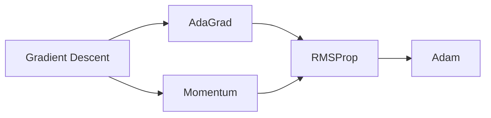

# RMSProp优化器在TensorFlow中的实现

## 1. 背景介绍

### 1.1 深度学习中的优化问题

在深度学习中,我们通常需要最小化一个损失函数,以便找到模型的最优参数。这个过程称为优化(Optimization)。然而,深度神经网络通常包含大量参数,使得优化变得非常具有挑战性。传统的优化方法如梯度下降法(Gradient Descent)在处理深度学习问题时往往收敛速度慢,容易陷入局部最优。

### 1.2 自适应学习率优化算法的发展

为了克服传统优化算法的局限性,研究者们提出了一系列自适应学习率(Adaptive Learning Rate)的优化算法。这类算法能够根据每个参数的梯度历史自动调整学习率,从而加速收敛并提高优化性能。其中比较著名的算法包括AdaGrad、RMSProp和Adam等。

### 1.3 RMSProp优化器简介

RMSProp(Root Mean Square Propagation)是由Geoff Hinton在他的Coursera课程中提出的一种自适应学习率优化算法。它结合了Adagrad和动量(Momentum)的思想,通过计算梯度的指数加权移动平均来调整每个参数的学习率。RMSProp能够自动适应不同参数的学习率,加速收敛,并在许多深度学习任务中取得了优异的表现。

## 2. 核心概念与联系

### 2.1 梯度下降法(Gradient Descent) 

梯度下降法是一种用于最小化目标函数的迭代优化算法。它通过计算损失函数对参数的梯度,并沿着负梯度方向更新参数来逐步逼近最小值点。传统的梯度下降法使用固定的学习率,可能导致收敛速度慢或在鞍点处停滞。

### 2.2 学习率(Learning Rate)

学习率决定了每次参数更新的步长。选择合适的学习率非常重要,过大的学习率可能导致优化发散,过小的学习率会使收敛非常缓慢。自适应学习率算法能够为不同的参数自动调整学习率,克服了手动调参的困难。

### 2.3 AdaGrad算法

AdaGrad是一种自适应学习率的优化算法,它根据每个参数的历史梯度值调整学习率。具体而言,AdaGrad算法会累积每个参数的梯度平方和,并用其平方根来缩放当前的学习率。这使得更新频繁的参数获得较小的学习率,而很少更新的参数获得较大的学习率。AdaGrad的缺点是学习率会随着训练的进行而单调下降,可能使得训练过早停止。

### 2.4 动量(Momentum)

动量方法借鉴了物理中的惯性思想,在更新参数时不仅考虑当前的梯度,还考虑之前的更新方向。这有助于加速收敛并减少震荡。动量法引入了一个动量因子,用于控制之前更新的影响程度。

### 2.5 RMSProp和其他优化器的关系

RMSProp结合了AdaGrad和动量的优点,使用指数加权移动平均来估计每个参数的梯度平方。相比AdaGrad,RMSProp的学习率不会单调下降至零。此外,RMSProp也是Adam优化器的基础,Adam在RMSProp的基础上引入了动量因子和偏差校正。下图展示了RMSProp与其他优化器之间的联系:



## 3. 核心算法原理与具体操作步骤

### 3.1 RMSProp算法原理

RMSProp通过维护每个参数的梯度平方的指数加权移动平均来调整学习率。具体而言,对于每个参数 $\theta_i$,RMSProp使用如下公式来更新其对应的梯度平方的移动平均 $v_i$:

$$v_i = \rho v_i + (1 - \rho) g_i^2$$

其中,$g_i$ 是当前时刻参数 $\theta_i$ 的梯度,$\rho$ 是衰减率,通常取0.9。

然后,参数 $\theta_i$ 的更新公式为:

$$\theta_i = \theta_i - \frac{\eta}{\sqrt{v_i + \epsilon}} g_i$$

其中,$\eta$ 是初始学习率,$\epsilon$ 是一个很小的常数,用于防止分母为零。

### 3.2 RMSProp算法的具体操作步骤

1. 初始化参数 $\theta$,梯度平方的移动平均 $v$,初始学习率 $\eta$,衰减率 $\rho$ 和常数 $\epsilon$。
2. 对于每个训练迭代:
   a. 计算当前参数的梯度 $g$。
   b. 使用公式 $v = \rho v + (1 - \rho) g^2$ 更新梯度平方的移动平均。
   c. 使用公式 $\theta = \theta - \frac{\eta}{\sqrt{v + \epsilon}} g$ 更新参数。
3. 重复步骤2,直到满足停止条件(如达到最大迭代次数或损失函数收敛)。

## 4. 数学模型和公式详细讲解举例说明

为了更好地理解RMSProp算法,我们以一个简单的线性回归问题为例。假设我们有一组训练数据 $\{(x_1, y_1), (x_2, y_2), ..., (x_n, y_n)\}$,其中 $x_i$ 是输入特征,$y_i$ 是对应的目标值。我们的目标是找到一个线性模型 $y = wx + b$,使得预测值与真实值之间的均方误差最小。

损失函数可以定义为:

$$J(w, b) = \frac{1}{2n} \sum_{i=1}^n (wx_i + b - y_i)^2$$

我们需要找到最优的参数 $w$ 和 $b$ 来最小化损失函数。使用RMSProp算法,我们可以按照以下步骤更新参数:

1. 初始化参数 $w$ 和 $b$ 为0,梯度平方的移动平均 $v_w$ 和 $v_b$ 为0,设置初始学习率 $\eta=0.01$,衰减率 $\rho=0.9$,常数 $\epsilon=1e-8$。

2. 对于每个训练迭代:
   a. 计算损失函数对参数 $w$ 和 $b$ 的梯度:
      
      $$g_w = \frac{1}{n} \sum_{i=1}^n (wx_i + b - y_i)x_i$$
      $$g_b = \frac{1}{n} \sum_{i=1}^n (wx_i + b - y_i)$$
   
   b. 更新梯度平方的移动平均:
      
      $$v_w = \rho v_w + (1 - \rho) g_w^2$$
      $$v_b = \rho v_b + (1 - \rho) g_b^2$$
   
   c. 更新参数:
      
      $$w = w - \frac{\eta}{\sqrt{v_w + \epsilon}} g_w$$
      $$b = b - \frac{\eta}{\sqrt{v_b + \epsilon}} g_b$$

3. 重复步骤2,直到满足停止条件。

通过使用RMSProp算法,我们可以自适应地调整每个参数的学习率,加速收敛并找到最优的模型参数。

## 5. 项目实践:代码实例和详细解释说明

下面我们使用TensorFlow实现RMSProp优化器,并将其应用于一个简单的线性回归问题。

```python
import tensorflow as tf
import numpy as np

# 生成随机训练数据
np.random.seed(0)
x_data = np.random.rand(100).astype(np.float32)
y_data = 0.1 * x_data + 0.3 + np.random.normal(0, 0.01, x_data.shape)

# 定义模型参数
w = tf.Variable(0.0)
b = tf.Variable(0.0)

# 定义损失函数
def loss_fn(y_true, y_pred):
    return tf.reduce_mean(tf.square(y_true - y_pred))

# 定义RMSProp优化器
optimizer = tf.optimizers.RMSprop(learning_rate=0.01, rho=0.9)

# 定义训练步骤
@tf.function
def train_step(x, y):
    with tf.GradientTape() as tape:
        y_pred = w * x + b
        loss = loss_fn(y, y_pred)
    grads = tape.gradient(loss, [w, b])
    optimizer.apply_gradients(zip(grads, [w, b]))
    return loss

# 训练模型
num_epochs = 1000
for epoch in range(num_epochs):
    loss = train_step(x_data, y_data)
    if (epoch + 1) % 100 == 0:
        print(f'Epoch {epoch+1}, Loss: {loss.numpy():.4f}')

# 打印最终的模型参数
print(f'Final model parameters: w = {w.numpy():.4f}, b = {b.numpy():.4f}')
```

代码解释:

1. 首先,我们生成一组随机的训练数据,其中 `x_data` 是输入特征,`y_data` 是对应的目标值。

2. 然后,我们定义模型参数 `w` 和 `b`,并初始化为0。

3. 接下来,我们定义损失函数 `loss_fn`,使用均方误差作为损失函数。

4. 我们创建一个RMSProp优化器 `optimizer`,设置初始学习率为0.01,衰减率为0.9。

5. 定义训练步骤 `train_step`,使用 `tf.GradientTape` 计算损失函数对参数的梯度,并使用RMSProp优化器更新参数。

6. 最后,我们进行1000次训练迭代,每100次打印当前的损失函数值。训练结束后,打印最终的模型参数。

通过运行这个例子,我们可以看到RMSProp优化器能够快速收敛并找到最优的模型参数。

## 6. 实际应用场景

RMSProp优化器在许多深度学习任务中得到了广泛应用,特别是在处理非平稳目标(如训练GAN)时表现出色。以下是一些常见的应用场景:

### 6.1 图像分类

在图像分类任务中,我们通常使用卷积神经网络(CNN)来提取图像特征并进行分类。RMSProp优化器能够有效地训练这些深层网络,加速收敛并提高分类精度。

### 6.2 自然语言处理

在自然语言处理任务中,如情感分析、命名实体识别和机器翻译等,我们通常使用循环神经网络(RNN)或变种(如LSTM、GRU)来处理序列数据。RMSProp优化器能够有效地训练这些网络,克服梯度消失和梯度爆炸问题。

### 6.3 语音识别

在语音识别任务中,我们通常使用卷积神经网络(CNN)或循环神经网络(RNN)来处理语音信号并进行识别。RMSProp优化器能够加速这些网络的训练,提高识别准确率。

### 6.4 强化学习

在强化学习任务中,我们通常使用深度神经网络来拟合值函数或策略函数。RMSProp优化器能够有效地训练这些网络,加速收敛并提高策略的性能。

## 7. 工具和资源推荐

以下是一些实现和使用RMSProp优化器的常用工具和资源:

- TensorFlow: https://www.tensorflow.org/api_docs/python/tf/keras/optimizers/RMSprop
- PyTorch: https://pytorch.org/docs/stable/optim.html#torch.optim.RMSprop
- Keras: https://keras.io/api/optimizers/rmsprop/
- 原始论文: Hinton, G. (2012). Neural networks for machine learning, Lecture 6a, overview of mini-batch gradient descent. (http://www.cs.toronto.edu/~tijmen/csc321/slides/lecture_slides_lec6.pdf)

这些工具和资源提供了RMSProp优化器的实现,以及如何在不同的深度学习框架中使用它的示例和文档。

## 8. 总结:未来发展趋势与挑战

RMSProp优化器是深度学习中一种重要的自适应学习率优化算法,它结合了AdaGrad和动量的优点,能够自动调整每个参数的学习率,加速收敛并提高优化性能。RMSProp在许多深度学习任务中取得了优异的表现,特别是在处理非