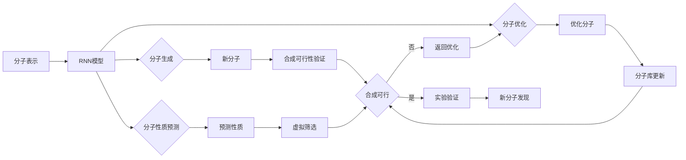

# RNN在化学分子设计中的实践

## 1. 背景介绍
### 1.1 化学分子设计的重要性
### 1.2 传统化学分子设计方法的局限性
### 1.3 人工智能在化学分子设计中的应用前景

## 2. 核心概念与联系
### 2.1 RNN的基本原理
#### 2.1.1 RNN的网络结构
#### 2.1.2 RNN的前向传播和反向传播
#### 2.1.3 RNN的变体(如LSTM、GRU)
### 2.2 RNN在化学分子设计中的应用
#### 2.2.1 分子生成
#### 2.2.2 分子性质预测
#### 2.2.3 分子优化

## 3. 核心算法原理具体操作步骤
### 3.1 数据预处理
#### 3.1.1 分子表示方法(如SMILES、图表示)
#### 3.1.2 数据增强技术
#### 3.1.3 数据集划分
### 3.2 RNN模型构建
#### 3.2.1 模型架构设计
#### 3.2.2 损失函数选择
#### 3.2.3 优化算法选择
### 3.3 模型训练与评估
#### 3.3.1 训练过程
#### 3.3.2 评估指标(如准确率、多样性)
#### 3.3.3 超参数调优

## 4. 数学模型和公式详细讲解举例说明
### 4.1 RNN的数学表示
#### 4.1.1 隐藏状态的更新公式
$$h_t=f(W_{hh}h_{t-1}+W_{xh}x_t+b_h)$$
其中，$h_t$表示t时刻的隐藏状态，$h_{t-1}$表示t-1时刻的隐藏状态，$x_t$表示t时刻的输入，$W_{hh}$、$W_{xh}$和$b_h$分别表示隐藏层到隐藏层、输入层到隐藏层的权重矩阵和隐藏层的偏置项，$f$表示激活函数(如tanh、ReLU)。

#### 4.1.2 输出层的计算公式
$$y_t=g(W_{hy}h_t+b_y)$$
其中，$y_t$表示t时刻的输出，$W_{hy}$和$b_y$分别表示隐藏层到输出层的权重矩阵和输出层的偏置项，$g$表示输出层的激活函数(如softmax)。

### 4.2 损失函数的数学表示
以交叉熵损失函数为例：
$$L=-\frac{1}{N}\sum_{i=1}^N\sum_{j=1}^My_{ij}\log(\hat{y}_{ij})$$
其中，$N$表示样本数，$M$表示类别数，$y_{ij}$表示第i个样本属于第j类的真实概率(取值为0或1)，$\hat{y}_{ij}$表示模型预测的第i个样本属于第j类的概率。

## 5. 项目实践：代码实例和详细解释说明
### 5.1 环境配置
#### 5.1.1 安装必要的库(如TensorFlow、RDKit)
#### 5.1.2 GPU加速配置
### 5.2 数据预处理
#### 5.2.1 读取分子数据集
#### 5.2.2 分子表示转换(如SMILES转换为one-hot编码)
#### 5.2.3 数据集划分为训练集、验证集和测试集
### 5.3 模型构建与训练
#### 5.3.1 定义RNN模型类
#### 5.3.2 实例化模型并设置超参数
#### 5.3.3 定义训练函数并开始训练
### 5.4 模型评估与应用
#### 5.4.1 在测试集上评估模型性能
#### 5.4.2 使用训练好的模型生成新分子
#### 5.4.3 对生成的分子进行性质预测和优化

## 6. 实际应用场景
### 6.1 药物分子设计
#### 6.1.1 基于RNN的新药分子生成
#### 6.1.2 药物分子性质预测与优化
### 6.2 材料分子设计  
#### 6.2.1 基于RNN的新材料分子生成
#### 6.2.2 材料分子性质预测与优化
### 6.3 其他领域的应用
#### 6.3.1 农药分子设计
#### 6.3.2 化妆品分子设计

## 7. 工具和资源推荐
### 7.1 开源工具包
#### 7.1.1 TensorFlow/Keras
#### 7.1.2 PyTorch
#### 7.1.3 RDKit
### 7.2 数据集资源
#### 7.2.1 ZINC数据库
#### 7.2.2 ChEMBL数据库
#### 7.2.3 PubChem数据库
### 7.3 学习资源
#### 7.3.1 在线课程
#### 7.3.2 教程和博客
#### 7.3.3 论文和书籍

## 8. 总结：未来发展趋势与挑战
### 8.1 RNN在化学分子设计中的发展趋势
#### 8.1.1 与其他AI技术的结合(如强化学习、对抗生成网络)
#### 8.1.2 设计更加复杂和多样化的分子
#### 8.1.3 实现分子设计的自动化和智能化
### 8.2 面临的挑战
#### 8.2.1 分子表示方法的局限性
#### 8.2.2 模型泛化能力和鲁棒性
#### 8.2.3 生成分子的合成可行性
### 8.3 未来研究方向
#### 8.3.1 改进分子表示方法
#### 8.3.2 引入先验化学知识指导分子生成
#### 8.3.3 开发更高效和可解释的模型架构

## 9. 附录：常见问题与解答
### 9.1 RNN相比其他生成模型(如VAE、GAN)的优缺点是什么？
### 9.2 如何处理分子生成过程中的化学规则和约束？
### 9.3 生成的分子如何进行合成可行性验证？
### 9.4 RNN模型的训练需要多大的数据量？
### 9.5 如何解释RNN生成分子的内在机制？

以上是使用RNN进行化学分子设计的一般流程。首先需要将分子转换为适合RNN处理的表示形式，如SMILES字符串或者图表示。然后构建RNN模型，通过训练使其学习分子的内在规律和特征。训练好的模型可以应用于分子生成、性质预测和优化等任务。

对于分子生成任务，RNN可以根据训练数据中的分子分布生成新的分子结构。生成的分子需要经过合成可行性验证，以确保其在化学上是合理和可合成的。通过分子性质预测，可以对生成的分子进行虚拟筛选，选出具有目标性质的分子。分子优化则是在已有分子的基础上，通过优化其结构来改善其性质。

优化后的分子会更新到分子库中，并再次经过合成可行性验证。验证通过的分子可以进入实验验证阶段，测试其实际活性和性质。实验验证的结果可以反馈到模型中，进一步指导分子优化。通过不断迭代优化和验证的过程，最终可以发现具有优异性质的新分子。

RNN在化学分子设计中已经展现出了广阔的应用前景。但是仍然存在一些挑战，如分子表示方法的局限性、生成分子的多样性和合成可行性等。未来的研究方向包括改进分子表示方法、引入先验化学知识指导分子生成、开发更高效和可解释的模型架构等。

随着人工智能技术的不断发展，RNN有望在新药开发、新材料设计等领域发挥更大的作用，加速新分子的发现和应用。但同时也需要密切关注其面临的挑战，不断改进和优化模型，使其更加鲁棒和实用。只有在理论研究和实践应用中取得平衡，RNN才能真正成为化学分子设计的得力助手，推动相关领域的创新发展。

作者：禅与计算机程序设计艺术 / Zen and the Art of Computer Programming