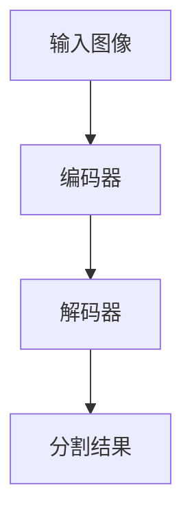

# SegNet原理与代码实例讲解

## 1.背景介绍

在计算机视觉领域,语义分割是一项重要的基础任务,旨在将图像像素级别地分配到不同的类别。传统的分割方法需要大量的人工特征工程,而深度学习的出现为语义分割任务带来了新的契机。SegNet是一种用于像素级语义分割的深度卷积神经网络,由Alex Kendall等人于2015年在剑桥大学提出。它的核心思想是将编码器(卷积层)和解码器(上采样层)结构进行对称设计,在保留边界信息的同时实现高效的端到端像素级分割。

## 2.核心概念与联系

### 2.1 编码器-解码器结构

SegNet采用了编码器-解码器的对称结构,如下图所示:



编码器部分由多个卷积层和池化层组成,用于提取图像的特征。解码器部分则由相应的上采样层和卷积层组成,用于将编码器输出的低分辨率特征图还原为与输入图像相同分辨率的分割结果。

### 2.2 池化索引

SegNet的关键创新点在于引入了池化索引(Pooling Indices)的概念。在编码器的每个池化层,SegNet不仅输出池化后的特征图,还保留了最大池化操作的索引信息。这些索引信息在解码器中被用于非线性上采样,从而保留了边界细节信息。

### 2.3 全卷积结构

与传统的卷积神经网络不同,SegNet采用了全卷积的结构,即不包含任何全连接层。这种设计使得SegNet能够处理任意大小的输入图像,而不受输入尺寸的限制。

## 3.核心算法原理具体操作步骤

SegNet的核心算法原理可以分为以下几个步骤:

1. **编码器**:输入图像经过一系列卷积层和池化层,提取不同尺度的特征图。在每个池化层,SegNet不仅输出池化后的特征图,还保留最大池化操作的索引信息。

2. **解码器**:从编码器的输出开始,通过一系列对应的上采样层和卷积层,逐步恢复特征图的分辨率。在上采样层,SegNet利用之前保存的池化索引信息进行非线性上采样,从而保留边界细节信息。

3. **像素级分类**:最终,解码器输出一个与输入图像相同分辨率的特征图,经过一个像素级分类层(如softmax层),得到每个像素属于不同类别的概率分布,即最终的分割结果。

下面是SegNet的具体操作步骤:

1. 初始化网络权重。
2. 输入图像,开始前向传播。
3. 在编码器中,图像依次经过一系列卷积层和池化层,提取不同尺度的特征图。在每个池化层,保留最大池化操作的索引信息。
4. 在解码器中,从编码器的输出开始,利用保存的池化索引信息进行非线性上采样,逐步恢复特征图的分辨率。
5. 在每个上采样层后,进行卷积操作,融合来自上一层和编码器对应层的特征信息。
6. 最终,解码器输出一个与输入图像相同分辨率的特征图。
7. 通过像素级分类层(如softmax层),得到每个像素属于不同类别的概率分布,即最终的分割结果。
8. 计算损失函数(如交叉熵损失),进行反向传播,更新网络权重。
9. 重复步骤2-8,直到模型收敛或达到预设的迭代次数。

## 4.数学模型和公式详细讲解举例说明

### 4.1 最大池化和池化索引

在SegNet的编码器中,最大池化操作可以表示为:

$$
y_{ij}^{l} = \max_{(i',j')\in R_{ij}}x_{i'j'}^{l-1}
$$

其中,$ y_{ij}^{l} $表示第l层特征图在位置(i,j)的输出,$ x_{i'j'}^{l-1} $表示上一层在池化窗口$ R_{ij} $内的输入值。

在最大池化操作时,SegNet还会记录获得最大值的输入位置,即池化索引:

$$
m_{ij}^{l} = \arg\max_{(i',j')\in R_{ij}}x_{i'j'}^{l-1}
$$

这些池化索引在解码器的上采样层中被用于非线性上采样,以保留边界细节信息。

### 4.2 非线性上采样

在解码器的上采样层,SegNet利用池化索引进行非线性上采样。对于一个上采样因子为f的上采样层,上采样操作可以表示为:

$$
y_{i'j'}^{l} = \begin{cases}
x_{ij}^{l-1}, & \text{if }m_{ij}^{l-1} = (i',j')\\
0, & \text{otherwise}
\end{cases}
$$

其中,$ y_{i'j'}^{l} $表示第l层上采样后特征图在位置(i',j')的输出值,$ x_{ij}^{l-1} $表示上一层在位置(i,j)的输入值,$ m_{ij}^{l-1} $是对应的池化索引。

这种非线性上采样方式可以精确地将低分辨率特征图还原为高分辨率,同时保留了边界细节信息。

### 4.3 损失函数

SegNet通常使用像素级交叉熵损失函数进行训练。对于一个包含N个像素的输入图像,损失函数可以表示为:

$$
L = -\frac{1}{N}\sum_{n=1}^{N}\sum_{c=1}^{C}y_{n}^{c}\log(p_{n}^{c})
$$

其中,$ y_{n}^{c} $是像素n的真实标签(one-hot编码),$ p_{n}^{c} $是SegNet预测的该像素属于类别c的概率。C是类别总数。

通过最小化这个损失函数,SegNet可以学习将输入图像正确地分割为不同的语义类别。

## 5.项目实践:代码实例和详细解释说明

下面是一个使用PyTorch实现的SegNet代码示例,包括编码器、解码器和非线性上采样层的实现。

```python
import torch
import torch.nn as nn
import torch.nn.functional as F

class SegNetEncoder(nn.Module):
    def __init__(self, in_channels, out_channels):
        super(SegNetEncoder, self).__init__()
        self.conv1 = nn.Conv2d(in_channels, out_channels, 3, padding=1)
        self.bn1 = nn.BatchNorm2d(out_channels)
        self.conv2 = nn.Conv2d(out_channels, out_channels, 3, padding=1)
        self.bn2 = nn.BatchNorm2d(out_channels)
        self.pool = nn.MaxPool2d(2, return_indices=True)

    def forward(self, x):
        x = F.relu(self.bn1(self.conv1(x)))
        x = F.relu(self.bn2(self.conv2(x)))
        x, indices = self.pool(x)
        return x, indices

class SegNetDecoder(nn.Module):
    def __init__(self, in_channels, out_channels):
        super(SegNetDecoder, self).__init__()
        self.conv1 = nn.Conv2d(in_channels, in_channels, 3, padding=1)
        self.bn1 = nn.BatchNorm2d(in_channels)
        self.conv2 = nn.Conv2d(in_channels, out_channels, 3, padding=1)
        self.bn2 = nn.BatchNorm2d(out_channels)
        self.unpool = nn.MaxUnpool2d(2)

    def forward(self, x, indices, output_size):
        x = self.unpool(x, indices, output_size=output_size)
        x = F.relu(self.bn1(self.conv1(x)))
        x = F.relu(self.bn2(self.conv2(x)))
        return x

class SegNet(nn.Module):
    def __init__(self, num_classes):
        super(SegNet, self).__init__()
        self.encoder1 = SegNetEncoder(3, 64)
        self.encoder2 = SegNetEncoder(64, 128)
        self.encoder3 = SegNetEncoder(128, 256)
        self.encoder4 = SegNetEncoder(256, 512)
        self.decoder1 = SegNetDecoder(512, 256)
        self.decoder2 = SegNetDecoder(256, 128)
        self.decoder3 = SegNetDecoder(128, 64)
        self.decoder4 = SegNetDecoder(64, num_classes)

    def forward(self, x):
        x, indices1 = self.encoder1(x)
        x, indices2 = self.encoder2(x)
        x, indices3 = self.encoder3(x)
        x, indices4 = self.encoder4(x)
        x = self.decoder1(x, indices4, output_size=indices3[0].shape)
        x = self.decoder2(x, indices3, output_size=indices2[0].shape)
        x = self.decoder3(x, indices2, output_size=indices1[0].shape)
        x = self.decoder4(x, indices1, output_size=x.shape)
        return x
```

代码解释:

1. `SegNetEncoder`类实现了SegNet的编码器模块,包含两个卷积层、两个批归一化层和一个最大池化层。在最大池化层,它不仅输出池化后的特征图,还返回池化索引。

2. `SegNetDecoder`类实现了SegNet的解码器模块,包含两个卷积层、两个批归一化层和一个非线性上采样层。在上采样层,它利用之前保存的池化索引进行非线性上采样,恢复特征图的分辨率。

3. `SegNet`类是整个网络的主体,它包含四个编码器模块和四个解码器模块。在前向传播时,输入图像依次经过编码器模块,提取不同尺度的特征图和对应的池化索引。然后,特征图和池化索引被传递给解码器模块,通过非线性上采样和卷积操作,逐步恢复特征图的分辨率。最终,解码器输出一个与输入图像相同分辨率的特征图,作为分割结果。

4. 在训练过程中,可以使用像素级交叉熵损失函数,并通过反向传播算法更新网络权重。

## 6.实际应用场景

SegNet在以下场景中有广泛的应用:

1. **自动驾驶**:对道路、车辆、行人等进行准确分割,为自动驾驶系统提供关键信息。

2. **医学图像分析**:分割CT、MRI等医学影像中的器官、肿瘤等,辅助医生诊断和治疗。

3. **遥感图像处理**:对卫星遥感图像进行分割,识别不同的地物类型,如建筑物、道路、植被等。

4. **机器人视觉**:帮助机器人准确识别和定位目标物体,实现精确操作。

5. **增强现实**:将真实场景与虚拟元素无缝融合,实现增强现实体验。

6. **视频监控**:对监控视频中的人物、车辆等目标进行分割和跟踪。

7. **人机交互**:通过手势分割,实现自然的人机交互方式。

## 7.工具和资源推荐

1. **开源框架**:PyTorch、TensorFlow、Caffe等深度学习框架都提供了SegNet的实现。

2. **数据集**:CamVid、CityScapes、Pascal VOC等公开数据集可用于训练和评估SegNet模型。

3. **在线教程**:Coursera、edX等在线课程平台提供了相关的计算机视觉和深度学习课程。

4. **论文**:SegNet的原论文"SegNet: A Deep Convolutional Encoder-Decoder Architecture for Image Segmentation"提供了详细的理论基础和实验结果。

5. **代码库**:GitHub上有许多开源的SegNet实现,可供参考和学习。

6. **可视化工具**:TensorBoard、Netron等工具可用于可视化网络结构和训练过程。

7. **在线社区**:Stack Overflow、Reddit等社区提供了丰富的问答资源和讨论。

## 8.总结:未来发展趋势与挑战

SegNet作为一种先驱性的像素级语义分割网络,为后续的研究工作奠定了基础。然而,它也存在一些局限性和挑战:

1. **内存消耗**:由于需要保存所有池化层的索引信息,SegNet的内存消耗较大,限制了它在大尺度图像上的应用。

2. **精度提升**:虽然SegNet在保留边界细节方面表现出色