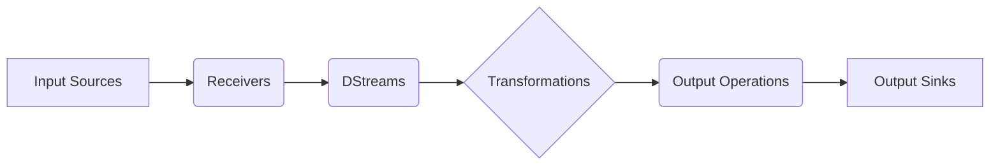

# SparkStreaming在实时航运物流监控中的应用案例

## 1. 背景介绍
### 1.1 航运物流行业面临的挑战
#### 1.1.1 实时性要求高
#### 1.1.2 数据量大且异构
#### 1.1.3 业务复杂多变
### 1.2 实时数据处理的必要性
#### 1.2.1 及时洞察问题
#### 1.2.2 快速响应变化  
#### 1.2.3 提升运营效率
### 1.3 SparkStreaming 简介
#### 1.3.1 SparkStreaming 概述
#### 1.3.2 SparkStreaming 优势
#### 1.3.3 SparkStreaming 应用场景

## 2. 核心概念与联系
### 2.1 SparkStreaming 核心概念
#### 2.1.1 DStream
#### 2.1.2 Receiver
#### 2.1.3 输入源与输出源
### 2.2 SparkStreaming 与 Spark 生态系统
#### 2.2.1 与 Spark Core 的关系
#### 2.2.2 与 Spark SQL 的集成
#### 2.2.3 与 Kafka、Flume 等的集成
### 2.3 SparkStreaming 架构与工作原理
#### 2.3.1 架构概览
#### 2.3.2 数据处理流程
#### 2.3.3 容错与高可用机制



## 3. 核心算法原理具体操作步骤
### 3.1 基本操作
#### 3.1.1 创建 StreamingContext
#### 3.1.2 定义输入源
#### 3.1.3 应用转换操作
#### 3.1.4 定义输出操作
#### 3.1.5 启动流计算
### 3.2 窗口操作
#### 3.2.1 滑动窗口
#### 3.2.2 滚动窗口  
#### 3.2.3 窗口函数
### 3.3 状态管理
#### 3.3.1 检查点机制
#### 3.3.2 updateStateByKey
#### 3.3.3 mapWithState
### 3.4 性能优化技巧
#### 3.4.1 并行度设置
#### 3.4.2 内存调优
#### 3.4.3 数据本地化

## 4. 数学模型和公式详细讲解举例说明
### 4.1 基于 SparkStreaming 的异常检测
#### 4.1.1 移动平均模型
移动平均值计算公式：
$$\bar{x}_t = \frac{\sum_{i=0}^{n-1} x_{t-i}}{n}$$
其中，$\bar{x}_t$ 为第 $t$ 个时间窗口的移动平均值，$x_t$ 为第 $t$ 个时间窗口的观测值，$n$ 为移动平均的窗口大小。
#### 4.1.2 异常点判断
基于移动平均值和标准差设置阈值，判断异常点：
$$|x_t - \bar{x}_t| > k \cdot \sigma_t$$
其中，$\sigma_t$ 为第 $t$ 个时间窗口的标准差，$k$ 为异常点判断的阈值系数。
### 4.2 实时预测模型
#### 4.2.1 线性回归
线性回归模型：
$$y = w_0 + w_1x_1 + w_2x_2 + \cdots + w_nx_n$$
其中，$y$ 为预测值，$x_i$ 为第 $i$ 个特征，$w_i$ 为第 $i$ 个特征的权重。
#### 4.2.2 随机森林
随机森林回归模型：
$$\hat{f} = \frac{1}{B} \sum_{b=1}^B T_b(x)$$
其中，$\hat{f}$ 为随机森林的预测值，$B$ 为决策树的数量，$T_b(x)$ 为第 $b$ 棵决策树对样本 $x$ 的预测值。

## 5. 项目实践：代码实例和详细解释说明 
### 5.1 项目背景与需求
#### 5.1.1 航运物流监控平台
#### 5.1.2 实时异常检测
#### 5.1.3 智能调度优化
### 5.2 数据源与数据预处理
#### 5.2.1 接入 Kafka 数据源
```scala
val kafkaParams = Map[String, Object](
  "bootstrap.servers" -> "localhost:9092",
  "key.deserializer" -> classOf[StringDeserializer],
  "value.deserializer" -> classOf[StringDeserializer],
  "group.id" -> "logistics-group",
  "auto.offset.reset" -> "latest",
  "enable.auto.commit" -> (false: java.lang.Boolean)
)

val topics = Array("logistics-data")
val stream = KafkaUtils.createDirectStream[String, String](
  ssc,
  PreferConsistent,
  Subscribe[String, String](topics, kafkaParams)
)
```
#### 5.2.2 数据清洗与转换
```scala
val cleanedStream = stream.map(record => {
  val fields = record.value().split(",")
  // 提取并转换字段
  (fields(0), fields(1).toDouble, fields(2).toInt)
})
```
### 5.3 实时异常检测
#### 5.3.1 移动平均模型
```scala
val windowDuration = Minutes(5)
val slideDuration = Seconds(30)

val avgStream = cleanedStream.map(data => (data._1, data._2))
  .groupByKeyAndWindow(windowDuration, slideDuration)
  .mapValues(values => values.sum / values.size)
```
#### 5.3.2 异常点判断
```scala
val anomalyStream = avgStream.join(stddevStream)
  .flatMapValues{case (avg, stddev) =>
    val threshold = 2.0
    if (math.abs(avg - stddev) > threshold * stddev)
      Some("Anomaly Detected")
    else
      None        
  }
```
### 5.4 智能调度优化
#### 5.4.1 实时路径规划
```scala
// 使用外部路径规划服务
val pathPlanningStream = cleanedStream.mapPartitions(iter => {
  val paths = iter.map(data => {
    val start = data._1
    val end = data._2
    // 调用路径规划 API
    val path = pathPlanner.plan(start, end)
    (data._3, path)
  })
  paths
})
```
#### 5.4.2 动态资源分配
```scala
val rebalanceStream = pathPlanningStream.map(data => (data._1, 1))
  .reduceByKeyAndWindow(_ + _, Minutes(5))
  .map{case (region, demand) => 
    val supply = regionSupply.getOrElse(region, 0)
    val rebalancePlan = scheduler.rebalance(region, demand, supply)
    (region, rebalancePlan)
  }
```
### 5.5 结果存储与可视化
#### 5.5.1 存储到数据库
```scala
anomalyStream.foreachRDD(rdd => {
  rdd.foreachPartition(iter => {
    val connection = createNewConnection()
    iter.foreach(record => {
      val sql = "INSERT INTO anomalies (timestamp, anomaly) VALUES (?, ?)"
      val statement = connection.prepareStatement(sql)
      statement.setString(1, record._1)
      statement.setString(2, record._2)
      statement.executeUpdate()
    })
    connection.close()
  })
})
```
#### 5.5.2 实时仪表盘展示
使用 Grafana、Kibana 等工具连接 SparkStreaming 的输出结果，实现实时监控仪表盘。

## 6. 实际应用场景
### 6.1 港口集装箱调度
#### 6.1.1 实时集装箱状态跟踪
#### 6.1.2 码头作业优化
#### 6.1.3 集卡调度管理
### 6.2 干线运输监控
#### 6.2.1 车辆实时定位
#### 6.2.2 运输异常报警
#### 6.2.3 智能调度决策
### 6.3 仓储物流管理  
#### 6.3.1 库存实时监测
#### 6.3.2 出入库作业优化
#### 6.3.3 智能补货预警

## 7. 工具和资源推荐
### 7.1 开发工具
- IntelliJ IDEA
- Spark-shell
- Zeppelin Notebook
### 7.2 部署工具
- Docker
- Kubernetes
- Mesos
### 7.3 监控工具
- Ganglia
- Grafana
- Prometheus
### 7.4 学习资源
- Spark官方文档
-《Spark大数据处理：技术、应用与性能优化》
- 慕课网SparkStreaming实战课程

## 8. 总结：未来发展趋势与挑战
### 8.1 流批一体化趋势
#### 8.1.1 Structured Streaming
#### 8.1.2 Flink Table API & SQL 
#### 8.1.3 流批统一的 API
### 8.2 机器学习与流计算结合
#### 8.2.1 在线学习
#### 8.2.2 流数据特征工程
#### 8.2.3 模型实时更新
### 8.3 面临的挑战
#### 8.3.1 数据丢失与重复
#### 8.3.2 状态管理与容错
#### 8.3.3 数据倾斜问题

## 9. 附录：常见问题与解答
### 9.1 SparkStreaming 与 Storm 的区别？
### 9.2 SparkStreaming 支持哪些数据源？
### 9.3 SparkStreaming 如何保证数据处理的一致性？
### 9.4 SparkStreaming 中的 Receiver 是什么？
### 9.5 如何选择 SparkStreaming 的批次间隔？
### 9.6 SparkStreaming 如何实现累加器和广播变量？

作者：禅与计算机程序设计艺术 / Zen and the Art of Computer Programming