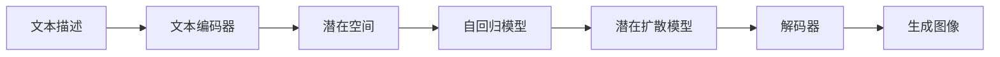

# Stable Diffusion原理与代码实例讲解

## 1.背景介绍
### 1.1 生成式AI的兴起
近年来,随着深度学习技术的快速发展,生成式人工智能(Generative AI)受到了广泛关注。生成式AI能够学习数据的分布,并生成与训练数据相似的新样本,在图像生成、语音合成、自然语言生成等领域取得了令人瞩目的成果。
### 1.2 文本到图像生成的突破
其中,文本到图像生成(Text-to-Image)是生成式AI的一个重要方向。它旨在根据给定的文本描述,自动生成与之相关的逼真图像。2022年,OpenAI发布的DALL-E 2和Stability AI开源的Stable Diffusion,将这一技术推向了新的高度,生成的图像质量和语义一致性大大提升。
### 1.3 Stable Diffusion的开源影响
特别是Stable Diffusion,作为一个开源模型,极大地降低了文本到图像生成的门槛,使得更多开发者和研究人员能够基于它进行二次开发和探索。了解Stable Diffusion的原理和代码实现,对于理解和应用这一前沿技术至关重要。

## 2.核心概念与联系
### 2.1 扩散模型(Diffusion Model) 
扩散模型是Stable Diffusion的核心,它通过迭代的正向和逆向扩散过程,逐步将随机噪声转化为有意义的图像。正向过程从真实图像出发,逐步添加高斯噪声,直到完全被噪声淹没;逆向过程则从纯噪声开始,通过神经网络逐步去噪,最终生成清晰图像。
### 2.2 自回归模型(Autoregressive Model)
自回归模型在Stable Diffusion中用于对潜在空间进行建模。它将图像生成问题转化为一个序列生成问题,通过逐像素预测的方式,利用已生成像素的信息,对下一个像素的概率分布进行建模。这使得模型能够捕捉图像的全局结构和局部细节。
### 2.3 文本编码器(Text Encoder)  
为了引入文本信息对图像生成过程进行指导,Stable Diffusion使用了一个预训练的文本编码器,将输入的文本描述映射到潜在空间。通常采用基于Transformer的模型如CLIP,提取文本的语义特征,与图像的潜码对齐,实现跨模态的语义理解。
### 2.4 潜在扩散模型(Latent Diffusion Model)
传统的扩散模型直接在像素空间进行建模,计算复杂度高。Stable Diffusion采用了潜在扩散模型,先将图像编码到一个低维的潜在空间,再在潜在空间中进行扩散过程。这大大降低了内存占用和计算开销,使得高分辨率图像的生成成为可能。



## 3.核心算法原理具体操作步骤
### 3.1 训练阶段
1. 对大规模图像-文本对数据集进行预处理,提取图像特征和对应的文本描述。
2. 使用文本编码器将文本描述映射到潜在空间,得到条件向量。
3. 将图像编码到潜在空间,与条件向量concat。
4. 在潜在空间中进行正向扩散,逐步添加高斯噪声,得到一系列噪声图像。
5. 训练逆向扩散模型,输入噪声图像和对应的时间步,预测去噪后的潜码。
6. 重复步骤4-5,优化模型参数,最小化重构损失。

### 3.2 推理阶段 
1. 输入文本描述,使用文本编码器得到条件向量。
2. 在潜在空间中采样一个高斯噪声向量作为初始状态。
3. 迭代执行逆向扩散过程,每一步:
   - 将当前潜码、时间步和条件向量输入扩散模型
   - 预测去噪后的潜码
   - 根据预测结果和时间步更新当前潜码
4. 重复步骤3直到完成所有逆向扩散步骤,得到最终的潜码。
5. 使用解码器将潜码解码为像素空间,得到生成的图像。

## 4.数学模型和公式详细讲解举例说明
### 4.1 正向扩散过程
正向扩散过程可以表示为一个马尔可夫链:

$q(x_t|x_{t-1}) = \mathcal{N}(x_t; \sqrt{1-\beta_t} x_{t-1}, \beta_t \mathbf{I})$

其中,$x_t$表示t时刻的噪声图像,$\beta_t$是一个事先定义好的噪声调度,控制每一步添加的噪声量。通过迭代地添加高斯噪声,图像逐渐被破坏,最终完全被噪声淹没。

例如,假设原始图像为一张512x512的风景照,经过1000步正向扩散后,图像中的物体边缘、纹理、色彩等信息逐渐被高斯噪声替代,最终变成一张完全随机的噪声图像,肉眼无法分辨原始图像的内容。

### 4.2 逆向去噪过程
逆向去噪过程旨在学习从噪声图像恢复出原始图像的条件概率分布:

$p_\theta(x_{t-1}|x_t) = \mathcal{N}(x_{t-1}; \mu_\theta(x_t, t), \Sigma_\theta(x_t, t))$

其中,$\mu_\theta$和$\Sigma_\theta$分别表示均值和方差,是以$x_t$和时间步t为条件的函数,通过神经网络参数化。模型通过最小化负对数似然损失来优化这些参数:

$L_{nll} = -\mathbb{E}_{q(x_{0:T})}[\log p_\theta(x_{0:T})]$

例如,给定一张添加了1000步噪声的图像,逆向去噪模型逐步预测每一步的去噪结果,经过1000步去噪后,最终恢复出一张干净的风景照。在这个过程中,模型需要在噪声图像中捕捉到一些残余的结构信息,并利用这些信息对图像进行修复和细化。

### 4.3 条件生成
为了实现根据文本描述生成对应图像,需要将文本信息引入到扩散模型中。具体而言,可以将文本编码器提取的条件向量$c$与噪声图像$x_t$拼接,作为扩散模型的输入:

$p_\theta(x_{t-1}|x_t, c) = \mathcal{N}(x_{t-1}; \mu_\theta(x_t, t, c), \Sigma_\theta(x_t, t, c))$

这样,扩散模型就能根据文本条件对图像生成过程进行引导。在训练时,优化目标变为条件负对数似然损失:

$L_{nll}^{cond} = -\mathbb{E}_{q(x_{0:T}|c)}[\log p_\theta(x_{0:T}|c)]$

例如,给定文本描述"A beautiful sunset over the ocean"(一个美丽的海上日落),文本编码器首先将其转换为一个条件向量。然后,从一个随机噪声开始,扩散模型在每一步去噪时都以噪声图像、时间步和条件向量为输入,预测下一步的去噪结果。经过多步迭代,扩散模型逐渐生成出一张与文本描述相符的日落美景图像。

## 5.项目实践：代码实例和详细解释说明
下面是一个简化版的Stable Diffusion代码实例,演示了如何使用预训练的扩散模型和文本编码器来生成图像:

```python
import torch
from diffusers import StableDiffusionPipeline

# 加载预训练的Stable Diffusion模型
model_id = "CompVis/stable-diffusion-v1-4"
device = "cuda"
pipe = StableDiffusionPipeline.from_pretrained(model_id, use_auth_token=True)
pipe = pipe.to(device)

# 输入文本描述
prompt = "A beautiful sunset over the ocean"

# 使用文本编码器和扩散模型生成图像
image = pipe(prompt, guidance_scale=7.5).images[0]  

# 展示生成的图像
image.save("sunset.png")
```

代码解释:
1. 首先,我们导入需要的库,包括PyTorch和Hugging Face的diffusers库。
2. 然后,我们指定预训练的Stable Diffusion模型的名称和设备(这里使用GPU)。
3. 使用`StableDiffusionPipeline.from_pretrained`方法加载预训练模型,其中`use_auth_token`参数用于访问Hugging Face上的受限模型。
4. 将加载的模型移动到指定的设备上。
5. 定义要生成图像的文本描述`prompt`。
6. 调用管道的`__call__`方法,传入文本描述和`guidance_scale`参数(控制生成图像与文本的相关程度),生成图像。
7. 最后,将生成的图像保存到本地文件。

以上代码展示了使用Stable Diffusion生成图像的基本流程。实际应用中,还可以通过调整`num_inference_steps`(推理步数)、`guidance_scale`等参数来控制生成图像的质量和多样性。此外,还可以使用`img2img`等方法,以现有图像为基础进行编辑和生成。

## 6.实际应用场景
Stable Diffusion 在各个领域都有广泛的应用前景,下面列举几个典型场景:
### 6.1 创意设计
Stable Diffusion 可以辅助设计师进行创意构思和视觉设计。设计师只需输入文本描述,就能快速生成多种设计方案,如海报、Logo、产品外观等,大大提高设计效率和创意灵感。
### 6.2 游戏和电影
在游戏和电影领域,Stable Diffusion 可用于自动生成逼真的场景、人物、道具等素材。根据剧本或游戏脚本中的描述,生成相应的概念艺术和原画,为后续的建模和渲染提供参考。
### 6.3 虚拟试衣和装修  
Stable Diffusion 还可应用于虚拟试衣和装修场景。用户输入对服装或房间装修风格的描述,模型自动生成相应的虚拟形象或室内设计效果图,提供个性化的试衣和装修体验。
### 6.4 教育和科普
利用Stable Diffusion 可以根据教材内容自动生成插图和示意图,辅助教师进行教学演示和学生理解抽象概念。在科普领域,可以根据科普文章的内容,自动生成生动形象的示意图,增强科普内容的趣味性和易理解性。

## 7.工具和资源推荐
### 7.1 官方资源
- [Stable Diffusion官网](https://stability.ai/blog/stable-diffusion-public-release):提供模型下载、使用文档和示例。
- [CompVis/stable-diffusion](https://github.com/CompVis/stable-diffusion):官方GitHub仓库,包含训练代码和预训练模型。
- [Hugging Face Stable Diffusion模型](https://huggingface.co/CompVis):Hugging Face上的官方模型分发页面。

### 7.2 第三方工具
- [AUTOMATIC1111/stable-diffusion-webui](https://github.com/AUTOMATIC1111/stable-diffusion-webui):基于Gradio的Web UI,提供了方便的界面和丰富的功能。
- [Diffusers](https://github.com/huggingface/diffusers):Hugging Face开发的扩散模型工具包,支持Stable Diffusion等多种模型。
- [InvokeAI](https://github.com/invoke-ai/InvokeAI):一个易用的Stable Diffusion工具箱,提供命令行和Web界面。

### 7.3 社区资源
- [Stable Diffusion Reddit社区](https://www.reddit.com/r/StableDiffusion/):Stable Diffusion的Reddit讨论社区,可以了解最新进展和交流心得。
- [Stable Diffusion Discord社区](https://discord.com/invite/stablediffusion):Stable Diffusion的Discord交流社区,汇聚了大量开发者和艺术家。

## 8.总结：未来发展趋势与挑战
Stable Diffusion 代表了文本到图像生成技术的重要进展,展现了生成式AI在创意