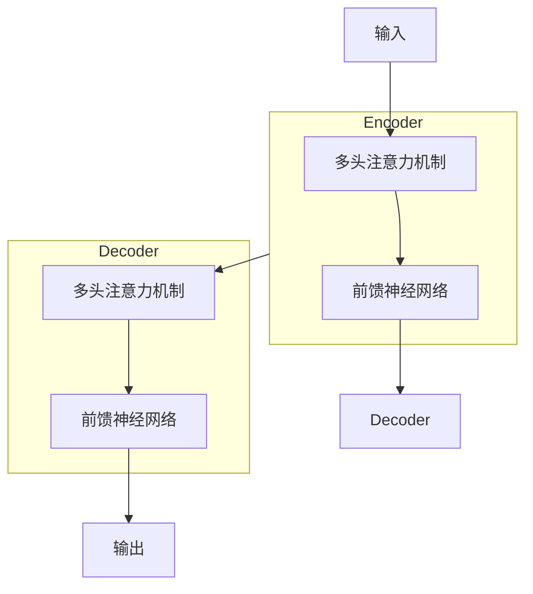
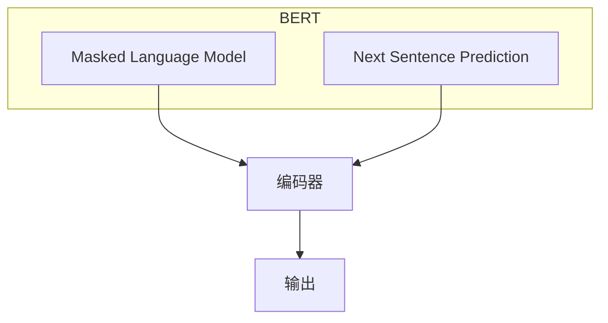

# Transformer大模型实战 BERT 的基本理念

## 1.背景介绍

随着深度学习技术的不断发展,自然语言处理(NLP)领域取得了长足的进步。传统的基于统计机器学习方法的NLP模型,已经不能满足当前对语言理解能力的需求。2017年,谷歌大脑团队提出了Transformer模型,该模型完全基于注意力机制,摒弃了传统序列模型中的循环神经网络和卷积神经网络结构,在机器翻译等任务上取得了突破性的成果。

2018年,谷歌研究员发表了BERT(Bidirectional Encoder Representations from Transformers)预训练模型,该模型基于Transformer的编码器结构,通过大规模的语料预训练,学习到了通用的语义表示能力。BERT在多项自然语言处理任务上取得了state-of-the-art的表现,开启了预训练语言模型的新时代。

## 2.核心概念与联系

### 2.1 Transformer模型

Transformer是一种全新的基于注意力机制的序列到序列(Seq2Seq)模型,主要由编码器(Encoder)和解码器(Decoder)两个部分组成。



编码器的作用是映射一个序列到一个连续的表示序列,解码器则利用编码器的输出生成一个新的序列。Transformer通过多头自注意力机制捕获输入序列中任意两个位置的关系,同时使用前馈神经网络对每个位置的表示进行转换,充分融合上下文信息。

### 2.2 BERT模型

BERT是一种基于Transformer编码器的预训练语言模型,通过自监督的方式学习通用的语义表示。BERT的核心创新点在于引入了Masked Language Model(MLM)和Next Sentence Prediction(NSP)两种预训练任务。



MLM任务通过随机遮挡输入序列中的部分token,并让模型基于上下文预测遮挡位置的token。NSP任务则是判断两个句子是否为连续关系。通过这两种任务的联合预训练,BERT学习到了深层次的语义表示能力。

## 3.核心算法原理具体操作步骤  

### 3.1 Transformer注意力机制

Transformer的核心是多头自注意力机制,其计算过程如下:

1) 将输入序列X映射到查询(Query)、键(Key)和值(Value)矩阵: $Q=XW_Q,K=XW_K,V=XW_V$
2) 计算注意力权重: $\text{Attention}(Q,K,V)=\text{softmax}(\frac{QK^T}{\sqrt{d_k}})V$
3) 多头注意力机制对多个注意力子空间的结果进行拼接: $\text{MultiHead}(Q,K,V)=\text{Concat}(head_1,...,head_h)W^O$

其中, $head_i=\text{Attention}(QW_i^Q,KW_i^K,VW_i^V)$

### 3.2 BERT的Masked语言模型

MLM的关键步骤如下:

1) 随机选择输入序列中15%的token位置
2) 80%的位置用[MASK]标记替换,10%保持不变,10%用随机token替换
3) 对于每个被mask的位置,模型需要基于上下文预测该位置的token

例如,输入序列为"今天的天气很[MASK]",模型需要预测[MASK]位置的token为"好"。

### 3.3 BERT的下一句预测

NSP的目标是判断两个句子A和B是否为连续关系。

1) 50%的时候,B是A的下一句,50%的时候,B是从语料库中随机采样的
2) 将A和B的序列拼接,用[CLS]标记开头,用[SEP]标记分隔
3) 模型对[CLS]标记的输出进行二分类,判断是否为IsNext=True

## 4.数学模型和公式详细讲解举例说明

### 4.1 注意力计算

给定查询$q$、键$k$和值$v$向量组,注意力计算公式为:

$$\begin{aligned}
\text{Attention}(q,K,V)&=\text{softmax}(\frac{qK^T}{\sqrt{d_k}})V\\
                       &=\sum_{i=1}^n \alpha_i v_i\\
\alpha_i&=\frac{\exp(q\cdot k_i/\sqrt{d_k})}{\sum_{j=1}^n\exp(q\cdot k_j/\sqrt{d_k})}
\end{aligned}$$

其中, $\alpha_i$是注意力权重, $d_k$是缩放因子,用于防止点积过大导致softmax饱和。

多头注意力机制将注意力计算过程分布在多个子空间中并行计算,最后将结果拼接:

$$\text{MultiHead}(Q,K,V)=\text{Concat}(head_1,...,head_h)W^O$$
$$\text{where } head_i=\text{Attention}(QW_i^Q,KW_i^K,VW_i^V)$$

### 4.2 掩码语言模型

给定输入序列$X=(x_1,x_2,...,x_n)$,其中$x_i$是第i个token的embedding向量。对于被mask的位置$x_j$,我们需要最大化如下条件概率:

$$\log P(x_j|X\backslash x_j;\theta)$$

其中$\theta$是模型参数,$X\backslash x_j$表示除去$x_j$的其他token。

该条件概率可通过softmax分类器计算:

$$P(x_j|X\backslash x_j;\theta)=\text{softmax}(h_jW_e^T)$$

其中$h_j$是BERT编码器对$x_j$位置的输出向量,$W_e$是词表embedding矩阵。

## 5.项目实践:代码实例和详细解释说明

以下是使用Hugging Face的Transformers库加载BERT模型并做文本分类任务的示例代码:

```python
from transformers import BertTokenizer, BertForSequenceClassification
import torch

# 加载预训练模型和tokenizer
model = BertForSequenceClassification.from_pretrained('bert-base-uncased')
tokenizer = BertTokenizer.from_pretrained('bert-base-uncased')

# 文本分类示例
text = "This is a great movie!"
inputs = tokenizer(text, return_tensors="pt")
outputs = model(**inputs)

# 获取分类结果
predictions = torch.nn.functional.softmax(outputs.logits, dim=-1)
print(predictions)
```

代码解释:

1. 导入BERT模型和tokenizer
2. 使用from_pretrained加载预训练权重
3. 对输入文本进行tokenize,得到模型输入
4. 将输入传入BERT模型,得到输出logits
5. 对logits做softmax,得到分类概率

对于自定义数据集的文本分类任务,还需要以下步骤:

1. 准备训练数据,标注文本标签
2. 定义数据集类,重写__getitem__方法返回tokenized输入和标签
3. 实例化DataLoader迭代器
4. 定义训练循环,计算损失和梯度回传
5. 在验证集上评估模型,保存最佳模型

## 6.实际应用场景

BERT及其变体模型在自然语言处理的诸多领域有广泛应用,包括但不限于:

- 文本分类: 新闻分类、情感分析、垃圾邮件过滤等
- 序列标注: 命名实体识别、关系抽取、词性标注等
- 问答系统: 阅读理解、开放域问答等
- 文本生成: 文章自动生成、机器翻译、文本续写等
- 语音识别与合成
- 多模态任务: 视觉问答、图文生成等

BERT模型的通用语义表示能力使其成为NLP任务的基础模块,在工业界和学术界广为应用和研究。

## 7.工具和资源推荐  

- Transformers: 由Hugging Face开发的NLP模型库,支持PyTorch和TensorFlow,包含BERT等多种预训练模型。
- AllenNLP: 由Allen研究所开发的开源NLP研究库,提供BERT等模型的可视化工具。
- TextBlob: 一个基于NLTK和Pattern的Python NLP工具包,可用于词性标注、情感分析等任务。
- spaCy: 一个工业级别的NLP库,提供命名实体识别、关系提取等功能,支持多种语言。
- LinggleCorpus: 一个大规模的中文语料库,可用于BERT等模型的预训练。

## 8.总结:未来发展趋势与挑战

BERT开创了预训练语言模型的新时代,但仍有一些局限性和挑战:

- 模型规模和计算成本高: BERT等大型语言模型需要大量计算资源进行预训练,给工业应用带来挑战。
- 长序列处理能力差: Transformer的自注意力机制计算复杂度较高,难以处理超长序列输入。
- 缺乏归纳推理能力: 现有模型主要关注语义理解,对于更高阶的推理和常识reasoning能力仍显不足。

未来的发展趋势包括:

- 模型压缩和高效推理: 通过知识蒸馏、剪枝、量化等技术压缩大型模型,降低推理成本。
- 长序列建模: 设计高效的注意力机制或结合卷积等操作,提升长序列处理能力。
- 多模态融合: 将视觉、语音等多模态信息融入预训练模型,拓展应用场景。
- 知识增强: 引入外部知识库,赋予模型更强的推理和常识reasoning能力。
- 可解释性: 提高模型的可解释性,探索模型内部语义表示,促进人类可解释的AI发展。

## 9.附录:常见问题与解答

1. BERT与其他语言模型有何区别?

   BERT的创新之处在于采用了Masked Language Model和Next Sentence Prediction两种预训练任务,通过自监督的方式学习通用的语义表示,避免了传统语言模型的单向性局限。此外,BERT基于Transformer结构,完全依赖注意力机制而不使用RNN或CNN。

2. BERT为什么需要Next Sentence Prediction任务?

   NSP任务的目的是让模型学习句子间的关系和上下文表示。通过判断两个句子是否为连续关系,BERT可以捕获跨句的语义信息,提升在下游任务中的表现。

3. BERT有哪些变体模型?

   基于BERT的创新思路,后续提出了多种变体模型,如RoBERTa、ALBERT、XLNet、ELECTRA等,通过改进预训练任务、模型结构、数据增强等方式,在某些任务上取得了更好的表现。

4. BERT的局限性是什么?

   BERT主要局限在计算成本高、长序列处理能力差、缺乏推理能力等方面。此外,预训练语料的质量和领域也会影响模型在特定任务上的表现。

5. BERT在工业界的应用前景如何?

   BERT及其变体模型已在工业界广泛应用,如智能助手、客服机器人、内容审核、知识问答等场景。未来,结合模型压缩、知识增强等技术,BERT在工业界的应用前景广阔。

作者: 禅与计算机程序设计艺术 / Zen and the Art of Computer Programming