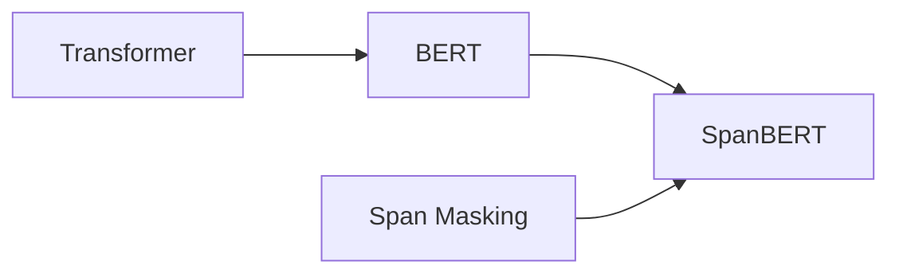

# Transformer大模型实战 了解SpanBERT的架构

## 1. 背景介绍

近年来,随着深度学习技术的飞速发展,自然语言处理(NLP)领域也取得了突破性的进展。Transformer模型作为一种强大的神经网络架构,在许多NLP任务中表现出色,如机器翻译、文本分类、问答系统等。而BERT(Bidirectional Encoder Representations from Transformers)作为Transformer的一个重要变体,通过在大规模无标注语料上进行预训练,可以学习到丰富的语义表示,并在下游任务上取得了state-of-the-art的结果。

SpanBERT是在BERT基础上进一步改进的预训练模型。它通过随机遮掩连续的文本片段(spans)而非单个tokens,更好地建模spans之间的关系,从而学习到更加细粒度和鲁棒的语义表示。本文将深入探讨SpanBERT的技术原理和实现细节,帮助读者全面了解这一前沿的NLP模型。

## 2. 核心概念与联系

要理解SpanBERT,首先需要掌握以下几个核心概念:

- Transformer:一种基于self-attention机制的神经网络架构,可以高效地处理序列数据。
- BERT:在Transformer基础上发展而来的预训练语言模型,通过Masked Language Model和Next Sentence Prediction两个预训练任务,学习双向的语义表示。
- Span:指文本中连续的一段字词序列,是SpanBERT的基本处理单元。
- Span Masking:SpanBERT的核心创新,通过随机遮掩spans而非单个tokens,让模型学习spans之间的关系。

下图展示了这些概念之间的联系:



## 3. 核心算法原理与具体操作步骤

SpanBERT的训练过程可分为两个阶段:预训练和微调。

### 3.1 预训练阶段

预训练阶段的目标是让模型在大规模无标注语料上学习通用的语义表示。具体步骤如下:

1. 对输入文本进行tokenization,将其转换为词块序列。
2. 随机遮掩spans,即以一定概率选择文本中的连续片段,并将其替换为特殊的[MASK]token。遮掩长度服从几何分布。
3. 将遮掩后的序列输入SpanBERT模型,通过Transformer编码器产生每个位置的隐藏状态。
4. 基于隐藏状态,预测被遮掩位置的原始tokens。这一任务称为Span Boundary Objective(SBO),旨在建模spans的边界信息。
5. 同时,SpanBERT还保留了BERT的Masked Language Model(MLM)任务,即预测单个被遮掩tokens。
6. 联合SBO和MLM的损失函数,对模型进行端到端的训练,优化模型参数。

### 3.2 微调阶段

在完成预训练后,我们可以将SpanBERT应用于下游的NLP任务,如文本分类、命名实体识别等。这需要在特定任务的标注数据上对模型进行微调。步骤如下:

1. 在预训练的SpanBERT模型顶部添加任务特定的输出层,如分类层、序列标注层等。
2. 利用下游任务的标注数据对模型进行微调,通过反向传播调整SpanBERT的参数,使其适应具体任务。
3. 在开发集上评估模型性能,并根据需要调整超参数。
4. 将微调后的模型应用于测试集,得到最终的任务性能指标。

## 4. 数学模型和公式详细讲解举例说明

SpanBERT的核心在于Span Masking和Span Boundary Objective。下面我们用数学语言对其进行详细说明。

假设输入文本序列为$\mathbf{x}=(x_1,\cdots,x_T)$,其中$x_i$表示第$i$个token。我们定义一个span $s=(s_\text{start},s_\text{end})$,其中$1 \leq s_\text{start} \leq s_\text{end} \leq T$。

在Span Masking中,我们以概率$p$随机选择spans进行遮掩。具体来说,对每个位置$i$,我们以几何分布$\text{Geo}(p)$采样一个长度$l_i$。如果$l_i>0$,则遮掩区间$[i,i+l_i)$内的所有tokens。

接下来,我们将遮掩后的序列$\mathbf{\hat{x}}$输入SpanBERT模型,得到隐藏状态序列$\mathbf{h}=(h_1,\cdots,h_T)$。

对于每个被遮掩的span $s$,Span Boundary Objective的目标是最大化如下条件概率:

$$
p(x_{s_\text{start}},x_{s_\text{end}}|\mathbf{\hat{x}}) = p(x_{s_\text{start}}|\mathbf{h}_{s_\text{start}}) \cdot p(x_{s_\text{end}}|\mathbf{h}_{s_\text{end}})
$$

其中$p(x|\mathbf{h})$通过一个前馈神经网络实现。直观地看,SBO的目的是预测spans的起始和结束位置,从而建模spans之间的关系。

与此同时,我们也优化传统的MLM目标,即最大化被遮掩tokens的条件概率:

$$
p(x_i|\mathbf{\hat{x}}) = p(x_i|\mathbf{h}_i), \quad \forall i \in \mathcal{M}
$$

其中$\mathcal{M}$为被遮掩位置的集合。

最终,SpanBERT的预训练损失为SBO和MLM损失的加权和:

$$
\mathcal{L} = \mathcal{L}_\text{SBO} + \lambda \mathcal{L}_\text{MLM}
$$

通过最小化该损失函数,模型可以同时学习spans的边界信息和单个tokens的表示。

## 5. 项目实践:代码实例和详细解释说明

下面我们通过PyTorch实现一个简化版的SpanBERT模型,帮助读者加深理解。

首先定义模型结构:

```python
class SpanBERT(nn.Module):
    def __init__(self, vocab_size, hidden_size, num_layers, max_len):
        super().__init__()
        self.embedding = nn.Embedding(vocab_size, hidden_size)
        self.position_embedding = nn.Embedding(max_len, hidden_size)
        self.encoder = nn.TransformerEncoder(
            nn.TransformerEncoderLayer(hidden_size, nhead=8), 
            num_layers
        )
        self.span_predictor = nn.Linear(hidden_size, vocab_size)
        self.token_predictor = nn.Linear(hidden_size, vocab_size)

    def forward(self, x, spans):
        positions = torch.arange(x.size(1), device=x.device).unsqueeze(0)
        h = self.embedding(x) + self.position_embedding(positions)
        h = self.encoder(h)
        span_scores = self.span_predictor(h)
        token_scores = self.token_predictor(h)
        return span_scores, token_scores
```

这里我们使用PyTorch内置的`TransformerEncoder`实现Transformer结构。`span_predictor`和`token_predictor`分别对应SBO和MLM任务的输出层。

接下来实现训练循环:

```python
model = SpanBERT(vocab_size, hidden_size, num_layers, max_len)
optimizer = torch.optim.Adam(model.parameters(), lr=1e-4)
criterion = nn.CrossEntropyLoss()

for epoch in range(num_epochs):
    for x, spans, labels in data_loader:
        optimizer.zero_grad()
        span_scores, token_scores = model(x, spans)
        span_loss = criterion(span_scores[spans], labels[spans])
        token_loss = criterion(token_scores[x != 0], x[x != 0])
        loss = span_loss + token_loss
        loss.backward()
        optimizer.step()
```

在每个batch中,我们首先进行前向传播,得到`span_scores`和`token_scores`。然后分别计算SBO和MLM任务的损失,并将二者相加得到总损失。最后通过反向传播更新模型参数。

需要注意的是,在计算MLM损失时,我们只考虑非零(即非填充)tokens的预测结果。

以上就是SpanBERT的PyTorch实现示例。通过这个简化版本,相信读者对SpanBERT的工作原理有了更直观的认识。在实践中,我们还需要考虑更多的细节,如span长度的采样、动态遮掩等,感兴趣的读者可以参考原论文进一步探索。

## 6. 实际应用场景

SpanBERT作为一种强大的通用语义表示模型,可以应用于各种NLP任务,包括但不限于:

- 阅读理解:通过对篇章级文本的建模,SpanBERT可以更好地捕捉长距离依赖,提高问答系统的准确性。
- 命名实体识别:SpanBERT对spans的显式建模,使其特别适合于识别文本中的实体spans。
- 关系抽取:通过对实体对之间的spans进行编码,SpanBERT可以有效地抽取实体之间的关系。
- 文本分类:利用SpanBERT产生的句子/文档表示,可以提升文本分类任务的性能。
- 机器翻译:将SpanBERT用于编码源语言和目标语言,有望改进翻译质量。

总的来说,SpanBERT为各类NLP应用提供了一个强大的基础模型。通过在特定任务上微调SpanBERT,我们可以充分利用其学习到的通用语义表示,从而达到更好的任务性能。

## 7. 工具和资源推荐

为了方便读者进一步学习和实践SpanBERT,这里推荐一些相关的工具和资源:

- 官方代码实现:[https://github.com/facebookresearch/SpanBERT](https://github.com/facebookresearch/SpanBERT)
- PyTorch Transformers库:[https://github.com/huggingface/transformers](https://github.com/huggingface/transformers)
- Google Research的BERT代码:[https://github.com/google-research/bert](https://github.com/google-research/bert)
- 中文预训练模型ChineseSpanBERT:[https://github.com/yizhen20133868/ChineseSpanBERT](https://github.com/yizhen20133868/ChineseSpanBERT)
- 预训练语料库:Wikipedia、BooksCorpus、中文维基百科等

此外,还有许多优秀的教程和博客,介绍了如何使用SpanBERT进行下游任务的微调。感兴趣的读者可以在网上搜索相关资源,加深理解并尝试实践。

## 8. 总结:未来发展趋势与挑战

SpanBERT的提出,进一步推动了预训练语言模型的发展。通过对spans的显式建模,它克服了传统BERT忽略局部结构信息的局限性,在多个任务上取得了新的state-of-the-art结果。

未来,SpanBERT的思想可以与其他先进的预训练技术相结合,如知识蒸馏、对抗训练、多任务学习等,以进一步提升模型性能。同时,如何在更大规模的数据上训练SpanBERT,如何提高其在特定领域的适应能力,也是值得探索的问题。

尽管SpanBERT已经展现出了强大的能力,但它仍然面临一些挑战:

- 计算效率:由于引入了spans的显式建模,SpanBERT的训练和推理成本较高,在实际应用中可能受到限制。
- 鲁棒性:SpanBERT对输入的扰动(如拼写错误、词序变化)的鲁棒性有待进一步验证和改进。
- 可解释性:像大多数深度神经网络一样,SpanBERT的内部工作机制还不够透明,需要更多的可解释性研究。

总的来说,SpanBERT为NLP领域带来了新的突破,展现了预训练语言模型的巨大潜力。相信通过学界和业界的共同努力,我们能够不断优化和拓展SpanBERT,让它在更广泛的场景中发挥价值。

## 9. 附录:常见问题与解答

1. Q:SpanBERT与BERT的主要区别是什么?  
   A:SpanBERT通过随机遮掩连续的文本片段(spans)进行预训练,而BERT只遮掩单个tokens。这使得SpanBERT能够更好地建模spans之间的关系,学习到更细粒度的语义表示。

2. Q:SpanBERT的预训练任务有哪些?  
   A:SpanBERT的预训练任务包括Span Boundary Objective(SBO)和Maske